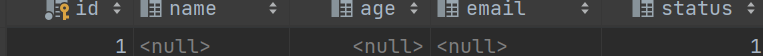

# MybatisPlus从入门到精通-高级篇

官网参考https://baomidou.com/pages/4c6bcf/

## 1.自动填充

​	在实际项目中的表会和我们的orders表一样，有**更新时间**，**创建时间**，**创建人，更新人**等字段。

​	我们可以使用 `@TableField` 的 `fill`  属性来设置字段的自动填充。让我们能更方便的更新相关字段。

准备数据库

```sql
CREATE TABLE user
(
    id      BIGINT (20) NOT NULL COMMENT '主键ID',
    name    VARCHAR(30) NULL DEFAULT NULL COMMENT '姓名',
    age     INT (11) NULL DEFAULT NULL COMMENT '年龄',
    email   VARCHAR(50) NULL DEFAULT NULL COMMENT '邮箱',
    create_Time datetime NULL DEFAULT NULL COMMENT '创建日期',
    update_Time datetime NULL DEFAULT NULL COMMENT '最后修改时间',
    PRIMARY KEY (id)
);
```

### 示例

①在对应字段上增加注解

​	使用TableField注解的fill属性来标注哪些字段需要在自动填充，加了注解MP才会在对应的SQL中为我们预留字段。而属性值代表我们在什么进行什么操作时需要预留字段。

~~~~java
/**
     * 创建日期
     */
@TableField(value = "create_Time",fill = FieldFill.INSERT)
private LocalDateTime createTime;

/**
     * 最后修改时间
     */
@TableField(value = "update_Time",fill = FieldFill.INSERT_UPDATE)
private LocalDateTime updateTime;

~~~~


②自定义填充处理器  MetaObjectHandler 

~~~~java
@Slf4j
@Component
public class MyMetaObjectHandler implements MetaObjectHandler {
    @Override
    public void insertFill(MetaObject metaObject) {
        //方式三推荐3.3.3之后
        this.strictInsertFill(metaObject, "createTime", () -> LocalDateTime.now(), LocalDateTime.class);
        this.strictInsertFill(metaObject, "updateTime", () -> LocalDateTime.now(), LocalDateTime.class);
    }
    @Override
    public void updateFill(MetaObject metaObject) {
        this.strictUpdateFill(metaObject, "updateTime", () -> LocalDateTime.now(), LocalDateTime.class); // 起始版本 3.3.3(推荐)
    }
}

~~~~

​	

## 2.逻辑删除

​	MP也支持逻辑删除的处理。我们只需要配置好逻辑删除的实体字段名，代表删除的字段值和代表未删除的字段值后即可。

​	注意：如果3.3.0版本之前还需要在对应的字段上加上`@TableLogic`注解

~~~~yaml
mybatis-plus:
  global-config:
    db-config:
      logic-delete-field: delFlag  # 全局逻辑删除的实体字段名(since 3.3.0,配置后可以忽略不配置步骤2)
      logic-delete-value: 1 # 逻辑已删除值(默认为 1)
      logic-not-delete-value: 0 # 逻辑未删除值(默认为 0)
~~~~

## 3.乐观锁

​	并发操作时,我们需要保证对数据的操作不发生冲突。乐观锁就是其中一种方式。乐观锁就是先加上不存在并发冲突问题，在进行实际数据操作的时候再检查是否冲突。

​	我们在使用乐观锁时一般在表中增加一个version列。用来记录我们对每天记录操作的版本。每次对某条记录进行过操作是，对应的版本也需要+1。

​	然后我们在每次要进行更新操作时，先查询对应数据的version值。在执行更新时， set version = 老版本+1 where version = 老版本 

​	如果在查询老版本号到更新操作的中间时刻有其他人更新了这条数据，这样这次更新语句就会更新失败。

​	这里在更新时对version的操作如果有我们自己做就会显的有点麻烦。所以MP提供了乐观锁插件。

​	使用后我们就可以非常方便的实现对version的操作。


### 3.1 使用

①配置对应插件

~~~~java
@Configuration
public class MybatisPlusConfig {
    /**
     * 旧版
     */
    @Bean
    public OptimisticLockerInterceptor optimisticLockerInterceptor() {
        return new OptimisticLockerInterceptor();
    }
    
    /**
     * 新版
     */
    @Bean
    public MybatisPlusInterceptor mybatisPlusInterceptor() {
        MybatisPlusInterceptor mybatisPlusInterceptor = new MybatisPlusInterceptor();
        mybatisPlusInterceptor.addInnerInterceptor(new OptimisticLockerInnerInterceptor());
        return mybatisPlusInterceptor;
    }
}
~~~~


②在实体类的字段上加上`@Version`注解

~~~~java
@Version
private Integer version;
~~~~

③更新

**注意：在更新前我们一定要先查询到version设置到实体类上再进行更新才能生效**

~~~~java
    @Test
    public void testVersion(){
        //查询id为3的数据
        QueryWrapper<Orders> queryWrapper = new QueryWrapper<>();
        queryWrapper.eq("id",3);
        Orders orders = ordersMapper.selectOne(queryWrapper);


        //对id为3的数据进行更新  把price修改为88
        orders.setPrice(88);
        ordersMapper.updateById(orders);
    }
~~~~

这种情况下我们可以看到执行的sql已经发生了变化。

~~~~
==>  Preparing: UPDATE orders SET price=?, update_time=?, version=? WHERE id=? AND version=? AND del_flag=0
==> Parameters: 8888(Integer), null, 2(Integer), 2(Long), 1(Integer)
~~~~


### 3.2 多插件配置问题

​	我们在使用3.4.0版本以后的MP时，如果需要用到多个插件的话要注意。在配置的时候只需要注入一个MybatisPlusInterceptor 对象，把插件对象添加到MybatisPlusInterceptor 对象中即可。

​	例如：

~~~~java
    @Bean
    public MybatisPlusInterceptor mybatisPlusInterceptor() {
        MybatisPlusInterceptor interceptor = new MybatisPlusInterceptor();
        interceptor.addInnerInterceptor(new PaginationInnerInterceptor(DbType.MYSQL));
        interceptor.addInnerInterceptor(new OptimisticLockerInnerInterceptor());
        return interceptor;
    }
~~~~


## 4. 通用枚举

准备数据库

```sql
CREATE TABLE user
(
    id      BIGINT (20) NOT NULL COMMENT '主键ID',
    name    VARCHAR(30) NULL DEFAULT NULL COMMENT '姓名',
    age     INT (11) NULL DEFAULT NULL COMMENT '年龄',
    email   VARCHAR(50) NULL DEFAULT NULL COMMENT '邮箱',
    status int(1) Not null DEFAULT 0 COMMENT '状态',
    PRIMARY KEY (id)
);
```

配置文件中配置枚举类所在的包

```yml
mybatis-plus:
  type-enums-package:
    com.example.mybatisplus.enums
```

### 4.1 方式一：枚举实现IEnum接口

```
public enum AgeEnum implements IEnum<Integer> {
  ONE(1, "一岁"),
  TWO(2, "二岁"),
  THREE(3, "三岁");

  private int value;
  private String desc;

  AgeEnum(final int value, final String desc) {
    this.value = value;
    this.desc = desc;
  }

  @Override
  public Integer getValue() {
    return value;
  }
}
```

通过getValue()方法，告诉Mybatis-Plus，枚举类的真正的value是什么，这样就实现了自由定制。

修改实体类字段

```java
/**
 * 年龄
 */
private AgeEnum age;
```

```java
测试
@Test
public void testStatusEnum(){
    User user = new User();
    user.setId(1L);
    user.setStatus(StatusEnum.WORK);
    int insert = userMapper.insert(user);
    System.out.println("测试testStatusEnum");
    System.out.println("插入数据"+insert+"条");
}
```

数据库结果


### 4.2 方式二：使用@EnumValue注解

```
public enum StatusEnum {
    WORK(1,"上班"),
    REST(0,"休息");

    @EnumValue//标记数据库存的值是code
    private int code;
    private String msg;

    StatusEnum(int code, String msg) {
        this.code = code;
        this.msg = msg;
    }
}
```

通过@EnumValue注解，告诉Mybatis-Plus, 枚举类的真正的value是什么，同样也就实现了自由定制。

修改实体类字段类型

```java
/**
 * 状态
 */
private StatusEnum status;
```

测试

```java
@Test
public void testAgeEnum(){
    User user = new User();
    user.setId(2L);
   user.setAge(AgeEnum.TWO);
    int insert = userMapper.insert(user);
    System.out.println("测试testStatusEnum");
    System.out.println("插入数据"+insert+"条");
}
```

测试结果



