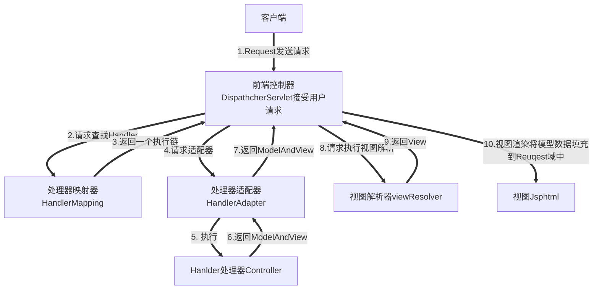

# Spring MVC 工作原理

## 1.Spring MVC 原理图




## 2.原理图中涉及的各个组件。

* DispacherServlet : 前端控制器，整个流程的控制中心，由它调用其他组件处理用户请求。
* HandlerMapping: 处理器映射器，负责根据用户的URL找到相应的Handler处理器
* HandlerAdapter: 处理器适配器,根据处理器适配器映射器（HandlerMapping）找到Handler相关信息，根据特定的规则执行相关的处理器Handler
* Handler: 处理器，负责执行用户的请求，Controller便是处理器。
* ViewResolver: 视图解析器，根据逻辑视图名解析成物理视图名，即具体的页面地址，再生成View 视图对象，最后对View进行渲染，并将结果通过页面返回给用户。
* ModelAndView: 使用ModelAndView类用来存储处理完的结果数据，以及显示该数据的视图。当控制器处理请求后，通常控制器会将包含视图名称的以及一些模型属性的ModelAndView对象返回给DispatcherServlet


## 3.接下来介绍SpringMVC的工作原理

1. 用户向服务器发送请求至前段控制器DispatcherServlet。
2. DispathcherServlet 调用HandlerMapping,由此得知哪个Handler(Controller) 处理该请求
3. HandlerMapping 找到具体的处理器，生成处理器对象以及处理器拦截器一并返回给DispathcherServlet.
4. DispathcherServlet 调用 HandlerAdapter。
5. HandlerAdapter 经过适配调用具体的Handler(也叫控制器Controller)。
6. Handler 处理完请求后返回ModelView
7. HandlerAdapter 将后端处理器结果(ModelView ) 反馈给DispathcherServlet。
8. DispathcherServlet 将ModelView 传递给 视图解析器ViewResolver。
9. ViewResolver 根据ModelView 中的视图名称返回具体的View。
10. DispathcherServlet 将ModelView 中的模型数据填充到视图中，渲染视图。
11. DispathcherServlet 将结果响应给用户。

## 4.下面创建一个Spring MVC 入门程序。

创建Maven Web工程

```shell
mvn archetype:generate -DgroupId=com.zdy -DartifactId=SpringMVC001 -DarchetypeArtifactId=maven-archetype-webapp
```

pom.xml

```html
<project xmlns="http://maven.apache.org/POM/4.0.0" xmlns:xsi="http://www.w3.org/2001/XMLSchema-instance"
xsi:schemaLocation="http://maven.apache.org/POM/4.0.0 http://maven.apache.org/maven-v4_0_0.xsd">
<modelVersion>4.0.0</modelVersion>
<groupId>com.zdy</groupId>
<artifactId>SpringMVC001</artifactId>
<packaging>war</packaging>
<version>1.0-SNAPSHOT</version>
<name>SpringMVC001 Maven Webapp</name>
<url>http://maven.apache.org</url>

<dependencies>
<!-- https://mvnrepository.com/artifact/org.springframework/spring-webmvc -->
<dependency>
  <groupId>org.springframework</groupId>
  <artifactId>spring-webmvc</artifactId>
  <version>5.3.5</version>
</dependency>


<!-- https://mvnrepository.com/artifact/javax.servlet/javax.servlet-api -->
<dependency>
  <groupId>javax.servlet</groupId>
  <artifactId>javax.servlet-api</artifactId>
  <version>4.0.1</version>
  <scope>provided</scope>
</dependency>
<!-- https://mvnrepository.com/artifact/javax.servlet.jsp/javax.servlet.jsp-api -->
<dependency>
  <groupId>javax.servlet.jsp</groupId>
  <artifactId>javax.servlet.jsp-api</artifactId>
  <version>2.3.3</version>
  <scope>provided</scope>
</dependency>


  <!-- https://mvnrepository.com/artifact/javax.servlet.jsp.jstl/javax.servlet.jsp.jstl-api -->
  <dependency>
      <groupId>javax.servlet.jsp.jstl</groupId>
      <artifactId>javax.servlet.jsp.jstl-api</artifactId>
      <version>1.2.2</version>
  </dependency>
  <dependency>
      <groupId>cn.itlym.shoulder</groupId>
      <artifactId>lombok</artifactId>
      <version>0.1</version>
  </dependency>
  <!-- https://mvnrepository.com/artifact/org.eclipse.jetty/jetty-server -->


</dependencies>

<build>
<finalName>SpringMVC001</finalName>
    <plugins>
        <plugin>
            <!--jetty maven 插件，为 maven 提供运行 web 程序的能力-->
            <groupId>org.eclipse.jetty</groupId>
            <artifactId>jetty-maven-plugin</artifactId>
            <version>9.4.12.v20180830</version>
            <configuration>
                <scanIntervalSeconds>10</scanIntervalSeconds>
                <webApp>
                    <contextPath>/</contextPath>
                </webApp>
            </configuration>
        </plugin>
    </plugins>
</build>
</project>

```

web.xml配置文件

```xml
<!DOCTYPE web-app PUBLIC
 "-//Sun Microsystems, Inc.//DTD Web Application 2.3//EN"
 "http://java.sun.com/dtd/web-app_2_3.dtd" >

<web-app>
  <display-name>Archetype Created Web Application</display-name>
  <!-- 配置 Spring MVC DispatchcerServlet 前端控制器 -->
  <servlet>
    <servlet-name>springmvc</servlet-name>
    <servlet-class>org.springframework.web.servlet.DispatcherServlet</servlet-class>
    <init-param>
      <!-- contextConfigLocation 是参数名称，该参数的值包含 Spring MVC 的配置文件路径 -->
      <param-name>contextConfigLocation</param-name>
      <param-value>classpath:springmvc-config.xml</param-value>
    </init-param>
    <!-- 在 Web 应用启动时立即加载 Servlet -->
    <load-on-startup>1</load-on-startup>
  </servlet>
  <!-- Servlet 映射声明 -->
  <servlet-mapping>
    <servlet-name>springmvc</servlet-name>
    <!-- 监听当前域的所有请求 -->
    <url-pattern>/</url-pattern>
  </servlet-mapping>
    <welcome-file-list>
    <welcome-file>register.jsp</welcome-file>
  </welcome-file-list>
</web-app>

```

springmvc-config.xml 配置文件编号邮箱

```xml
<?xml version = "1.0" encoding = "UTF-8"?>
<beans xmlns = "http://www.springframework.org/schema/beans"
       xmlns:xsi = "http://www.w3.org/2001/XMLSchema-instance" xmlns:context = "http://www.springframework.org/schema/context"
       xmlns:mvc = "http://www.springframework.org/schema/mvc"
       xsi:schemaLocation = "http://www.springframework.org/schema/beans http://www.springframework.org/schema/beans/spring-beans-4.2.xsd
        http://www.springframework.org/schema/context http://www.springframework.org/schema/context/spring-context-4.2.xsd
        http://www.springframework.org/schema/mvc http://www.springframework.org/schema/mvc/spring-mvc-4.2.xsd">

    <!-- 开启注解 -->
    <mvc:annotation-driven />
    <!-- 配置自动扫描的包，完成 Bean 的创建和自动依赖注入的功能 -->
    <context:component-scan base-package = "com.zdy.mvc.controller" />
    <!-- 默认静态资源处理 -->
    <mvc:default-servlet-handler/>
    <!-- 配置视图解析器 -->
    <bean id = "viewResolver" class = "org.springframework.web.servlet.view.InternalResourceViewResolver">
        <property name = "prefix" value = "/WEB-INF/views/"/>
        <property name = "suffix" value = ".jsp"/>
    </bean>
</beans>
```


新建实体类

User.java

```java
@Data
public class User {
    private Integer id;
    private String username;
    private String password;
    private Integer age;
}

```

新建控制器UserController.java

```java
@Controller
public class UserController{
    @PostMapping("/register")
   public String registUser(User user, Model model){
       model.addAttribute("user",user);
        return "success";
   }
}

```

配置注册页面register.jsp

```jsp
<%@ page language = "java" contentType = "text/html; charset = UTF-8"
         pageEncoding = "UTF-8"%>
<!DOCTYPE html PUBLIC "-//W3C//DTD HTML 4.01 Transitional//EN" "http://www.w3.org/TR/html4/loose.dtd">
<html>
<head>
    <meta http-equiv = "Content-Type" content = "text/html; charset = UTF-8">
    <title>register page</title>
</head>
<body>
<form action = "register" method = "post">
    <h5>User registration</h5>
    <p>
        <label>name </label> <input type = "text" id = "username" name = "username"
                                    tabindex = "1">
    </p>

    <p>
        <label>password </label> <input type = "text" id = "password" name = "password"
                                        tabindex = "2">
    </p>

    <p>
        <label>age </label> <input type = "text" id = "age" name = "age"
                                   tabindex = "3">
    </p>
    <p id = "buttons">
        <input id = "submit" type = "submit" tabindex = "4" value = "register">
        <input id = "reset" type = "reset" tabindex = "5" value = "reset">
    </p>
</form>
</body>
</html>
```

配置成功页面

success.jsp

```html
<%@ page language = "java" contentType = "text/html; charset = UTF-8"
    pageEncoding = "UTF-8"%>
    <!DOCTYPE html PUBLIC "-//W3C//DTD HTML 4.01 Transitional//EN" "http://www.w3.org/TR/html4/loose.dtd">
<%--支持el 表达式--%>
<%@ page isELIgnored="false" %>
    <html>
        <head>
            <meta http-equiv = "Content-Type" content = "text/html; charset = UTF-8">
            <title>success page</title>
        </head>
        <body>
            <h5>login was successful</h5>
            <p>
                name：${requestScope.user.username}<br /> password：${requestScope.user.password}<br /> age：${requestScope.user.age}<br />
            </p>
        </body>
    </html>
```

执行 mvn jetty:run 访问 https://locahost:8080/register.jsp 

填入相应的用户信息，并提交自动跳转到成功页面回显。  