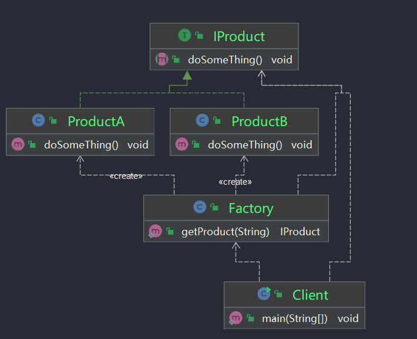

# 三大工厂模式

[TOC]

​		主要会介绍三种工厂模式：简单工厂，工厂方法，抽象工厂。其中简单工厂并不属于 GoF 23 种设计模式，工厂方法和抽象工厂模式则是属于 GoF 23 种设计模式之中的 2 种。工厂模式作为一种非常常用的设计模式，在日常开发中非常常见，也是一种非常基础的设计模式。

# 1. 简单工厂模式

## 介绍

​		简单工厂设计模式：`Simple Factory Pattern`，指的是由一个工厂对象来决定创建具体的产品实例，简单工厂模式并不属于 GoF 23 种设计模式之一，但是我们在平常开发中也运用的非常广泛。

#### 简单工厂模式适用场景

简单工厂适用于工厂类负责创建的对象较少的场景，且客户端只需要传入工厂类的参数，对于如何创建对象的逻辑不需要关心。

#### 简单工厂模式存在的问题

假如每种产品创建不仅仅只是实例化一个对象，还有其它逻辑需要处理，那么我们无法直接使用一句反射语句来创建对象，所以还是避免不了要写很多 if 或者 switch 循环分支。这样每新增一个产品我们都需要修改简单工厂类，违背了开闭原则，而且随着产品越来越丰富，工厂的职责会变得越来越多，久而久之会越来越难以维护。

为了弥补简单工厂方法的不足之处，所以就有了工厂方法模式。

* 抽象产品
* 工厂接口

## UML



## 示例代码

### 抽象接口

```java
public interface IProduct {
    void doSomeThing();
}
```
### 接口实现

```java
public class ProductA implements IProduct {

    @Override
    public void doSomeThing() {
        System.out.println("生产产品A");
    }
}
```

```java
public class ProductB implements IProduct {


    public void doSomeThing() {
        System.out.println("生产产品B");

    }
}
```

### 工厂类

```java
public class Factory {
    public static IProduct getProduct(String productName) {
        IProduct product = null;
        if (productName.equals("A")) {
            product = new ProductA();
        } else if (productName.equals("B")) {
            product = new ProductB();
        }
        return product;
    }
}

```

### 测试

```java
public class Client {
    public static void main(String[] args) {
        IProduct productA = Factory.getProduct("A");
        productA.doSomeThing();
        IProduct productB = Factory.getProduct("B");
        productB.doSomeThing();

    }
}
```

当出现新的产品C 需要修改Factory 类比较麻烦。 还要修改客户端代码。

升级：

## 使用配置文件获取产品

### factory.properties

```properties
productA=com.zdy.ProductA
productB=com.zdy.ProductB
```

### 修改工厂类

```java
public class Factory {
    private String porductName;

    public void setPorductName(String porductName) {
        this.porductName = porductName;
    }

    /**
     * 具体创建IProduct的方法，根据配置文件的参数来创建接口
     * @return
     */
    public  IProduct createIProduct(){
        //直接读取配置文件来获取需要创建实例的类
        Properties p = new Properties();
        InputStream input = null;
        try {
            input = Factory.class.getResourceAsStream("factory.properties");
            p.load(input);
        } catch (IOException e) {
            System.out.println("装载配置文件工厂出错，具体的堆栈信息如下:");
            e.printStackTrace();
        }finally{
            try {
                input.close();
            } catch (IOException e) {
                e.printStackTrace();
            }
        }
        IProduct IProduct = null;
        try {
            IProduct = (IProduct)Class.forName(p.getProperty(porductName)).newInstance();
        } catch (Exception e) {

            e.printStackTrace();
        }
        return IProduct;
    }
}
```

### 测试

```java
public class Client {
    public static void main(String[] args) {
        Factory factory = new Factory();
        factory.setPorductName("productA");
        IProduct iProduct = factory.createIProduct();
        iProduct.doSomeThing();

    }
}
```

以后生产新的产品，只需要新建产品类，实现IProduct接口，修改factory.properties. 不用修改工厂类。就可以创建新的产品。

1：简单工厂有点：

（1）帮助封装（简单工厂虽然很简单，但是很友好地帮助我们实现了组件的封装，然后让组件外部能真正面向接口编程）

（2）解耦（通过简单工厂，实现了客户端和具体实现类的解耦，如上面例子，客户端根本就不知道具体是由谁来实现，也不知道如何实现，客户端只是通过工厂获取它需要的接口对象）。

2：简单工厂缺点

（1）可能增加了客户端的复杂度

如果通过客户端的参数来选择具体的实现类，那么就必须让客户端能理解各个参数所代表的具体功能和含义，这样会增加客户端使用的难度，也部分暴露了内部实现，这种情况可以选用可配置的方式来实现。

（2）不方便扩展子工厂

私有化简单工厂的构造方法，使用静态方法来创建接口，也就不能通过写简单工厂类的子类来改变创建接口的方法的行为了。不过，通常情况下是不需要为简单工厂创建子类的。


# 2. 工厂方法

## 介绍：

工厂方法模式：`Fatory Method Pattern`，主要用来解决简单工厂模式存在的问题。其是指定义一个创建对象的接口，然后创建不同的具体工厂来创建对应的产品。工厂方法让类的实例化推迟到工厂子类中进行，在工厂方法模式中用户只需要关心所需产品对应的工厂，无须关心创建细节。

工厂方法模式中假如需要新增产品，只需要再新建工厂实现类，无需修改源码，符合开闭原则。

#### 工厂方法模式的适用场景

工厂方法模式主要适用于以下场景：

- 创建对象需要大量重复的代码。
- 客户端（应用层）不依赖于产品类实例如何被创建、实现等细节。
- 一个类通过其子类来指定创建哪个对象。

#### 工厂方法模式的缺点

工厂方法模式的缺点也是很明显的，每新增一个产品就需要新增两个类，一旦产品数量上来了，类的个数也会过多，就会增加了系统的复杂度，也使得系统更加抽象难以理解。

以下面的例子为例：

## 示例代码

### 产品抽象接口和实现


```java
public interface IProduct {
    void doSomeThing();
}
```

```java
public class ProductA implements IProduct {

    @Override
    public void doSomeThing() {
        System.out.println("生产产品A");
    }
}
```

```java
public class ProductB implements IProduct {
    public void doSomeThing() {
        System.out.println("生产产品B");
    }
}
```

###  工厂类抽象

需要生产什么商品，就实现商品所对应的工厂去生产商品。

```java
public interface IFacotry {
    IProduct getProduct();
}
```

###  工厂类的实现

```java
public class ProductAFactory implements IFacotry{
    @Override
    public IProduct getProduct() {
        return new ProductA();
    }
}
```

```java
public class ProductBFactory implements IFacotry{
    @Override
    public IProduct getProduct() {
        return new ProductB();
    }
}
```

### 测试代码

```java
public class Client {
    public static void main(String[] args) {
        //生产产品A
        ProductAFactory productAFactory = new ProductAFactory();
        IProduct productA = productAFactory.getProduct();
        productA.doSomeThing();
        //生产产品B
        ProductAFactory productBFactory = new ProductAFactory();
        IProduct productB = productAFactory.getProduct();
        productA.doSomeThing();
    }
}
```

# 3. 抽象工厂

## 介绍

抽象工厂模式：`Abstract Factory Pattern`，是指提供一个创建一系列相关或相互依赖对象的接口，而无须指定它们具体的类。客户端（应用层）不依赖于产品类实例如何被创建、实现等细节。

抽象工厂模式强调的是一系列相关的产品对象（属于同一产品族）一起使用创建对象时需要大量重复的代码。此时我们就需要提供一个产品类的库，使得所有的产品以同样的接口出现，这样客户端就可以不依赖于具体实现。

## 什么是产品族

在学习抽象工厂模式之前，我们需要先了解一下什么叫产品族。产品族指的就是相似的产品，比如说我们常用的手机，有华为、小米、OPPO，这些不同品牌的手机就属于同一个产品族，它们隶属于不同的公司，也就是需要由不同的工厂进行生产，这些工厂都可以共用同一个抽象方法来生产手机，这就是抽象工厂模式的本质，将相似的产品（同一产品族）抽象出公共的方法，统一对外接口。

## 抽象工厂模式的适用场景

抽象工厂模式适用于我们有一系列类似的产品，然后这些产品的实现又有细节上的不同，那么这时候就可以利用抽象工厂模式来将产品进行抽象化。

## 抽象工厂模式的缺点

根据例子再结合设计模式七大原则，其实我们可以发现抽象工厂有一个很大的缺点，那就是扩展产品相当困难，比如示例中现在工厂1想生产产品C，那么我们需要修改工厂的源码，新增生产C的方法，这样的话抽象工厂、具体工厂都需要修改，显然违背了开闭原则。所以抽象工厂模式使用的前提必须是产品比较稳定，不会轻易作出修改，否则后期的维护将会非常困难。


## 实例代码

甲乙个工厂生产相同的产品，但是甲工厂生产的大尺寸A,和优质B.

乙工厂生产小尺寸A ，和质量稍微差点的B.

### 抽象产品A

```java
public interface ProductA {
    void size();
}
```

### 实现接口A

```java
public class BigProductA implements ProductA{
    @Override
    public void size() {
        System.out.println("大尺寸A");
    }
}
```

```java
public class SmallProductA implements ProductA{
    @Override
    public void size() {
        System.out.println("小尺寸B");
    }
}
```

### 抽象产品B

```java
public interface ProductB {
    void pinzhi();
}
```

### 实现接口B

```java
public class GoodProductB implements ProductB{
    @Override
    public void pinzhi() {
        System.out.println("优品B");
    }
}
```

```java
public class BadProductB implements ProductB{
    @Override
    public void pinzhi() {
        System.out.println("差品B");
    }
}
```


### 抽象工厂

```java
public interface AbstactFacotry {
    ProductA getProdcutA();
    ProductB getProdcutB();
}
```


### 实现工厂甲

```java
public class ProductBigAGoodBFactory implements AbstactFacotry{
    @Override
    public ProductA getProdcutA() {
        return new BigProductA();
    }

    @Override
    public ProductB getProdcutB() {
        return new GoodProductB();
    }
}
```
### 实现工厂乙

```java
public class PorductSmallABadBFactory implements AbstactFacotry{
    @Override
    public ProductA getProdcutA() {
        return new SmallProductA();
    }

    @Override
    public ProductB getProdcutB() {
        return new BadProductB();
    }
}
```

### 测试代码

```java
public class Client {
    public static void main(String[] args) {
        
        System.out.println("工厂甲生产的产品");
        AbstactFacotry factory1 = new ProductBigAGoodBFactory();
        factory1.getProdcutA().size();
        factory1.getProdcutB().pinzhi();

        
        System.out.println("工厂乙生产的产品");
        AbstactFacotry factory2 = new PorductSmallABadBFactory();
        factory2.getProdcutA().size();
        factory2.getProdcutB().pinzhi();
    }
}
```

