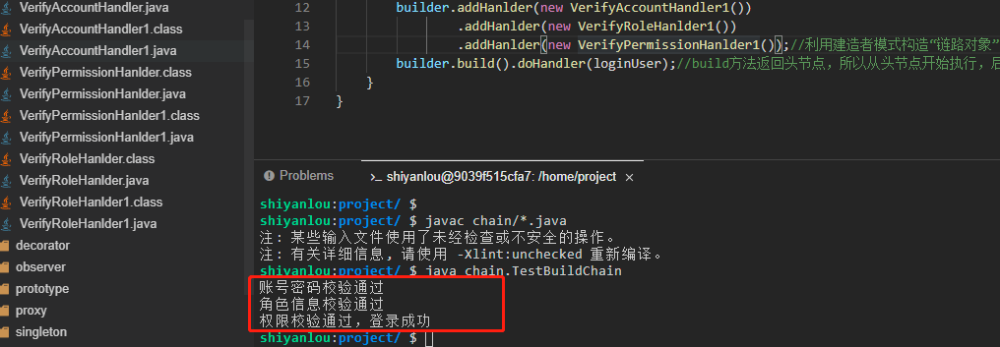

# 责任链模式

责任链模式。责任链模式的核心就在于一个“链”字，所以比较适合于流程固定的，比如审批之类的，可以将审批节点沿着“链路”一直传递。

## 什么是责任链模式

责任链模式（Chain of Responsibility Pattern）是指将链中的每一个节点看作是一个对象，每个节点处理的请求均不同，且每个节点内部自动维护了一个又一个节点对象。当一个请求在链路的头部发出时，会沿着链的路径依次传递给每一个节点对象，直到有对象处理这个请求为止。

责任链模式属于行为型模式。

#### 示例

在我们一个系统中，登录及权限校验就可以作为一条“链路”来处理，普通写法就是在一个方法里面先校验账号密码是否正确，然后校验角色是否正确，再校验权限是否正确，但是如果利用责任链模式我们就可以把这三种校验封装成 3 个节点，并让这 3 个节点构成一条“链路”。

下面就让我们通过一个登录及权限校验的示例来看看责任链模式是怎么实现的（这里我们需要新建一个 `chain` 目录，相关类创建在 `chain` 目录下）。

- 首先新建一个登录用户信息类 `LoginUser.java`，里面存储了一些需要校验的信息。

```java
package chain;

public class LoginUser {
    private String loginName;//登录名
    private String password;//密码
    private String roleName;//角色
    private String permission;//权限

    public String getLoginName() {
        return loginName;
    }

    public void setLoginName(String loginName) {
        this.loginName = loginName;
    }

    public String getPassword() {
        return password;
    }

    public void setPassword(String password) {
        this.password = password;
    }

    public String getRoleName() {
        return roleName;
    }

    public void setRoleName(String roleName) {
        this.roleName = roleName;
    }

    public String getPermission() {
        return permission;
    }

    public void setPermission(String permission) {
        this.permission = permission;
    }
}
```

- 为了面向抽象编程，我们先新建一个“链路”的抽象节点类 `MyHandler.java`，这个类内部维护了下一个节点，并定义了一个执行业务逻辑的方法 dohandler 方法。

```java
package chain;

public abstract class MyHandler {
    protected MyHandler next;//持有下一个节点对象，也就是每个节点都需要知道自己的下一个节点是谁才能传递下去

    public void next(MyHandler handler){
        this.next = handler;
    }

    public abstract void doHandler(LoginUser loginUser);//执行每个节点的处理逻辑
}
```

- 接下来建造“链路”节点之一，校验账号密码节点类 `VerifyAccountHandler.java`，并继承抽象节点类 MyHandler。

```java
package chain;

public class VerifyAccountHandler extends MyHandler {
    @Override
    public void doHandler(LoginUser loginUser) {//校验账号密码
        if (null == loginUser.getLoginName()){
            System.out.println("用户名不能为空");
            return;
        }
        if (null == loginUser.getPassword()){
            System.out.println("密码不能为空");
            return;
        }
        if (!loginUser.getPassword().equals("123456")){
            System.out.println("密码不正确");
            return;
        }
        System.out.println("账号密码校验通过");
        next.doHandler(loginUser);//传递给下一个节点
    }
}
```

- 继续建造“链路”节点之一，校验角色信息节点类 `VerifyRolehandler.java`，并继承抽象节点类 MyHandler。

```java
package chain;

public class VerifyRolehandler extends MyHandler {
    @Override
    public void doHandler(LoginUser loginUser) {
        if(!"admin".equals(loginUser.getRoleName())){//校验角色信息
            System.out.println("角色信息有误");
            return;
        }
        System.out.println("角色信息校验通过");
        next.doHandler(loginUser);//传递给下一个节点
    }
}
```

- 继续建造“链路”节点之一，校验权限信息节点类 `VerifyPermissionhandler.java`，并继承抽象节点类 MyHandler。

```java
package chain;

public class VerifyPermissionhandler extends MyHandler {
    @Override
    public void doHandler(LoginUser loginUser) {//校验权限
        if (!"admin".equals(loginUser.getPermission())){
            System.out.println("暂无权限");
            return;
        }
        System.out.println("权限校验通过，登录成功");
    }
}
```

注意，这是最后一个节点，所以不需要传递给下一个节点了。

- 最后我们新建一个测试类 `TestChain.java` 来测试一下。

```java
package chain;

public class TestChain {
    public static void main(String[] args) {
        MyHandler accountHandler = new VerifyAccountHandler();
        MyHandler rolehandler = new VerifyRolehandler();
        MyHandler permissionhandler = new VerifyPermissionhandler();

        accountHandler.next(rolehandler);
        rolehandler.next(permissionhandler);

        LoginUser loginUser = new LoginUser();
        loginUser.setLoginName("孤狼1号");
        loginUser.setPassword("123456");
        loginUser.setRoleName("admin");
        loginUser.setPermission("admin");
        accountHandler.doHandler(loginUser);//从起点开始调用
    }
}
```

执行 `javac chain/*.java` 命令进行编译，然后再执行 `java chain.TestChain` 命令运行测试类（大家一定要自己动手运行哦，只有自己实际去运行了才会更能体会其中的思想）。


上面就是一个责任链模式的常规写法，但是总感觉构建“链路”的时候有点不是很优雅，如果我们把“链路”看成一个对象，是不是有办法进行优化呢？是不是有人想到了我们上一个实验讲解的建造者模式。是的，可以利用建造者模式进行改造一下，接下来就让我们一起看看该如何利用建造者模式来改造。

- 新建一个“链路”的抽象节点 `BuildHandler.java`，这个和上面并没有什么不同。

```java
package chain;

public abstract class BuildHandler<T> {
    protected BuildHandler next;//下一个节点

    public void next(BuildHandler handler){
        this.next = handler;
    }

    public abstract void doHandler(LoginUser loginUser);//真正处理业务逻辑
}
```

- 新建一个“链路”对象的建造者类 `Builder.java`，这个用来负责生成“链路”对象。

```java
package chain;

public class Builder<T> {
    private BuildHandler<T> head;//链路的头节点
    private BuildHandler<T> tail;//链路的尾节点

    public Builder<T> addhandler(BuildHandler handler){
        if (null == head){//如果头节点为空，则说明正在构建第一个节点，此时头尾节点都相等
            head = this.tail = handler;
            return this;
        }
        //走到这里说明头节点不为空，
        this.tail.next(handler);//把当前“链路”的tail节点的下一个节点指向刚加进来的节点
        this.tail = handler;//然后把当前加进来的节点设置为tail节点
        return this;
    }

    public BuildHandler<T> build(){
        return this.head;//调用build之后就会开始调用流程了，从头节点开始，所以返回头节点
    }
}
```

- 接下来建造“链路”节点之一，校验账号密码节点类 `VerifyAccountHandler1.java`，并继承抽象建造者类 BuildHandler，注意这个类除了继承类做了修改，其余地方代码没做变动。

```java
package chain;

public class VerifyAccountHandler1 extends BuildHandler {
    @Override
    public void doHandler(LoginUser loginUser) {//校验账号密码
         if (null == loginUser.getLoginName()){
            System.out.println("用户名不能为空");
            return;
        }
        if (null == loginUser.getPassword()){
            System.out.println("密码不能为空");
            return;
        }
        if (!loginUser.getPassword().equals("123456")){
            System.out.println("密码不正确");
            return;
        }
        System.out.println("账号密码校验通过");
        next.doHandler(loginUser);//传递给下一个节点

    }
}
```

- 继续建造“链路”节点之一，校验角色信息节点类 `VerifyRolehandler1.java`，并继承抽象建造者类 BuildHandler。

```java
package chain;

public class VerifyRolehandler1 extends BuildHandler {
    @Override
    public void doHandler(LoginUser loginUser) {
        if(!"admin".equals(loginUser.getRoleName())){//校验角色信息
            System.out.println("角色信息有误");
            return;
        }
        System.out.println("角色信息校验通过");
        next.doHandler(loginUser);//传递给下一个节点
    }
}
```

- 继续建造“链路”节点之一，校验权限信息节点类 `VerifyPermissionhandler1.java`，并继承抽象建造者类 BuildHandler。

```java
package chain;

public class VerifyPermissionhandler1 extends BuildHandler {
    @Override
    public void doHandler(LoginUser loginUser) {//校验权限
        if (!"admin".equals(loginUser.getPermission())){
            System.out.println("暂无权限");
            return;
        }
        System.out.println("权限校验通过，登录成功");
    }
}
```

- 最后我们新建一个测试类 `TestBuildChain.java` 来测试一下。

```java
package chain;

public class TestBuildChain {
    public static void main(String[] args) {
        LoginUser loginUser = new LoginUser();
        loginUser.setLoginName("孤狼1号");
        loginUser.setPassword("123456");
        loginUser.setRoleName("admin");
        loginUser.setPermission("admin");

        Builder<BuildHandler> builder = new Builder();
        builder.addhandler(new VerifyAccountHandler1())
                .addhandler(new VerifyRolehandler1())
                .addhandler(new VerifyPermissionhandler1());//利用建造者模式构造“链路对象”
        builder.build().doHandler(loginUser);//build方法返回头节点，所以从头节点开始执行，后面就会自动传递
    }
}
```

执行 `javac chain/*.java` 命令进行编译，然后再执行 `java chain.TestBuildChain` 命令运行测试类（大家一定要自己动手运行哦，只有自己实际去运行了才会更能体会其中的思想）。



可以看到，通过建造者模式来结合使用，构造“链路”对象的时候比之前优雅多了。

#### 责任链模式适用场景

责任链模式主要是解耦了请求与处理，用户只需要将请求发送到链上即可，无需关心请求的具体内容和处理细节，请求会自动进行传递直至有节点进行处理。主要适用于如下场景：

1. 多个对象可以处理同一请求，但具体由哪个对象处理则在运行时动态决定。
2. 可以动态指定一组对象的处理请求。

#### 责任链模式优点

1. 请求处理者（链路中的节点）只需关注自己感兴趣的请求进行处理，对于不感兴趣或者无法处理的请求直接转发给下一个处理者。
2. 具备链式传递请求的功能，请求发送者无需知晓链路结构，只需等待请求处理结果。
3. 链路结构灵活，可以通过改变链路结构动态的新增或者删减责任。
4. 易于扩展新的请求处理类，符合开闭原则。

#### 责任链模式缺点

1. 如果责任链的链路太长或者处理时间过长，会影响性能。
2. 如果节点对象存在循环引用时，会造成死循环，导致系统崩溃。

主要介绍了责任链模式的基本使用，并且最后通过将责任链模式和建造者模式结合进一步改造优化代码，其实其它设计模式也一样，大部分情况设计模式都不会单独出现，都是你中有我、我中有你的一个结合使用。