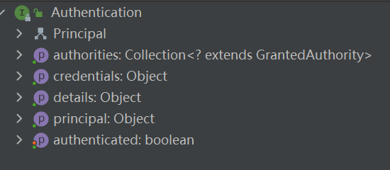

Spring Security 认证

AuthenticationManager：认证管理器

ProviderManager： 认证管理器的实现类


```java
public interface AuthenticationManager {

   Authentication authenticate(Authentication authentication)
         throws AuthenticationException;
}
```

Authentication：认证类

```java
public interface Authentication extends Principal, Serializable {

   Collection<? extends GrantedAuthority> getAuthorities();
```



authtoities 获取用户的权限。

再已登录用户中获取用户信息

```java
Authentication authentication = SecurityContextHolder.getContext().getAuthentication();
System.out.println("获取用户权限集合"+authentication.getAuthorities());
System.out.println("获取密码凭证"+authentication.getCredentials());
```

GrantedAuthority： 权限接口

```java
public interface GrantedAuthority extends Serializable {
 
   String getAuthority();
}
```


WebSecurityConfigurerAdapter: 安全管理配置接口

```java

@Configuration
@EnableWebSecurity	// 开启Spring Security 
@EnableGlobalMethodSecurity(prePostEnabled = true)	// 开启权限注解，如：@PreAuthorize注解
public class WebSecurityConfig extends WebSecurityConfigurerAdapter {

    @Override
    public void configure(AuthenticationManagerBuilder auth) throws Exception {
   
    }
}
```

重写  configure 其方法实现数据接入如

```
auth.inMemoryAuthentication("添加认证对象");
```

