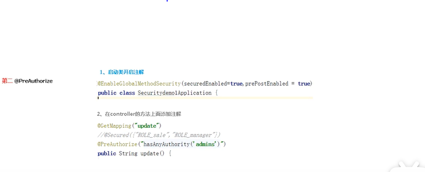
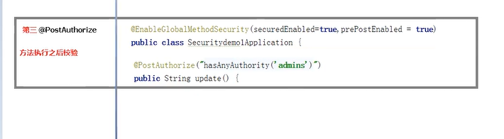

# 一、spring Security 原理

它本质是一组过滤器，过滤链。

主要的过滤器

FilterSecurityInterceptor:   是一个方法级过滤器

ExecptionTranslationFilter : 异常过滤器

UsernamePasswordAthenticationFilter: 对/loginPost进行拦截，校验表单中的用户名和密码。#

# 二、2个重要的接口

UserServiceDetail 接口  从数据库中查询用户信息

PasswordEncoder接口 密码加密


# 三、WEB 权限设置

创建Springboot 项目

引入依赖

```xml
<dependency>
    <groupId>org.springframework.boot</groupId>
    <artifactId>spring-boot-starter-web</artifactId>

</dependency>
<dependency>
    <groupId>org.springframework.boot</groupId>
    <artifactId>spring-boot-starter-security</artifactId>

</dependency>
```

启动项目： 访问  [localhost:8080/test/hello](http://localhost:8080/test/hello)

账号默认为admin ,密码项目启动时出现，登录进行测试


# 四、登录用户的三种配置方式


## 1. 通过配置文件


```properties
spring:
  security:
    user:
      name: root
      password: root
      roles: admin
```

启动项目： 使用上述账号密码，成功登录。

## 2. 通过配置类


```
@Configuration
public class SecurityConfig extends WebSecurityConfigurerAdapter {

    @Override
    protected void configure(AuthenticationManagerBuilder auth) throws Exception {
        PasswordEncoder encoder = new BCryptPasswordEncoder();
        String password = encoder.encode("123");
        auth.inMemoryAuthentication()
                .withUser("Tom")
                .password(password)
                .roles("admin");

    }
    @Bean
    public PasswordEncoder getPassword(){
        return new BCryptPasswordEncoder();
    }
}
```

使用Tom 123 登录成功。

## 3. 1 自定义配置类

```java

@Configuration
public class SecurityConfig extends WebSecurityConfigurerAdapter {
    
    @Autowired
    private UserDetailsService userDetailsService;//和MyUserServie类Service注解名一致。

    @Override
    protected void configure(AuthenticationManagerBuilder auth) throws Exception {
       auth.userDetailsService(userDetailsService).passwordEncoder(getPassword());

    }
    @Bean
    PasswordEncoder getPassword(){
        return new BCryptPasswordEncoder();
    }
}

```

```java
@Service("userDetailsService") //注解名和配置类中UserDetailsService 名一致
public class MyUserDetailsService implements UserDetailsService {
    @Override
    public UserDetails loadUserByUsername(String username) throws UsernameNotFoundException {

            List<GrantedAuthority> auths = AuthorityUtils.commaSeparatedStringToAuthorityList("roles");

            //真实项目中从数据库查询用户，返回user 对象。
            return new User("Di",new BCryptPasswordEncoder().encode("123"),auths);
    }
}
```

使用Di  123 进行登录测试。

##  3.2. 通过自定义用户数据库实现用户登录查询

修改3.1 中代码，实现数据库用户登录。

项目加入数据库

### 第一步： 引入相关依赖

```xml
<dependency>
    <groupId>com.baomidou</groupId>
    <artifactId>mybatis-plus-boot-starter</artifactId>
    <version>3.4.2</version>
</dependency>
<!--数据库连接-->
<dependency>
    <groupId>mysql</groupId>
    <artifactId>mysql-connector-java</artifactId>

</dependency>
<!--简化代码开发-->
<dependency>
    <groupId>org.projectlombok</groupId>
    <artifactId>lombok</artifactId>
    <version>1.18.20</version>
</dependency>
```


### 第二步：创建数据

```sql
show databases;
create database db_security;

use db_security;
create table users(
                      id int(10) primary key auto_increment,
                      username varchar(50),
                      password varchar(50)
);
insert into users (username, password) values('小花猫','123');
```

### 第三步： 创建实体类和mapper（下面代码使用mybatis-plus 自动生成工具生成。）

```java
@Data
@EqualsAndHashCode(callSuper = false)
public class Users implements Serializable {

    private static final long serialVersionUID = 1L;

    @TableId(value = "id", type = IdType.AUTO)
    private Integer id;

    private String username;

    private String password;


}
```

```java
@Repository 
public interface UsersMapper extends BaseMapper<Users> {

}
```

### 第四步： 创建自定义MyUserDetailsService 实现 UserDetailsService接口

```java
@Service("userDetailsService")
public class MyUserDetailsService implements UserDetailsService {
    @Autowired
    private UsersMapper usersMapper;
    @Override
    public UserDetails loadUserByUsername(String username) throws UsernameNotFoundException {
        //查询数据库
        QueryWrapper<Users> wrapper = new QueryWrapper<>();
        wrapper.eq("username",username);
        //获取user对象
        Users user = usersMapper.selectOne(wrapper);
        //判断用户
        if(user == null ){
            throw new UsernameNotFoundException("用户名不存在");
        }


        List<GrantedAuthority> auths = AuthorityUtils.commaSeparatedStringToAuthorityList("roles");

            //真实项目中从数据库查询用户，返回user 对象。
            return new User(user.getUsername(),new BCryptPasswordEncoder().encode(user.getPassword()),auths);
    }
}

```

###   第五步： 配置 Security 继承 WebSecurityConfigurerAdapter

```java
@Configuration
public class SecurityConfig extends WebSecurityConfigurerAdapter {
    @Autowired
    private UserDetailsService userDetailsService;

    @Override
    protected void configure(AuthenticationManagerBuilder auth) throws Exception {
       auth.userDetailsService(userDetailsService).passwordEncoder(getPassword());

    }
    @Bean
    PasswordEncoder getPassword(){
        return new BCryptPasswordEncoder();
    }
}
```

### 第六步：启动类添加`@MapperScan("com.zdy.mapper")`

### 第七步： 配置yaml

```yml
spring:
  datasource:
    driver-class-name: com.mysql.cj.jdbc.Driver
    url: jdbc:mysql://localhost:3306/db_security?useSSL=true&useUnicode=true&characterEncoding=utf8&serverTimezone=UTC
    username: root
    password: 666666
```

启动服务

使用  小花猫 123 测试

测试 [localhost:8080/test/hello](localhost:8080/test/hello)

# 五、自定义登录页面

在配置类中实现相关的配置

@Configuration
public class SecurityConfig extends WebSecurityConfigurerAdapter {
    @Autowired
    private UserDetailsService userDetailsService;

```java
@Configuration
public class SecurityConfig extends WebSecurityConfigurerAdapter {
  /***
  代码。。。
  /
  
}
```
}

# 六、 访问页面放行

* hasAuthority
* hasAnyAuthority
* hasRole
* hasAnyRole

# 七、自定义403页面

```html
<!DOCTYPE html>
<html lang="en">
<head>
    <meta charset="UTF-8">
    <title>Title</title>
</head>
<body>
<h1>你没有访问权限！</h1>
</body>
</html>
```

```java
http.exceptionHandling().accessDeniedPage("/unauth.html");
```

访问登录账号正确，权限不够的页面

出现你没有访问权限的信息。

# 八、常用注解使用

* @Secured 用户具有某个角色，才可以访问

	首先启动类或者配置类添加

	`@EnableGlobalMethodSecurity(securedEnabled = true)` 

	在控制层添加一个update() 方法

	```java
	@GetMapping("/update")
	@Secured({"ROLE_sale","ROLE_manager"})
	public String update(){
	    return "Hello Update!";
	}
	```

	修改自定义UserServiceDetails 接口实现类

	```java
	
	        List<GrantedAuthority> auths = AuthorityUtils
	            //添加update 对应角色信息
	                .commaSeparatedStringToAuthorityList("ROLE_sale");
	
	```

	

启动项目重新访问[localhost:8080/test/update](http://localhost:8080/test/update)

浏览器出现Hello Update!


* PreAuthorize` 注解的使用，方法执行之前进行数据校验
* 



* `preAuthorize` 注解的使用，方法执行之前进行数据校验




# 九、退出功能

#十、记住我功能实现

第一步创建数据表

第二步配置类

注入数据源Datasource

# 十一 、跨站请求伪造


