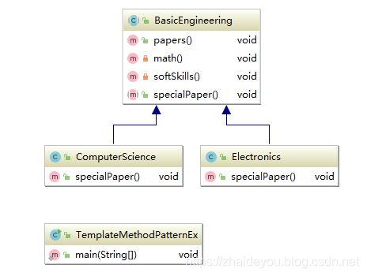

# 模板方法模式

[TOC]


## 介绍

模板方法模式（Template Method Pattern）是指定义一个算法的总体流程步骤，然后允许子类为其中一个或者多个步骤提供特定的实现方式。模板方法模式可以使得子类在不改变算法总体流程的情况下，重新定义算法的某些步骤。模板方法模式属于行为设计模式。

## 模板方法模式适用场景

模板方法模式适用于相对流程比较固定，而大部分步骤又都具有通用性，仅仅需要保留小部分可变动部分交给子类去实现。

##模板方法模式优点

1. 由于流程具有通用型，可以将大部分步骤放到父类实现，这样能提高代码的复用性。
2. 将个性化的步骤留到子类实现，子类可以扩展不同的行为，这也从一定程度上提升了代码的扩展性。
3. 因为父类都是封装相对固定的流程，而经常变动的放到子类，我们可以通过扩展子类来实现不同业务场景，而无需修改源码，符合开闭原则。

## 模板方法模式缺点

1. 当变动部分有较多场景时，会导致子类数量不断增多，导致系统更复杂。
2. 模板方法模式是使用继承来实现的，违反了合成复用原则，一旦流程发生变化导致父类修改，可能所有子类都需要变动。

## UML Class Diagram


## 示例代码

### 抽象父类定义模板

```java
public  abstract class BasicEngineering {
    //模板方法
    public void papers(){
        // Common papers;
        math();
        softSkills();
        // Special paters
        specialPaper();
    }

	//通用方法
    private void math(){
        System.out.println("Mathematics");
    }
    //通过方法
    private void softSkills(){
        System.out.println("softSkills");
    }
	//需要子类实现的特殊方法
    public abstract void specialPaper();
}

```

### 子类定制化特殊方法
```java
public class ComputerScience extends BasicEngineering{
    @Override
    public void specialPaper() {
        System.out.println("Objec Oriented Programing");
    }
}

```

```java
public class Electronics extends BasicEngineering {
    @Override
    public void specialPaper() {
        System.out.println("Digital Logic and Circut Theory");
    }
}

```
### 测试 
```java
public class TemplateMethodPatternEx {
    public static void main(String[] args) {

        BasicEngineering bs = new ComputerScience();
        bs.papers();
        
        bs = new Electronics();  
        bs.papers();
    }
}

```