# Redis 学习手册

# 1. redis 安装

## 1.1 redis 安装

1、[官网](https://redis.io/)下载最新版 Redis redis-6.2.1.tar.gz

2、复制到 Linux ，下面是安装包存放路径

```shell
 cd /usr/local
 mkdir redis
 cd redis
```

3、解压缩并安装

```shell
tar -xvf redis-6.2.1.tar.gz
cd redis-6.2.1
make install
```

报错：server.c:xxxx:xx: error: ‘xxxxxxxx’ has no member named ‘xxxxx’

原因：CentOS 7 默认安装 gcc 4.8.5，Redis 6 必须将 gcc 升级到 9.3

```
# 查看gcc版本是否在5.3以上，centos7.6默认安装4.8.5
gcc -v

# 升级gcc到5.3及以上,如下：
升级到gcc 9.3：
yum -y install centos-release-scl
yum -y install devtoolset-9-gcc devtoolset-9-gcc-c++ devtoolset-9-binutils
scl enable devtoolset-9 bash
需要注意的是scl命令启用只是临时的，退出shell或重启就会恢复原系统gcc版本。
如果要长期使用gcc 9.3的话：

echo "source /opt/rh/devtoolset-9/enable" >>/etc/profile
这样退出shell重新打开就是新版的gcc了
以下其他版本同理，修改devtoolset版本号即可。
```

如果 yum 安装报错 yum 被 packagekit 占用

将 /etc/yum/pluginconf.d/refresh-packagekit.conf 改为如下

enabled=0

然后重启 Linux 即可

安装成功如下所示。

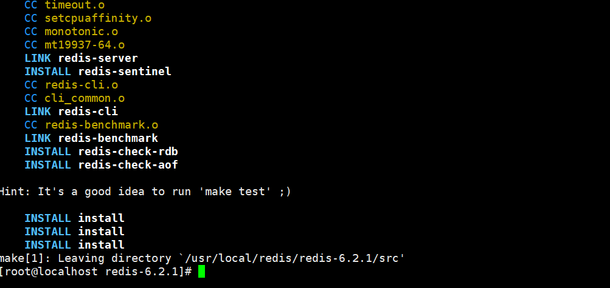

8、启动 Redis

```shell
cd src
./redis-server
```


9、配置为后台服务

修改 redis.conf 文件

```shell
cd ..
vim redis.conf
```

守护线程改为 yes 表示启动后台启动，保存退出

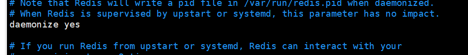

10、将 redis.conf 复制到 /etc/redis 路径下，并改名为 6379.conf

```shell
cd /etc
mkdir redis
cd redis
cp /usr/local/redis/redis-6.2.1/redis.conf 6379.conf
```

11、将启动文件 /usr/local/redis/redis-6.2.1/utils/redis_init_script 拷贝到 /etc/rc.d/init.d/

```shell
cp /usr/local/redis/redis-6.2.1/utils/redis_init_script /etc/rc.d/init.d/
```

修改文件名为 redisd

```shell
cd /etc/rc.d/init.d/
mv redis_init_script redisd
```

12、修改复制后的 redisd 文件，让它成为服务

```shell
cd /etc/rc.d/init.d/
vim redisd
```

- 修改 EXEC、CLIEXEC 的路径

```shell
#原内容
EXEC=/usr/local/bin/redis-server
CLIEXEC=/usr/local/bin/redis-cli

#修改后的内容
EXEC=/usr/local/redis/redis-6.2.1/src/redis-server
CLIEXEC=/usr/local/redis/redis-6.2.1/src/redis-cli
```

- 在 $EXEC $CONF 后面加上 &，表示后台启动

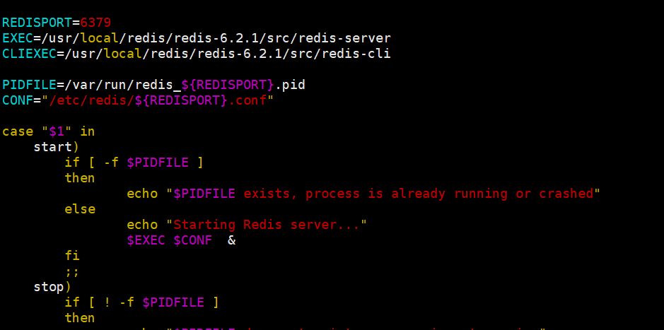

13、添加开机启动

```shell
chkconfig redisd on
```

14、启动 redis 服务

```shell
service redisd start
```


Ctrl + c 退出，Reids 也不会关闭了，执行命令查看

```shell
ps -ef | grep redis
```

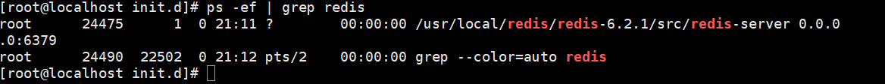

可以看到 Redis 服务已经后台启动了

15、关闭 Redis 服务

```shell
service redisd stop
```

16、客户端访问

```shell
cd /usr/local/redis/redis-6.2.1/src
redis-cli
```

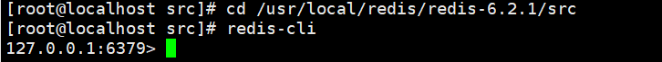

17、允许外部访问

- 添加端口

1、查看防火墙状态

```shell
firewall-cmd --state
```


runing 表示开启，not runing 表示关闭，如果关闭，执行

```shell
systemctl start firewalld.service
```

开放 6379 端口

```shell
firewall-cmd --zone=public --add-port=6379/tcp --permanent
systemctl restart firewalld.service
firewall-cmd --reload
```

- 修改配置文件

```shell
vim /etc/redis/6379.conf
```

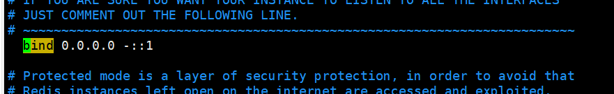

bind 改为 0.0.0.0 表示任何 IP 都可以连接。

## 1.2 密码设置

方法一：通过配置文件（/etc/redis.conf）进行设置

这里使用 

> vim /etc/redis/6379.conf
>
> requirepass  123

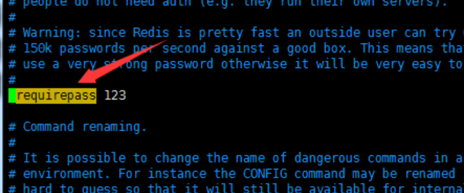

方法二：通过命令设置密码

这种方法相对简单，不需要重启redis服务。连接redis之后，通过命令设置，如下：

> config set requirepass 123456

如此，便将密码设置成了123456

设置之后，可通过以下指令查看密码

> config get requirepass

密码设置之后，当你退出再次连上redis的时候，就需要输入密码了，不然是无法操作的。

>  redis-cli  -p 6379-a 123456

下面项目为了测试方便均不设置密码

> ###### config set requirepass ''

# 2.Redis_Jedis测试

## 2.1  redis

```xml
<dependency>
<groupId>redis.clients</groupId>
<artifactId>jedis</artifactId>
<version>3.2.0</version>
</dependency>

```

```java
public static void main(String[] args) {
    Jedis jedis = new Jedis("127.0.0.1",6379);
    String pong = jedis.ping();
    System.out.println("连接成功："+pong);
    jedis.close();

}
```

## 2.2 JedisPool

为了安全使用线程池

```java
public class JedisPoolTest {
    public static void main(String[] args) {
        JedisPool jedisPool = new JedisPool( "127.0.0.1", 6379 );
        try (Jedis jedis = jedisPool.getResource()){
            String ping = jedis.ping();
            System.out.println(ping);
        }
    }
}
```

## 2.3 lettuce

```java
public class LettuceTest {
    public static void main(String[] args) {
        //密码传值，如果有密码放在@前面，没有不写
        RedisClient redisClient = RedisClient.create( "redis://@127.0.0.1" );
        RedisCommands<String, String> sync = redisClient.connect().sync();
        sync.set( "k1","V!!" );
        String k1 = sync.get( "k1" );
        System.out.println(k1);
    }
}
```

# 3.Spring boot 整合 redis

## 3.1 引入依赖

```xml
<dependency>
    <groupId>org.springframework.boot</groupId>
    <artifactId>spring-boot-starter-web</artifactId>
</dependency>
<dependency>
    <groupId>org.springframework.boot</groupId>
    <artifactId>spring-boot-starter-data-redis</artifactId>
</dependency>
<!-- https://mvnrepository.com/artifact/org.apache.commons/commons-pool2 -->
<dependency>
    <groupId>org.apache.commons</groupId>
    <artifactId>commons-pool2</artifactId>
    <version>2.11.1</version>
</dependency>
<!-- https://mvnrepository.com/artifact/redis.clients/jedis -->
<dependency>
    <groupId>redis.clients</groupId>
    <artifactId>jedis</artifactId>
    <version>4.1.1</version>
</dependency>


<dependency>
    <groupId>org.springframework.boot</groupId>
    <artifactId>spring-boot-starter-test</artifactId>
    <scope>test</scope>
</dependency>
<dependency>
    <groupId>com.fasterxml.jackson.core</groupId>
    <artifactId>jackson-databind</artifactId>
    <version>2.13.1</version>
</dependency>
```

## 3.2 application.properties配置

```properties
#Redis服务器地址
spring.redis.host=192.168.247.128
#Redis服务器连接端口
spring.redis.port=6379
#Redis数据库索引（默认为0）
spring.redis.database= 0
#连接超时时间（毫秒）
spring.redis.timeout=1800000
#连接池最大连接数（使用负值表示没有限制）
spring.redis.lettuce.pool.max-active=20
#最大阻塞等待时间(负数表示没限制)
spring.redis.lettuce.pool.max-wait=-1
#连接池中的最大空闲连接
spring.redis.lettuce.pool.max-idle=5
#连接池中的最小空闲连接
spring.redis.lettuce.pool.min-idle=0

```

## 3.3 添加redis 配置类

```java
@EnableCaching
@Configuration
public class RedisConfig extends CachingConfigurerSupport {

    @Bean
    public RedisTemplate<String, Object> redisTemplate(RedisConnectionFactory factory) {
        RedisTemplate<String, Object> template = new RedisTemplate<>();
        RedisSerializer<String> redisSerializer = new StringRedisSerializer();
        Jackson2JsonRedisSerializer jackson2JsonRedisSerializer = new Jackson2JsonRedisSerializer(Object.class);
        ObjectMapper om = new ObjectMapper();
        om.setVisibility(PropertyAccessor.ALL, JsonAutoDetect.Visibility.ANY);
        om.enableDefaultTyping(ObjectMapper.DefaultTyping.NON_FINAL);
        jackson2JsonRedisSerializer.setObjectMapper(om);
        template.setConnectionFactory(factory);
//key序列化方式
        template.setKeySerializer(redisSerializer);
//value序列化
        template.setValueSerializer(jackson2JsonRedisSerializer);
//value hashmap序列化
        template.setHashValueSerializer(jackson2JsonRedisSerializer);
        return template;
    }

    @Bean
    public CacheManager cacheManager(RedisConnectionFactory factory) {
        RedisSerializer<String> redisSerializer = new StringRedisSerializer();
        Jackson2JsonRedisSerializer jackson2JsonRedisSerializer = new Jackson2JsonRedisSerializer(Object.class);
//解决查询缓存转换异常的问题
        ObjectMapper om = new ObjectMapper();
        om.setVisibility(PropertyAccessor.ALL, JsonAutoDetect.Visibility.ANY);
        om.enableDefaultTyping(ObjectMapper.DefaultTyping.NON_FINAL);
        jackson2JsonRedisSerializer.setObjectMapper(om);
// 配置序列化（解决乱码的问题）,过期时间600秒
        RedisCacheConfiguration config = RedisCacheConfiguration.defaultCacheConfig()
                .entryTtl(Duration.ofSeconds(600))
                .serializeKeysWith(RedisSerializationContext.SerializationPair.fromSerializer(redisSerializer))
                .serializeValuesWith(RedisSerializationContext.SerializationPair.fromSerializer(jackson2JsonRedisSerializer))
                .disableCachingNullValues();
        RedisCacheManager cacheManager = RedisCacheManager.builder(factory)
                .cacheDefaults(config)
                .build();
        return cacheManager;
    }
}

```

## 测试

RedisTestController 中添加方法

```java
@RestController
@RequestMapping("/redisTest")
public class RedisTestController {
    @Autowired
    private RedisTemplate redisTemplate;

    @GetMapping
    public String testRedis() {
        //设置值到redis
        redisTemplate.opsForValue().set("name","lucy");
        //从redis获取值
        String name = (String)redisTemplate.opsForValue().get("name");
        return name;
    }
}

```

# 4 redis 的基本操作

## 4.1 连接关闭数据库

```shell
# redis客户端连接===> 观察地址的变化，如果连接ok,是直接连上的，redis默认端口号 6379
[root@192 bin]# redis-cli -p 6379
127 .0.0.1:6379> ping
PONG
127 .0.0.1:6379> set k1 helloworld
OK
127 .0.0.1:6379> get k
"helloworld"

# 【redis】关闭连接
127 .0.0.1:6379> shutdown
not connected> exit

# 【shell】ps显示系统当前进程信息
[root@192 myredis]# ps -ef|grep redis
root 16140  16076  0 04 :53 pts/2 00 :00:00 grep --color=auto redis
```

## 4.2 数据库操作

```shell
127 .0.0.1:6379> select 7
OK
127 .0.0.1:6379[7]>
# 不同的库可以存不同的数据
### Dbsize查看当前数据库的key的数量
127 .0.0.1:6379> select 7
OK
# 查看数据库大小
127 .0.0.1:6379[7]> DBSIZE
(integer) 0
127 .0.0.1:6379[7]> select 0
OK
127 .0.0.1:6379> DBSIZE
(integer) 5
127 .0.0.1:6379> keys * # 查看具体的key
1 ) "counter:__rand_int__"
2 ) "mylist"
3 ) "k1"
4 ) "myset:__rand_int__"
5 ) "key:__rand_int__"
# 数据库清空
127 .0.0.1:6379> DBSIZE
(integer) 5
127 .0.0.1:6379> FLUSHDB
OK
127 .0.0.1:6379> DBSIZE
(integer) 0
# 清空全部数据库
127.0.0.1:6379> flushall
OK
```

>Redis采用的是基于内存的采用的是单进程单线程模型的 KV 数据库，由C语言编写，官方提供的数据是可以达到100000+的QPS（每秒内查询次数）。这个数据不比采用单进程多线程的同样基于内存的 KV数据库 Memcached 差！

#  5. Redis 的数据类型

### 

>Redis是一个开放源代码（BSD许可）的内存中数据结构存储，用作数据库，缓存和消息代理。它支持数
>据结构，例如字符串，哈希，列表，集合，带范围查询的排序集合，位图，超日志，带有半径查询和流
>的地理空间索引。Redis具有内置的复制，Lua脚本，LRU驱逐，事务和不同级别的磁盘持久性，并通过
>Redis Sentinel和Redis Cluster自动分区提供了高可用性。

## 5.0 Redis 的key

```shell
# keys * 查看所有的key
127 .0.0.1:6379> keys *
(empty list or set)
127 .0.0.1:6379> set name qinjiang
OK
127 .0.0.1:6379> keys *
1 ) "name"

# exists key 的名字，判断某个key是否存在
127 .0.0.1:6379> EXISTS name
(integer) 1
127 .0.0.1:6379> EXISTS name1
(integer) 0

# move key db ---> 当前库就没有了，被移除了
127 .0.0.1:6379> move name 1
(integer) 1
127 .0.0.1:6379> keys *
(empty list or set)


# type key 查看你的key是什么类型
127 .0.0.1:6379> set name qinjiang
OK
127 .0.0.1:6379> get name
"qinjiang"
127 .0.0.1:6379> type name
string

# expire key 秒钟：为给定 key 设置生存时间，当 key 过期时(生存时间为 0 )，它会被自动删
除。
# 使用时必须已经存在name
127 .0.0.1:6379> EXPIRE name 10
(integer) 1
# ttl key 查看还有多少秒过期，-1 表示永不过期，-2 表示已过期
127 .0.0.1:6379> ttl name
(integer) 4
127 .0.0.1:6379> ttl name
(integer) 3
127 .0.0.1:6379> ttl name
(integer) 2
127 .0.0.1:6379> ttl name
(integer) 1
# -2 表示国企
127 .0.0.1:6379> ttl name
(integer) -2
127 .0.0.1:6379> keys *
(empty list or set)
```


redis Api 查看相关命令

[Command reference – Redis](https://redis.io/commands)

## 5.1 String （字符串类型）

>String是redis最基本的类型，你可以理解成Memcached一模一样的类型，一个key对应一个value。<br>
>String类型是二进制安全的，意思是redis的string可以包含任何数据，比如jpg图片或者序列化的对象。<br>
>String类型是redis最基本的数据类型，一个redis中字符串value最多可以是512M。<br>

```shell
 # 删除key
127 .0.0.1:6379> del key1 
(integer) 1

 # 对不存在的 key 进行 APPEND ，等同于 SET
127 .0.0.1:6379> append key1 "hello"
key1 "hello"


127.0.0.1:6379> flushdb
# 追加
127.0.0.1:6379> set key1 hello
OK
127.0.0.1:6379> append key1 " world"
(integer) 11
127.0.0.1:6379> get key1
"hello world"


 # # 获取字符串的长度
127 .0.0.1:6379> STRLEN key1
(integer) 10

127 .0.0.1:6379> set views 0 # 设置浏览量为 0
OK
127 .0.0.1:6379> incr views  # 浏览 + 1
(integer) 1
127 .0.0.1:6379> incr views  # 浏览 + 1
(integer) 2
127 .0.0.1:6379> decr views  # 浏览 - 1
(integer) 1
127 .0.0.1:6379> incrby views 10 # +10
(integer) 11
127 .0.0.1:6379> decrby views 10 # -10
(integer) 1


# ===================================================
# range [范围]
# getrange 获取指定区间范围内的值，类似between...and的关系，从零到负一表示全部
# ===================================================
127 .0.0.1:6379> set key2 abcd123456  # 设置key2的值
OK
127 .0.0.1:6379> getrange key2 0 -1 # 获得全部的值
"abcd123456"
127 .0.0.1:6379> getrange key2 0 2 # 截取部分字符串
"abc"


# ===================================================
# range [范围]
# getrange 获取指定区间范围内的值，类似between...and的关系，从零到负一表示全部
# ===================================================
127 .0.0.1:6379> set key2 abcd123456  # 设置key2的值
OK
127 .0.0.1:6379> getrange key2 0 -1 # 获得全部的值
"abcd123456"

127 .0.0.1:6379> getrange key2 0 2 # 截取部分字符串
"abc"

# ===================================================
# setrange 设置指定区间范围内的值，格式是setrange key值 具体值
# ===================================================
127 .0.0.1:6379> get key2
"abcd123456"
127 .0.0.1:6379> SETRANGE key2 1 xx # 替换值
(integer) 10
127 .0.0.1:6379> get key2
"axxd123456"

# ===================================================
# setex（set with expire）键秒值
# setnx（set if not exist） 如果存在就不设置
# ===================================================
127 .0.0.1:6379> setex key3 60 expire  # 设置过期时间
OK

127 .0.0.1:6379> ttl key3  # 查看剩余的时间
(integer) 55
127 .0.0.1:6379> setnx mykey "redis" # 如果不存在就设置，成功返回 1
(integer) 1
127 .0.0.1:6379> setnx mykey "mongodb" # 如果存在就设置，失败返回 0
(integer) 0
127 .0.0.1:6379> get mykey
"redis"

# ===================================================
# mset Mset 命令用于同时设置一个或多个 key-value 对。
# mget Mget 命令返回所有(一个或多个)给定 key 的值。
# 如果给定的 key 里面，有某个 key 不存在，那么这个 key 返回特殊值 nil 。
# msetnx 当所有 key 都成功设置，返回 1 。
# 如果所有给定 key 都设置失败(至少有一个 key 已经存在)，那么返回 0 。原子操
作
# ===================================================
127 .0.0.1:6379> mset k10 v10 k11 v11 k12 v12
OK
127 .0.0.1:6379> keys *
1 ) "k12"
2 ) "k11"
3 ) "k10"
127 .0.0.1:6379> mget k10 k11 k12 k13
1 ) "v10"
2 ) "v11"
3 ) "v12"
4 ) (nil)
127 .0.0.1:6379> msetnx k10 v10 k15 v15 # 原子性操作！
(integer) 0
127 .0.0.1:6379> get key15
(nil)

# 传统对象缓存
set user:1 value(json数据)

# 可以用来缓存对象
mset user:1:name zhangsan user:1:age 2
mget user:1:name user:1:age

# ===================================================
# getset（先get再set）
# ===================================================
127 .0.0.1:6379> getset db mongodb # 没有旧值，返回 nil
(nil)
127 .0.0.1:6379> get db
"mongodb"
127 .0.0.1:6379> getset db redis # 返回旧值 mongodb
"mongodb"
127 .0.0.1:6379> get db
"redis"

```


## 5.2 List（列表）

>Redis列表是简单的字符串列表，按照插入顺序排序，你可以添加一个元素到列表的头部（左边）或者尾部（右边）。<br>
>它的底层实际是个链表!

```shell
#### # ===================================================
# Lpush：将一个或多个值插入到列表头部。（左）
# rpush：将一个或多个值插入到列表尾部。（右）
# lrange：返回列表中指定区间内的元素，区间以偏移量 START 和 END 指定。
# 其中 0 表示列表的第一个元素， 1 表示列表的第二个元素，以此类推。
# 你也可以使用负数下标，以 -1 表示列表的最后一个元素， -2 表示列表的倒数第二个元素，以此
类推。
# ===================================================
127 .0.0.1:6379> LPUSH list "one"
(integer) 1
127 .0.0.1:6379> LPUSH list "two"
(integer) 2

127 .0.0.1:6379> RPUSH list "right"
(integer) 3
127 .0.0.1:6379> Lrange list 0 -1
1 ) "two"
2 ) "one"
3 ) "right"
127 .0.0.1:6379> Lrange list 0 1
1 ) "two"
2 ) "one"

# ===================================================
# lpop 命令用于移除并返回列表的第一个元素。当列表 key 不存在时，返回 nil 。
# rpop 移除列表的最后一个元素，返回值为移除的元素。
# ===================================================
127 .0.0.1:6379> Lpop list
"two"
127 .0.0.1:6379> Rpop list
"right"
127 .0.0.1:6379> Lrange list 0 -1
1 ) "one"

# ===================================================
# Lindex，按照索引下标获得元素（-1代表最后一个， 0 代表是第一个）
# ===================================================
127 .0.0.1:6379> Lindex list 1
(nil)
127 .0.0.1:6379> Lindex list 0
"one"
127 .0.0.1:6379> Lindex list -1
"one"

# ===================================================
# llen 用于返回列表的长度。
# ===================================================
127 .0.0.1:6379> flushdb
OK
127 .0.0.1:6379> Lpush list "one"
(integer) 1
127 .0.0.1:6379> Lpush list "two"
(integer) 2
127 .0.0.1:6379> Lpush list "three"
(integer) 3

# Llen 用于返回列表的长度。
127 .0.0.1:6379> Llen list # 返回列表的长度
(integer) 3

# ===================================================
# lrem key 根据参数 COUNT 的值，移除列表中与参数 VALUE 相等的元素。
# ===================================================
127 .0.0.1:6379> lrem list 1 "two"
(integer) 1
127 .0.0.1:6379> Lrange list 0 -1
1 ) "three"
2 ) "one"

# ===================================================
# Ltrim key 对一个列表进行修剪(trim)，就是说，让列表只保留指定区间内的元素，不在指定区
间之内的元素都将被删除。
# ===================================================

127 .0.0.1:6379> RPUSH mylist "hello"
(integer) 1
127 .0.0.1:6379> RPUSH mylist "hello"
(integer) 2
127 .0.0.1:6379> RPUSH mylist "hello2"
(integer) 3
127 .0.0.1:6379> RPUSH mylist "hello3"
(integer) 4
127 .0.0.1:6379> ltrim mylist 1 2
OK
127 .0.0.1:6379> lrange mylist 0 -1
1 ) "hello"
2 ) "hello2"

# ===================================================
# rpoplpush 移除列表的最后一个元素，并将该元素添加到另一个列表并返回。
# ===================================================
127 .0.0.1:6379> rpush mylist "hello"
(integer) 1
127 .0.0.1:6379> rpush mylist "foo"
(integer) 2
127 .0.0.1:6379> rpush mylist "bar"
(integer) 3
127 .0.0.1:6379> rpoplpush mylist myotherlist
"bar"
127 .0.0.1:6379> lrange mylist 0 -1
1 ) "hello"
2 ) "foo"
127 .0.0.1:6379> lrange myotherlist 0 -1
1 ) "bar"

# ===================================================
# lset key index value 将列表 key 下标为 index 的元素的值设置为 value 。
# ===================================================
127 .0.0.1:6379> exists list  # 对空列表(key 不存在)进行 LSET
(integer) 0
127 .0.0.1:6379> lset list 0 item # 报错
(error) ERR no such key

127 .0.0.1:6379> lpush list "value1" # 对非空列表进行 LSET
(integer) 1
127 .0.0.1:6379> lrange list 0 0
1 ) "value1"
127 .0.0.1:6379> lset list 0 "new" # 更新值
OK
127 .0.0.1:6379> lrange list 0 0
1 ) "new"
127 .0.0.1:6379> lset list 1 "new" # index 超出范围报错
(error) ERR index out of range

# ===================================================
# linsert key before/after pivot value 用于在列表的元素前或者后插入元素。
# 将值 value 插入到列表 key 当中，位于值 pivot 之前或之后。
# ===================================================
redis> RPUSH mylist "Hello"
(integer) 1
redis> RPUSH mylist "World"
(integer) 2

redis> LINSERT mylist BEFORE "World" "There"
(integer) 3
redis> LRANGE mylist 0 -1
1 ) "Hello"
2 ) "There"
3 ) "World"
```


### 性能总结

* 它是一个字符串链表，left，right 都可以插入添加
* 如果键不存在，创建新的链表
* 如果键已存在，新增内容
* 如果值全移除，对应的键也就消失了
* 链表的操作无论是头和尾效率都极高，但假如是对中间元素进行操作，效率就很惨淡了。

>list就是链表，略有数据结构知识的人都应该能理解其结构。使用Lists结构，我们可以轻松地实现最新消
>息排行等功能。List的另一个应用就是消息队列，可以利用List的PUSH操作，将任务存在List中，然后工
>作线程再用POP操作将任务取出进行执行。Redis还提供了操作List中某一段的api，你可以直接查询，删
>除List中某一段的元素。

>Redis的list是每个子元素都是String类型的双向链表，可以通过push和pop操作从列表的头部或者尾部添加或者删除元素，这样List即可以作为栈，也可以作为队列。

## 5.3 哈希Hash

`kv模式不变，但V是一个键值对`

```shell
#### # ===================================================

# hset、hget 命令用于为哈希表中的字段赋值 。
# hmset、hmget 同时将多个field-value对设置到哈希表中。会覆盖哈希表中已存在的字段。
# hgetall 用于返回哈希表中，所有的字段和值。
# hdel 用于删除哈希表 key 中的一个或多个指定字段
# ===================================================
127 .0.0.1:6379> hset myhash field1 "kuangshen"
(integer) 1
127 .0.0.1:6379> hget myhash field1
"kuangshen"
127 .0.0.1:6379> HMSET myhash field1 "Hello" field2 "World"
OK
127 .0.0.1:6379> HGET myhash field1
"Hello"
127 .0.0.1:6379> HGET myhash field2
"World"
127 .0.0.1:6379> hgetall myhash
1 ) "field1"
2 ) "Hello"
3 ) "field2"
4 ) "World"
127 .0.0.1:6379> HDEL myhash field1
(integer) 1
127 .0.0.1:6379> hgetall myhash
1 ) "field2"
2 ) "World"

# ===================================================
# hlen 获取哈希表中字段的数量。
# ===================================================
127 .0.0.1:6379> hlen myhash
(integer) 1
127 .0.0.1:6379> HMSET myhash field1 "Hello" field2 "World"
OK
127 .0.0.1:6379> hlen myhash
(integer) 2

# ===================================================
# hexists 查看哈希表的指定字段是否存在。
# ===================================================
127 .0.0.1:6379> hexists myhash field1
(integer) 1
127 .0.0.1:6379> hexists myhash field3
(integer) 0

# ===================================================
# hkeys 获取哈希表中的所有域（field）。
# hvals 返回哈希表所有域(field)的值。
# ===================================================
127 .0.0.1:6379> HKEYS myhash
1 ) "field2"
2 ) "field1"
127 .0.0.1:6379> HVALS myhash
1 ) "World"
2 ) "Hello"

# ===================================================
# hincrby 为哈希表中的字段值加上指定增量值。
# ===================================================
127 .0.0.1:6379> hset myhash field 5
(integer) 1
127 .0.0.1:6379> HINCRBY myhash field 1
(integer) 6
127 .0.0.1:6379> HINCRBY myhash field -1
(integer) 5
127 .0.0.1:6379> HINCRBY myhash field -10
(integer) -5

# ===================================================
# hsetnx 为哈希表中不存在的的字段赋值 。
# ===================================================
127 .0.0.1:6379> HSETNX myhash field1 "hello"
(integer) 1 # 设置成功，返回 1 。
127 .0.0.1:6379> HSETNX myhash field1 "world"
(integer) 0 # 如果给定字段已经存在，返回 0 。
127 .0.0.1:6379> HGET myhash field1
"hello"
```

>Redis hash是一个string类型的field和value的映射表，hash特别适合用于存储对象。存储部分变更的数据，如用户信息等。

## 5.4 Set（集合）

>Redis的Set是String类型的无序集合，它是通过HashTable实现的!


```shell
#### # ===================================================
# sadd 将一个或多个成员元素加入到集合中，不能重复
# smembers 返回集合中的所有的成员。
# sismember 命令判断成员元素是否是集合的成员。
# ===================================================
127 .0.0.1:6379> sadd myset "hello"
(integer) 1
127 .0.0.1:6379> sadd myset "kuangshen"
(integer) 1
127 .0.0.1:6379> sadd myset "kuangshen"
(integer) 0
127 .0.0.1:6379> SMEMBERS myset
1 ) "kuangshen"
2 ) "hello"
127 .0.0.1:6379> SISMEMBER myset "hello"
(integer) 1
127 .0.0.1:6379> SISMEMBER myset "world"
(integer) 0

# ===================================================
# scard，获取集合里面的元素个数
# ===================================================
127 .0.0.1:6379> scard myset
(integer) 2

# ===================================================
# srem key value 用于移除集合中的一个或多个成员元素
# ===================================================
127 .0.0.1:6379> srem myset "kuangshen"
(integer) 1

127 .0.0.1:6379> SMEMBERS myset
1 ) "hello"

# ===================================================
# srandmember key 命令用于返回集合中的一个随机元素。
# ===================================================
127 .0.0.1:6379> SMEMBERS myset
1 ) "kuangshen"
2 ) "world"
3 ) "hello"
127 .0.0.1:6379> SRANDMEMBER myset
"hello"
127 .0.0.1:6379> SRANDMEMBER myset 2
1 ) "world"
2 ) "kuangshen"
127 .0.0.1:6379> SRANDMEMBER myset 2
1 ) "kuangshen"
2 ) "hello"

# ===================================================
# spop key 用于移除集合中的指定 key 的一个或多个随机元素
# ===================================================
127 .0.0.1:6379> SMEMBERS myset
1 ) "kuangshen"
2 ) "world"
3 ) "hello"
127 .0.0.1:6379> spop myset
"world"
127 .0.0.1:6379> spop myset
"kuangshen"
127 .0.0.1:6379> spop myset
"hello"

# ===================================================
# smove SOURCE DESTINATION MEMBER
# 将指定成员 member 元素从 source 集合移动到 destination 集合。
# ===================================================
127 .0.0.1:6379> sadd myset "hello"
(integer) 1
127 .0.0.1:6379> sadd myset "world"
(integer) 1
127 .0.0.1:6379> sadd myset "kuangshen"
(integer) 1
127 .0.0.1:6379> sadd myset2 "set2"
(integer) 1
127 .0.0.1:6379> smove myset myset2 "kuangshen"
(integer) 1
127 .0.0.1:6379> SMEMBERS myset
1 ) "world"
2 ) "hello"
127 .0.0.1:6379> SMEMBERS myset2
1 ) "kuangshen"
2 ) "set2"

# ===================================================
- 数字集合类
  - 差集： sdiff
  - 交集： sinter
  - 并集： sunion
# ===================================================
127 .0.0.1:6379> sadd key1 "a"
(integer) 1
127 .0.0.1:6379> sadd key1 "b"
(integer) 1
127 .0.0.1:6379> sadd key1 "c"
(integer) 1
127 .0.0.1:6379> sadd key2 "c"
(integer) 1
127 .0.0.1:6379> sadd key2 "d"
(integer) 1
127 .0.0.1:6379> sadd key2 "e"
(integer) 1
127 .0.0.1:6379> SDIFF key1 key2 # 差集
1 ) "a"
2 ) "b"
127 .0.0.1:6379> SINTER key1 key2 # 交集
1 ) "c"
127 .0.0.1:6379> SUNION key1 key2 # 并集
1 ) "a"
2 ) "b"
3 ) "c"
4 ) "e"
5 ) "d"
```


## 5.5  Zset（sorted set：有序集合）

>Redis zset 和 set 一样，也是String类型元素的集合，且不允许重复的成员。<br>
>不同的是每个元素都会关联一个double类型的分数。<br><br>
>Redis正是通过分数来为集合中的成员进行从小到大的排序，zset的成员是唯一的，但是分数（Score）<br>
>却可以重复。<br>

`在set基础上，加一个score值。之前set是k1 v1 v2 v3，现在zset是 k1 score1 v1 score2 v2`

```shell
#### # ===================================================
# zadd 将一个或多个成员元素及其分数值加入到有序集当中。
# zrange 返回有序集中，指定区间内的成员
# ===================================================
127 .0.0.1:6379> zadd myset 1 "one"
(integer) 1
127 .0.0.1:6379> zadd myset 2 "two" 3 "three"
(integer) 2
127 .0.0.1:6379> ZRANGE myset 0 -1
1 ) "one"
2 ) "two"
3 ) "three"

# ===================================================
# zrangebyscore 返回有序集合中指定分数区间的成员列表。有序集成员按分数值递增(从小到大)
次序排列。
# ===================================================
127 .0.0.1:6379> zadd salary 2500 xiaoming
(integer) 1
127 .0.0.1:6379> zadd salary 5000 xiaohong
(integer) 1
127 .0.0.1:6379> zadd salary 500 kuangshen
(integer) 1
# Inf无穷大量+∞,同样地,-∞可以表示为-Inf。
127 .0.0.1:6379> ZRANGEBYSCORE salary -inf +inf # 显示整个有序集
1 ) "kuangshen"
2 ) "xiaoming"
3 ) "xiaohong"
127 .0.0.1:6379> ZRANGEBYSCORE salary -inf +inf withscores # 递增排列
1 ) "kuangshen"
2 ) "500"
3 ) "xiaoming"
4 ) "2500"
5 ) "xiaohong"
6 ) "5000"
127 .0.0.1:6379> ZREVRANGE salary 0 -1 WITHSCORES  # 递减排列
1 ) "xiaohong"
2 ) "5000"
3 ) "xiaoming"
4 ) "2500"
5 ) "kuangshen"
6 ) "500"
127 .0.0.1:6379> ZRANGEBYSCORE salary -inf 2500 WITHSCORES # 显示工资 <=2500
的所有成员
1 ) "kuangshen"
2 ) "500"
3 ) "xiaoming"
4 ) "2500"

#### # ===================================================
# zrem 移除有序集中的一个或多个成员
# ===================================================
127 .0.0.1:6379> ZRANGE salary 0 -1
1 ) "kuangshen"
2 ) "xiaoming"
3 ) "xiaohong"
127 .0.0.1:6379> zrem salary kuangshen
(integer) 1
127 .0.0.1:6379> ZRANGE salary 0 -1
1 ) "xiaoming"
2 ) "xiaohong"

# ===================================================
# zcard 命令用于计算集合中元素的数量。
# ===================================================
127 .0.0.1:6379> zcard salary
(integer) 2
OK

# ===================================================
# zcount 计算有序集合中指定分数区间的成员数量。
# ===================================================
127 .0.0.1:6379> zadd myset 1 "hello"
(integer) 1
127 .0.0.1:6379> zadd myset 2 "world" 3 "kuangshen"
(integer) 2
# 计算指定分数区间数量
127 .0.0.1:6379> ZCOUNT myset 1 3
(integer) 3
127 .0.0.1:6379> ZCOUNT myset 1 2
(integer) 2

# ===================================================
# zrank 返回有序集中指定成员的排名。其中有序集成员按分数值递增(从小到大)顺序排列。
# ===================================================
127 .0.0.1:6379> zadd salary 2500 xiaoming
(integer) 1
127 .0.0.1:6379> zadd salary 5000 xiaohong
(integer) 1
127 .0.0.1:6379> zadd salary 500 kuangshen
(integer) 1
127 .0.0.1:6379> ZRANGE salary 0 -1 WITHSCORES  # 显示所有成员及其 score 值
1 ) "kuangshen"
2 ) "500"
3 ) "xiaoming"
4 ) "2500"
5 ) "xiaohong"
6 ) "5000"
127 .0.0.1:6379> zrank salary kuangshen  # 显示 kuangshen 的薪水排名，最少
(integer) 0
127 .0.0.1:6379> zrank salary xiaohong # 显示 xiaohong 的薪水排名，第三
(integer) 2

# ===================================================
# zrevrank 返回有序集中成员的排名。其中有序集成员按分数值递减(从大到小)排序。
# ===================================================
127 .0.0.1:6379> ZREVRANK salary bright
```

>和set相比，sorted set增加了一个权重参数score，使得集合中的元素能够按score进行有序排列，比如一个存储全班同学成绩的sorted set，其集合value可以是同学的学号，而score就可以是其考试得分，这样在数据插入集合的时候，就已经进行了天然的排序。可以用sorted set来做带权重的队列，比如普通消息的score为 1 ，重要消息的score为 2 ，然后工作线程可以选择按score的倒序来获取工作任务。让重要的任务优先执行。

>排行榜应用，取TOP N操作 ！

补充

```shell
# 设置过期时间，如果在未过期时重新设置值，则过期时间会失效。
127.0.0.1:6379> set k1 100 ex 20
OK
127.0.0.1:6379> ttl k1
(integer) 15
127.0.0.1:6379> ttl k1
(integer) 14
127.0.0.1:6379> set k1 20
OK
127.0.0.1:6379> ttl k1
(integer) -1
127.0.0.1:6379> ttl k1
(integer) -1
127.0.0.1:6379> get k1
"20"
127.0.0.1:6379>

## persist 移除失效时间
127.0.0.1:6379> set k1 100 ex 20
OK
127.0.0.1:6379> persist k1
(integer) 1
127.0.0.1:6379>
# pttl 和 ttl 一样但是返回的是毫秒。
```


# 6 三种特殊的数据类型

## 6.1 GEO地理位置

>简介

>Redis 的 GEO 特性在 Redis 3.2 版本中推出， 这个功能可以将用户给定的地理位置信息储存起来， 并对这些信息进行操作。来实现诸如附近位置、摇一摇这类依赖于地理位置信息的功能。geo的数据类型为zset。

>GEO 的数据结构总共有六个常用命令：geoadd、geopos、geodist、georadius、georadiusbymember、gethash

官方文档：https://www.redis.net.cn/order/3685.html

### geoadd

**解析：**

```shell
#### # 语法
geoadd key longitude latitude member ...

# 将给定的空间元素(纬度、经度、名字)添加到指定的键里面。
# 这些数据会以有序集he的形式被储存在键里面，从而使得georadius和georadiusbymember这样的命令可以在之后通过位置查询取得这些元素。
# geoadd命令以标准的x,y格式接受参数,所以用户必须先输入经度,然后再输入纬度。
# geoadd能够记录的坐标是有限的:非常接近两极的区域无法被索引。
# 有效的经度介于-180-180度之间，有效的纬度介于-85.05112878 度至 85.05112878 度之间。，当用户尝试输入一个超出范围的经度或者纬度时,geoadd命令将返回一个错误。
```

测试：百度搜索经纬度查询，模拟真实数据

```shell
127 .0.0.1:6379> geoadd china:city 116 .23 40 .22 北京
(integer) 1
127 .0.0.1:6379> geoadd china:city 121 .48 31 .40 上海 113 .88 22 .55 深圳 120 .21
30 .20 杭州
(integer) 3
127 .0.0.1:6379> geoadd china:city 106 .54 29 .40 重庆 108 .93 34 .23 西安 114 .02
30 .58 武汉
(integer) 3
```

### geopos

**解析：**

```shell
geopos key member [member...]

#从key里返回所有给定位置元素的位置（经度和纬度）
```

测试：

```shell
127 .0.0.1:6379> geopos china:city 北京
1 ) 1 ) "116.23000055551528931"
2 ) "40.2200010338739844"
127 .0.0.1:6379> geopos china:city 上海 重庆
1 ) 1 ) "121.48000091314315796"
2 ) "31.40000025319353938"
2 ) 1 ) "106.54000014066696167"
2 ) "29.39999880018641676"
127 .0.0.1:6379> geopos china:city 新疆
1 ) (nil)
```

### geodist

**解析：**

```shell
geodist key member1 member2 [unit]

# 返回两个给定位置之间的距离，如果两个位置之间的其中一个不存在,那么命令返回空值。
# 指定单位的参数unit必须是以下单位的其中一个：
# m表示单位为米
# km表示单位为千米
# mi表示单位为英里
# ft表示单位为英尺
# 如果用户没有显式地指定单位参数,那么geodist默认使用米作为单位。
#geodist命令在计算距离时会假设地球为完美的球形,在极限情况下,这一假设最大会造成0.5%的误差。
```

测试：

```shell
127 .0.0.1:6379> geodist china:city 北京 上海
"1088785.4302"
127 .0.0.1:6379> geodist china:city 北京 上海 km
"1088.7854"
127 .0.0.1:6379> geodist china:city 重庆 北京 km
"1491.6716"
```

### georadius

解析：

```shell
#### # 语法
georadius key longitude latitude radius m|km|ft|mi [withcoord][withdist]
[withhash][asc|desc][count count]
# 以给定的经纬度为中心， 找出某一半径内的元素
```

测试：重新连接 redis-cli，增加参数 --raw ，可以强制输出中文，不然会乱码

```shell
[root@kuangshen bin]# redis-cli --raw -p 6379
# 在 china:city 中寻找坐标 100 30 半径为 1000km 的城市
127 .0.0.1:6379> georadius china:city 100 30 1000 km
重庆
西安

# withdist 返回位置名称和中心距离
127 .0.0.1:6379> georadius china:city 100 30 1000 km withdist
重庆
635 .2850
西安
963 .3171

# withcoord 返回位置名称和经纬度
127 .0.0.1:6379> georadius china:city 100 30 1000 km withcoord
重庆
106 .54000014066696167
29 .39999880018641676
西安
108 .92999857664108276
34 .23000121926852302

# withdist withcoord 返回位置名称 距离 和经纬度 count 限定寻找个数
127 .0.0.1:6379> georadius china:city 100 30 1000 km withcoord withdist count
1
重庆
635 .2850
106 .54000014066696167
29 .39999880018641676
127 .0.0.1:6379> georadius china:city 100 30 1000 km withcoord withdist count
2
重庆
635 .2850
106 .54000014066696167
29 .39999880018641676
西安
963 .3171
108 .92999857664108276
34 .23000121926852302
```

### georadiusbymember

解析：

```shell
#### # 语法
georadiusbymember key member radius m|km|ft|mi [withcoord][withdist]
[withhash][asc|desc][count count]
# 找出位于指定范围内的元素，中心点是由给定的位置元素决定
```

测试：

```
127 .0.0.1:6379> GEORADIUSBYMEMBER china:city 北京 1000 km
北京
西安
127 .0.0.1:6379> GEORADIUSBYMEMBER china:city 上海 400 km
杭州
上海
```

### geohash

解析：

```
#### # 语法
geohash key member [member...]
# Redis使用geohash将二维经纬度转换为一维字符串，字符串越长表示位置更精确,两个字符串越相似
表示距离越近。
```

测试：

```
127 .0.0.1:6379> geohash china:city 北京 重庆
wx4sucu47r0
wm5z22h53v0
127 .0.0.1:6379> geohash china:city 北京 上海
wx4sucu47r0
wtw6sk5n300
```

### zrem

>GEO没有提供删除成员的命令，但是因为GEO的底层实现是zset，所以可以借用zrem命令实现对地理位置信息的删除.

```shell
127 .0.0.1:6379> geoadd china:city 116 .23 40 .22 beijin
1
127 .0.0.1:6379> zrange china:city 0 -1 # 查看全部的元素
重庆
西安
深圳
武汉
杭州
上海
beijin
北京
127 .0.0.1:6379> zrem china:city beijin  # 移除元素
1
127 .0.0.1:6379> zrem china:city 北京 # 移除元素
1
127 .0.0.1:6379> zrange china:city 0 -1
重庆
西安
深圳
武汉
杭州
上海
```


## 6.2 BitMap


>简介

>在开发中，可能会遇到这种情况：需要统计用户的某些信息，如活跃或不活跃，登录或者不登录；又如需要记录用户一年的打卡情况，打卡了是 1 ， 没有打卡是 0 ，如果使用普通的 key/value存储，则要记录365 条记录，如果用户量很大，需要的空间也会很大，所以 Redis 提供了 Bitmap 位图这中数据结构，Bitmap 就是通过操作二进制位来进行记录，即为 0 和 1 ；如果要记录 365 天的打卡情况，使用 Bitmap表示的形式大概如下：0101000111000111...........................，这样有什么好处呢？当然就是节约内存了， 365 天相当于 365 bit，又 1 字节 = 8 bit , 所以相当于使用 46 个字节即可。

>BitMap 就是通过一个 bit 位来表示某个元素对应的值或者状态, 其中的 key 就是对应元素本身，实际上底层也是通过对字符串的操作来实现。Redis 从 2.2 版本之后新增了setbit, getbit, bitcount 等几个bitmap 相关命令。

### setbit 设置操作

SETBIT key offset value : 设置 key 的第 offset 位为value (1或0)

```shell
# 使用 bitmap 来记录上述事例中一周的打卡记录如下所示：
# 周一： 1 ，周二： 0 ，周三： 0 ，周四： 1 ，周五： 1 ，周六： 0 ，周天： 0 （ 1 为打卡， 0 为不打卡）
127 .0.0.1:6379> setbit sign 0 1
0
127 .0.0.1:6379> setbit sign 1 0
0
127 .0.0.1:6379> setbit sign 2 0
0
127 .0.0.1:6379> setbit sign 3 1
0
127 .0.0.1:6379> setbit sign 4 1
0
127 .0.0.1:6379> setbit sign 5 0
0
127 .0.0.1:6379> setbit sign 6 0
0
```

### getbit 获取操作

GETBIT key offset 获取offset设置的值，未设置过默认返回 0

```shell
127 .0.0.1:6379> getbit sign 3 # 查看周四是否打卡
1
127 .0.0.1:6379> getbit sign 6 # 查看周七是否打卡
0
```

### bitcount 统计操作

bitcount key [start, end] 统计 key 上位为 1 的个数

```
127 .0.0.1:6379> bitcount sign
3
```


### BitMap 是对二进制操作

```shell
127.0.0.1:6379> set k1 a
OK

#  a 在二进制中的表示方式 01100001 
# getbit 获取 a 对应位的0 1 值
127.0.0.1:6379> getbit k1 0
(integer) 0
127.0.0.1:6379> getbit k1 1
(integer) 1
127.0.0.1:6379> getbit k1 2
(integer) 1
127.0.0.1:6379> getbit k1 3
(integer) 0
127.0.0.1:6379> getbit k1 4
(integer) 0
127.0.0.1:6379> getbit k1 5
(integer) 0
127.0.0.1:6379> getbit k1 6
(integer) 0
127.0.0.1:6379> getbit k1 7
(integer) 1
127.0.0.1:6379> 

```


```shell
127.0.0.1:6379> setbit k1 7 0
(integer) 1
127.0.0.1:6379> get k1
"`"
```

bitcount 统计二进制数据中1的个数

```shell
127.0.0.1:6379> set k1 abcdef
OK	
#						a		b		c	   d	   e	  f
# abcdef 对应的二进制 为 01100001 01100010 01100011 01100100 01100101 01100110
127.0.0.1:6379> bitcount k1 0 3
(integer) 13
127.0.0.1:6379> bitcount k1 0 0
(integer) 3
127.0.0.1:6379> bitcount k1 0 1
(integer) 6
127.0.0.1:6379> bitcount k1 0 2
(integer) 10
127.0.0.1:6379>


```

### 统计签到

如果你用 string 类型来存储，那你需要 365 个 key/value，操作起来麻烦。通过
位图可以有效的简化这个操作。
它的统计很简单：
01111000111
每天的记录占一个位，365 天就是 365 个位，大概 46 个字节，这样可以有效的节省存储空间，如果有
一天想要统计用户一共签到了多少天，统计 1 的个数即可。
对于位图的操作，可以直接操作对应的字符串（get/set），可以直接操作位（getbit/setbit）.


### 零存整取

J  01001010 按照位存 1 

直接根据key 值去取获取J


### 整存零取

和上面过程相反，存入一个整数，取的时候对位操作

### Bit 批处理

在 Redis 3.2 之后，新加了一个功能叫做 bitfiled ，可以对 bit 进行批量操作。
例如：
BITFIELD name get u4 0
表示获取 name 中的位，从 0 开始获取，获取 4 个位，返回一个无符号数字。
u 表示无符号数字
i 表示有符号数字，有符号的话，第一个符号就表示符号位，1 表示是一个负数。
bitfiled 也可以一次执行多个操作。

**Get**

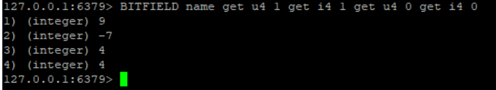

**Set**

无符号的 98 转成的 8 位二进制数字，代替从第 8 位开始接下来的 8 位数字。

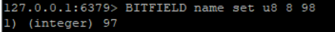

INCRBY：
对置顶范围进行自增操作，自增操作可能会出现溢出，既可能是向上溢出，也可能是向下溢出。Redis
中对于溢出的处理方案是折返。8 位无符号数 255 加 1 溢出变为 0；8 位有符号数 127，加 1 变为 -
128.
也可以修改默认的溢出策略，可以改为 fail ，表示执行失败。

>BITFIELD name overflow fail incrby u2 6 1

sat 表示留在在最大/最小值。

>  BITFIELD name overflow sat incrby u2 6 1

## 6.3. HyperLoglog

一般我们评估一个网站的访问量，有几个主要的参数：
pv，Page View，网页的浏览量
uv，User View，访问的用户
一般来说，pv 或者 uv 的统计，可以自己来做，也可以借助一些第三方的工具，比如 cnzz，友盟 等。
如果自己实现，pv 比较简单，可以直接通过 Redis 计数器就能实现。但是 uv 就不一样，uv 涉及到另
外一个问题，去重。
我们首先需要在前端给每一个用户生成一个唯一 id，无论是登录用户还是未登录用户，都要有一个唯一
id，这个 id 伴随着请求一起到达后端，在后端我们通过 set 集合中的 sadd 命令来存储这个 id，最后通
过 scard 统计集合大小，进而得出 uv 数据。
如果是千万级别的 UV，需要的存储空间就非常惊人。而且，像 UV 统计这种，一般也不需要特别精
确，800w 的 uv 和 803w 的 uv，其实差别不大。所以，我们要介绍今天的主角---HyperLogLog
Redis 中提供的 HyperLogLog 就是专门用来解决这个问题的，HyperLogLog 提供了一套不怎么精确但
是够用的去重方案，会有误差，官方给出的误差数据是 0.81%，这个精确度，统计 UV 够用了。
HyperLogLog 主要提供了两个命令：pfadd 和 pfcount。
pfadd 用来添加记录，类似于 sadd ，添加过程中，重复的记录会自动去重。
pfcount 则用来统计数据。
数据量少的时候看不出来误差。
在 Java 中，我们多添加几个元素：

做网站用户访问量和网页访问量统计

```java
public class HyperLogLogTest {
    public static void main(String[] args) {
        Redis redis = new Redis();
        redis.execute( jedis -> {
            for (int i = 0; i < 1000; i++) {
                jedis.pfadd( "uv", "vu"+i,"vu"+(i+1) );
            }
            long uvCount = jedis.pfcount( "uv" );
            System.out.println(uvCount); //理论值1000 
        } );
    }
}
```

实际值稍微有差别。可以接受

除了 pfadd 和 pfcount 之外，还有一个命令 pfmerge ，合并多个统计结果，在合并的过程中，会自动
去重多个集合中重复的元素。


# 7 redis 做分布式锁

k1 为锁

在**服务端编写lua 脚本(推荐)**

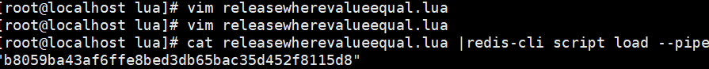

脚本内容
```shell
if redis.call("get",KEYS[1]==ARGV[1] then
        return redis.call("del",KEYS[1])
else
        return 0
end

```


script load 这个命令会在 Redis 服务器中缓存 Lua 脚本，并返回脚本内容的 SHA1 校验和，然后在
Java 端调用时，传入 SHA1 校验和作为参数，这样 Redis 服务端就知道执行哪个脚本了。

获取sha 字符串 	`b8059ba43af6ffe8bed3db65bac35d452f8115d8`

接下来，在 Java 端调用这个脚本。

```java
public class LuaTest {
    public static void main(String[] args) {
        Redis redis = new Redis();
        for (int i = 0; i < 2; i++) {
            redis.execute(jedis -> {
                //1.先获取一个随机字符串
                String value = UUID.randomUUID().toString();
                //2.获取锁
                String k1 = jedis.set("k1", value, new SetParams().nx().ex(5));
                //3.判断是否成功拿到锁
                if (k1 != null && "OK".equals(k1)) {
                //4. 具体的业务操作
                jedis.set("site", "www.javaboy.org");
                String site = jedis.get("site");
                System.out.println(site);
                //5.释放锁
                // jedis.eval(  )
                jedis.evalsha("b8059ba43af6ffe8bed3db65bac35d452f8115d8",
                Arrays.asList("k1"), Arrays.asList(value));
                } else {
                System.out.println("没拿到锁");
                }
            });
        }
    }
}
```

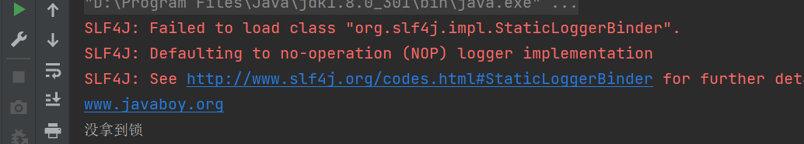

也可以lua **脚本写在客户端**

jedis.evel() 使用下图中的方法

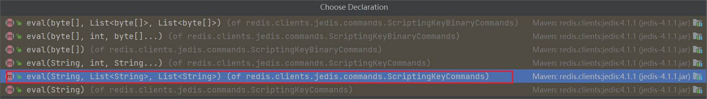

推荐把脚本写在resources 里用Java 代码加载进来转为String 类型。

# 8. Redis 做消息队列

参考 [Redis实现消息队列 - 简书 (jianshu.com)](https://www.jianshu.com/p/02a923fea175)

Redis提供了两种方式来做消息队列，一种是生产消费模式，另一种是发布订阅模式。

## 8.1 生产消费模式

生产消费模式会让一个或多个客户端监听消息队列，一旦消息到达，消费者马上消费，谁先抢到算谁的。如果队列中没有消息，消费者会继续监听。推荐**只有一个消费者时，使用redis** 就可以实现。如果对消息可靠性有极高的追求时，推荐使用专业的消息中间件。


如果队列空了怎么办呢？

如果队列空了，消费者会陷入`pop`死循环，即使没有数据也不会停止。空轮询不但消耗消费者的CPU资源还会影响Redis的性能。傻瓜式的做法是让消费者的线程按照一定的时间间隔不停的循环和监控队列，虽然可行但显然会造成不必要的资源浪费，而且循环周期也很难确定。

## 8.2 发布订阅模式

发布订阅模式是一个或多个客户端订阅消息频道，只要发布者发布消息，所有订阅者都能收到消息，订阅者都是平等的。

PUB/SUB

Redis自带`pub/sub`机制即发布订阅模式，此模式中生产者`producer`和消费者`consumer`之间的关系是一对多的，也就是一条消息会被多个消费者所消费，当只有一个消费者时可视为一对一的消息队列。


## 8.3 延迟消息队列

延迟队列可以通过 zset 来实现，因为 zset 中有一个 score，我们可以把时间作为 score，将 value 存到
redis 中，然后通过轮询的方式，去不断的读取消息出来。（可以根剧score，在指定的时间读取，实现延时）
首先，如果消息是一个字符串，直接发送即可，如果是一个对象，则需要对对象进行序列化，这里我们
使用 JSON 来实现序列化和反序列化。

```xml
<dependency>
    <groupId>redis.clients</groupId>
    <artifactId>jedis</artifactId>
    <version>4.1.1</version>
</dependency>
<dependency>
    <groupId>com.fasterxml.jackson.core</groupId>
    <artifactId>jackson-databind</artifactId>
    <version>2.10.3</version>
</dependency>
<dependency>
    <groupId>org.projectlombok</groupId>
    <artifactId>lombok</artifactId>
    <version>RELEASE</version>
    <scope>compile</scope>
</dependency>
```


```java
public class Redis {
    private JedisPool pool;

    public Redis(){
        GenericObjectPoolConfig config = new GenericObjectPoolConfig();
        //设置最大空闲数
        config.setMaxIdle( 300 );
        //设置最大连接数
        config.setMaxTotal( 1000 );

        Duration maxWaitDuration = Duration.ofMillis( 30000 );
        config.setMaxWait( maxWaitDuration );
        //在空闲时检查有效性
        config.setTestOnBorrow( true );

        pool = new JedisPool(config,"192.168.247.128",6379,3000);


    }
    public void execute(CallWithJedis callWithJedis){
        try(Jedis jedis = pool.getResource()){
            callWithJedis.call( jedis );
        }
    }

    public static void main(String[] args) {

        Redis redis = new Redis();

        //执行redis 想做的事情就好了
        redis.execute( jedis -> {
            System.out.println( jedis.ping() );
        } );

    }


}
```

```java
public interface CallWithJedis {
    void call(Jedis jedis);
}
```

```java
@Data
@AllArgsConstructor
@NoArgsConstructor
public class Message {
    private String id;
    private Object data;
}
```

```java

@AllArgsConstructor
@NoArgsConstructor
public class DelayMsgQueue {
    private Jedis jedis;
    //存放消息
    private String queue;

    /**
     * 消息入队
     * @param data
     */

    public void queue(Object data){
        Message message = new Message( UUID.randomUUID().toString(), data );

        //序列化
        try {
            String s = new ObjectMapper().writeValueAsString( message );
            System.out.println("message publish:" + new Date() );
            jedis.zadd( queue, System.currentTimeMillis()+5000,s );
        } catch (JsonProcessingException e) {
            e.printStackTrace();
        }
    }

    /**
     * 消费队列
     */
    public void loop(){
        while (!Thread.interrupted()){
            //排序读取一个元素
            List<String> zrange = jedis.zrangeByScore( queue, 0, System.currentTimeMillis(), 0, 1 );
            if(zrange.isEmpty()){
                try {
                    Thread.sleep( 500 );
                } catch (InterruptedException e) {
                   break;
                }
                continue;
            }

            //如果读取到了就取出来
            String next = zrange.iterator().next();
            if(jedis.zrem( queue,next ) > 0){
                try {
                    Message message = new ObjectMapper().readValue( next, Message.class );
                    //输出收到的信息
                    System.out.println("receive msg " + message);
                } catch (JsonProcessingException e) {
                    e.printStackTrace();
                }
            }
        }
    }
}
```

```java
public class DelayMsgTest {
    public static void main(String[] args) {
        Redis redis = new Redis();
        redis.execute( jedis->{
            //构造消息队列
            DelayMsgQueue delay_queue = new DelayMsgQueue( jedis, "delay_queue" );

            //构造消息生产者
            Thread producer = new Thread(){
                @Override
                public void run() {
                    for (int i = 0; i < 5; i++) {
                        delay_queue.queue( "data>>>>>"+ i);
                        
                    }
                }
            };

            Thread customer = new Thread(){
                @Override
                public void run() {
                    delay_queue.loop();
                }
            };

            //启动生产者消费者
            producer.start();
            customer.start();
            try {
                Thread.sleep( 7000 );
            } catch (InterruptedException e) {
                e.printStackTrace();
            }
        } );
    }
}
```


# 9. Redis Scann


1.简单介绍
scan 实际上是 keys 的一个升级版。
可以用 keys 来查询 key，在查询的过程中，可以使用通配符。keys 虽然用着还算方便，但是没有分页
功能。同时因为 Redis 是单线程，所以 key 的执行会比较消耗时间，特别是当数据量大的时候，影响整
个程序的运行。
为了解决 keys 存在的问题，从 Redis2.8 中开始，引入了 scan。
scan 具备 keys 的功能，但是不会阻塞线程，而且可以控制每次返回的结果数。
