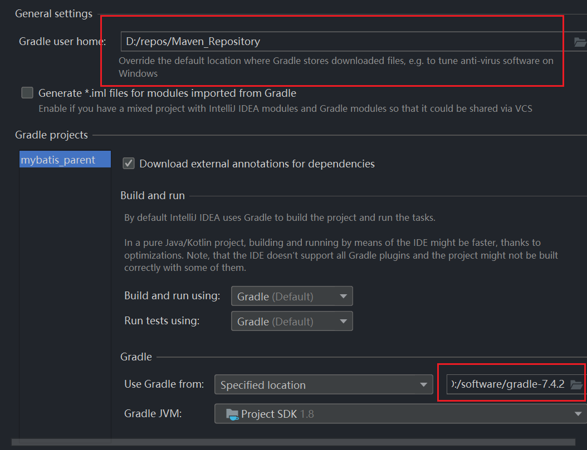

## Gradle 安装

### 下载

官网地址：[https://gradle.org/](https://gradle.org/)

下载解压，配置环境变量


配置本地仓库为Maven的本地仓库


如果maven 仓库中没有jar 包，则下载到 maven 仓库下的caches 目录下。


win+R 启动命令查看cmd

> gradle -v 

查看版本


### 配置Gradle仓库源

可以放在 Gradle 安装目录下的`init.d`文件夹`init.gradle` 文件内，为了以后升级方便，可以直接放在

用户目录下的`.gradle` 文件下`init.gradle` 文件内。

```
allprojects {
    repositories {
        mavenLocal()
        maven { name "Alibaba" ; url "https://maven.aliyun.com/repository/public" }
        maven { name "Bstek" ; url "https://nexus.bsdn.org/content/groups/public/" }
        mavenCentral()
    }
    buildscript {
        repositories {
        maven { name "Alibaba" ; url 'https://maven.aliyun.com/repository/public' }
        maven { name "Bstek" ; url 'https://nexus.bsdn.org/content/groups/public/' }
        maven { name "M2" ; url 'https://plugins.gradle.org/m2/' }
        }
    }
}
```


[教程](https://www.it235.com/实用工具/Gradle/gradle.html)：


Gradle 创建Java 项目



创建成功后设置一下本地启动。

Gradle 创建Web项目

