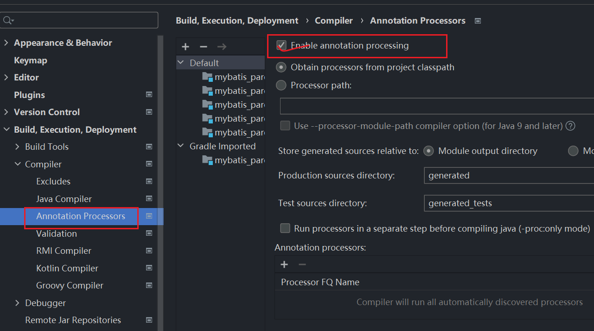

1. 控制台输入乱码

修改help-> edit custom jvm options

```
-Dfile.encoding=UTF-8
```

2. 无法使用lombok 插件

需要build.gradle 中添加



```groovy
dependencies {
    compileOnly 'org.projectlombok:lombok:1.18.18'
    annotationProcessor 'org.projectlombok:lombok:1.18.18'
}
```


3. 创建JavaWeb 项目控制台乱码

修改tomcat 中 config/logging.properties 中

java.util.logging.ConsoleHandler.encoding = `utf-8`


4. Idea 创建新版JavaWeb 项目

必须使用 web5.0 + tomcat10

```gradle
compileOnly('jakarta.servlet:jakarta.servlet-api:5.0.0')
```

