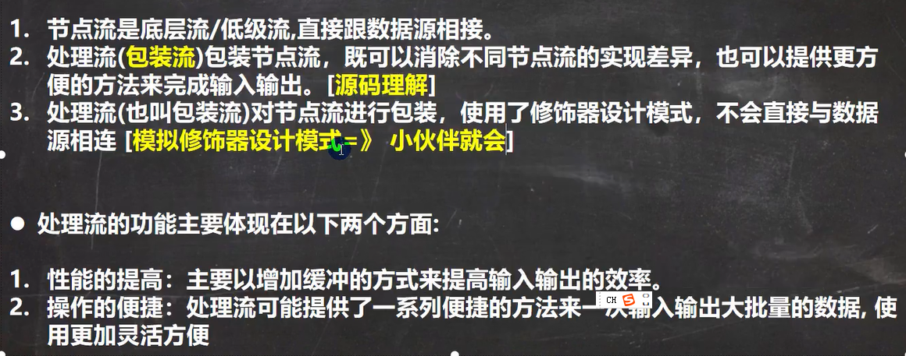
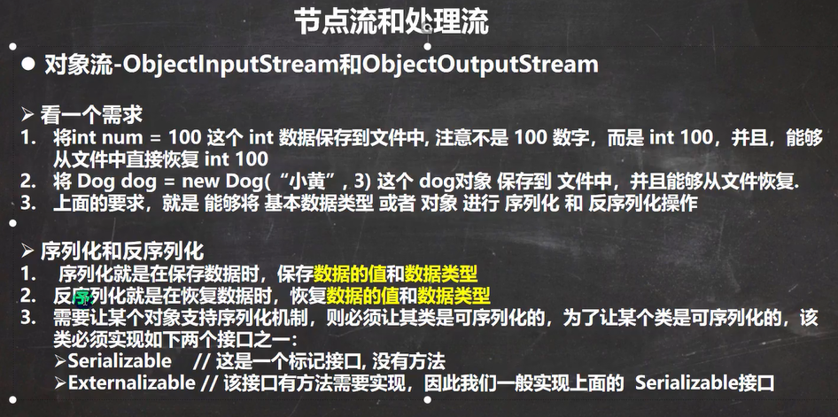
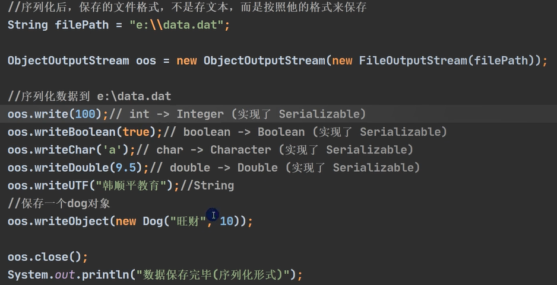
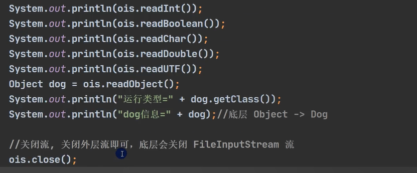
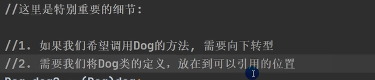
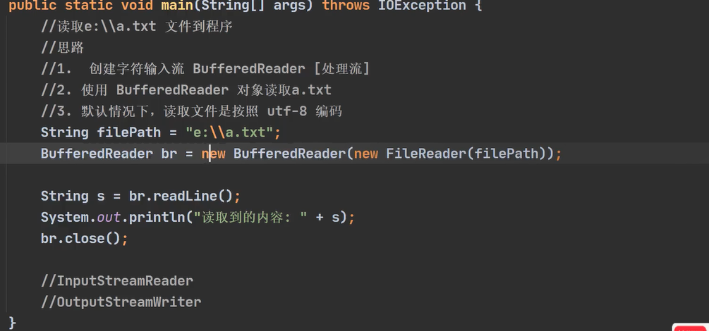
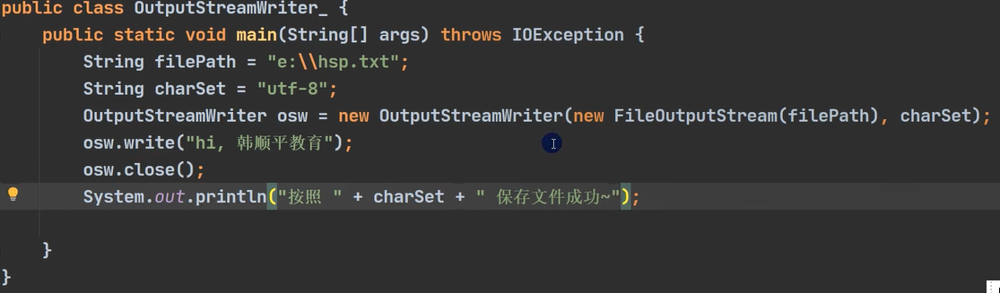
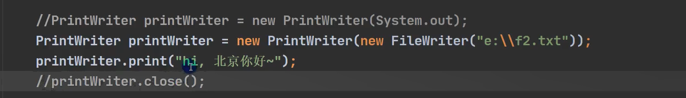
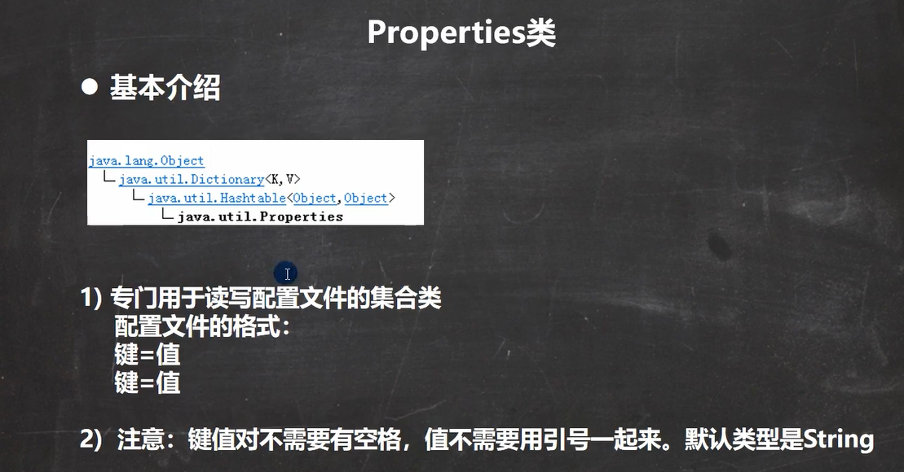
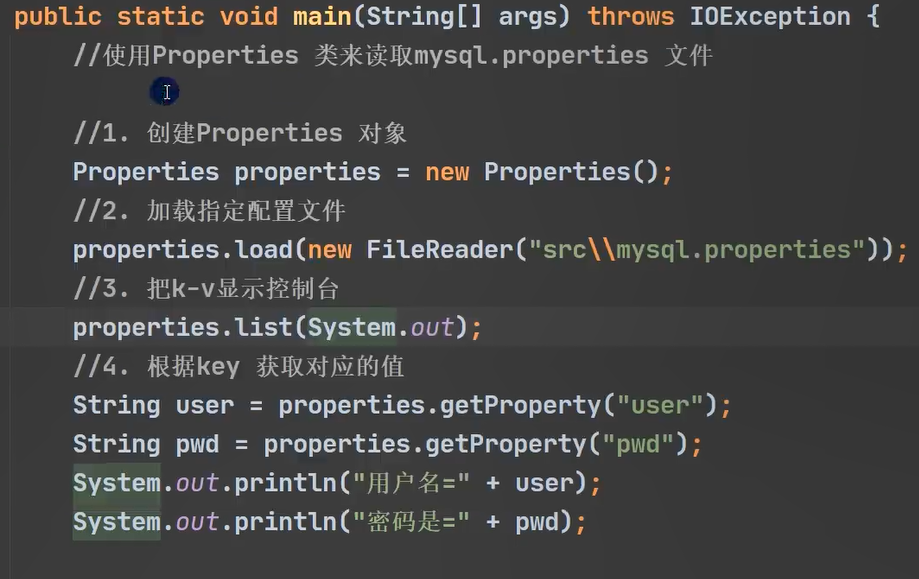

# IO 流专题

## 字节流


### FileInputStream

示例代码 1 

```java
public static void main(String[] args) throws IOException {
。
    InputStream inputStream = new FileInputStream("d:/a.txt");
    //读取一个字节，如果读取不到返回-1

   int read = 0;
    while ((read = inputStream.read()) !=-1) {
        System.out.print((char) read);
    }
    inputStream.close();

}
```
示例代码 2

```java
public static void main(String[] args) throws IOException {
    
    InputStream inputStream = new FileInputStream("d:/a.txt");
    //读取一个字节，如果读取不到返回-1
    byte[] b = new byte[8];
    //
    while((read = inputStream.read(b)) != -1){
        System.out.println(new String(b,0,read));
    }
    inputStream.close();

}
```
示例代码 3

### FileOutputStream

```java
@Test
public void test() throws IOException {
    File path = new File("d:/a/b.txt");
    path.getParentFile().mkdirs();
    OutputStream outputStream = new FileOutputStream(path);
    String info = "Hello World b";
    //1. 写入一个字符 108 对应字母l
    outputStream.write(108);
    //2. 写入字节数组
    outputStream.write(info.getBytes());
    //3.写入截取的字符串
    outputStream.write(info.getBytes(),2,3);
   
    outputStream.close();
}
```

### 文件读写

示例1

```java
@Test
public void IOTest() throws IOException {
    FileInputStream fileInputStream = new FileInputStream("d:/1.jpg");
    FileOutputStream fileOutputStream = new FileOutputStream("src/2.jpg");

    byte[] buf = new byte[1024];
    int read = 0;
    while ((read = fileInputStream.read(buf)) != -1){
        fileOutputStream.write(buf, 0, read);
    }
    fileInputStream.close();
    fileInputStream.close();
   
}
```

JDK 9 中  InputStream 新增一个 transferTo() 可以直接实现文件输入输出。

示例代码如下

```java
@Test
public void IOTest2() throws IOException {
    FileInputStream fileInputStream = new FileInputStream("d:/1.jpg");
    FileOutputStream fileOutputStream = new FileOutputStream("src/2.jpg");
	//jdk 9 新增方法
    fileInputStream.transferTo(fileOutputStream);

    fileInputStream.close();
    fileInputStream.close();

}
```

### InputStream 的 mark() 和 reset()

InputStream 中有2个方法mark() 和 reset(),他的子类可能支持也可能不支持。

要想其子类支持这2个方法，必须重写子类的markSupported() 方法返回true。如果返回false,这2个方法同样不支持。

**mark()** 标记读取流的位置

**reset()** 重新回退定位到mark()标记的位置。

```java
public synchronized void mark(int readlimit) {}
 public synchronized void reset() throws IOException {
        throw new IOException("mark/reset not supported");
    }
```

```java
byte[] bytes = "abcdef".getBytes();

ByteArrayInputStream byteArrayInputStream = new ByteArrayInputStream(bytes);

int data = byteArrayInputStream.read();  // read 'a'
    data = byteArrayInputStream.read();  // read 'b'
    data = byteArrayInputStream.read();  // read 'c'

    byteArrayInputStream.mark(1024);     // mark set before reading 'd'
    data = byteArrayInputStream.read();  // read 'd'
    data = byteArrayInputStream.read();  // read 'e'
    data = byteArrayInputStream.read();  // read 'f'

    byteArrayInputStream.reset();        // reset to mark before 'd'
    data = byteArrayInputStream.read();  // read 'd'
    data = byteArrayInputStream.read();  // read 'e'
    data = byteArrayInputStream.read();  // read 'f'
```

###  available() 查看可用字节

```java
byte[] bytes = "ABCDEF".getBytes();
ByteArrayInputStream byteArrayInputStream = new ByteArrayInputStream(bytes);
int available = byteArrayInputStream.available();
System.out.println("查看有多少个字节可用" + available);
```

### skip() 方法跳过字节

```java
byte[] bytes = "ABCDEF".getBytes();
ByteArrayInputStream byteArrayInputStream = new ByteArrayInputStream(bytes);

//跳过2个字节
byteArrayInputStream.skip(2);
System.out.println("跳过2个字节后读取的数据"+(char) byteArrayInputStream.read());
```

## 字符流

### FileReader

```java
@Test
public void test1() throws IOException {
    FileReader fileReader = new FileReader("d:/story.txt");
    int read = 0;
    while ((read = fileReader.read() )!= -1) {
        System.out.print((char)read);
    }
    fileReader.close();

}
```

```java
@Test
public void test2() throws IOException {
    FileReader fileReader = new FileReader("d:/story.txt");
    int len = 0;
    char[] buf = new char[1024];

    while ((len = fileReader.read(buf) )!= -1) {
        System.out.print(new String(buf,0,len));
    }
    fileReader.close();

}
```

```java
@Test
public void test4() throws IOException {
    FileReader fileReader = new FileReader("d:/story.txt");
    int len = 0;
    char[] buf = new char[1024];
    int read = fileReader.read(buf, 1, 2);
    System.out.println(new String(buf,1,read));
    fileReader.close();

}
```

### FileWriter

```java
@Test
public void test() throws IOException {
    FileWriter fileWriter = new FileWriter("d:/newStory.txt");
    String content = "很久很久以前,山上一个庙,庙里一个老和尚";
    fileWriter.write(content);
    fileWriter.close();
}
```

```java
@Test
public void test() throws IOException {
    FileWriter fileWriter = new FileWriter("d:/newStory.txt",true);
    String content = "很久很久以前,山上一个庙,庙里一个老和尚";
    fileWriter.write(content);
   // fileWriter.flush();
    fileWriter.close();
}
```

### 文件读取

```java
@Test
public void test5() throws IOException {
    FileReader fileReader = new FileReader("d:/story.txt");
   // FileWriter fileWriter = new FileWriter("src/newStroy.txt");
    FileWriter fileWriter = new FileWriter("src/newStroy.txt",true);
    char[] buf = new char[1024];
    int len = 0;
    while ((len = fileReader.read(buf)) != -1){
        fileWriter.write(buf,0,len);
    }
    fileWriter.close();
    fileReader.close();

}
```

JDK 10 新增方法

```java
@Test
public void test3() throws IOException {
    FileReader fileReader = new FileReader("d:/story.txt");
    FileWriter fileWriter = new FileWriter("src/newStroy.txt");
    fileReader.transferTo(fileWriter);
    fileReader.close();

}
```

查看transferTo 源码

```java
//缓冲流大小
private static final int TRANSFER_BUFFER_SIZE = 8192
public long transferTo(Writer out) throws IOException {
    //要求输入流不为空
    Objects.requireNonNull(out, "out");
    long transferred = 0;
    char[] buffer = new char[TRANSFER_BUFFER_SIZE];
    int nRead;
    while ((nRead = read(buffer, 0, TRANSFER_BUFFER_SIZE)) >= 0) {
        out.write(buffer, 0, nRead);
        transferred += nRead;
    }
    return transferred;
}
```


## 字符处理流

字节流和字符流都属于处理流。




### BufferReader

```java
@Test
public void test() throws IOException {

    BufferedReader bufferedReader = new BufferedReader(new FileReader("d:/a.txt"));
    String line;
    //实现一行一行读取
    while ((line =bufferedReader.readLine()) != null){
        System.out.println(line);
    }
    //关闭秩序关闭外层流即可
    bufferedReader.close();
}
```

### BufferedWriter

```java
@Test
public void test() throws IOException {
    BufferedWriter bufferedWriter = new BufferedWriter(new FileWriter("d:/aa.txt"));
    bufferedWriter.write("Hello,今天天气不错偶！");
    bufferedWriter.write("Hello,今天天气不错偶！");
    //换行
    bufferedWriter.write("\r\n");
    //添加换行
    bufferedWriter.newLine();
    bufferedWriter.write("Hello,今天天气不错偶！");
    bufferedWriter.write("Hello,今天天气不错偶！");
    //关闭流
    bufferedWriter.close();


}
```

### 文件读取

```java
@Test
public void test2() throws IOException {

    BufferedReader bufferedReader = new BufferedReader(new FileReader("d:/a.txt"));
    BufferedWriter bufferedWriter = new BufferedWriter(new FileWriter("src/aa.txt"));
    String line;
    //实现一行一行读取
    while ((line =bufferedReader.readLine()) != null){
       bufferedWriter.write(line);
       //换行
       bufferedWriter.newLine();

    }
    //关闭外层流,先关输出流，再关输入流。
    bufferedWriter.close();
    bufferedReader.close();

}
```

## 字节处理流

### BufferedInputStream

具体代码和上述类似。不在详细演示

### BufferedOutputStream

具体代码和上述类似。不在详细演示

### 实现音频文件拷贝

```java
@org.junit.Test
public void test() throws IOException {
    String srcFile = "d:/a.mp4";
    String destFile = "d:/b.mp4";
    BufferedInputStream bis = new BufferedInputStream(new FileInputStream(srcFile));
    BufferedOutputStream bos = new BufferedOutputStream(new FileOutputStream(destFile));
    byte[] buf = new byte[1024];
    int len;
    while ((len = bis.read(buf)) != -1){
        bos.write(buf, 0, len);
    }
    bos.close();
    bis.close();

}
```

## 对象处理流



### ObjectInputStream 

提供序列化



### ObjectOutputStream

提供反序列化







## 标准输入输出流

## 转换流

### InputStreamReader

```java
@Test
public void test() throws IOException {
    InputStream inputStream = new FileInputStream("src/data/input.txt");
    //InputStreamReader inputStreamReader = new InputStreamReader(inputStream);
    //设置字符编码，
    InputStreamReader inputStreamReader = new InputStreamReader(inputStream, StandardCharsets.UTF_8);
    //获取字符编码
    String encoding = inputStreamReader.getEncoding();
    System.out.println("获取字符编码"+encoding);
    int data;
    while ((data =inputStreamReader.read()) != -1){
        System.out.print((char)data);
    }
    //关闭
    inputStreamReader.close();
}
```

### OutputStreamWriter

```java
@Test
public void test1() throws IOException {
    OutputStream outputStream  = new FileOutputStream("src\\data\\output.txt");
    //输出转换流
    //OutputStreamWriter outputStreamWriter = new OutputStreamWriter(outputStream);
    //设置编码
    OutputStreamWriter outputStreamWriter = new OutputStreamWriter(outputStream, StandardCharsets.UTF_8);

    System.out.println("获取输出流的编码格式"+outputStreamWriter.getEncoding());

    outputStreamWriter.write("Hello World");
    char[] chars = new char[]{'A','B','C','D','E'};

    outputStreamWriter.write(chars);
    //确保内容全部存入磁盘
    outputStreamWriter.flush();
    outputStreamWriter.close();
}
```






## 打印流

打印流只有输出流，没有输入流  PrintStream 和 PrintWriter

### PrintStream


### PrintWriter



printWriter.clowe() 方法不执行，无法打印输出。

## Properties

### 读取文件


### Properties 的使用




Properties 类读取



Properties 核心底层是HashTable

## 回退流

### PushbackInputStream

```java

PushbackInputStream input = new PushbackInputStream(
                                new FileInputStream("c:\\data\\input.txt"));
//读取一个字节
int data = input.read();
//回退一个字节
input.unread(data);
```

```java
int pushbackLimit = 8;
//设置字节限制，最多回退8个字节
PushbackInputStream input = new PushbackInputStream(
                                new FileInputStream("c:\\data\\input.txt"),
                                pushbackLimit);
```

## 行号流 LineNumberReader

```java
@Test
public void test() throws IOException {
    LineNumberReader lineNumberReader =
            new LineNumberReader(new FileReader("src\\data\\input.txt"));
    String data;
    while((data = lineNumberReader.readLine()) != null){
		 //返回行号,每读取一次加1
        int lineNumber = lineNumberReader.getLineNumber();
        System.out.println(lineNumber);
        System.out.println(data);

    }
    lineNumberReader.close();
}
```

## Pipe Stream

* 在Java 中要求管道流必须运行在同一个进程，不同的线程中的交流。

* 管道流必须是一个线程读一个线程写。当你用一个线程同时进行读写操作时，会造成线程阻塞。

* 如果要在线程之间交换原始数据，管道是可行的。

### 管道流的使用

```java
import java.io.IOException;
import java.io.PipedInputStream;
import java.io.PipedOutputStream;

public class PipeExample {

    public static void main(String[] args) throws IOException {

        final PipedOutputStream output = new PipedOutputStream();
        final PipedInputStream  input  = new PipedInputStream(output);


        Thread thread1 = new Thread(new Runnable() {
            @Override
            public void run() {
                try {
                    output.write("Hello world, pipe!".getBytes());
                } catch (IOException e) {
                }
            }
        });


        Thread thread2 = new Thread(new Runnable() {
            @Override
            public void run() {
                try {
                    int data = input.read();
                    while(data != -1){
                        System.out.print((char) data);
                        data = input.read();
                    }
                } catch (IOException e) {
                }
            }
        });

        thread1.start();
        thread2.start();

    }
}
```


### PipedOutputStream

```java
OutputStream output = new PipedOutputStream(pipedInputStream);

while(moreData) {
  int data = getMoreData();
  output.write(data);
}
output.close();
```

### PipedInputStream

```java
InputStream input = new PipedInputStream(pipedOutputStream);

int data = input.read();
while(data != -1) {
  //do something with data...
  doSomethingWithData(data);

  data = input.read();
}
input.close();
```

## 数据流

通常，您将使用 Java DataInputStream 来读取由Java DataOutputStream写入的数据。

需要提前知道从DataInputStream 中读取那些数据，以及读取的顺序。

### DataOutputStream

```java
FileOutputStream outputStream = new FileOutputStream("src/data/binary1.data");

DataOutputStream dataOutputStream =new DataOutputStream(outputStream);

dataOutputStream.writeInt(123);
dataOutputStream.writeFloat(123.45F);
dataOutputStream.writeLong(789);

dataOutputStream.close();
```

###  DataInputStream


```java
DataInputStream dataInputStream =new DataInputStream(new FileInputStream("src/data/binary1.data"));

int   int123     = dataInputStream.readInt();
float float12345 = dataInputStream.readFloat();
long  long789    = dataInputStream.readLong();

dataInputStream.close();

System.out.println("int123     = " + int123);
System.out.println("float12345 = " + float12345);
System.out.println("long789    = " + long789);
```

## 序列流

```java
InputStream input1 = new FileInputStream("c:\\data\\file1.txt");
InputStream input2 = new FileInputStream("c:\\data\\file2.txt");

SequenceInputStream sequenceInputStream =
    new SequenceInputStream(input1, input2);

int data = sequenceInputStream.read();
while(data != -1){
    System.out.println(data);
    data = sequenceInputStream.read();
}
```

## StringReader

## StringWriter

