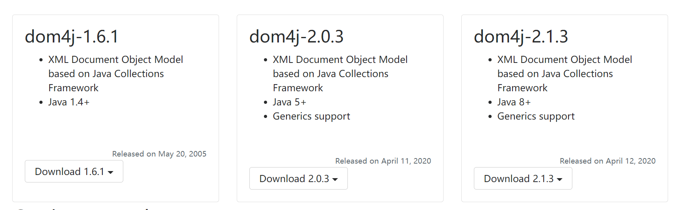
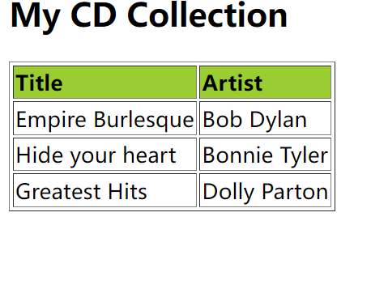

# XML 解析

## 1. dom4j

 dom4j是一个Java的XML API，类似于jdom，用来读写XML文件的。dom4j是一个非常非常优秀的Java XML API，具有性能优异、功能强大和极端易用使用的特点，同时它也是一个开放源代码的软件，可以在SourceForge上找到它. 

  对主流的Java XML API进行的性能、功能和易用性的评测，dom4j无论在那个方面都是非常出色的。如今你可以看到越来越多的Java软件都在使用dom4j来读写XML，例如Hibernate，包括sun公司自己的JAXM也用了Dom4j。

   使用Dom4j开发，需下载dom4j相应的jar文件

### 1.1 官网下载: [dom4j](https://dom4j.github.io/#parsing)

​	推荐下载地址[dom4j](https://dom4j.github.io/#parsing)



### 1.2 dom4j  解析xml

示例

```xml
<?xml version="1.0" encoding="UTF-8"?>
<scores>
    <student id="1">
        <name>张三</name>
        <course>java</course>
        <score>89</score>

    </student>

    <student id="2">
        <name>王五</name>
        <course>sql</course>
        <score>27</score>
    </student>
    <student id="3">
        <name>赵六</name>
        <course>mysql</course>
        <score>27</score>

    </student>
</scores>
```

解析代码

```java
public class ParseXml {

    public static void main(String[] args) throws DocumentException {

        File file = new File( "src/demo.xml" );
        //获取docment 对象
        Document document = new ParseXml().parse( file );

        Element rootElement = document.getRootElement();
        //获取根元素的名字
        System.out.println( rootElement.getName() );

        Iterator<Element> elementIterator = rootElement.elementIterator();
        while (elementIterator.hasNext()){
            Element element = elementIterator.next();
            //获取
            System.out.println( element.getName() );
            //获取属性对象
            Attribute attributeId = element.attribute( "id" );
            //打印输出
            System.out.println(attributeId.getName() +"====="+ attributeId.getValue() );
            //根名字获取元素
            Element name = element.element( "name" );
            Element course = element.element( "course" );
            Element score = element.element( "score" );
            //打印输出
            System.out.println(name.getName() + "====" + name.getStringValue());
            System.out.println(course.getName() + "====" + course.getText());
            System.out.println(score.getName() + "====" + score.getText());


        }

    }

    /**
     *
     * @param file
     * @return 获取Document 对象
     * @throws DocumentException
     */
    public Document parse(File file) throws DocumentException {
        SAXReader reader = new SAXReader();
        Document document = reader.read(file);
        System.out.println(document);
        return document;
    }

}

```

### 1.3 dom4j 创建xml 

```java
import org.dom4j.Document;
import org.dom4j.DocumentHelper;
import org.dom4j.Element;
import org.dom4j.io.OutputFormat;
import org.dom4j.io.XMLWriter;

import java.io.FileWriter;
import java.io.IOException;

/**
 * @Author deyou
 * @Date 2022/2/28 10:49
 * @Version 1.0
 */
public class CreateXml {
    public Document createDocument() {
        Document document = DocumentHelper.createDocument();
        Element root = document.addElement("root");

        Element author1 = root.addElement("author")
                .addAttribute("name", "James")
                .addAttribute("location", "UK")
                .addText("James Strachan");

        Element author2 = root.addElement("author")
                .addAttribute("name", "Bob")
                .addAttribute("location", "US")
                .addText("Bob McWhirter");

        Element author3 = root.addElement("author")
                .addAttribute("name", "Bob")
                .addAttribute("location", "US");

        Element test = author3.addElement( "test" );
        test.addText( "testValue" );
        return document;
    }

    public static void main(String[] args) throws IOException {
        CreateXml createXml = new CreateXml();
        Document document = createXml.createDocument();
        FileWriter fileWriter = new FileWriter("output.xml");


//        document.write(out);
//        out.close();


        // Pretty print the document to System.out
        //OutputFormat format = OutputFormat.createPrettyPrint();
        OutputFormat format = OutputFormat.createCompactFormat();
        format.setEncoding("UTF-8");//设置字符格式
        XMLWriter writer = new XMLWriter(fileWriter, format);
        writer.write( document );
        writer.close();
    }
}
```

### 1.4 模拟备份数据

新建User类

```java
@Data
@AllArgsConstructor
@NoArgsConstructor
public class User {
    private int id;
    private String name;
    private int age;
}
```


数据备份类

```java
import entity.User;
import org.dom4j.Document;
import org.dom4j.DocumentHelper;
import org.dom4j.Element;
import org.dom4j.io.OutputFormat;
import org.dom4j.io.XMLWriter;

import java.io.FileWriter;
import java.io.IOException;
import java.util.ArrayList;
import java.util.List;

/**
 * @Author deyou
 * @Date 2022/2/28 11:14
 * @Version 1.0
 */
public class BackData {
    
    private List<User> userList = new ArrayList<>();
    public BackData() {
        //模拟数据库数据
        userList.add( new User(1,"tom",23) );
        userList.add( new User(2,"tom",23) );
        userList.add( new User(3,"tom",23) );
        userList.add( new User(4,"tom",23) );
    }

    public static void main(String[] args) throws IOException {
        BackData backData = new BackData();
        List<User> userList = backData.userList;
        Document document = createDocument( userList );
        createXml( document,"output.xml" );

    }

    public static Document createDocument(List<User> userList){
        Document document = DocumentHelper.createDocument();

        Element root = document.addElement("users");
        for (User user : userList) {
            Element userElement = root.addElement( "user" )

                    .addAttribute("id", String.valueOf( user.getId() ) );
            Element name = userElement.addElement( "name" );
            Element age = userElement.addElement( "age" );
            name.setText( user.getName() );
            age.setText( String.valueOf( user.getAge() ) );

        }
        return document;
    }

    public static void createXml(Document document,String outPath) throws IOException {

        FileWriter fileWriter = new FileWriter(outPath);
        //创建紧凑的格式
        //OutputFormat format = OutputFormat.createCompactFormat();
        //创建优美的格式
        OutputFormat format = OutputFormat.createPrettyPrint();
        //设置字符格式
        format.setEncoding("UTF-8");
        XMLWriter writer = new XMLWriter(fileWriter, format);
        writer.write( document );
        writer.close();
    }
}
```

测试输出结果

output.xml

```java
<?xml version="1.0" encoding="UTF-8"?>

<users>
  <user id="1">
    <name>tom</name>
    <age>23</age>
  </user>
  <user id="2">
    <name>tom</name>
    <age>23</age>
  </user>
  <user id="3">
    <name>tom</name>
    <age>23</age>
  </user>
  <user id="4">
    <name>tom</name>
    <age>23</age>
  </user>
</users>
```

### 1.5 转换字符串

#### 1.5.1转换为xml 文本

```java
Document document = …;
String text = document.asXML();
```

#### 1.5.2 xml 格式的文本解析

```java
String text = "<person> <name>James</name> </person>";
Document document = DocumentHelper.parseText(text);
```

### 1.6 XML 转换样式

也就是使用一个XSLT 转换XML 样式。

XSLT 其实就是xml 样式模板。

传入一个document 对象，和样式文件。返回转换后的样式

下面方法可以把xml 转换成想要的XHTML 样式。

```java
 public Document styleDocument(Document document, String stylesheet) throws Exception {

        // load the transformer using JAXP
        TransformerFactory factory = TransformerFactory.newInstance();
        Transformer transformer = factory.newTransformer(new StreamSource(stylesheet));

        // now lets style the given document
        DocumentSource source = new DocumentSource(document);
        DocumentResult result = new DocumentResult();
        transformer.transform(source, result);

        // return the transformed document
        Document transformedDoc = result.getDocument();
        return transformedDoc;
 }
```

#### 例子：

xml 文件

```xml
<!--  Edited with XML Spy v2007 (http://www.altova.com)  -->
<catalog>
    <cd>
        <title>Empire Burlesque</title>
        <artist>Bob Dylan</artist>
        <country>USA</country>
        <company>Columbia</company>
        <price>10.90</price>
        <year>1985</year>
    </cd>
    <cd>
        <title>Hide your heart</title>
        <artist>Bonnie Tyler</artist>
        <country>UK</country>
        <company>CBS Records</company>
        <price>9.90</price>
        <year>1988</year>
    </cd>
    <cd>
        <title>Greatest Hits</title>
        <artist>Dolly Parton</artist>
        <country>USA</country>
        <company>RCA</company>
        <price>9.90</price>
        <year>1982</year>
    </cd>
 

</catalog>
```

xsl 样式文件

```xml
<!--  Edited with XML Spy v2007 (http://www.altova.com)  -->
<xsl:stylesheet xmlns:xsl="http://www.w3.org/1999/XSL/Transform" version="1.0">
    <xsl:output method="html" version="1.0" encoding="UTF-8" indent="yes"/>
    <xsl:template match="/">
        <html>
            <body>
                <h2>My CD Collection</h2>
                <table border="1">
                    <tr bgcolor="#9acd32">
                        <th align="left">Title</th>
                        <th align="left">Artist</th>
                    </tr>
                    <xsl:for-each select="catalog/cd">
                        <tr>
                            <td>
                                <xsl:value-of select="title"/>
                            </td>
                            <td>
                                <xsl:value-of select="artist"/>
                            </td>
                        </tr>
                    </xsl:for-each>
                </table>
            </body>
        </html>
    </xsl:template>
</xsl:stylesheet>
```

```java
public class TansXmlToHtml {
    public Document styleDocument(Document document, String stylesheet) throws Exception {

        // load the transformer using JAXP
        TransformerFactory factory = TransformerFactory.newInstance();
        Transformer transformer = factory.newTransformer(new StreamSource(stylesheet));

        // now lets style the given document
        DocumentSource source = new DocumentSource(document);
        DocumentResult result = new DocumentResult();
        transformer.transform(source, result);

        // return the transformed document
        Document transformedDoc = result.getDocument();
        return transformedDoc;
    }

    public static void main(String[] args) throws Exception {
        File file = new File( "src/catalog.xml" );
        //获取docment 对象
        Document document = new ParseXml().parse( file );
        TansXmlToHtml changXml = new TansXmlToHtml();
        Document resultDoc = changXml.styleDocument( document, "src/catalog.xsl" );


        FileWriter fileWriter = new FileWriter("src/catalog.html");

        OutputFormat format = OutputFormat.createPrettyPrint();
        XMLWriter writer = new XMLWriter(fileWriter, format);
        writer.write( resultDoc );
        writer.close();

    }

}
```

执行上述代码：生成catalog.html 文件

```html
<?xml version="1.0" encoding="UTF-8"?>

<html>
  <body>
    <h2>My CD Collection</h2>
    <table border="1">
      <tr bgcolor="#9acd32">
        <th align="left">Title</th>
        <th align="left">Artist</th>
      </tr>
      <tr>
        <td>Empire Burlesque</td>
        <td>Bob Dylan</td>
      </tr>
      <tr>
        <td>Hide your heart</td>
        <td>Bonnie Tyler</td>
      </tr>
      <tr>
        <td>Greatest Hits</td>
        <td>Dolly Parton</td>
      </tr>
    
    </table>
  </body>
</html>
```

使用浏览器打开如下



