# 泛型

## 1. 泛型类

具有泛型变量的类

类名后面使用 <T>   <T,U> 

* 可以用修饰成员变量。

* 方法参数类型，

* 方法返回值类型。

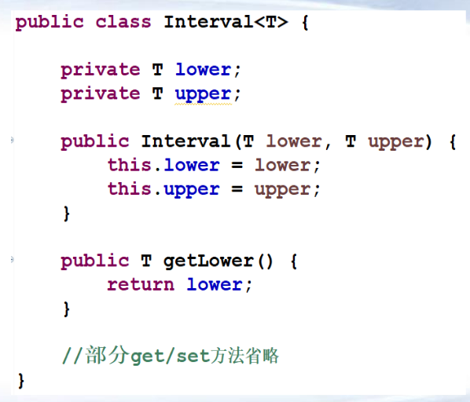

泛型类的调用

>  Interval v1 = new Interval(1,2);
>
>  Interval v1 = new Interval<>(1,2);

## 2. 泛型方法

具有泛型参数的方法。

可以再普通类和泛型类中存在。

<T> 在修饰符后返回值前。

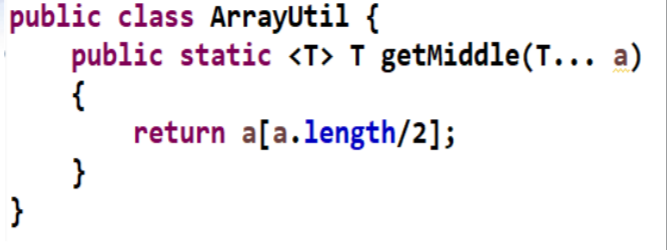

## 3.泛型接口

泛型接口 

* 和泛型类相似，在类名后加 –T
* 用来指定方法返回值和参数 
* 实现接口时，指定类型

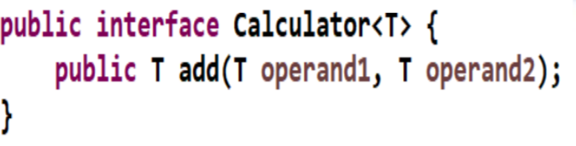

## 4. 泛型类的限定

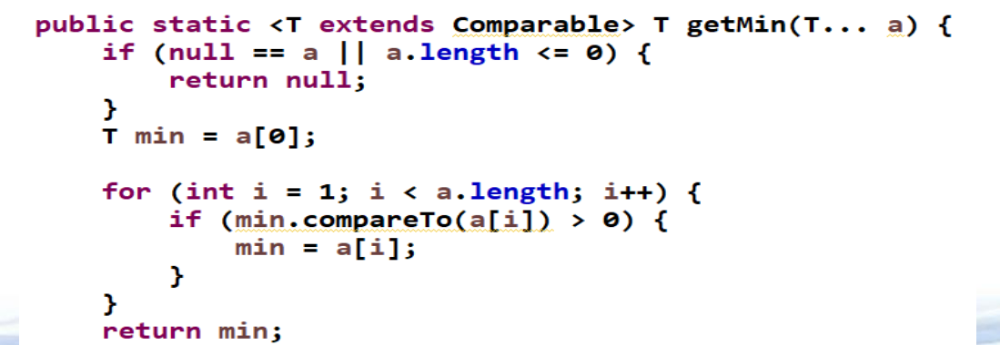

## 5. 泛型限定

泛型限定

* 编写的代码可以被很多不同类型的对象所重用 –
* 特定场合下，需要对类型进行限定(使用某些特定方法)

* <T extends Comparable> 约定T必须是Comparable的子类
* extends固定，后面可以多个，以&拼接，如<T extends
  Comparable & Serializable>
* extends限定可以有多个接口，但只能一个类，且类必须排第一位
* 逗号隔参数，<T extends File & Cloneable, U extends Serializable>

## 6 泛型类的继承

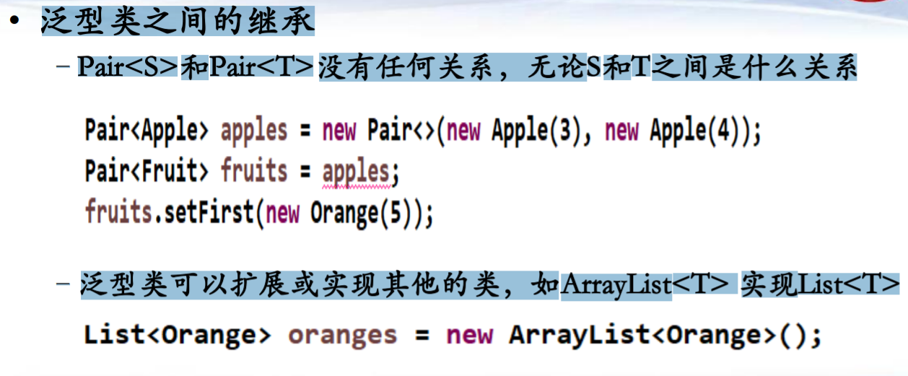

## 7 泛型通配符

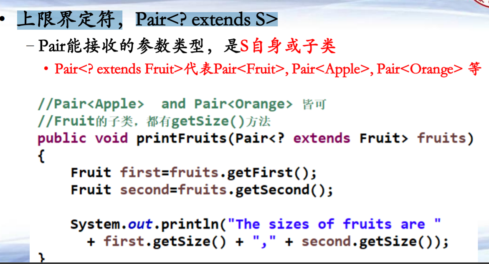

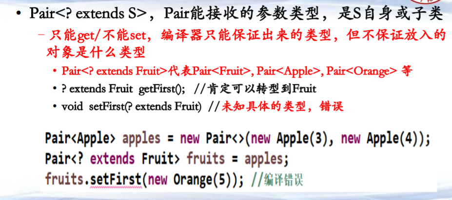

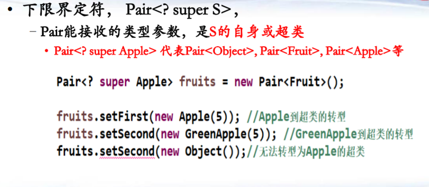

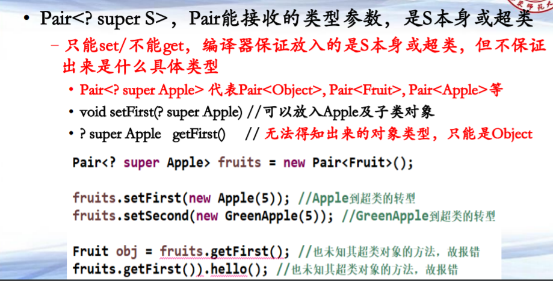

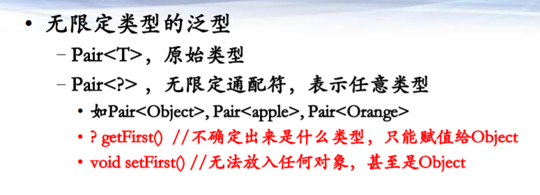

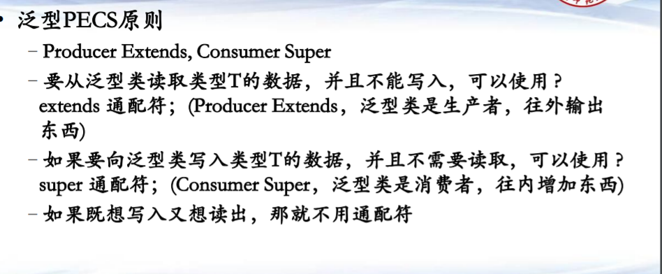

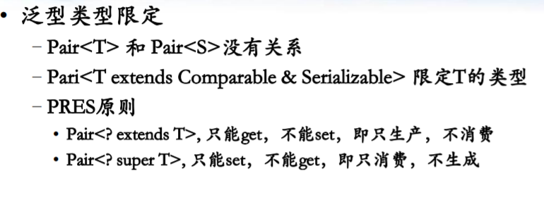