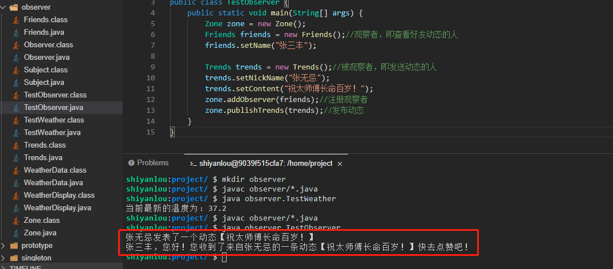

# 观察者模式

## 1、观察者模式主要有2中写法

* 一种是监听到消息后主动获取

* 一种是对方主动推送消息给观察者。

## 2、什么是观察者模式？

观察者模式（Observer Pattern）也叫做发布订阅模式，其定义了对象之间的一对多依赖，让多个观察者对象同时监听一个主体对象，当主体对象发生变化时，它的所有依赖者（观察者）都会收到通知并更新，观察者模式属于行为型模式。

下面我们就以获取天气预报中的气温举例进行说明，看看观察者模式应该如何实现（这里我们需要新建一个 `observer` 目录，相关类创建在 `observer` 目录下）。

## 3.1push 模式示例

- 新建一个观察者接口 `Observer.java`。

```java
package observer;

public interface Observer {
    void update(float temperature);//更新天气信息
}
```

- 接下来新建一个 `Subject.java` 类，用来管理观察者，主要定义了三个方法。

```java
package observer;

public interface Subject {
    void registerObserver(Observer o);//注册观察对象
    void removeObserver(Observer o);//移除观察对象
    void notifyObservers();//通知观察对象
}
```

- 接下来再建立一个 `WeatherData.java` 类，实现 Subject 接口。

```java
package observer;

import java.util.ArrayList;
import java.util.List;

public class WeatherData implements Subject {
    private List<Observer> observers;//观察者不止一个，所以用list进行维护

    private float temperature;//温度

    public void setMessurements(float temperature){
        this.temperature = temperature;

        notifyObservers();//气温信息发生变化时，通知所有观察者
    }


    public WeatherData() {//初始化list
        this.observers = new ArrayList<>();
    }

    /**
     * 注册观察者
     * @param o
     */
    @Override
    public void registerObserver(Observer o) {
        observers.add(o);
    }

    /**
     * 移除观察者
     * @param o
     */
    @Override
    public void removeObserver(Observer o) {
        int i = observers.indexOf(o);
        if(i >= 0){
            observers.remove(i);
        }

    }

    /**
     * 通知所有观察者
     */
    @Override
    public void notifyObservers() {
        for (Observer observer : observers){//遍历所有观察者
            observer.update(temperature);//通知观察者更新数据信息
        }
    }
}
```

WeatherData 类就相当于是一个被观察者，所以接下来我们还需要一个观察者。

- 新建一个观察者类 `WeatherDisplay.java`，需要实现 Observer 接口。

```java
package observer;

public class WeatherDisplay implements Observer {
    private Subject subject;//维护观察者
    private float temperature;//温度

    public WeatherDisplay(Subject subject) {//注册监听对象
        this.subject = subject;
        subject.registerObserver(this);
    }


    @Override
    public void update(float temperature) {//当被观察者气温发生变化会调用这个方法，也就等于更新了观察者对象的数据
        this.temperature = temperature;
    }

    public void display(){
        System.out.println("当前最新的温度为：" + temperature);
    }
}
```

- 最后我们新建一个测试类 `TestWeather.java` 来测试一下。

```java
package observer;

public class TestWeather {
    public static void main(String[] args) {
        WeatherData weatherData = new WeatherData();//天气数据即被观察者
        WeatherDisplay weatherDisplay = new WeatherDisplay(weatherData);//天气展示即观察者
        weatherData.setMessurements(37.2f);//被观察者数据发生变化了，其内部会通知观察者
        weatherDisplay.display();//查看观察者是否获取到了最新温度数据
    }
}
```

现在我们需要验证一下结果，先执行 `javac observer/*.java` 命令进行编译。然后再执行 `java observer.TestWeather` 命令运行测试类（大家一定要自己动手运行哦，只有自己实际去运行了才会更能体会其中的思想）。


可以看到，我们只是设置了 WeatherData 对象中的温度，但是 WeatherDisplay 中也实时改变了温度，这就是观察者模式。但是我们这里是观察者主动推的数据给观察者，也就是 push 模式，这样不论观察者是不是需要数据，都会被推送，那么假如数据信息很多，但是我只要其中一种呢？能不能只是观察者自己去拿数据，这是可以的，这就是接下来我们要介绍的观察者模式的另一种写法，也就是 pull 写法。

##  pull 类型的观察者模式。

在 JDK 中自带了观察者模式的写法，下面我们就利用 JDK 自带的观察者模式来实现一个 pull 类型的观察者模式。

比如我们以空间好友自行去获取好友发表在空间的动态来举例说明，看看到底该怎么写 pull 类型的观察者模式。

- 新建一个空间动态类 `Trends.java` 来记录动态信息。

```java
package observer;

public class Trends {
    private String nickName;//发表动态的用户昵称

    private String content;//发表的动态内容

    public String getNickName() {
        return nickName;
    }

    public void setNickName(String nickName) {
        this.nickName = nickName;
    }

    public String getContent() {
        return content;
    }

    public void setContent(String content) {
        this.content = content;
    }
}
```

- 新建一个空间 `Zone.java` 类（被观察者），继承 JDK 自带的被观察者对象：Observable。

```java
package observer;

import java.util.Observable;

public class Zone extends Observable {
    //发表动态
    public void publishTrends(Trends trends){
        System.out.println(trends.getNickName() + "发表了一个动态【" + trends.getContent() + "】" );
        setChanged();//占位,只是设置一个标记说明数据改变了
        notifyObservers(trends);//通知所有观察者
    }
}
```

- 新建一个好友 `Friends.java` 类（观察者），实现 JDK 自带的观察者接口：Observer。

```java
package observer;

import java.util.Observable;
import java.util.Observer;

public class Friends implements Observer {
    private String name;//看动态的人名

    public String getName() {
        return name;
    }

    public void setName(String name) {
        this.name = name;
    }

    @Override
    public void update(Observable o, Object arg) {//获取（空间）被观察者数据
        Trends trends = new Trends();
        if(null != arg && arg instanceof Trends){
            trends = (Trends)arg;
        }
        System.out.println(this.getName() + "，您好！您收到了来自" + trends.getNickName() +
                "的一条动态【" + trends.getContent() + "】" + "快去点赞吧！");
    }
}
```

- 最后我们新建一个测试类 `TestObserver.java` 来测试一下。

```java
package observer;

public class TestObserver {
    public static void main(String[] args) {
        Zone zone = new Zone();
        Friends friends = new Friends();//观察者，即查看好友动态的人
        friends.setName("张三丰");

        Trends trends = new Trends();//被观察者，即发送动态的人
        trends.setNickName("张无忌");
        trends.setContent("祝太师傅长命百岁！");
        zone.addObserver(friends);//注册观察者
        zone.publishTrends(trends);//发布动态
    }
}
```

重新执行 `javac observer/*.java` 命令进行编译。然后再执行 `java observer.TestObserver` 命令运行测试类（大家一定要自己动手运行哦，只有自己实际去运行了才会更能体会其中的思想）。



可以看到，当动态发布之后，好友立即就收到了动态，而这里我们是主动去获取数据的，即 Friends 类的 update 方法。我们可以根据自己的需求想要什么数据就拿什么数据，其它不关心的数据一律不要。

#### JDK 自带的观察者模式的局限性

JDK 自带的观察者模式虽然可以主动去 pull 自己需要的数据，但也同时存在以下两个问题：

1. Observable 是一个类而不是一个接口，所以复用性就不是很好，如果某类同时想具有 Observable 类和另一个超类的行为，就会有问题，毕竟 Java 不支持多继承。
2. Observable 将关键的方法保护起来了，比如 setChanged 方法，也就是我们只能继承 Observable 类才能实现想要的功能，这个违反了合成复用原则。

#### 观察者模式适用场景

观察者模式一般适用于需要实时监听数据的场景，比如事件监听器等。

#### 观察者模式的优点

观察者和被观察者之间建立了一个抽象的耦合，要扩展观察者只需要新建观察者并注册进去就可以，扩展性好。

#### 观察者模式的缺点

观察者之间有过多的细节依赖、提高时间消耗及程序的复杂度，此外，当被观察者对象过多时，会使得系统非常复杂难以维护。