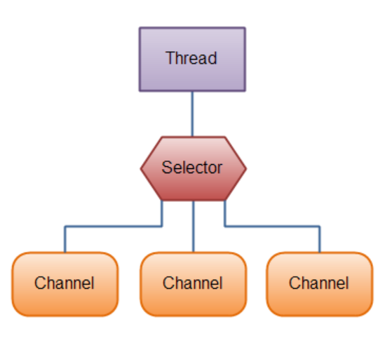

# 1. NIO概述

# 2. Channel

# 3. Buffer

buffer 中的三个属性

看buffer 源吗

0 <= mark <= position <= limit <= capacity


position 开读或者写的位置。

limit     对于写，就和capacity 一样，对于读，和存在缓冲区内容的大小一致。

capacity buffer 缓冲大小

mark 

# 4. Selector



创建选择器

```
Selector selector = Selector.open();
```

把通道注册进入选择器

```
channel.configureBlocking(false);
SelectionKey key = channel.register(selector, SelectionKey.OP_READ);
```

int  selector()  阻塞的 没有注册通道的发生事件，会阻塞，至少有一个通道发生注册才会返回

int  selector(Long timeour) 阻塞指定时间后返回

int  selectorNow() 不阻塞的， 立马返回。 

# 5. Pipe 和 FileLock

# 6. 其他

# 7. 综合案例

## 7.1 .简单 实现服务端和客户端通信

### 服务端

```java
public static void main(String[] args) throws IOException {
    //创建ServerSocketChannel ->
    ServerSocketChannel serverSocketChannel = ServerSocketChannel.open();
    //创建选择器
    Selector selector = Selector.open();
    //绑定端口
    serverSocketChannel.socket().bind( new InetSocketAddress(6666) );
    //非阻塞
    serverSocketChannel.configureBlocking( false );
    //注册进入选择器
    serverSocketChannel.register( selector, SelectionKey.OP_ACCEPT );
    //循环等待客户端连接
    while(true){
        if(selector.select(1000) == 0){
            System.out.println("服务器等待了1s, 无连接。。。。。");
            continue;
        }

        //如果有返回获得返回集合
        Set<SelectionKey> selectionKeys = selector.selectedKeys();
        Iterator<SelectionKey> iterator = selectionKeys.iterator();
        while (iterator.hasNext()){
            SelectionKey key = iterator.next();
            if(key.isAcceptable()){
                SocketChannel socketChannel = serverSocketChannel.accept();
                socketChannel.configureBlocking( false);

                //指定监听到的客户端为注册为写事件
                socketChannel.register( selector,SelectionKey.OP_READ, ByteBuffer.allocate( 1024 ) );
            }
            if(key.isReadable()) {

                SocketChannel channel = (SocketChannel) key.channel();
                ByteBuffer buffer = (ByteBuffer) key.attachment();


                channel.read( buffer );
                buffer.flip();
                System.out.println( "From 客户端：" );
                while (buffer.hasRemaining()) {
                    System.out.print( (char) buffer.get() );
                }
                System.out.println();
            }

        }
        iterator.remove();
    }

}
```

### 客户端

```java
public class NIOClient {
    public static void main(String[] args) throws IOException {
        SocketChannel channel = SocketChannel.open();

        channel.configureBlocking( false );
        InetSocketAddress inetSocketAddress = new InetSocketAddress( "127.0.0.1", 6666 );

        if(! channel.connect( inetSocketAddress )){
            while(!channel.finishConnect()){
                System.out.println("因为连接需要时间客户端不会阻塞");
            }
        }

        //连接成功可以发送数据

        String str = " Hello MyFriend!";

        ByteBuffer buffer = ByteBuffer.wrap( str.getBytes() );
        channel.write( buffer );
        //代码还会停在这里。
        System.in.read();

    }
}
```

## 7.2 实现多用户间的通信

实例要求：

编写一个NIO 群聊系统，实现服务器和客户端之间简单的数据通信。

实现多人群聊

服务端可以检测用户上线和下线，实现消息转发。

客户端： 可以无阻塞的发送消息给其他用户，同时可以接收其他用户发送的消息

目的： 进一步了解NIO 网络编程案例。

### 服务端

```java
public class GroupChatServer {
    //定义属性
    private Selector selector;

    private ServerSocketChannel listenChannel;

    private static final int PORT = 6667;

    //初始化工作
    public GroupChatServer(){

        //得到选择器
        try {
            selector = Selector.open();
            listenChannel = ServerSocketChannel.open();
            //绑定端口
            listenChannel.socket().bind( new InetSocketAddress( PORT ) );
            //设置非阻塞模式
            listenChannel.configureBlocking( false );
            //注册channel到 selector
            listenChannel.register( selector, SelectionKey.OP_ACCEPT );
        } catch (IOException e) {
            e.printStackTrace();
        }
    }
    //监听
    public void listen(){

        try {
            while (true){
                int count = selector.select(  );
                if(count > 0 ){
                    Iterator<SelectionKey> iterator = selector.selectedKeys().iterator();
                    while (iterator.hasNext()){
                        SelectionKey key = iterator.next();
                        //监听到accpect
                        if(key.isAcceptable()){
                            SocketChannel sc = listenChannel.accept();
                            sc.configureBlocking( false );
                            //将sc 注册到selector
                            sc.register( selector,SelectionKey.OP_READ );

                            System.out.println(sc.getRemoteAddress() + "上线");
                        }
                        if(key.isReadable()){
                            //todo
                            readData( key );
                        }

                        //当前key 删除防止重复处理
                        iterator.remove();
                    }
                }
            }

        } catch (IOException e) {
            e.printStackTrace();
        } finally {

        }

    }

    //读取数据

    private void readData(SelectionKey key)  {
        SocketChannel channel = null;
        try{
            channel = (SocketChannel)key.channel();
            //创建buffer

            ByteBuffer buffer = ByteBuffer.allocate( 1024 );

            int count = channel.read( buffer );

            if(count > 0 ){
                String msg = new String(buffer.array()).trim();

                System.out.println("From 客户端" + msg);
                //向其他客户端转发消息 转门写一个方法
                sendInfoToOtherClient(msg,channel);
            }

        } catch (IOException e) {

            try {
                System.out.println(channel.getRemoteAddress()+ "离线了");
                //取消注册
                key.cancel();
                channel.close();
            } catch (IOException ex) {
                ex.printStackTrace();
            }
        }


    }

    //转发消息到其他的客户端

    private void sendInfoToOtherClient(String msg,SocketChannel self) throws IOException {

        System.out.println("服务器转发消息中");
        for (SelectionKey key : selector.keys()){
            Channel targetChannel = key.channel();

           //排除自己
            if( targetChannel instanceof  SocketChannel && targetChannel != self){
                //转型
                SocketChannel dest = (SocketChannel) targetChannel;
                //将msg 存储dao buffer
                ByteBuffer buffer  = ByteBuffer.wrap( msg.getBytes() );
                //将buffer 中的数据输出
                dest.write( buffer );

            }

        }
    }

    public static void main(String[] args) {
        GroupChatServer groupChatServer = new GroupChatServer();
        groupChatServer.listen();
    }
}
```

### 客户端

```java
public class GroupChatClient {

    //定义相关属性
    private final String Host = "127.0.0.1";
    private final int PORT = 6667;

    private Selector selector;

    private SocketChannel socketChannel;

    private String userName;

    public GroupChatClient() throws IOException {
       selector =  Selector.open();
       socketChannel = socketChannel.open( new InetSocketAddress( Host, PORT ) );

        socketChannel.configureBlocking( false );
       //注册
       socketChannel.register( selector, SelectionKey.OP_READ );

       //获取本地地址

        userName = socketChannel.getLocalAddress().toString().substring( 1 );
        System.out.println(userName + "is ok.....");


    }
    //向服务器发送消息
    public void sendInfo(String info){
        info = userName + "--说:" + info;

        try {
            socketChannel.write( ByteBuffer.wrap( info.getBytes() )  );
        } catch (IOException e) {
            e.printStackTrace();
        }


    }

    //从服务器回复的消息

    public void readInfo(){
        try {
            int readSelector = selector.select();
            if(readSelector > 0 ){ //有可用的通道
                Iterator<SelectionKey> iterator = selector.selectedKeys().iterator();
               while (iterator.hasNext()){
                   SelectionKey key = iterator.next();
                   if(key.isReadable()){
                       //得到相关通道
                       SocketChannel channel = (SocketChannel) key.channel();

                       //得到一个buffer
                       ByteBuffer buffer = ByteBuffer.allocate(1024);

                       socketChannel.read(buffer);

                       //把读到的缓冲区的数据转成字符串。

                       String msg = new String(buffer.array());
                       System.out.println(msg.trim());

                   }
                   else {
                       System.out.println("没有可用通道");
                   }
                   iterator.remove();//删除key 防止重复操作
               }


            }
        } catch (IOException e) {
            e.printStackTrace();
        }
    }

    public static void main(String[] args) throws IOException {
        //启动客户端
        GroupChatClient chatClient = new GroupChatClient();

        Thread thread = new Thread( () -> {
            while(true){
                chatClient.readInfo();
                try {
                    Thread.currentThread().sleep(3000);
                } catch (InterruptedException e) {
                    e.printStackTrace();
                }
            }
        } );
        thread.start();

        Scanner scanner = new Scanner( System.in );
        //循环读取数据
        while(scanner.hasNext()){
            String s = scanner.nextLine();
            chatClient.sendInfo( s );
        }
    }
}
```

启动服务器后，运行多个客户端。进行测试。

# 8. 零Copy

