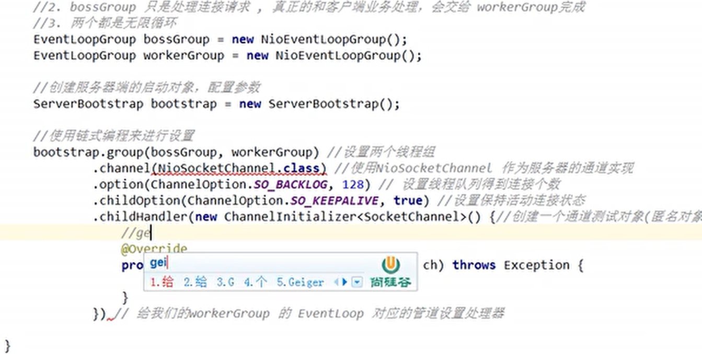
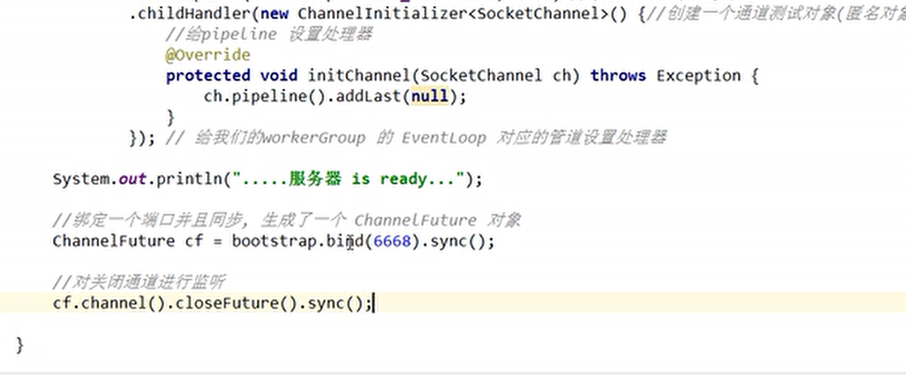
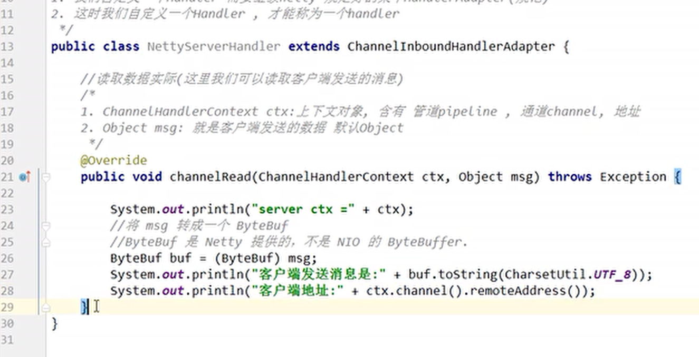
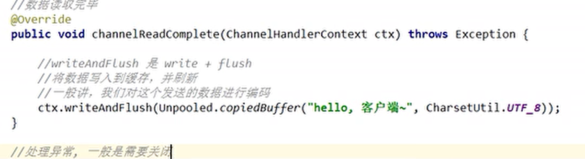
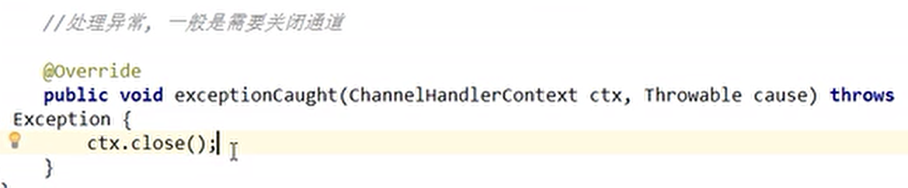
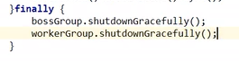

Netty 笔记

NIO 开发成本比较高。

netty

 开发速度快，

线程模型：

传统的线程模型，

当并发数很大就会创建大量的线程，占用很大系统资源。

Reacor 模式

* 单Reactor 单线程
* 单Reactor 多线程
* 主从Reactor 多线程

基于IO 复用模型

多个连接功能用一个阻塞对象，应用程序只对一个阻塞对象等待

无需阻塞等待所有连接，当某个连接有新的数据可以处理的时候，操作系统通知新应用程序，线程从阻塞状态返回，开始进行业务处理

基于线程池复用线程资源，不必为每个连接创建线程，将连接完成后的业务处理任务分配给线程进行处理，一个线程可以处理多个连接业务。

# Netty 代码案例

