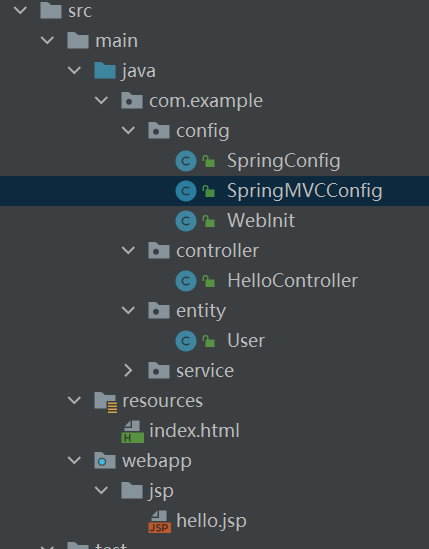
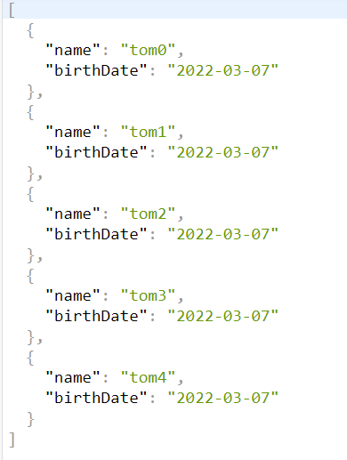

SSM 注解配置


# SSM 注解配置

## 1 创建Maven 项目

### 1. 项目路径



### 2. 引入依赖

```xml
<dependencies>
<dependency>
    <groupId>org.springframework</groupId>
    <artifactId>spring-webmvc</artifactId>
    <version>5.3.16</version>
</dependency>
<dependency>
    <groupId>javax.servlet</groupId>
    <artifactId>javax.servlet-api</artifactId>
    <version>4.0.1</version>
</dependency>
    <dependency>
        <groupId>javax.servlet.jsp</groupId>
        <artifactId>javax.servlet.jsp-api</artifactId>
        <version>2.3.3</version>
    </dependency>

    <dependency>
        <groupId>com.fasterxml.jackson.core</groupId>
        <artifactId>jackson-databind</artifactId>
        <version>2.11.3</version>
    </dependency>
</dependencies>
```

### 3. Spring 配置

```java
@ComponentScan(basePackages = "com.example" ,useDefaultFilters = true,
                    excludeFilters = {@ComponentScan.Filter
                            (type = FilterType.ANNOTATION,classes = Controller.class)
                        }
                )
@Configuration
public class SpringConfig  {
}
```

### 4. SpringMVC 配置

```java
@ComponentScan(basePackages = "com.example",useDefaultFilters = false,
        includeFilters = {@ComponentScan.Filter(type = FilterType.ANNOTATION,classes = Controller.class),@ComponentScan.Filter(type = FilterType.ANNOTATION,classes = Configuration.class)}
)
@Configuration
public class SpringMVCConfig extends WebMvcConfigurationSupport {
   
}
```

### 5. web配置

```java
public class WebInit implements WebApplicationInitializer {
    @Override
    public void onStartup(ServletContext servletContext) throws ServletException {
        AnnotationConfigWebApplicationContext ctx = new AnnotationConfigWebApplicationContext();
        ctx.register( SpringMVCConfig.class );

        ServletRegistration.Dynamic springmvc = servletContext.addServlet( "springmvc", new DispatcherServlet( ctx ) );
        springmvc.addMapping( "/" );
        springmvc.setLoadOnStartup( 1 );
    }
}
```

### 6. Controller 配置

```java
@Controller
public class HelloController {
    @GetMapping("/hello")
    @ResponseBody
    public String hello(){
        System.out.println( helloService.hello() );
        return "Hello SSM Annotation!";
    }


}

```

测试： 

[localhost:8080/hello](http://localhost:8080/hello)

>Hello SSM Annotation!


## 2. 配置Spring MVC 其他功能

```java

@ComponentScan(basePackages = "com.example",useDefaultFilters = false,
        includeFilters = {@ComponentScan.Filter(type = FilterType.ANNOTATION,classes = Controller.class),@ComponentScan.Filter(type = FilterType.ANNOTATION,classes = Configuration.class)}
)
@Configuration
public class SpringMVCConfig extends WebMvcConfigurationSupport {
    /*添加静态资源映射*/
    @Override
    protected void addResourceHandlers(ResourceHandlerRegistry registry) {
      registry.addResourceHandler( "/**" ).addResourceLocations( "classpath:/" );

    }

    /**
     * 配置Jsp视图解析器 前缀 后缀
     * @param registry
     */
    @Override
    protected void configureViewResolvers(ViewResolverRegistry registry) {
        registry.jsp("jsp/",".jsp");
    }

    /**
     * 配置视图映射控制器
     * @param registry
     */
    @Override
    protected void addViewControllers(ViewControllerRegistry registry) {
       registry.addViewController( "/hello3" ).setViewName( "hello" );
    }

    @Override
    protected void configureMessageConverters(List<HttpMessageConverter<?>> converters) {
        ObjectMapper om = new ObjectMapper();
        //全局配置日期格式
        om.setDateFormat( new SimpleDateFormat("yyyy-MM-dd") );//注意一定要是yyyy-MM-dd
        MappingJackson2HttpMessageConverter converter = new MappingJackson2HttpMessageConverter(om);
        converters.add( converter );
    }
}

```

* addResourceHandlers 添加静态资源过滤。保证可以访问resources 文件下的静态资源文件。
* configureViewResolvers 配置jsp 视图解析器。

访问指定资源文件路径下的jsp 文件

​	

* addViewControllers  配置视图映射控制器

​		等价于在Controller 中配置

```java
@GetMapping("/hello3")
public String hello(){ 
    return "hello";
}
```

​	控制台访问hello3 ,自动跳转到对应的hello.jsp 页面。在配置好前端映射器的前提下。

* configureMessageConverters 配置全局转换器


具体过程: 使用了 jackson-databind 依赖。 

### 2.1 User.java

```java
public class User {
    private String name;
    private Date birthDate;

    public User() {
    }

    public User(String name, Date birthDate) {
        this.name = name;
        this.birthDate = birthDate;
    }
	//省略getset 方法
}
```

### 2.2 接口配置

```java
@GetMapping("/names2")
@ResponseBody
public List<User> getName2(){
    ArrayList<User> names = new ArrayList<>();
    for (int i = 0; i < 5; i++) {
        User user = new User( "tom" + i, new Date() );
        names.add(user);
    }
    return names;
}
```

日期转换器配置

```java
@Override
protected void configureMessageConverters(List<HttpMessageConverter<?>> converters) {
    ObjectMapper om = new ObjectMapper();
    //全局配置日期格式
    om.setDateFormat( new SimpleDateFormat("yyyy-MM-dd") );//注意一定要是yyyy-MM-dd
    MappingJackson2HttpMessageConverter converter = new MappingJackson2HttpMessageConverter(om);
    
    converters.add( converter );
}
```

重启项目显示测试结果：

[localhost:8080/names2](http://localhost:8080/names2)


