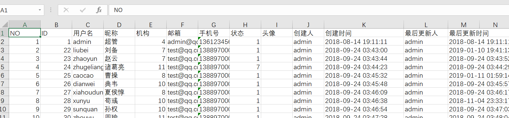

## 1、引入依赖

依赖版本可能会引起程序异常。

```java
<dependency>
   <groupId>org.apache.poi</groupId>
   <artifactId>poi-ooxml</artifactId>
   <version>4.1.2</version>
</dependency>
```

## 2、编写控制器

```java
 /**
     * 导出 Excel 报表
     */
    @PostMapping("/exportExcelUser")
    public void exportExcelUser(@RequestBody PageRequest pageRequest, HttpServletResponse response){
        File file = sysUserService.createUserExcelFile(pageRequest);
        FileUtils.downloadFile(response,file,file.getName());
    }
```

## 3、编写接口

```java
public interface ISysUserService extends IService<SysUser> {

    File createUserExcelFile(PageRequest pageRequest);

}
```

## 4、编写实现类

```java
@Override
public File createUserExcelFile(PageRequest pageRequest) {
    IPage<SysUser> sysUserIPage = new Page<>();
    sysUserIPage.setCurrent(pageRequest.getPageNum());
    sysUserIPage.setSize(pageRequest.getPageSize());
    Map<String, Object> params = pageRequest.getParams();
    QueryWrapper<SysUser> queryWrapper = new QueryWrapper<>();
    queryWrapper.allEq(params);
    IPage<SysUser> result = sysUserMapper.selectPage(sysUserIPage, queryWrapper);

    return createUserExcelFile(result.getRecords());
}

private File createUserExcelFile(List<?> records) {
    if(records == null){
         records = new ArrayList<>();
    }

    XSSFWorkbook sheets = new XSSFWorkbook();

    XSSFSheet sheet = sheets.createSheet();

    XSSFRow row0 = sheet.createRow(0);
    //命名第一行
    int columnIndex = 0;
    row0.createCell(columnIndex).setCellValue("NO");
    row0.createCell(++columnIndex).setCellValue("ID");
    row0.createCell(++columnIndex).setCellValue("用户名");
    row0.createCell(++columnIndex).setCellValue("昵称");
    row0.createCell(++columnIndex).setCellValue("机构");
    row0.createCell(++columnIndex).setCellValue("邮箱");
    row0.createCell(++columnIndex).setCellValue("手机号");
    row0.createCell(++columnIndex).setCellValue("状态");
    row0.createCell(++columnIndex).setCellValue("头像");
    row0.createCell(++columnIndex).setCellValue("创建人");
    row0.createCell(++columnIndex).setCellValue("创建时间");
    row0.createCell(++columnIndex).setCellValue("最后更新人");
    row0.createCell(++columnIndex).setCellValue("最后更新时间");

    //写入数据

    for (int i = 0; i < records.size(); i++) {
        SysUser user =(SysUser) records.get(i);
        Row row = sheet.createRow(i + 1);
        for (int j = 0; j < columnIndex + 1; j++) {
            row.createCell(j);
        }
        //重置指针
        columnIndex = 0;
        row.getCell(columnIndex).setCellValue(i+1);
        row.getCell(++columnIndex).setCellValue(user.getId());
        row.getCell(++columnIndex).setCellValue(user.getName());
        row.getCell(++columnIndex).setCellValue(user.getNickName());
        row.getCell(++columnIndex).setCellValue(user.getDeptId());
        row.getCell(++columnIndex).setCellValue(user.getEmail());
        row.getCell(++columnIndex).setCellValue(user.getMobile());
        row.getCell(++columnIndex).setCellValue(user.getStatus());
        row.getCell(++columnIndex).setCellValue(user.getAvatar());
        row.getCell(++columnIndex).setCellValue(user.getCreateBy());
        row.getCell(++columnIndex).setCellValue(DateTimeUtils.getDateTime(user.getCreateTime()));
        row.getCell(++columnIndex).setCellValue(user.getLastUpdateBy());
        row.getCell(++columnIndex).setCellValue(DateTimeUtils.getDateTime(user.getLastUpdateTime()));

    }
    return PoiUtils.createExcelFile(sheets,"download_user");
}
```

## 5、工具类代码

`PoiUtils.java`

```java
public class PoiUtils {

   /**
    * 生成Excel文件
    * @param workbook
    * @param fileName
    * @return
    */
   public static File createExcelFile(Workbook workbook, String fileName) {
      OutputStream stream = null;
      File file = null;
      try {
         file = File.createTempFile(fileName, ".xlsx");
         stream = new FileOutputStream(file.getAbsoluteFile());
         workbook.write(stream);
      } catch (FileNotFoundException e) {
         e.printStackTrace();
      } catch (IOException e) {
         e.printStackTrace();
      } finally {
         IOUtils.closeQuietly(workbook);
         IOUtils.closeQuietly(stream);
      }
      return file;
   }
}
```

`FileUtils` 下载文件到本地

```java
public class FileUtils {

   /**
    * 下载文件
    * @param response
    * @param file
    * @param newFileName
    */
   public static void downloadFile(HttpServletResponse response, File file, String newFileName) {
      try {
         response.setHeader("Content-Disposition", "attachment; filename=" + new String(newFileName.getBytes("ISO-8859-1"), "UTF-8"));
         BufferedOutputStream bos = new BufferedOutputStream(response.getOutputStream());
         InputStream is = new FileInputStream(file.getAbsolutePath());
         BufferedInputStream bis = new BufferedInputStream(is);
         int length = 0;
         byte[] temp = new byte[1 * 1024 * 10];
         while ((length = bis.read(temp)) != -1) {
            bos.write(temp, 0, length);
         }
         bos.flush();
         bis.close();
         bos.close();
         is.close();
      } catch (Exception e) {
         e.printStackTrace();
      }
   }
}
```

## 6、使用Swager2 进行接口测试。

{
  "pageNum": 1,
  "pageSize": 10,
  "params": {}
}

结果如下：



