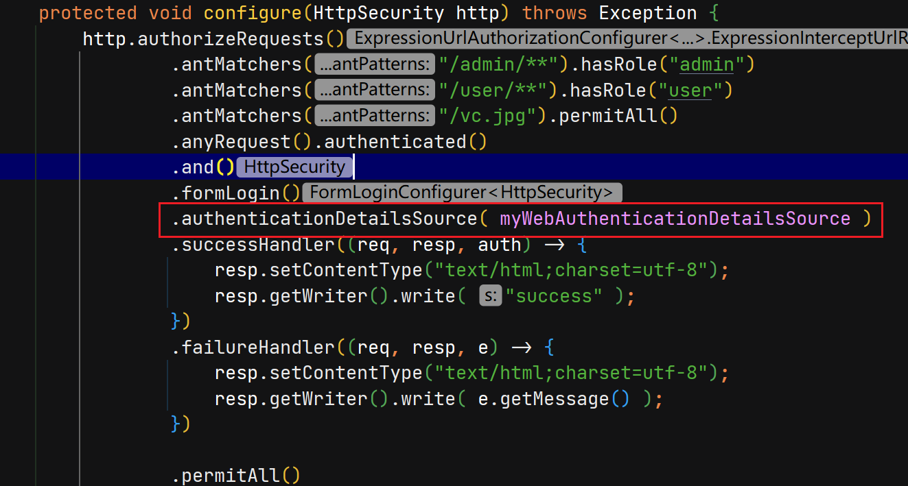
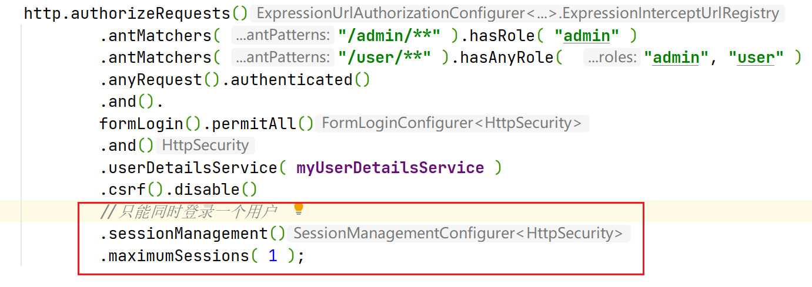

## 1. Spring Security初体验

* Spring boot 版本2.7.0

* Spring Security 5.7.1

创建项目

```xml
<dependency>
    <groupId>org.springframework.boot</groupId>
    <artifactId>spring-boot-starter-security</artifactId>
</dependency>
<dependency>
    <groupId>org.springframework.boot</groupId>
    <artifactId>spring-boot-starter-web</artifactId>
</dependency>
```

创建HelloController

```java
@RestController
public class HelloController {
    @GetMapping("/hello")
    public String hello(){
        return "hello Security!";
    }
}
```

启动项目

http://localhost:8080/hello

使用默认用户名user 和控制台自动生成代码登录

### 修改默认密码

#### 方式一

* 配置文件内

```properties
spring.security.user.name=user
spring.security.user.password=123
spring.security.user.roles=admin
```

#### 方式二

创建SecuorityConfig类

* 基于内存创建用户

```java
@Bean
public UserDetailsService userDetailsService(){
    InMemoryUserDetailsManager manager = new InMemoryUserDetailsManager();
    manager.createUser( User.withUsername("admin").password( "123" ).roles( "admin" ).build() );
    manager.createUser( User.withUsername("user").password( "123" ).roles( "user" ).build() );
    return manager;
}
```

* 注意还要添加编码方式这里使用不加密方式， NoOpPasswordEncoder 类过期

```java
@Bean
PasswordEncoder passwordEncoder() {
    return NoOpPasswordEncoder.getInstance();
}
```

完整的类配置如下

```
@Configuration
public class SecurityConfig   {
    @Bean
    PasswordEncoder passwordEncoder() {
        return NoOpPasswordEncoder.getInstance();
    }
    @Bean
    public UserDetailsService userDetailsService(){
        InMemoryUserDetailsManager manager = new InMemoryUserDetailsManager();
      	
        manager.createUser( User.withUsername("admin").password( "123" ).roles( "ADMIN" ).build() );
        manager.createUser( User.withUsername("user").password( "123" ).roles( "USER" ).build() );
        return manager;
    }
}
```

如果使用加密密码，在测试类中

```java
@Test
void contextLoads() {
    BCryptPasswordEncoder passwordEncoder = new BCryptPasswordEncoder();
    System.out.println( passwordEncoder.encode( "123" ) );
}
```

BCryptPasswordEncoder 生成加密后的密码，复制粘贴到对应密码位置，


修改后的代码如下，在新的版本中 WebSecurityConfigurerAdapter 抽象类过期，这里就不是使用

```java
@Configuration
public class SecurityConfig   {
    @Bean
    PasswordEncoder passwordEncoder(){
        //修改一
        return new BCryptPasswordEncoder();
    }
   
    @Bean
    public UserDetailsService userDetailsService(){
        InMemoryUserDetailsManager manager = new InMemoryUserDetailsManager();
        //修改二，修改密码为密文
        manager.createUser( User.withUsername("admin").password( "$2a$10$nnQ7S0j2hSULPvqIsdFJbuiuOKYrpUuZjiOLqe9U5e9RdTbtt.0Fy" ).roles( "ADMIN" ).build() );
        manager.createUser( User.withUsername("user").password( "$2a$10$nnQ7S0j2hSULPvqIsdFJbuiuOKYrpUuZjiOLqe9U5e9RdTbtt.0Fy" ).roles( "USER" ).build() );
        
        return manager;
    }
}
```

启动项目：http://localhost:8080/hello

分别用admin 和user 用户登录测试

## 2. 配置HttpSecuirty


$$HelloController$$  中创建2个新的测试接口

```java
@GetMapping("/admin/hello")
public String admin(){
    return "hello admin!";
}

@GetMapping("/user/hello")
public String user(){
    return "hello user!";
}
```

### 2.1 基本配置 HttpSecurity

admin/hello 接口只有admin 角色可以访问，user 接口admin和user 用户均可访问

```java
@Bean
SecurityFilterChain filterChain(HttpSecurity http) throws Exception {

     http.authorizeRequests()
             .antMatchers( "/admin/**" ).hasRole( "admin" )
             .antMatchers( "/user/**" ).hasAnyRole(  "admin", "user" )
             .anyRequest().authenticated()
         .and().
             formLogin().permitAll()
         .and()
             .csrf().disable();

     return http.build();

}
```

重启项目分别进行测试

### 2.2. 登录配置详解

#### 2.2.1前后端不分离自定义登录页面

```java
 @Override
    protected void configure(HttpSecurity http) throws Exception {
        http.authorizeRequests().anyRequest().authenticated()
                .and()
                .formLogin()
                //和登录页面from 表单 action属性保持一致,注意不要丢失“/"

                .loginProcessingUrl( "/doLogin" )
                //自定义登录页面，注意不要丢失“/"，如果不设置loginProcessingUrl()登录页面from 表单 action属=/login.html
                .loginPage( "/login.html" )

                //登录成功后跳转页面，注意不要丢失“/"
                .defaultSuccessUrl( "/index" )
                //登录失败后跳转页面
                .failureUrl( "/login.html" )
                //和登录页面的name 属性保持一致
                .usernameParameter( "uname" )
                //和登录页面的密码的name属性保持一致
                .passwordParameter( "passwd" )
                .permitAll()
            .and()
                .csrf().disable();
    }

```

static 文件下登录页面

```html
<!DOCTYPE html>
<html lang="en">
<head>
    <meta charset="UTF-8">
    <title>登录</title>

</head>
<style>
    #login .container #login-row #login-column #login-box {
        border: 1px solid #9C9a9C;
        background-color: #EAEAEB
    }
</style>
<body>
<div id="login">
    <div class="container">
        <div id="login-row" class="row justify-content-center align-items-center">
            <div id="login-column" class="col-md-6">
                <div id="login-box" class="col-md-12">
                    <form id="login-form" class="form" action="/doLogin" method="post">
                        <h3 class="text-center text-info">登录</h3>
                        <div class="form-group">
                            <label for="username" class="text-info">用户名:</label><br>
                            <input type="text" name="uname" id="username" class="form-control">
                        </div>
                        <div class="form-group">
                            <label for="password" class="text-info">密码:</label><br>
                            <input type="text" name="passwd" id="password" class="form-control">
                        </div>
                        <div class="form-group">
                            <input type="submit" name="submit" class="btn btn-info btn-md" value="登录">
                        </div>
                    </form>
                </div>
            </div>
        </div>
    </div>
</div>
</body>
```

重点

首先我们在配置的时候，defaultSuccessUrl 和 successForwardUrl 只需要配置一个即可，具体配置哪个，则要看你的需求，两个的区别如下：

1. defaultSuccessUrl 有一个重载的方法，我们先说一个参数的 defaultSuccessUrl 方法。如果我们在 defaultSuccessUrl 中指定登录成功的跳转页面为 `/index`，此时分两种情况，如果你是直接在浏览器中输入的登录地址，登录成功后，就直接跳转到 `/index`，如果你是在浏览器中输入了其他地址，例如 `http://localhost:8080/hello`，结果因为没有登录，又重定向到登录页面，此时登录成功后，就不会来到 `/index` ，而是来到 `/hello` 页面。
2. defaultSuccessUrl 还有一个重载的方法，第二个参数如果不设置默认为 false，也就是我们上面的的情况，如果手动设置第二个参数为 true，则 defaultSuccessUrl 的效果和 successForwardUrl 一致。
3. successForwardUrl 表示不管你是从哪里来的，登录后一律跳转到 successForwardUrl 指定的地址。例如 successForwardUrl 指定的地址为 `/index` ，你在浏览器地址栏输入 `http://localhost:8080/hello`，结果因为没有登录，重定向到登录页面，当你登录成功之后，就会服务端跳转到 `/index` 页面；或者你直接就在浏览器输入了登录页面地址，登录成功后也是来到 `/index`。

#### 2.2.2前后端分离返回json 字符串

* 登录成功处理器

```
.successHandler(  )
```

```java
.successHandler((req, resp, authentication) -> {
    Object principal = authentication.getPrincipal();
    resp.setContentType("application/json;charset=utf-8");
    PrintWriter out = resp.getWriter();
    out.write(new ObjectMapper().writeValueAsString(principal));
    out.flush();
    out.close();
})
```


* 登录失败处理器

```xml
.failureHandler(  )
```

```java
.failureHandler((req, resp, e) -> {
    resp.setContentType("application/json;charset=utf-8");
    PrintWriter out = resp.getWriter();
    out.write(e.getMessage());
    out.flush();
    out.close();
})
```


### 2.3 注销配置详解

#### 2.3.1前后端不分离

```java
.and()
.logout()
.logoutUrl("/logout")
 //指定post 方式退出
//.logoutRequestMatcher(new AntPathRequestMatcher("/logout","POST"))
.logoutSuccessUrl("/index")
.deleteCookies()
.clearAuthentication(true)
.invalidateHttpSession(true)
.permitAll()
.and()
```

#### 2.3.2 前后端分离

```java
.and()
.logout()
.logoutUrl("/logout")
.logoutSuccessHandler((req, resp, authentication) -> {
    resp.setContentType("application/json;charset=utf-8");
    PrintWriter out = resp.getWriter();
    out.write("注销成功");
    out.flush();
    out.close();
})
.permitAll()
.and()
```

### 2.4 多个HttpSecurity 配置


## 3 授权操作

### 3.1 测试用户还是用基于内存操作

密码不加密

```java
@Bean
PasswordEncoder passwordEncoder() {
    return NoOpPasswordEncoder.getInstance();
}
```


方式一

```java
@Override
protected void configure(AuthenticationManagerBuilder auth) throws Exception {
    auth.inMemoryAuthentication()
            .withUser("javaboy")
            .password("123").roles("admin")
            .and()
            .withUser("江南一点雨")
            .password("123")
            .roles("user");
}
```

方式二

```java
@Bean
protected UserDetailsService userDetailsService() {
    InMemoryUserDetailsManager manager = new InMemoryUserDetailsManager();
    manager.createUser(User.withUsername("javaboy").password("123").roles("admin").build());
    manager.createUser(User.withUsername("江南一点雨").password("123").roles("user").build());
    return manager;
}
```

准备三个测试接口
```java
@RestController
public class HelloController {
    @GetMapping("/hello")
    public String hello() {
        return "hello";
    }

    @GetMapping("/admin/hello")
    public String admin() {
        return "admin";
    }

    @GetMapping("/user/hello")
    public String user() {
        return "user";
    }
}
```

这三个测试接口，我们的规划是这样的：

1. /hello 是任何人都可以访问的接口
2. /admin/hello 是具有 admin 身份的人才能访问的接口
3. /user/hello 是具有 user 身份的人才能访问的接口
4. 所有 user 能够访问的资源，admin 都能够访问

**配置权限 **

注意版本问题 新的版本使用org.springframework.security.web.SecurityFilterChain的 Bean 去配置 HttpSecurity

```java
http.authorizeRequests()
    	//anyRequest() 一定要配置在anMatchers() 后面
     
        .antMatchers("/admin/**").hasRole("admin")
        .antMatchers("/user/**").hasRole("user")
       .anyRequest().authenticated()
        .and()
```

旧版本 

```java
@Configuration
public class WebSecurityConfig extends WebSecurityConfigurerAdapter {
   	//省略部分代码 基于内存配置用户，和密码配置
    @Override
    protected void configure(HttpSecurity http) throws Exception {
        http.authorizeRequests()
                //anyRequest() 一定要配置在anMatchers() 后面

                .antMatchers("/admin/**").hasRole("admin")
                .antMatchers("/user/**").hasRole("user")
                .anyRequest().authenticated()
                .and()
                .formLogin()
                .permitAll()
                .and()
                .csrf().disable();
    }
}
```


旧版本

```java
@Configuration
public class WebSecurityConfig1 {
    //省略部分代码 基于内存配置用户，和密码配置
    @Bean
    SecurityFilterChain filterChain(HttpSecurity http)throws Exception{
        http.authorizeRequests()
                //anyRequest() 一定要配置在anMatchers() 后面

                .antMatchers("/admin/**").hasRole("admin")
                .antMatchers("/user/**").hasRole("user")
                .anyRequest().authenticated()
                .and()
                .formLogin()
                .permitAll()
                .and()
                .csrf().disable();
        return http.build();
    }
}
```


**启动项目进行测试** 

登录成功后，分别访问 `/hello`，`/admin/hello` 以及 `/user/hello` 三个接口，其中：

1. `/hello` 因为登录后就可以访问，这个接口访问成功。
2. `/admin/hello` 需要 admin 身份，所以访问失败。
3. `/user/hello` 需要 user 身份，所以访问成功。

### 3.2.角色继承


```java
@Bean
RoleHierarchy roleHierarchy() {
    RoleHierarchyImpl hierarchy = new RoleHierarchyImpl();
    hierarchy.setHierarchy("ROLE_admin > ROLE_user");
    return hierarchy;
}
```

配置成功后，再次测试 admin 用户就能访问user 用户了。

## 5. 基于数据库认证

### 5.1 使用JDBC 技术

数据准备

```sql
create table users(username varchar(50) not null primary key,password varchar(500) not null,enabled boolean not null);
create table authorities (username varchar(50) not null,authority varchar(50) not null,constraint fk_authorities_users foreign key(username) references users(username));
create unique index ix_auth_username on authorities (username,authority);
```

执行完 SQL 脚本后，我们可以看到一共创建了两张表：users 和 authorities。

- users 表中保存用户的基本信息，包括用户名、用户密码以及账户是否可用。
- authorities 中保存了用户的角色。
- authorities 和 users 通过 username 关联起来。

创建项目引入依赖

```java
<dependency>
    <groupId>org.springframework.boot</groupId>
    <artifactId>spring-boot-starter-security</artifactId>
</dependency>
<dependency>
    <groupId>org.springframework.boot</groupId>
    <artifactId>spring-boot-starter-web</artifactId>
</dependency>

<dependency>
    <groupId>org.springframework.boot</groupId>
    <artifactId>spring-boot-starter-jdbc</artifactId>
</dependency>
<dependency>
    <groupId>mysql</groupId>
    <artifactId>mysql-connector-java</artifactId>
</dependency>
```

准备接口

```java
@RestController
public class HelloController {
    @GetMapping("/hello")
    public String hello() {
        return "hello";
    }

    @GetMapping("/admin/hello")
    public String admin() {
        return "admin";
    }

    @GetMapping("/user/hello")
    public String user() {
        return "user";
    }
}
```


Security 配置

* 新版

```java
@Configuration
public class WebSecurity {
    /**
     * 权限继承
     * @return
     */

    @Bean
    RoleHierarchy roleHierarchy() {
        RoleHierarchyImpl hierarchy = new RoleHierarchyImpl();
        hierarchy.setHierarchy("ROLE_admin > ROLE_user");
        return hierarchy;

    }

    /**
     * 密码不加密
     * @return
     */
    @Bean
    PasswordEncoder passwordEncoder() {
        return NoOpPasswordEncoder.getInstance();
    }

    /**
     * 数据源
     */

    @Autowired
    DataSource dataSource;

    @Bean
    protected UserDetailsService userDetailsService() {
        JdbcUserDetailsManager manager = new JdbcUserDetailsManager();
        manager.setDataSource(dataSource);
        if (!manager.userExists("javaboy")) {
            manager.createUser(User.withUsername("javaboy").password("123").roles("admin").build());
        }
        if (!manager.userExists("江南一点雨")) {
            manager.createUser(User.withUsername("江南一点雨").password("123").roles("user").build());
        }
        return manager;
    }
    @Bean
    SecurityFilterChain filterChain(HttpSecurity http)throws Exception{
        http.authorizeRequests()
                //anyRequest() 一定要配置在anMatchers() 后面

                .antMatchers("/admin/**").hasRole("admin")
                .antMatchers("/user/**").hasRole("user")
                .anyRequest().authenticated()
                .and()
                .formLogin()
                .permitAll()
                .and()
                .csrf().disable();
        return http.build();
    }


}
```

旧版

```java
//@Configuration
public class WebSecurity1 extends WebSecurityConfigurerAdapter {

    @Bean
    RoleHierarchy roleHierarchy() {
        RoleHierarchyImpl hierarchy = new RoleHierarchyImpl();
        hierarchy.setHierarchy("ROLE_admin > ROLE_user");
        return hierarchy;
    }
    @Bean
    PasswordEncoder passwordEncoder() {
        return NoOpPasswordEncoder.getInstance();
    }

    @Autowired
    DataSource dataSource;

    @Bean
    protected UserDetailsService userDetailsService() {
        JdbcUserDetailsManager manager = new JdbcUserDetailsManager();
        manager.setDataSource(dataSource);

        if (!manager.userExists("javaboy")) {
            manager.createUser(User.withUsername("javaboy").password("123").roles("admin").build());
        }
        if (!manager.userExists("江南一点雨")) {
            manager.createUser(User.withUsername("江南一点雨").password("123").roles("user").build());
        }
        return manager;
    }
    @Override
    protected void configure(HttpSecurity http) throws Exception {
        http.authorizeRequests()
                //anyRequest() 一定要配置在anMatchers() 后面

                .antMatchers("/admin/**").hasRole("admin")
                .antMatchers("/user/**").hasRole("user")
                .anyRequest().authenticated()
                .and()
                .formLogin()
                .permitAll()
                .and()
                .csrf().disable();
    }
}
```


登录成功后，分别访问 `/hello`，`/admin/hello` 以及 `/user/hello` 三个接口，其中：

1. `/hello` 因为登录后就可以访问，这个接口访问成功。
2. `/admin/hello` 需要 admin 身份，所以访问失败。
3. `/user/hello` 需要 user 身份，所以访问成功。

### 5.2 整合JPA 

引入依赖

```xml
    <groupId>org.springframework.boot</groupId>
    <artifactId>spring-boot-starter-data-jpa</artifactId>
</dependency>
<dependency>
    <groupId>org.springframework.boot</groupId>
    <artifactId>spring-boot-starter-security</artifactId>
</dependency>
<dependency>
    <groupId>org.springframework.boot</groupId>
    <artifactId>spring-boot-starter-web</artifactId>
</dependency>

<dependency>
    <groupId>mysql</groupId>
    <artifactId>mysql-connector-java</artifactId>
    <scope>runtime</scope>
</dependency>
```

yml

```properties
spring.datasource.username=root
spring.datasource.password=666666
spring.datasource.url=jdbc:mysql:///withjpa?useUnicode=true&characterEncoding=UTF-8&serverTimezone=Asia/Shanghai

spring.jpa.database=mysql
spring.jpa.database-platform=mysql
spring.jpa.hibernate.ddl-auto=update
spring.jpa.show-sql=true
spring.jpa.properties.hibernate.dialect=org.hibernate.dialect.MySQL8Dialect
```


测试接口

```java
@RestController
public class HelloController {
    @GetMapping("/hello")
    public String hello() {
        return "hello";
    }

    @GetMapping("/admin/hello")
    public String admin() {
        return "admin";
    }

    @GetMapping("/user/hello")
    public String user() {
        return "user";
    }
}
```

User

```java


@Entity(name = "t_user")
public class User implements UserDetails {


    @Id
    @GeneratedValue(strategy = GenerationType.IDENTITY)
    private Long id;
    private String username;
    private String password;
    private boolean accountNonExpired;
    private boolean accountNonLocked;
    private boolean credentialsNonExpired;
    private boolean enabled;
    @ManyToMany(fetch = FetchType.EAGER,cascade = CascadeType.PERSIST)
    private List<Role> roles;

    public List<Role> getRoles() {
        return roles;
    }

    public void setRoles(List<Role> roles) {
        this.roles = roles;
    }

    @Override
    public Collection<? extends GrantedAuthority> getAuthorities() {
        List<SimpleGrantedAuthority> authorities = new ArrayList<>();
        for (Role role : getRoles()) {
            authorities.add(new SimpleGrantedAuthority(role.getName()));
        }
        return authorities;
    }

    @Override
    public String getPassword() {
        return password;
    }

    @Override
    public String getUsername() {
        return username;
    }

    @Override
    public boolean isAccountNonExpired() {
        return true;
    }

    @Override
    public boolean isAccountNonLocked() {
        return true;
    }

    @Override
    public boolean isCredentialsNonExpired() {
        return true;
    }

    @Override
    public boolean isEnabled() {
        return true;
    }

    public Long getId() {
        return id;
    }

    public void setId(Long id) {
        this.id = id;
    }

    public void setUsername(String username) {
        this.username = username;
    }

    public void setPassword(String password) {
        this.password = password;
    }

    public void setAccountNonExpired(boolean accountNonExpired) {
        this.accountNonExpired = accountNonExpired;
    }

    public void setAccountNonLocked(boolean accountNonLocked) {
        this.accountNonLocked = accountNonLocked;
    }

    public void setCredentialsNonExpired(boolean credentialsNonExpired) {
        this.credentialsNonExpired = credentialsNonExpired;
    }

    public void setEnabled(boolean enabled) {
        this.enabled = enabled;
    }
}
```

```java
@Entity(name = "t_role")
public class Role {
    @Id
    @GeneratedValue(strategy = GenerationType.IDENTITY)
    private Long id;
    private String name;
    private String nameZh;


    public Long getId() {
        return id;
    }

    public void setId(Long id) {
        this.id = id;
    }

    public String getName() {
        return name;
    }

    public void setName(String name) {
        this.name = name;
    }

    public String getNameZh() {
        return nameZh;
    }

    public void setNameZh(String nameZh) {
        this.nameZh = nameZh;
    }
}
```

```java
@Component
public interface UserDao extends JpaRepository<User,Long> {
    User findUserByUsername(String username);
}
```

配置文件

```java
//@Configuration
public class WebSecurity extends AuthenticationConfiguration {
    /**
     * 权限继承
     * @return
     */

    @Bean
    RoleHierarchy roleHierarchy() {
        RoleHierarchyImpl hierarchy = new RoleHierarchyImpl();
        hierarchy.setHierarchy("ROLE_admin > ROLE_user");
        return hierarchy;

    }

    /**
     * 密码不加密
     * @return
     */
    @Bean
    PasswordEncoder passwordEncoder() {
        return NoOpPasswordEncoder.getInstance();
    }

    @Bean
    SecurityFilterChain filterChain(HttpSecurity http)throws Exception{
        http.authorizeRequests()
                //anyRequest() 一定要配置在anMatchers() 后面

                .antMatchers("/admin/**").hasRole("admin")
                .antMatchers("/user/**").hasRole("user")
                .anyRequest().authenticated()
                .and()
                .formLogin()
                .permitAll()
                .and()
                .csrf().disable();
        return http.build();
    }
}
```

### 5.3 整合mybatis

依赖 Springboot 2.7.0

```xml
<dependency>
    <groupId>org.springframework.boot</groupId>
    <artifactId>spring-boot-starter-security</artifactId>
</dependency>
<dependency>
    <groupId>org.springframework.boot</groupId>
    <artifactId>spring-boot-starter-web</artifactId>
</dependency>

<dependency>
    <groupId>org.springframework.boot</groupId>
    <artifactId>spring-boot-starter-test</artifactId>
    <scope>test</scope>
</dependency>
<dependency>
    <groupId>org.springframework.security</groupId>
    <artifactId>spring-security-test</artifactId>
    <scope>test</scope>
</dependency>
<!-- https://mvnrepository.com/artifact/org.mybatis.spring.boot/mybatis-spring-boot-starter -->
<dependency>
    <groupId>org.mybatis.spring.boot</groupId>
    <artifactId>mybatis-spring-boot-starter</artifactId>
    <version>2.2.2</version>
</dependency>

<dependency>
    <groupId>mysql</groupId>
    <artifactId>mysql-connector-java</artifactId>
</dependency>
<dependency>
    <groupId>org.projectlombok</groupId>
    <artifactId>lombok</artifactId>
</dependency>
```

数据库准备

```sql

CREATE TABLE `role` (
  `id` int(11) NOT NULL AUTO_INCREMENT,
  `name` varchar(32) DEFAULT NULL,
  `nameZh` varchar(32) DEFAULT NULL,
  PRIMARY KEY (`id`)
) ENGINE=InnoDB DEFAULT CHARSET=utf8;

LOCK TABLES `role` WRITE;
/*!40000 ALTER TABLE `role` DISABLE KEYS */;

INSERT INTO `role` (`id`, `name`, `nameZh`)
VALUES
	(1,'ROLE_dba','数据库管理员'),
	(2,'ROLE_admin','系统管理员'),
	(3,'ROLE_user','用户');

/*!40000 ALTER TABLE `role` ENABLE KEYS */;
UNLOCK TABLES;


# Dump of table user
# ------------------------------------------------------------

CREATE TABLE `user` (
  `id` int(11) NOT NULL AUTO_INCREMENT,
  `username` varchar(32) DEFAULT NULL,
  `password` varchar(255) DEFAULT NULL,
  `enabled` tinyint(1) DEFAULT NULL,
  `accountNonExpired` tinyint(1) DEFAULT NULL,
  `accountNonLocked` tinyint(1) DEFAULT NULL,
  `credentialsNonExpired` tinyint(1) DEFAULT NULL,
  PRIMARY KEY (`id`)
) ENGINE=InnoDB DEFAULT CHARSET=utf8;

LOCK TABLES `user` WRITE;
/*!40000 ALTER TABLE `user` DISABLE KEYS */;

INSERT INTO `user` (`id`, `username`, `password`, `enabled`, `accountNonExpired`, `accountNonLocked`, `credentialsNonExpired`)
VALUES
	(1,'root','{noop}123',1,1,1,1),
	(2,'admin','{noop}123',1,1,1,1),
	(3,'sang','{noop}123',1,1,1,1);

/*!40000 ALTER TABLE `user` ENABLE KEYS */;
UNLOCK TABLES;


# Dump of table user_role
# ------------------------------------------------------------

CREATE TABLE `user_role` (
  `id` int(11) NOT NULL AUTO_INCREMENT,
  `uid` int(11) DEFAULT NULL,
  `rid` int(11) DEFAULT NULL,
  PRIMARY KEY (`id`),
  KEY `uid` (`uid`),
  KEY `rid` (`rid`)
) ENGINE=InnoDB DEFAULT CHARSET=utf8;

LOCK TABLES `user_role` WRITE;
/*!40000 ALTER TABLE `user_role` DISABLE KEYS */;

INSERT INTO `user_role` (`id`, `uid`, `rid`)
VALUES
	(1,1,1),
	(2,1,2),
	(3,2,2),
	(4,3,3);


UNLOCK TABLES;

```

配置文件

```java
spring.datasource.username=root
spring.datasource.password=666666
spring.datasource.url=jdbc:mysql:///security?useUnicode=true&characterEncoding=UTF-8&serverTimezone=Asia/Shanghai
# 这里一定要配
mybatis.mapper-locations=classpath:mapper/*.xml
```

创建测试类

```java
@RestController
public class HelloController {
    @GetMapping("/hello")
    public String hello() {
        return "hello";
    }

    @GetMapping("/admin/hello")
    public String admin() {
        return "admin";
    }

    @GetMapping("/user/hello")
    public String user() {
        return "user";
    }
}
```

User 类

```java
@Data
public class User implements UserDetails {
    private Integer id;
    private String username;
    private String password;
    private Boolean enabled;
    private Boolean accountNonExpired;
    private Boolean accountNonLocked;
    private Boolean credentialsNonExpired;
    private List<Role> roles = new ArrayList<>();


    @Override
    public Collection<? extends GrantedAuthority> getAuthorities() {
        List<SimpleGrantedAuthority> authorities = new ArrayList<>();
        for (Role role : roles) {
            authorities.add(new SimpleGrantedAuthority(role.getName()));
        }
        return authorities;
    }

    @Override
    public boolean isAccountNonExpired() {
        return accountNonExpired;
    }

    @Override
    public boolean isAccountNonLocked() {
        return accountNonLocked;
    }

    @Override
    public boolean isCredentialsNonExpired() {
        return credentialsNonExpired;
    }

    @Override
    public boolean isEnabled() {
        return enabled;
    }


}

```

Role类

```java
@Data
public class Role {

    private Integer id;
    private String name;
    private String nameZh;
}
```

UserMapper

```java
@Mapper
public interface UserMapper {
    List<Role> getRolesByUid(Integer id);
    User loadUserByUsername(String username);
}
```

UserMapper.xml 该配置配文路径`resources/mapper/UserMapper.xml`

```java
<!DOCTYPE mapper
        PUBLIC "-//mybatis.org//DTD Mapper 3.0//EN"
        "http://mybatis.org/dtd/mybatis-3-mapper.dtd">
<mapper namespace="deyo.xyz.securitymybatis.mapper.UserMapper">
    <select id="loadUserByUsername" resultType="deyo.xyz.securitymybatis.entity.User">
        select * from user where username=#{username};
    </select>
    <select id="getRolesByUid" resultType="deyo.xyz.securitymybatis.entity.Role">
        select r.* from role r,user_role ur where r.`id`=#{id}
    </select>
</mapper>
```

`注意`也可以选择接口`UserMapper` 放在一起，但是要在`pom.xml` 文件中添加

```xml
<build>
    <resources>
        <resource>
            <directory>src/main/java</directory>
            <includes>
                <include>**/*.xml</include>
            </includes>
            <filtering>false</filtering>
        </resource>
    </resources>
</build>
```


UserService

```java
@Service
public class MyUserDetailsService implements UserDetailsService {
    @Autowired
    UserMapper userMapper;
    @Override
    public UserDetails loadUserByUsername(String username) throws UsernameNotFoundException {
        User user = userMapper.loadUserByUsername(username);
        if (user == null) {
            throw new UsernameNotFoundException("用户不存在");
        }
        user.setRoles(userMapper.getRolesByUid(user.getId()));
        return user;
    }
}
```

配置类 早前版本

```java
@Configuration
public class SecurityConfig extends WebSecurityConfigurerAdapter {

    @Autowired
    MyUserDetailsService myUserDetailsService;

    @Override
    protected void configure(AuthenticationManagerBuilder auth) throws Exception {
        auth.userDetailsService(myUserDetailsService);
    }

    @Override
    protected void configure(HttpSecurity http) throws Exception {
        http.authorizeRequests()
                .antMatchers("/admin/**").hasRole("admin")
                .antMatchers("/user/**").hasRole("user")
                .anyRequest().authenticated()
                .and()
                .formLogin()
                .permitAll()
                .and()
                .csrf().disable()
                ;
    }
}
```


如果使用spring boot  2.7.0 版本 filterChain 中配置自定的`myUserDetailseService`

```java
@Configuration
public class SecurityConfig1 {

    @Autowired
    MyUserDetailsService myUserDetailsService;

    @Bean
    SecurityFilterChain filterChain(HttpSecurity http) throws Exception {

        http.authorizeRequests()
                .antMatchers( "/admin/**" ).hasRole( "admin" )
                .antMatchers( "/user/**" ).hasAnyRole(  "admin", "user" )
                .anyRequest().authenticated()
                .and().
                formLogin().permitAll()
                .and()
                .userDetailsService( myUserDetailsService )
                .csrf().disable();

        return http.build();

    }
}
```

启动项目

以用户身份sang 123 访问

http://localhost:8080/admin/hello

http://localhost:8080/user/hello

再以root 123 用户访问 

http://localhost:8080/admin/hello

http://localhost:8080/user/hello

## 6.动态配置权限

## 7.Spring Security JSON 登录

HelloController

```java
@RestController
public class HelloController {
    @GetMapping("/hello")
    public String hello() {
        return "hello security";
    }
}
```


配置

```java
@Configuration
public class SecurityConfig extends WebSecurityConfigurerAdapter {
    @Bean
    PasswordEncoder passwordEncoder() {
        return NoOpPasswordEncoder.getInstance();
    }
    @Bean
    public UserDetailsService userDetailsService(){
        InMemoryUserDetailsManager manager = new InMemoryUserDetailsManager();
        manager.createUser( User.withUsername("admin").password( "123" ).roles( "admin" ).build() );
        manager.createUser( User.withUsername("user").password( "123" ).roles( "user" ).build() );
        return manager;
    }

    @Override
    protected void configure(HttpSecurity http) throws Exception {
        http.authorizeRequests().anyRequest().authenticated()
                .and()
                .formLogin().permitAll()
                .and().csrf().disable();
        //添加自定的JSON 过滤器
        http.addFilterAt(myAuthenticationFilter(), UsernamePasswordAuthenticationFilter.class);
    }
    @Bean
    MyAuthenticationFilter myAuthenticationFilter() throws Exception {
        MyAuthenticationFilter filter = new MyAuthenticationFilter();
        
		//添加认证管理器bean
        filter.setAuthenticationManager(authenticationManagerBean());
        、、
        return filter;
    }  
}
```


**UsernamePasswordAuthenticationFilter 为登录认证过滤器，自定义一个登录认证过滤器，加在UsernamePasswordAuthenticationFilter 前面实现JSON登录功能。**

自定义过滤器

```java

public class MyAuthenticationFilter extends UsernamePasswordAuthenticationFilter {
    @Override
    public Authentication attemptAuthentication(HttpServletRequest request, HttpServletResponse response) throws AuthenticationException {
        if (!request.getMethod().equals("POST")) {
            throw new AuthenticationServiceException(
                    "Authentication method not supported: " + request.getMethod());
        }
        if (request.getContentType().equals(MediaType.APPLICATION_JSON_VALUE)) {
            //说明用户以 JSON 的形式传递的参数

            String username = null;
            String password = null;
            try {
                Map<String, String> map = new ObjectMapper().readValue(request.getInputStream(), Map.class);
                username = map.get("username");
                password = map.get("password");
            } catch (IOException e) {
                e.printStackTrace();
            }

            if (username == null) {
                username = "";
            }

            if (password == null) {
                password = "";
            }

            username = username.trim();

            UsernamePasswordAuthenticationToken authRequest = new UsernamePasswordAuthenticationToken(
                    username, password);

            // Allow subclasses to set the "details" property
            setDetails(request, authRequest);
            //执行身份验证
            return this.getAuthenticationManager().authenticate(authRequest);
        }
        //兼容表单登录方式
        return super.attemptAuthentication(request, response);

    }
}
```


使用JSON 进行测试


## 8.Spring Security 整合Jwt

创建项目引入依赖

```
<dependency>
    <groupId>org.springframework.boot</groupId>
    <artifactId>spring-boot-starter-security</artifactId>
</dependency>
<dependency>
    <groupId>org.springframework.boot</groupId>
    <artifactId>spring-boot-starter-web</artifactId>
</dependency>
<dependency>
    <groupId>io.jsonwebtoken</groupId>
    <artifactId>jjwt</artifactId>
    <version>0.9.1</version>
</dependency>
```

创建HelloController

```
@RestController
public class HelloController {

    @GetMapping("/hello")
    public String hello() {
        return "hello jwt !";
    }
    @GetMapping("/admin")
    public String admin() {
        return "hello admin !";
    }
}

```

User

```java
public class User implements UserDetails {
    private String username;
    private String password;

    private List<GrantedAuthority> authorities;

    @Override
    public Collection<? extends GrantedAuthority> getAuthorities() {
        return authorities;
    }

    @Override
    public String getPassword() {
        return password;
    }

    @Override
    public String getUsername() {
        return username;
    }

    @Override
    public boolean isAccountNonExpired() {
        return true;
    }

    @Override
    public boolean isAccountNonLocked() {
        return true;
    }

    @Override
    public boolean isCredentialsNonExpired() {
        return true;
    }

    @Override
    public boolean isEnabled() {
        return true;
    }
}
```


```java

public class JwtFilter extends GenericFilterBean {
    @Override
    public void doFilter(ServletRequest servletRequest, ServletResponse servletResponse, FilterChain filterChain) throws IOException, ServletException {
        HttpServletRequest req = (HttpServletRequest) servletRequest;
        String jwtToken = req.getHeader("authorization");
        System.out.println(jwtToken);
        Claims claims = Jwts.parser().setSigningKey("sang@123").parseClaimsJws(jwtToken.replace("Bearer",""))
                .getBody();
        String username = claims.getSubject();//获取当前登录用户名
        List<GrantedAuthority> authorities = AuthorityUtils.commaSeparatedStringToAuthorityList((String) claims.get("authorities"));
        UsernamePasswordAuthenticationToken token = new UsernamePasswordAuthenticationToken(username, null, authorities);
        SecurityContextHolder.getContext().setAuthentication(token);
        filterChain.doFilter(req,servletResponse);
    }
}
```

```java

public class JwtLoginFilter extends AbstractAuthenticationProcessingFilter {
    public JwtLoginFilter(String defaultFilterProcessesUrl, AuthenticationManager authenticationManager) {
        super(new AntPathRequestMatcher(defaultFilterProcessesUrl));
        setAuthenticationManager(authenticationManager);
    }
    @Override
    public Authentication attemptAuthentication(HttpServletRequest req, HttpServletResponse resp) throws AuthenticationException, IOException, ServletException {
        User user = new ObjectMapper().readValue(req.getInputStream(), User.class);
        return getAuthenticationManager().authenticate(new UsernamePasswordAuthenticationToken(user.getUsername(), user.getPassword()));
    }
    @Override
    protected void successfulAuthentication(HttpServletRequest req, HttpServletResponse resp, FilterChain chain, Authentication authResult) throws IOException, ServletException {
        Collection<? extends GrantedAuthority> authorities = authResult.getAuthorities();
        StringBuffer as = new StringBuffer();
        for (GrantedAuthority authority : authorities) {
            as.append(authority.getAuthority())
                    .append(",");
        }
        //JWT 加密
        String jwt = Jwts.builder()
                .claim("authorities", as)//配置用户角色
                .setSubject(authResult.getName())
                .setExpiration(new Date(System.currentTimeMillis() + 10 * 60 * 1000))
                .signWith( SignatureAlgorithm.HS512,"sang@123")
                .compact();
        resp.setContentType("application/json;charset=utf-8");
        PrintWriter out = resp.getWriter();
        out.write(new ObjectMapper().writeValueAsString(jwt));
        out.flush();
        out.close();
    }
    protected void unsuccessfulAuthentication(HttpServletRequest req, HttpServletResponse resp, AuthenticationException failed) throws IOException, ServletException {
        resp.setContentType("application/json;charset=utf-8");
        PrintWriter out = resp.getWriter();
        out.write("登录失败!");
        out.flush();
        out.close();
    }
}
```

## 9.Remerme 自动登录

### 9.1 实现自动登录

引入依赖

```xml
<dependency>
    <groupId>org.springframework.boot</groupId>
    <artifactId>spring-boot-starter-security</artifactId>
</dependency>
<dependency>
    <groupId>org.springframework.boot</groupId>
    <artifactId>spring-boot-starter-web</artifactId>
</dependency>
```

测试接口

```java
@RestController
public class HelloController {

    @GetMapping("/hello")
    public String hello(){
        return "hello";
    }

    @GetMapping("/admin")
    public String admin() {
        return "admin";
    }
    @GetMapping("/rememberme")
    public String rememberme() {
        return "rememberme";
    }
}
```

配置类配置

```java
public class SecurityConfig extends WebSecurityConfigurerAdapter {
    @Bean
    PasswordEncoder passwordEncoder(){
        return NoOpPasswordEncoder.getInstance();
    }
    @Bean
    protected UserDetailsService userDetailsService(){
        InMemoryUserDetailsManager manager = new InMemoryUserDetailsManager();
        manager.createUser( User.withUsername("javaboy")
                .password( "123" ).roles( "admin" ).build() );
        return manager;
    }

    @Override
    protected void configure(HttpSecurity http) throws Exception {
        http.authorizeRequests().anyRequest().authenticated()
                .and()
                .formLogin()
                .permitAll()
                .and()
                .rememberMe()
                //添加key 后服务端重启，依赖能够直接访问
                .key( "123" )
                //配置过期时间，10天
                .tokenValiditySeconds( 60*60*60*24*10 )
                .and()
                .csrf().disable();
    }
}
```

### 9.2 增加安全性

#### 9.2.1 持久化令牌操作

添加依赖

```xml
<dependency>
    <groupId>org.springframework.boot</groupId>
    <artifactId>spring-boot-starter-jdbc</artifactId>
</dependency>
<dependency>
    <groupId>mysql</groupId>
    <artifactId>mysql-connector-java</artifactId>
</dependency>
```


准备持久化数据库

```sql
CREATE TABLE `persistent_logins` (
  `username` varchar(64) COLLATE utf8mb4_unicode_ci NOT NULL,
  `series` varchar(64) COLLATE utf8mb4_unicode_ci NOT NULL,
  `token` varchar(64) COLLATE utf8mb4_unicode_ci NOT NULL,
  `last_used` timestamp NOT NULL DEFAULT CURRENT_TIMESTAMP ON UPDATE CURRENT_TIMESTAMP,
  PRIMARY KEY (`series`)
) ENGINE=InnoDB DEFAULT CHARSET=utf8mb4 COLLATE=utf8mb4_unicode_ci;
```


```properties
spring.datasource.url=jdbc:mysql:///oauth2?useUnicode=true&characterEncoding=UTF-8&serverTimezone=Asia/Shanghai
spring.datasource.username=root
spring.datasource.password=123
```

修改配置文件

```java
@Configuration
public class SecurityConfig1 extends WebSecurityConfigurerAdapter {
    @Autowired
    DataSource dataSource;
    @Bean
    JdbcTokenRepositoryImpl jdbcTokenRepository() {
        JdbcTokenRepositoryImpl jdbcTokenRepository = new JdbcTokenRepositoryImpl();
        jdbcTokenRepository.setDataSource(dataSource);
        return jdbcTokenRepository;
    }

    @Bean
    PasswordEncoder passwordEncoder(){
        return NoOpPasswordEncoder.getInstance();
    }
    @Bean
    protected UserDetailsService userDetailsService(){
        InMemoryUserDetailsManager manager = new InMemoryUserDetailsManager();
        manager.createUser( User.withUsername("javaboy")
                .password( "123" ).roles( "admin" ).build() );
        return manager;
    }

    @Override
    protected void configure(HttpSecurity http) throws Exception {
        http.authorizeRequests().anyRequest().authenticated()
                .and()
                .formLogin()
                .permitAll()
                .and()
                .rememberMe()
                //添加key 后服务端重启，依赖能够直接访问
                .key( "123" )
                //配置过期时间，10天
                .tokenValiditySeconds( 60*60*60*24*10 )
                .tokenRepository( jdbcTokenRepository() )
                .and()
                .csrf().disable();
    }
}
```

我们还是先去访问 `/hello` 接口，此时会自动跳转到登录页面，然后我们执行登录操作，记得勾选上“记住我”这个选项，登录成功后，我们可以重启服务器、然后关闭浏览器再打开，再去访问 /hello 接口，发现依然能够访问到，说明我们的持久化令牌配置已经生效。

查看 remember-me 的令牌，如下：


这个令牌经过解析之后，格式如下：

```
emhqATk3ZDBdR8862WP4Ig%3D%3D:ZAEv6EIWqA7CkGbYewCh8g%3D%3D
```

这其中，%3D 表示 `=`，所以上面的字符实际上可以翻译成下面这样：

```
emhqATk3ZDBdR8862WP4Ig==:ZAEv6EIWqA7CkGbYewCh8g==
```

此时，查看数据库，我们发现之前的表中生成了一条记录：


数据库中的记录和我们看到的 remember-me 令牌解析后是一致的。

#### 9.2.2 二次认证

敏感接口二次认证  `.antMatchers( "/admin" ).fullyAuthenticated()`

1. 第一个 /hello 接口，只要认证后就可以访问，无论是通过用户名密码认证还是通过自动登录认证，只要认证了，就可以访问。
2. 第二个 /admin 接口，必须要用户名密码认证之后才能访问，如果用户是通过自动登录认证的，则必须重新输入用户名密码才能访问该接口。
3. 第三个 /rememberme 接口，必须是通过自动登录认证后才能访问，如果用户是通过用户名/密码认证的，则无法访问该接口。

```java
@Configuration
public class SecurityConfig2 extends WebSecurityConfigurerAdapter {
    @Autowired
    DataSource dataSource;
    @Bean
    JdbcTokenRepositoryImpl jdbcTokenRepository() {
        JdbcTokenRepositoryImpl jdbcTokenRepository = new JdbcTokenRepositoryImpl();
        jdbcTokenRepository.setDataSource(dataSource);
        return jdbcTokenRepository;
    }

    @Bean
    PasswordEncoder passwordEncoder(){
        return NoOpPasswordEncoder.getInstance();
    }
    @Bean
    protected UserDetailsService userDetailsService(){
        InMemoryUserDetailsManager manager = new InMemoryUserDetailsManager();
        manager.createUser( User.withUsername("javaboy")
                .password( "123" ).roles( "admin" ).build() );
        return manager;
    }

    @Override
    protected void configure(HttpSecurity http) throws Exception {

        http.authorizeRequests()
                //二次验证
                //必须通过用户密码验证才能登录
                .antMatchers( "/admin" ).fullyAuthenticated()
                //接口需要记住我才能访问
                .antMatchers("/rememberme").rememberMe()
                .anyRequest().authenticated()
            .and()
                .formLogin()
                .permitAll()
            .and()
                .rememberMe()
                //添加key 后服务端重启，依赖能够直接访问
                .key( "123" )
                //配置过期时间，10天
                .tokenValiditySeconds( 60*60*60*24*10 )
                .tokenRepository( jdbcTokenRepository() )
            .and()
                .csrf().disable();
    }
}
```

可以看到：

1. /rememberme 接口是需要 rememberMe 才能访问。
2. /admin 是需要 fullyAuthenticated，fullyAuthenticated 不同于 authenticated，fullyAuthenticated 不包含自动登录的形式，而 authenticated 包含自动登录的形式。
3. 最后剩余的接口（/hello）都是 authenticated 就能访问。

## 10 自定义验证码登录

### 10.1 基于上面5.3 项目

引入依赖

```xml
<dependency>
    <groupId>com.github.penggle</groupId>
    <artifactId>kaptcha</artifactId>
    <version>2.3.2</version>
</dependency>
```


```java
@Configuration
public class KaptchaConfig {
    @Bean
    Producer verifycode(){
        Properties properties = new Properties();

        properties.setProperty("kaptcha.image.width", "150");
        properties.setProperty("kaptcha.image.height", "50");
        properties.setProperty("kaptcha.textproducer.char.string", "0123456789");
        properties.setProperty("kaptcha.textproducer.char.length", "4");

        Config config = new Config(properties);
        DefaultKaptcha defaultKaptcha = new DefaultKaptcha();
        defaultKaptcha.setConfig( config );

        return defaultKaptcha;

    }
}
```


创建接口

```java
@RestController
public class VerifyCodeController {
    @Autowired
    Producer producer;
    @GetMapping("/vc.jpg")
    public void getVerifyCode(HttpServletResponse resp, HttpSession session) throws IOException {
        resp.setContentType("image/jpeg");
        //创建文本
        String text = producer.createText();

        session.setAttribute("verify_code", text);
        //创建图片
        BufferedImage image = producer.createImage(text);

        try(ServletOutputStream out = resp.getOutputStream()) {
            ImageIO.write(image, "jpg", out);
        }
    }
}
```


修改配置类


启动项目访问 http://localhost:8080/vc.jpg 查看是否成功获取验证

自定义`AuthenticationProvider` 继承`DaoAuthenticationProvider`

```java
public class MyAuthenticationProvider extends DaoAuthenticationProvider {

    @Override
    protected void additionalAuthenticationChecks(UserDetails userDetails, UsernamePasswordAuthenticationToken authentication) throws AuthenticationException {
        HttpServletRequest req = ((ServletRequestAttributes) RequestContextHolder.getRequestAttributes()).getRequest();
        //从请求中获取code参数值,请求测试时使用code 参数名
        String code = req.getParameter("code");
        //在Controller 接口中存入了verify_code，注意参数名和接口中保持一致
        String verify_code = (String) req.getSession().getAttribute("verify_code");
        if (code == null || verify_code == null || !code.equals(verify_code)) {
            throw new AuthenticationServiceException("验证码错误");
        }
        super.additionalAuthenticationChecks(userDetails, authentication);
    }
}
```


再配置类中添加

```java
@Bean
MyAuthenticationProvider myAuthenticationProvider() {
    MyAuthenticationProvider myAuthenticationProvider = new MyAuthenticationProvider();
    myAuthenticationProvider.setUserDetailsService(myUserDetailsService);
    return myAuthenticationProvider;
}

@Override
@Bean
protected AuthenticationManager authenticationManager() throws Exception {
    ProviderManager manager = new ProviderManager( Arrays.asList(myAuthenticationProvider()));
    return manager;
}
```

修改


代码片段如下

```
.formLogin()
.successHandler((req, resp, auth) -> {
    resp.setContentType("text/html;charset=utf-8");
    resp.getWriter().write( "success" );
})
.failureHandler((req, resp, e) -> {
    resp.setContentType("text/html;charset=utf-8");
    resp.getWriter().write( e.getMessage() );
})

.permitAll()
```

启动项目进行测试

首先获取验证码


测试验证码登录是否成功


### 10.2 WebAuthenticationDetails 获取登录IP 地址

```java
@GetMapping("/hello")
public String hello() {
    WebAuthenticationDetails details =(WebAuthenticationDetails)SecurityContextHolder.getContext().getAuthentication().getDetails();

    String remoteAddress = details.getRemoteAddress();
    String sessionId = details.getSessionId();
    System.out.println("sessionId: " + sessionId);
    System.out.println("remoteAddress: " + remoteAddress);
    return "hello";
}
```

启动项目，使用http://127.0.0.1:8080/login 后查看后端控制台输出

sessionId: BBA31B9986127C4D5F8AEB26A3BC7DEF
remoteAddress: 127.0.0.1

### 10.3 自定义WebAuthenticationDetails

在上面项目的基础上进行修改

```java
public class MyWebAuthenticationDetails extends WebAuthenticationDetails {

    private boolean isPassed;

    public MyWebAuthenticationDetails(HttpServletRequest req) {
        super(req);
        String code = req.getParameter("code");
        String verify_code = (String) req.getSession().getAttribute("verify_code");
        if (code != null && verify_code != null && code.equals(verify_code)) {
            isPassed = true;
        }
    }

    public boolean isPassed() {
        return isPassed;
    }
}
```


```java
@Component
public class MyWebAuthenticationDetailsSource implements AuthenticationDetailsSource<HttpServletRequest,MyWebAuthenticationDetails> {
    @Override
    public MyWebAuthenticationDetails buildDetails(HttpServletRequest context) {
        return new MyWebAuthenticationDetails(context);
    }
}
```


修改MyAuthenticationProvider

```java
public class MyAuthenticationProvider extends DaoAuthenticationProvider {

    @Override
    protected void additionalAuthenticationChecks(UserDetails userDetails, UsernamePasswordAuthenticationToken authentication) throws AuthenticationException {
        if (!((MyWebAuthenticationDetails) authentication.getDetails()).isPassed()) {
            throw new AuthenticationServiceException("验证码错误");
        }
        super.additionalAuthenticationChecks(userDetails, authentication);
    }
}
```


MyWebAuthenticationDetailsSource注入配置类

在配置类中做如下修改

```java
@Autowired
MyWebAuthenticationDetailsSource myWebAuthenticationDetailsSource;
```

添加配置如图



启动项目进行测试

使用如下代码 依然可以获取用户的IP 

获取 MyWebAuthenticationDetails

```java
@Service
public class HelloService {
    public void hello() {
        Authentication authentication = SecurityContextHolder.getContext().getAuthentication();
        MyWebAuthenticationDetails details = (MyWebAuthenticationDetails) authentication.getDetails();
        deta
        System.out.println(details);
    }
}

```

# 11. Spring Security 自动踢掉前一个登录用户

* 设置只能登录一个用户



* 设置一个用户登录后，其他设备用同样的账号密码无法登录。

# 12 集群化Session共享

```java
@Configuration
public class SecurityConfig {


    @Bean
    SecurityFilterChain filterChain(HttpSecurity http) throws Exception {
        http.authorizeRequests()
                .anyRequest().authenticated()
                .and()
                .formLogin()
                .permitAll()
                .and()
                .csrf().disable()
                .sessionManagement()
                .maximumSessions( 1 )
                .maxSessionsPreventsLogin( true );
        return http.build();
    }
    @Autowired
    FindByIndexNameSessionRepository sessionRepository;
    @Bean
    SpringSessionBackedSessionRegistry sessionRegistry() {
        return new SpringSessionBackedSessionRegistry(sessionRepository);
    }
}

```
