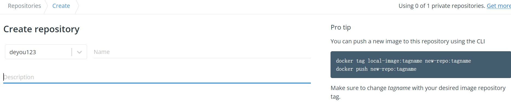
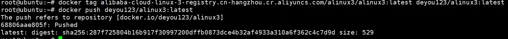
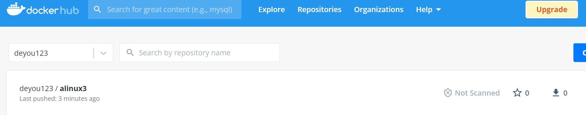
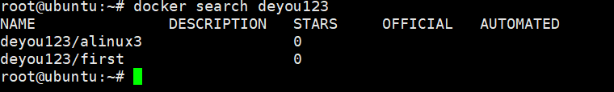
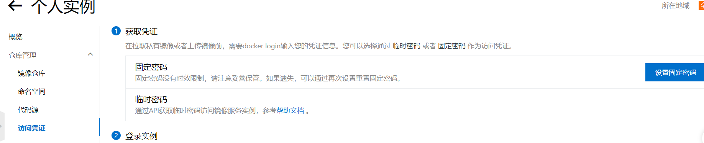
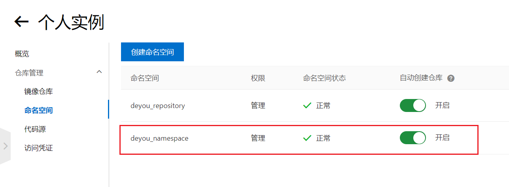

# 官方

### 推送镜像

在创建一个镜像之后，将其保存在一个镜像仓库服务是一个不错的方式。这样存储镜像会比较安全，并且可以被其他人访问使用。Docker Hub 就是这样的一个开放的公共镜像仓库服务，并且这也是 `docker image push` 命令默认的推送地址。

在推送镜像之前，需要先使用 Docker ID 登录 Docker Hub。除此之外，还需要为待推送的镜像打上合适的标签。

接下来介绍如何登录 Docker Hub，并将镜像推送到其中。

可以访问 [Docker Hub](https://hub.docker.com/) 这个网址以注册 Docker Hub 账号： **deyou123   pwd: Zhai@1993**

注册成功之后，在实验环境中登录自己的账号，Username 为自己的账号名字，Password 为密码：




假定你的用户名是 deyou123，下图展示了 Docker 如何确定镜像所要推送的目的仓库：


```
docker tag local-image:tagname new-repo:tagname
docker push new-repo:tagname
```

例子：


```shell
# 获取镜像
$ docker pull alibaba-cloud-linux-3-registry.cn-hangzhou.cr.aliyuncs.com/alinux3/alinux3
```


```shell
#注意一定要写 命名空间deyou123,和自己的账号名一致
$ docker tag alibaba-cloud-linux-3-registry.cn-hangzhou.cr.aliyuncs.com/alinux3/alinux3:latest deyou123/alinux3:latest
# 推送镜像
$ docker push deyou123/alinux3:latest
```






拉取已经上传的镜像

```shell
$ docker search deyou123
```



```
root@ubuntu:~# docker pull deyou123/alinux3
Using default tag: latest
latest: Pulling from deyou123/alinux3
Digest: sha256:287f725804b16b917f30997200dffb0873dce4b32af4933a310a6f362c4c7d9d
Status: Downloaded newer image for deyou123/alinux3:latest
docker.io/deyou123/alinux3:latest
root@ubuntu:~# docker images
REPOSITORY             TAG       IMAGE ID       CREATED        SIZE
deyou123/alinux3       latest    c54f2e68b09f   43 hours ago   162MB
```


# 阿里云

## 1. 登录阿里云Docker Registry

阿里云登录

搜索 容器镜像服务

创建账号密码  docker 登录



```
$ docker login --username=tb6072921_2013 registry.cn-zhangjiakou.aliyuncs.com
```

pwd: Zhai@1993

您可以在访问凭证页面修改凭证密码。需要先创建一个命名空间`deyou_namespace`  设置为自动创建仓库



## 2. 从Registry中拉取镜像 

```
$ docker pull registry.cn-zhangjiakou.aliyuncs.com/deyou_namespace/[镜像仓库名]:[镜像版本号]
```

## 3. 将镜像推送到Registry

```
$ docker login --username=tb6072921_2013 registry.cn-zhangjiakou.aliyuncs.com
# 从已有的镜像中，获取 ImageId  镜像仓库名  镜像版本号 docker images 查看
$ docker tag [ImageId] registry.cn-zhangjiakou.aliyuncs.com/deyou_namespace/[镜像仓库名]:[镜像版本号]
$ docker push registry.cn-zhangjiakou.aliyuncs.com/deyou_namespace/[镜像仓库名]:[镜像版本号]
```

请根据实际镜像信息替换示例中的[ImageId]和[镜像版本号]参数。

## 4. 选择合适的镜像仓库地址

从ECS推送镜像时，可以选择使用镜像仓库内网地址。推送速度将得到提升并且将不会损耗您的公网流量。

如果您使用的机器位于VPC网络，请使用 registry-vpc.cn-zhangjiakou.aliyuncs.com 作为Registry的域名登录。

## 5. 示例

使用"docker tag"命令重命名镜像，并将它通过专有网络地址推送至Registry。

```
$ docker imagesREPOSITORY                                                         TAG                 IMAGE ID            CREATED             VIRTUAL SIZEregistry.aliyuncs.com/acs/agent                                    0.7-dfb6816         37bb9c63c8b2        7 days ago          37.89 MB$ docker tag 37bb9c63c8b2 registry-vpc.cn-zhangjiakou.aliyuncs.com/acs/agent:0.7-dfb6816
```

使用 "docker push" 命令将该镜像推送至远程。

```
$ docker push registry-vpc.cn-zhangjiakou.aliyuncs.com/acs/agent:0.7-dfb6816
```


# 在Docker 中安装 aliunx3 镜像，并运行

```shell
# 获取镜像
$ docker pull alibaba-cloud-linux-3-registry.cn-hangzhou.cr.aliyuncs.com/alinux3/alinux3
# 运行镜像
$ docker run -d -i -t --name alinux3  alibaba-cloud-linux-3-registry.cn-hangzhou.cr.aliyuncs.com/alinux3/alinux3  /bin/bash
# 查看镜像运行
$ docker ps
# 进入镜像内部
$ docker exec -it alinux3 /bin/bash
bash-4.4# exit 
$
```

执行如上命令就可以玩aliunx3 了

# aliunx3 系统安装docker

参考阿里云网站

https://help.aliyun.com/document_detail/264695.html