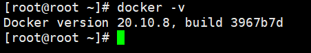
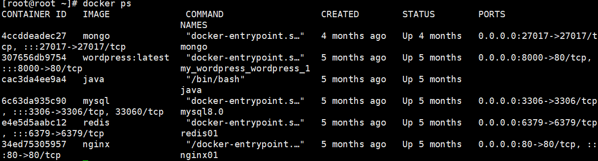

Docker 笔记

## 一、什么是 docker

根据 wikipedia 中的介绍：

> Docker 是一个开放源代码软件项目，让应用程序布署在软件容器下的工作可以自动化进行，借此在 Linux 操作系统上，提供一个额外的软件抽象层，以及操作系统层虚拟化的自动管理机制。
> Docker 利用 Linux 核心中的资源分脱机制，例如 cgroups ，以及 Linux 核心名字空间（name space），来创建独立的软件容器（containers）。这可以在单一 Linux 实体下运作，避免启动一个虚拟机造成的额外负担。Linux 核心对名字空间的支持完全隔离了工作环境中应用程序的视野，包括进程树、网络、用户 ID 与挂载文件系统，而核心的 cgroup 提供资源隔离，包括 CPU 、存储器、block I/O 与网络。从 0.9 版本起，Dockers 在使用抽象虚拟是经由 libvirt 的 LXC 与 systemd – nspawn 提供界面的基础上，开始包括 libcontainer 库做为以自己的方式开始直接使用由 Linux 核心提供的虚拟化的设施。
> 依据行业分析公司“451研究”：“Dockers 是有能力打包应用程序及其虚拟容器，可以在任何 Linux 服务器上运行的依赖性工具，这有助于实现灵活性和便携性，应用程序在任何地方都可以运行，无论是公有云、私有云、单机等。” 。

这里的介绍有点绕口，让我来介绍下 docker 解决了哪些痛点：

1. 简化环境管理

传统的软件开发与发布环境复杂，配置繁琐，经常有读者在微信上问：我的代码开发环境可以运行，一旦部署到服务器上就运行不了了。这个问题很常见，也确实很烦人，但是问题总要解决，开发环境、测试环境、生产环境，每个环节都有可能出现这样那样的问题，如果能够在各个环境中实现一键部署，就会方便很多，例如一键安装 linux 、一键安装 mysql、一键安装 nginx 等，docker 彻底解决了这个问题。

1. 虚拟化更加轻量级

说到容器，说到虚拟化，很多人总会想到虚拟机，想到 VMware、VirtualBox 等工具，不同于这些虚拟技术，docker 虚拟化更加轻量级，传统的虚拟机都是先虚拟出一个操作系统，然后在操作系统上完成各种各样的配置，这样并不能充分的利用物理机的性能，docker 则是一种操作系统级别的虚拟技术，它运行在操作系统之上的用户空间，所有的容器都共用一个系统内核甚至公共库，容器引擎提供了进程级别的隔离，让每个容器都像运行在单独的系统之上，但是又能够共享很多底层资源。因此 docker 更为轻量、快速和易于管理。

1. 程序可移植

有了前面介绍的两个特点，程序可移植就是顺理成章的事情了。

## docker 和虚拟机

前面介绍了 docker 与传统虚拟机的差异，通过下表再来详细了解下这种差异：

|              |                            docker                            |                            虚拟机                            |
| :----------: | :----------------------------------------------------------: | :----------------------------------------------------------: |
|    相同点    | 1. 都可在不同的主机之间迁移 2. 都具备 root 权限 3. 都可以远程控制 4. 都有备份、回滚操作 |                                                              |
|   操作系统   |          在性能上有优势，可以轻易的运行多个操作系统          |              可以安装任何系统，但是性能不及容器              |
|     原理     | 和宿主机共享内核，所有容器运行在容器引擎之上，容器并非一个完整的操作系统，所有容器共享操作系统，在进程级进行隔离 | 每一个虚拟机都建立在虚拟的硬件之上，提供指令级的虚拟，具备一个完整的操作系统 |
|     优点     | 高效、集中。一个硬件节点可以运行数以百计的的容器，非常节省资源，QoS 会尽量满足，但不保证一定满足。内核由提供者升级，服务由服务提供者管理 | 对操作系统具有绝对权限，对系统版本和系统升级具有完全的管理权限。具有一整套的的资源：CPU、RAM 和磁盘。QoS 是有保证的，每一个虚拟机就像一个真实的物理机一样，可以实现不同的操作系统运行在同一物理节点上。 |
|   资源管理   | 弹性资源分配：资源可以在没有关闭容器的情况下添加，数据卷也无需重新分配大小 | 虚拟机需要重启，虚拟机里边的操作系统需要处理新加入的资源，如磁盘等，都需要重新分区。 |
|   远程管理   |     根据操作系统的不同，可以通过 shell 或者远程桌面进行      |      远程控制由虚拟化平台提供，可以在虚拟机启动之前连接      |
|     缺点     | 对内核没有控制权限，只有容器的提供者具备升级权限。只有一个内核运行在物理节点上，几乎不能实现不同的操作系统混合。容器提供者一般仅提供少数的几个操作系统 | 每一台虚拟机都具有更大的负载，耗费更多的资源，用户需要全权维护和管理。一台物理机上能够运行的虚拟机非常有限 |
|     配置     |                    快速，基本上是一键配置                    |                          配置时间长                          |
|   启动时间   |                             秒级                             |                            分钟级                            |
|   硬盘使用   |                              MB                              |                              GB                              |
|     性能     |                          接近原生态                          |                          弱于原生态                          |
| 系统支持数量 |                        单机支持上千个                        |                       一般不多于几十个                       |

## docker 与传统容器

不同与传统容器，docker 早起基于 LXC，后来基于自研的 libContainer，docker 对于传统容器做了许多优化，如下：

1. 跨平台的可移植性
2. 面向应用
3. 版本控制
4. 组件复用
5. 共享性
6. 工具生态系统

## docker 应用场景

1. 加速本地开发
2. 自动打包和部署应用
3. 创建轻量、私有的PaaS环境
4. 自动化测试和持续集成/部署
5. 部署并扩展Web应用、数据库和后端服务器
6. 创建安全沙盒
7. 轻量级的桌面虚拟化

## docker 核心组件

docker 中有三大核心组件：
– 镜像

镜像是一个只读的静态模版，它保存了容器需要的环境和应用的执行代码，可以将镜像看成是容器的代码，当代码运行起来之后，就成了容器，镜像和容器的关系也类似于程序和进程的关系。

- 容器

容器是一个运行时环境，是镜像的一个运行状态，它是镜像执行的动态表现。

- 库

库是一个特定的用户存储镜像的目录，一个用户可以建立多个库来保存自己的镜像。

## docker相关技术

1. 隔离性
2. 可度量性
3. 移植性
4. 安全性

## docker 安装

相对而言，Linux 上安装 Docker 是最容易的，其次是 Mac ，最后是 Windows ，Windows 因此要装的东西比较多，官方也提供了两个不同的安装包，支持不同的 Windows 的不同版本，一个是针对 Win10 的安装引导程序，还有一个是兼容性较好的 Toolbox ，但是在 Windows 上运行 Docker ，后期在虚拟目录等方面还会遇到各种问题，所以这里松哥是非常不建议大家在 Windows 中安装 Docker ，有 Mac 的上 Mac （Mac 上安装 Docker 就像安装普通软件一样），没有 Mac 的装 Linux 虚拟机，再装 Docker 即可，这里我就先以 CentOS 上安装 Docker 为例，来说说 Docker 安装。

分别执行如下安装命令：

```
# 首先安装 Docker
yum -y install docker

# 然后启动 Docker 服务
service docker start

# 测试安装是否成功
docker -v
```

安装完成后，看到如下页面，表示安装成功：



docker 中的容器就是一个轻量级的虚拟机，是镜像运行起来的一个状态，本文就先来看看容器的基本操作。


镜像就像是一个安装程序，而容器则是程序运行时的一个状态。

# 查看容器

## 查看容器

启动 docker 后，使用 `docker ps` 命令可以查看当前正在运行的容器：



## 查看所有容器

上面这条命令是查看当前正在运行的容器，如果需要查看所有容器，则可以通过 `docker ps -a` 命令查看：


在查看容器时，涉及到几个查看参数，含义分别如下：

- CONTAINER ID:CONTAINER ID是指容器的id，是一个唯一标识符,这是一个64位的十六进制整数，在不会混淆的情况下可以只采用id的前几位进行标识一个容器。
- IMAGE:IMAGE表示创建容器时使用的镜像。
- COMMAND:COMMAND表示容器最后运行的命令。
- CREATED:创建容器的时间。
- STATUS:容器的状态，这里可能显示一个容器启动时间，也能显示容器关闭时间。具体显示哪个要看容器当前的状态。
- PORTS:容器对外开放的端口。
- NAMES:容器的名字，如果不设置，会有一个默认的名字。

## 查看最新创建的容器

使用 `docker ps -l` 可以查看最近创建的容器，如下：


## 查看最新创建的n个容器

可以使用 `docker ps -n=XXX` 来查看最新创建的n个容器，如下：


# 创建容器

创建容器整体上来说有两种不同的方式，可以先创建，再启动，也可以连创建带启动一步到位，无论是那种方式，流程都是相似的，当执行一个创建命令之后，docker 首先会去本地路径下查找是否有相应的镜像，如果没有，就去 docker hub 上搜索，如果搜索到了，则下载下来，然后利用该镜像创建一个容器并启动。容器的文件系统是在只读的镜像文件上添加一层可读写的文件层，这样可以使在不改变镜像的情况下，只记录改变的数据。下面对这两种方式分别予以介绍。

## 容器创建

开发者可以首先使用 `docker create` 命令创建一个容器，这个时候创建出来的容器是处于停止状态，没有运行，例如要创建一个 nginx 容器，创建命令如下：

```
docker create nginx
```

创建成功后，可以查看容器是否创建成功：


此时创建的容器并未运行，处于停止状态，容器的 name 是随机生成的，开发者也可以在创建容器时指定 name ，如下：

```
docker create --name=nginx nginx
```

运行结果如下：


此时的 name 属性就不是随机生成的，而是用户指定的 name。

这种方式只是单纯的创建了一个用户，并未启动。

## 容器创建+启动

如果开发者需要既创建又启动容器，则可以使用 `docker run` 命令。 `docker run` 命令又可以启动两种不同模式的容器：后台型容器和交互型容器，顾名思义，后台型容器就是一个在后台运行的容器，默默的在后台执行计算就行了，不需要和开发者进行交互，而交互型容器则需要接收开发者的输入进行处理给出反馈。对于开发者而言，大部分情况下创建的都是后台型容器，不过在很多时候，即使是后台型容器也不可避免的需要进行交互，下面分别来看。

### 后台型容器

后台型容器以 nginx 为例，一般 nginx 在后台运行即可：

```
docker run --name nginx1 -d -p 8080:80 nginx
```

`--name` 含义和上文一样，表示创建的容器的名字，-d 表示容器在后台运行，-p 表示将容器的 80 端口映射到宿主机的 8080 端口，创建过程如下图：


首先依然会去本地检查，本地没有相应的容器，则会去 Docker Hub 上查找，查找到了下载并运行，并且生成了一个容器 id。运行成功后，在浏览器中输入 `http://localhost:8080` 就能看到 Nginx 的默认页面了，如下：


这是一个后台型容器的基本创建方式。

### 交互型容器

也可以创建交互型容器，例如创建一个 ubuntu 容器，开发者可能需要在 ubuntu 上面输入命令执行相关操作，交互型容器创建方式如下：

```
docker run --name ubuntu -it ubuntu /bin/bash
```

参数含义都和上文一致，除了 -it，-it 参数，i 表示开发容器的标准输入（STDIN），t 则表示告诉 docker，为容器创建一个命令行终端。执行结果如下：


该命令执行完后，会打开一个输入终端，读者就可以在这个终端里愉快的操作 ubuntu 了。

想要退出该终端，只需要输入 exit 命令即可。

# 容器启动

## 启动

如果开发者使用了 `docker run` 命令创建了容器，则创建完成后容器就已经启动了，如果使用了 `docker create` 命令创建了容器，则需要再执行 `docker start` 命令来启动容器，使用 `docker start` 命令结合容器 id 或者容器 name 可以启动一个容器，如下：


`docker start` 启动的是一个已经存在的容器，要使用该命令启动一个容器，必须要先知道容器的 id 或者 name ，开发者可以通过这两个属性启动一个容器（案例中，nginx 是通过 name 启动，而 ubuntu 则是通过 id 启动）。一般来说，第一次可以使用 `docker run` 启动一个容器，以后直接使用 `docker start` 即可。

## 重启

容器在运行过程中，会不可避免的出问题，出了问题时，需要能够自动重启，在容器启动时使用 –restart 参数可以实现这一需求。根据 docker 官网的解释，docker 的重启策略可以分为 4 种，如下：


四种的含义分别如下：

1. no表示不自动重启容器，默认即此。
2. on:failure:[max-retries]表示在退出状态为非0时才会重启（非正常退出），有一个可选择参数：最大重启次数，可以设置最大重启次数，重启次数达到上限后就会放弃重启。
3. always表示始终重启容器，当docker守护进程启动时，也会无论容器当时的状态为何，都会尝试重启容器。
4. unless-stopped表示始终重启容器，但是当docker守护进程启动时，如果容器已经停止运行，则不会去重启它。

# 容器停止

通过 `docker stop` 命令可以终止一个容器，如下：


可以通过 name 或者 id 终止一个容器。

# 容器删除

## 单个删除

容器停止后还依然存在，如果需要，还可以通过 `docker start` 命令再次重启一个容器，如果不需要一个容器，则可以通过 `docker rm` 命令删除一个容器。删除容器时，只能删除已经停止运行的容器，不能删除正在运行的容器。如下：


可以通过 name 或者 id 删除一个容器。如果非要删除一个正在运行的容器，可以通过 -f 参数实现，如下：


## 批量删除

容器也可以批量删除，命令如下：

```
docker rm $(docker ps -a -q)
```

`docker ps -a -q` 会列出所有容器的 id ，供 rm 命令删除。

如下命令也支持删除已退出的孤立的容器：

```
docker container prune
```

# 总结

本文主要向大家介绍了 Docker 容器的基本操作，更多高级操作我们将在下篇文章中介绍。