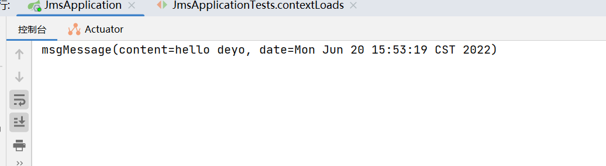

# ActiveMQ的安装与使用

### 一、安装

1、下载安装包
官网下载地址: http://activemq.apache.org/components/classic/download/

* 根据自己的电脑的系统下载对应的版本.

* 还要根据自己的JDK 下载对应的版本

2、解压
cd 到下载压缩包的目录,解压压缩包,输入 tar -zxvf +文件名即可解压
tar zxvf apache-activemq-5.16.0-bin.tar.gz


3、启动
进入相对目录: /apache-activemq-5.16.0/bin/macosx

命令行输入./activemq start 启动ActiveMQ
启动成功后,会看到 Broker

4、访问
游览器输入地址: http://127.0.0.1:8161/admin/ 

访问账号和密码默认为: admin/admin

### 二入门使用

```java
@SpringBootApplication
public class JmsApplication {

    public static void main(String[] args) {
        SpringApplication.run( JmsApplication.class, args );
    }
    @Bean
    Queue Queue() throws Exception {
        return new ActiveMQQueue( "MyQueue" );
    }
}
```

```java
@Data
public class Message implements Serializable {
    private String content;
    private Date date;
}
```

```java
@Component
public class JmsComponent {
    @Autowired
    JmsMessagingTemplate jmsMessagingTemplate;
    @Autowired
    Queue queue;

    public void send(Message message){
        jmsMessagingTemplate.convertAndSend( queue,message  );
    }

    /**
     * 实际中收发不在同一个项目中
     */
    @JmsListener( destination = "MyQueue")
    public void receive(Message msg){
        System.out.println("msg" + msg);
    }
}
```

测试类进行测试

```java
@SpringBootTest
class JmsApplicationTests {
    @Autowired
    JmsComponent jmsComponent;
    @Test
    void contextLoads() {
        Message message = new Message();
        message.setContent( "hello deyo" );
        message.setDate( new Date() );
        jmsComponent.send( message );
    }

}
```

查看控制台

