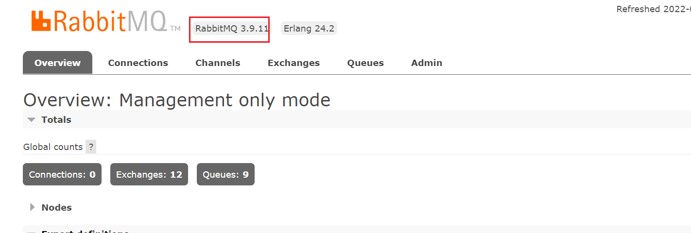
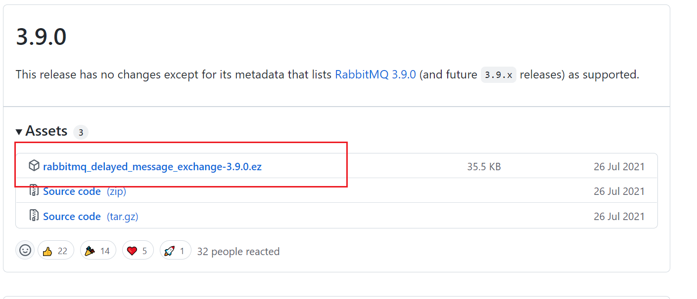
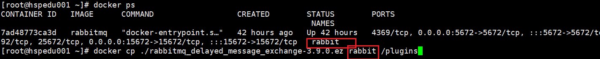
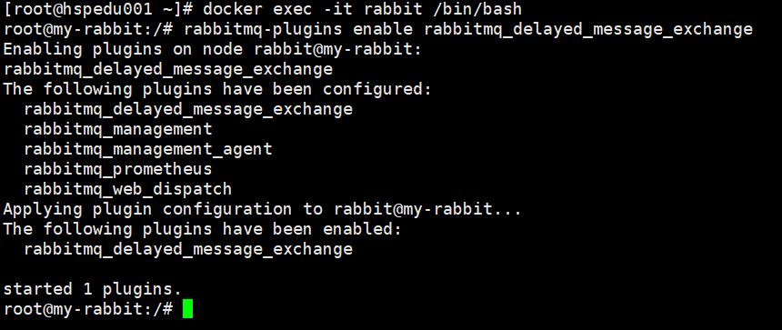
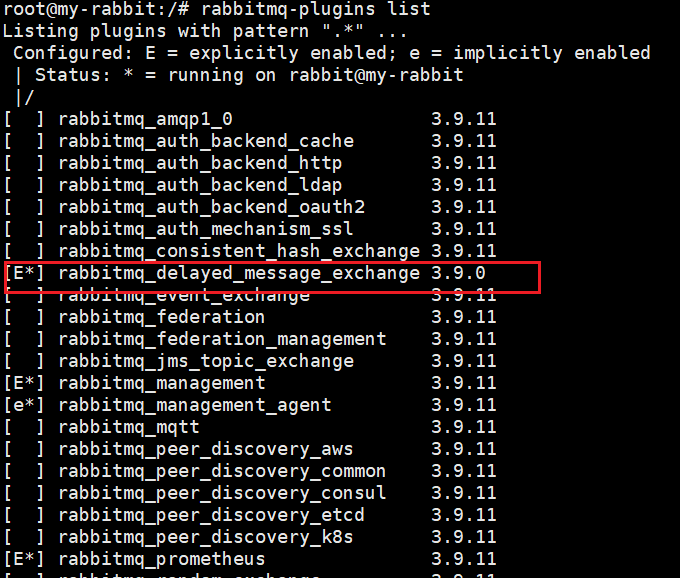

# RabbitMQ

# 1.  安装 RabbitMQ


安装命令

> docker run -d --hostname my-rabbit --name rabbit -p 15672:15672 -p 5672:5672 rabbitmq


通过`docker ps -a`查看部署的mq容器id，在通过 `docker exec -it 7ad48773ca3d /bin/bash` 进入容器内部在
运行：`rabbitmq-plugins enable rabbitmq_management

开启网页版控制台访问

访问： http://192.168.247.129:15672/

在虚拟机上注意防火墙问题

[root@hspedu001 ~]# firewall-cmd --state
running
[root@hspedu001 ~]# systemctl stop firewalld.service
[root@hspedu001 ~]# systemctl start  firewalld.service
[root@hspedu001 ~]# firewall-cmd --state

或者 开放对应的端口号

# 2. RabbitMQ 的使用

### 四种模式

### Direct模式

```java
@Configuration
public class DirectConfig {
    @Bean
    Queue directQueue(){
        return new Queue( "javaboy-queue" );
    }

    @Bean
    DirectExchange directExchange(){
        return new DirectExchange( "javaboy-direct",true,false );
    }

    @Bean
    Binding directBing(){
        return BindingBuilder.bind( directQueue() ).to( directExchange() ).with( "direct" );
    }
}

```


```java
@Configuration
public class DirectConfig {
    @Bean
    Queue directQueue(){
        return new Queue( "javaboy-queue" );
    }

    @Bean
    DirectExchange directExchange(){
        return new DirectExchange( "javaboy-direct",true,false );
    }

    @Bean
    Binding directBing(){
        return BindingBuilder.bind( directQueue() ).to( directExchange() ).with( "direct" );
    }
}
```

测试

```java
@Autowired
RabbitTemplate rabbitTemplate;
@Test
void contextLoads() {
    rabbitTemplate.convertAndSend( "javaboy-queue","hello javaboy" );
}
```


### Fanout模式

```java
package deyo.xyz.amqp.config;

import org.springframework.amqp.core.Binding;
import org.springframework.amqp.core.BindingBuilder;
import org.springframework.amqp.core.FanoutExchange;
import org.springframework.amqp.core.Queue;
import org.springframework.context.annotation.Bean;
import org.springframework.context.annotation.Configuration;

/**
 * @Author deyou
 * @Date 2022/6/20 14:06
 * @Version 1.0
 */
@Configuration
public class FanoutConfig {
    @Bean
    Queue queueOne(){
        return new Queue( "queue-One" );
    }

    @Bean
    Queue queueTwo(){
        return new Queue( "queue-Two" );
    }

    @Bean
    FanoutExchange fanoutExchange(){
        return new FanoutExchange( "javaboy-fanout",true,false );
    }

    @Bean
    Binding bindingOne(){
        return BindingBuilder.bind( queueOne() ).to( fanoutExchange() );
    }

    @Bean
    Binding bindingTwo(){
        return BindingBuilder.bind( queueTwo() ).to( fanoutExchange() );
    }
}
```

```java
@Component
public class FanoutReceive {
    @RabbitListener(queues = "queue-One")
    public void handler1(String msg){
        System.out.println( "handler1:msg="+msg );
    }

    @RabbitListener(queues = "queue-Two")
    public void handler2(String msg){
        System.out.println( "handler2:msg="+msg );
    }

}
```


测试

```java
@Test
@DisplayName( "测试Fanout模式" )
void test2() {
    rabbitTemplate.convertAndSend( "javaboy-fanout",null,"Hello! javaBoy" );
}
```

### Topic 模式

```java
public class TopicConfig {
    @Bean
    Queue xiaomi(){
        return new Queue( "xiaomi" );
    }

    @Bean
    Queue huawei(){
        return new Queue( "huawei" );
    }
    @Bean
    Queue phone(){
        return new Queue( "phone" );
    }
    @Bean
    TopicExchange topicExchange(){
        return new TopicExchange( "javaboy-topic",true,false );
    }

    @Bean
    Binding xiaomiBinding(){
        return BindingBuilder.bind( xiaomi() ).to( topicExchange() ).with( "xiaomi.#" );
    }

    @Bean
    Binding huaweiBinding(){
        return BindingBuilder.bind( huawei() ).to( topicExchange() ).with( "huawei.#" );
    }

    @Bean
    Binding phoneBinding(){
        return BindingBuilder.bind( phone() ).to( topicExchange() ).with( "#.phone.#" );
    }

}
```

```java
@Component
public class TopicReceive {

    @RabbitListener(queues = "xiaomi")
    public void xiaomi(String msg){
        System.out.println( "xiaomi:msg="+msg );
    }

    @RabbitListener(queues = "huawei")
    public void huawei(String msg){
        System.out.println( "huawei:msg="+msg );
    }

    @RabbitListener(queues = "phone")
    public void phone(String msg){
        System.out.println( "phone:msg="+msg );
    }
}
```

测试

```java
@Test
@DisplayName( "测试Topic模式" )
void test3() {
    rabbitTemplate.convertAndSend( "javaboy-topic","xiaomi.news","小米新闻" );
}
@Test
@DisplayName( "测试Topic模式" )
void test4() {
    rabbitTemplate.convertAndSend( "javaboy-topic","xiaomi.phone","小米手机" );
}


```

### Header 模式

```java
@Configuration
public class HeaderConfig {
    @Bean
    Queue queueName(){
        return new Queue( "queue-name" );
    }
    @Bean
    Queue queueAge(){
        return new Queue( "queue-age" );
    }
    @Bean
    HeadersExchange headersExchange(){
        return new HeadersExchange( "javaboy-header",true,false );
    }

    @Bean
    Binding bindingAge(){
        HashMap<String, Object> map = new HashMap<>();
        map.put( "age",99 );
        return BindingBuilder.bind( queueAge() ).to( headersExchange() ).whereAny( map ).match();
    }

    @Bean
    Binding bindingName(){
        return BindingBuilder.bind( queueName() ).to( headersExchange() ).where( "name" ).exists();
    }
}
```

```java
@Component
public class HeaderReceive {
    @RabbitListener(queues = "queue-name")
    public void handler1(String msg){
        System.out.println("queue-name:msg =" + msg);
    }

    @RabbitListener(queues = "queue-age")
    public void handler2(String msg){
        System.out.println("queue-age:msg =" + msg);
    }
}
```


测试

```java
@Test
@DisplayName( "测试header模式" )
void test5() {
    //header必须出现name,值没有影响
    Message nameMsg = MessageBuilder.withBody( "hello javaboy-name".getBytes( StandardCharsets.UTF_8 ) ).setHeader( "name","javaboy" ).build();
    rabbitTemplate.convertAndSend( "javaboy-header",null,nameMsg );
}

@Test
@DisplayName( "测试header模式" )
void test6() {
    //header必须出现age 值为99
    Message nameMsg = MessageBuilder.withBody( "hello javaboy-age".getBytes( StandardCharsets.UTF_8 ) ).setHeader( "age",99 ).build();
    rabbitTemplate.convertAndSend( "javaboy-header",null,nameMsg );
}
```

## 3. 安装延迟队列插件



选择对应版本

https://github.com/rabbitmq/rabbitmq-delayed-message-exchange/releases



单击右键复制下载链接,进入虚拟机linux 系统

> wget https://github.com/rabbitmq/rabbitmq-delayed-message-exchange/releases/download/3.10.2/rabbitmq_delayed_message_exchange-3.10.2.ez

进入docker



> [root@hspedu001 ~]# `docker exec -it rabbit /bin/bash`
> root@my-rabbit:/# `rabbitmq-plugins enable rabbitmq_delayed_message_exchange`



> root@my-rabbit:/# rabbitmq-plugins list



插件安装完毕

