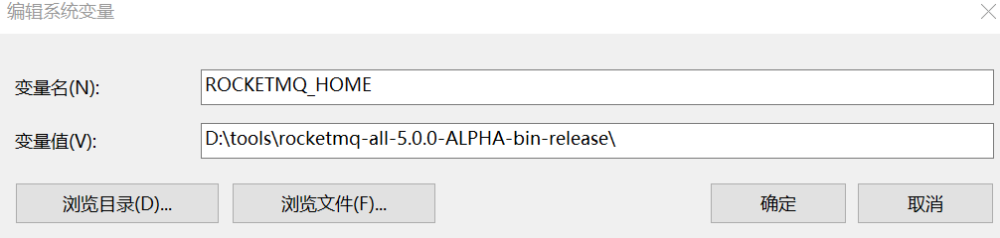
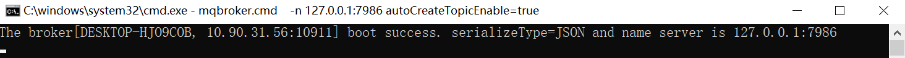
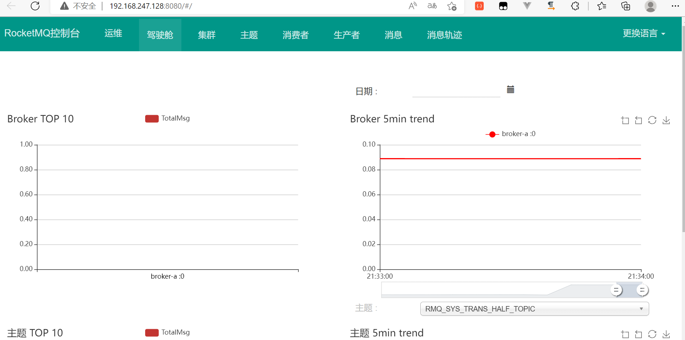

# RocketMq 安装


## Window 安装

下载https://dist.apache.org/repos/dist/dev/rocketmq/5.0.0-ALPHA-rc2/rocketmq-all-5.0.0-ALPHA-bin-release.zip

解压后配置环境变量




到解压目录下启动


> start mqnamesrv.cmd


> start mqbroker.cmd  -n 127.0.0.1:9876 autoCreateTopicEnable=true




启动成功


## Docker 安装rocketmq

> docker pull rocketmqinc/rocketmq


>mkdir -p /docker/rocketmq/data/namesrv/logs /docker/rocketmq/data/namesrv/store

>docker run -d --restart=always --name rmqnamesrv --privileged=true -p 9876:9876  -v /docker/rocketmq/data/namesrv/logs:/root/logs -v /docker/rocketmq/data/namesrv/store:/root/store -e "MAX_POSSIBLE_HEAP=100000000" rocketmqinc/rocketmq sh mqnamesrv

> mkdir -p /docker/rocketmq/conf

> vi /docker/rocketmq/conf/broker.conf 

```shell
# 所属集群名称，如果节点较多可以配置多个
brokerClusterName = DefaultCluster 
#broker名称，master和slave使用相同的名称，表明他们的主从关系 
brokerName = broker-a 
#0表示Master，大于0表示不同的
slave brokerId = 0 
#表示几点做消息删除动作，默认是凌晨4点 
deleteWhen = 04 
#在磁盘上保留消息的时长，单位是小时 
fileReservedTime = 48 
#有三个值：SYNC_MASTER，ASYNC_MASTER，SLAVE；同步和异步表示Master和Slave之间同步数据的机 制；
brokerRole = ASYNC_MASTER 
#刷盘策略，取值为：ASYNC_FLUSH，SYNC_FLUSH表示同步刷盘和异步刷盘；SYNC_FLUSH消息写入磁盘后 才返回成功状态，ASYNC_FLUSH不需要；
flushDiskType = ASYNC_FLUSH 
# 设置broker节点所在服务器的ip地址 
brokerIP1 = 192.168.247.128
#剩余磁盘比例 
diskMaxUsedSpaceRatio=99

```

```shell
docker run -d --restart=always --name rmqbroker --link rmqnamesrv:namesrv -p 10911:10911 -p 10909:10909 --privileged=true -v /docker/rocketmq/data/broker/logs:/root/logs -v /docker/rocketmq/data/broker/store:/root/store -v /docker/rocketmq/conf/broker.conf:/opt/rocketmq-4.4.0/conf/broker.conf -e "NAMESRV_ADDR=namesrv:9876" -e "MAX_POSSIBLE_HEAP=200000000" rocketmqinc/rocketmq sh mqbroker -c /opt/rocketmq-4.4.0/conf/broker.conf

```

```java
docker pull pangliang/rocketmq-console-ng
```


记得修改Ip 地址

```shell
docker run -d --restart=always --name rmqadmin -e "JAVA_OPTS=-Drocketmq.namesrv.addr=192.168.247.128:9876 -Dcom.rocketmq.sendMessageWithVIPChannel=false" -p 8080:8080 pangliang/rocketmq-console-ng

```

#关闭防火墙 

> systemctl stop firewalld.service 
> #禁止开机启动 
> systemctl disable firewalld.service


RocketMQ提供了UI管理工具，名为rocketmq-console，我们选择docker安装

通过浏览器进行访问：[http://192.168.247.128:8080/](http://192.168.247.128:8080/)



Rocketmq 集群部署


# 基本概念
----
## 1 消息模型（Message Model）

RocketMQ主要由 Producer、Broker、Consumer 三部分组成，其中Producer 负责生产消息，Consumer 负责消费消息，Broker 负责存储消息。Broker 在实际部署过程中对应一台服务器，每个 Broker 可以存储多个Topic的消息，每个Topic的消息也可以分片存储于不同的 Broker。Message Queue 用于存储消息的物理地址，每个Topic中的消息地址存储于多个 Message Queue 中。ConsumerGroup 由多个Consumer 实例构成。

## 2 消息生产者（Producer）
 负责生产消息，一般由业务系统负责生产消息。一个消息生产者会把业务应用系统里产生的消息发送到broker服务器。RocketMQ提供多种发送方式，同步发送、异步发送、顺序发送、单向发送。同步和异步方式均需要Broker返回确认信息，单向发送不需要。

## 3 消息消费者（Consumer）
 负责消费消息，一般是后台系统负责异步消费。一个消息消费者会从Broker服务器拉取消息、并将其提供给应用程序。从用户应用的角度而言提供了两种消费形式：拉取式消费、推动式消费。

## 4 主题（Topic）
  表示一类消息的集合，每个主题包含若干条消息，每条消息只能属于一个主题，是RocketMQ进行消息订阅的基本单位。

## 5 代理服务器（Broker Server）
消息中转角色，负责存储消息、转发消息。代理服务器在RocketMQ系统中负责接收从生产者发送来的消息并存储、同时为消费者的拉取请求作准备。代理服务器也存储消息相关的元数据，包括消费者组、消费进度偏移和主题和队列消息等。

## 6 名字服务（Name Server）
 名称服务充当路由消息的提供者。生产者或消费者能够通过名字服务查找各主题相应的Broker IP列表。多个Namesrv实例组成集群，但相互独立，没有信息交换。

## 7 拉取式消费（Pull Consumer）
  Consumer消费的一种类型，应用通常主动调用Consumer的拉消息方法从Broker服务器拉消息、主动权由应用控制。一旦获取了批量消息，应用就会启动消费过程。

## 8 推动式消费（Push Consumer）
 Consumer消费的一种类型，该模式下Broker收到数据后会主动推送给消费端，该消费模式一般实时性较高。

## 9 生产者组（Producer Group）
  同一类Producer的集合，这类Producer发送同一类消息且发送逻辑一致。如果发送的是事务消息且原始生产者在发送之后崩溃，则Broker服务器会联系同一生产者组的其他生产者实例以提交或回溯消费。

## 10 消费者组（Consumer Group）
  同一类Consumer的集合，这类Consumer通常消费同一类消息且消费逻辑一致。消费者组使得在消息消费方面，实现负载均衡和容错的目标变得非常容易。要注意的是，消费者组的消费者实例必须订阅完全相同的Topic。RocketMQ 支持两种消息模式：集群消费（Clustering）和广播消费（Broadcasting）。

## 11 集群消费（Clustering）
集群消费模式下,相同Consumer Group的每个Consumer实例平均分摊消息。

## 12 广播消费（Broadcasting）
广播消费模式下，相同Consumer Group的每个Consumer实例都接收全量的消息。

## 13 普通顺序消息（Normal Ordered Message）
普通顺序消费模式下，消费者通过同一个消息队列（ Topic 分区，称作 Message Queue） 收到的消息是有顺序的，不同消息队列收到的消息则可能是无顺序的。

## 14 严格顺序消息（Strictly Ordered Message）
严格顺序消息模式下，消费者收到的所有消息均是有顺序的。

## 15 消息（Message）
消息系统所传输信息的物理载体，生产和消费数据的最小单位，每条消息必须属于一个主题。RocketMQ中每个消息拥有唯一的Message ID，且可以携带具有业务标识的Key。系统提供了通过Message ID和Key查询消息的功能。
## 16 标签（Tag）
 为消息设置的标志，用于同一主题下区分不同类型的消息。来自同一业务单元的消息，可以根据不同业务目的在同一主题下设置不同标签。标签能够有效地保持代码的清晰度和连贯性，并优化RocketMQ提供的查询系统。消费者可以根据Tag实现对不同子主题的不同消费逻辑，实现更好的扩展性。


# 特性(features)
----
## 1 订阅与发布
消息的发布是指某个生产者向某个topic发送消息；消息的订阅是指某个消费者关注了某个topic中带有某些tag的消息，进而从该topic消费数据。
## 2 消息顺序
消息有序指的是一类消息消费时，能按照发送的顺序来消费。例如：一个订单产生了三条消息分别是订单创建、订单付款、订单完成。消费时要按照这个顺序消费才能有意义，但是同时订单之间是可以并行消费的。RocketMQ可以严格的保证消息有序。

顺序消息分为全局顺序消息与分区顺序消息，全局顺序是指某个Topic下的所有消息都要保证顺序；部分顺序消息只要保证每一组消息被顺序消费即可。
- 全局顺序
对于指定的一个 Topic，所有消息按照严格的先入先出（FIFO）的顺序进行发布和消费。
适用场景：性能要求不高，所有的消息严格按照 FIFO 原则进行消息发布和消费的场景
- 分区顺序
对于指定的一个 Topic，所有消息根据 sharding key 进行区块分区。 同一个分区内的消息按照严格的 FIFO 顺序进行发布和消费。 Sharding key 是顺序消息中用来区分不同分区的关键字段，和普通消息的 Key 是完全不同的概念。
适用场景：性能要求高，以 sharding key 作为分区字段，在同一个区块中严格的按照 FIFO 原则进行消息发布和消费的场景。
## 3 消息过滤
RocketMQ的消费者可以根据Tag进行消息过滤，也支持自定义属性过滤。消息过滤目前是在Broker端实现的，优点是减少了对于Consumer无用消息的网络传输，缺点是增加了Broker的负担、而且实现相对复杂。
## 4 消息可靠性
RocketMQ支持消息的高可靠，影响消息可靠性的几种情况：
1) Broker非正常关闭
2) Broker异常Crash
3) OS Crash
4) 机器掉电，但是能立即恢复供电情况
5) 机器无法开机（可能是cpu、主板、内存等关键设备损坏）
6) 磁盘设备损坏

1)、2)、3)、4) 四种情况都属于硬件资源可立即恢复情况，RocketMQ在这四种情况下能保证消息不丢，或者丢失少量数据（依赖刷盘方式是同步还是异步）。

5)、6)属于单点故障，且无法恢复，一旦发生，在此单点上的消息全部丢失。RocketMQ在这两种情况下，通过异步复制，可保证99%的消息不丢，但是仍然会有极少量的消息可能丢失。通过同步双写技术可以完全避免单点，同步双写势必会影响性能，适合对消息可靠性要求极高的场合，例如与Money相关的应用。注：RocketMQ从3.0版本开始支持同步双写。

## 5 至少一次
至少一次(At least Once)指每个消息必须投递一次。Consumer先Pull消息到本地，消费完成后，才向服务器返回ack，如果没有消费一定不会ack消息，所以RocketMQ可以很好的支持此特性。

## 6 回溯消费
回溯消费是指Consumer已经消费成功的消息，由于业务上需求需要重新消费，要支持此功能，Broker在向Consumer投递成功消息后，消息仍然需要保留。并且重新消费一般是按照时间维度，例如由于Consumer系统故障，恢复后需要重新消费1小时前的数据，那么Broker要提供一种机制，可以按照时间维度来回退消费进度。RocketMQ支持按照时间回溯消费，时间维度精确到毫秒。

## 7 事务消息
RocketMQ事务消息（Transactional Message）是指应用本地事务和发送消息操作可以被定义到全局事务中，要么同时成功，要么同时失败。RocketMQ的事务消息提供类似 X/Open XA 的分布事务功能，通过事务消息能达到分布式事务的最终一致。
## 8 定时消息
定时消息（延迟队列）是指消息发送到broker后，不会立即被消费，等待特定时间投递给真正的topic。
broker有配置项messageDelayLevel，默认值为“1s 5s 10s 30s 1m 2m 3m 4m 5m 6m 7m 8m 9m 10m 20m 30m 1h 2h”，18个level。可以配置自定义messageDelayLevel。注意，messageDelayLevel是broker的属性，不属于某个topic。发消息时，设置delayLevel等级即可：msg.setDelayLevel(level)。level有以下三种情况：

- level == 0，消息为非延迟消息
- 1<=level<=maxLevel，消息延迟特定时间，例如level==1，延迟1s
- level > maxLevel，则level== maxLevel，例如level==20，延迟2h

定时消息会暂存在名为SCHEDULE_TOPIC_XXXX的topic中，并根据delayTimeLevel存入特定的queue，queueId = delayTimeLevel – 1，即一个queue只存相同延迟的消息，保证具有相同发送延迟的消息能够顺序消费。broker会调度地消费SCHEDULE_TOPIC_XXXX，将消息写入真实的topic。

需要注意的是，定时消息会在第一次写入和调度写入真实topic时都会计数，因此发送数量、tps都会变高。

## 9 消息重试
Consumer消费消息失败后，要提供一种重试机制，令消息再消费一次。Consumer消费消息失败通常可以认为有以下几种情况：
- 由于消息本身的原因，例如反序列化失败，消息数据本身无法处理（例如话费充值，当前消息的手机号被注销，无法充值）等。这种错误通常需要跳过这条消息，再消费其它消息，而这条失败的消息即使立刻重试消费，99%也不成功，所以最好提供一种定时重试机制，即过10秒后再重试。
- 由于依赖的下游应用服务不可用，例如db连接不可用，外系统网络不可达等。遇到这种错误，即使跳过当前失败的消息，消费其他消息同样也会报错。这种情况建议应用sleep 30s，再消费下一条消息，这样可以减轻Broker重试消息的压力。

RocketMQ会为每个消费组都设置一个Topic名称为“%RETRY%+consumerGroup”的重试队列（这里需要注意的是，这个Topic的重试队列是针对消费组，而不是针对每个Topic设置的），用于暂时保存因为各种异常而导致Consumer端无法消费的消息。考虑到异常恢复起来需要一些时间，会为重试队列设置多个重试级别，每个重试级别都有与之对应的重新投递延时，重试次数越多投递延时就越大。RocketMQ对于重试消息的处理是先保存至Topic名称为“SCHEDULE_TOPIC_XXXX”的延迟队列中，后台定时任务按照对应的时间进行Delay后重新保存至“%RETRY%+consumerGroup”的重试队列中。
## 10 消息重投
生产者在发送消息时，同步消息失败会重投，异步消息有重试，oneway没有任何保证。消息重投保证消息尽可能发送成功、不丢失，但可能会造成消息重复，消息重复在RocketMQ中是无法避免的问题。消息重复在一般情况下不会发生，当出现消息量大、网络抖动，消息重复就会是大概率事件。另外，生产者主动重发、consumer负载变化也会导致重复消息。如下方法可以设置消息重试策略：

- retryTimesWhenSendFailed:同步发送失败重投次数，默认为2，因此生产者会最多尝试发送retryTimesWhenSendFailed + 1次。不会选择上次失败的broker，尝试向其他broker发送，最大程度保证消息不丢。超过重投次数，抛出异常，由客户端保证消息不丢。当出现RemotingException、MQClientException和部分MQBrokerException时会重投。
- retryTimesWhenSendAsyncFailed:异步发送失败重试次数，异步重试不会选择其他broker，仅在同一个broker上做重试，不保证消息不丢。
- retryAnotherBrokerWhenNotStoreOK:消息刷盘（主或备）超时或slave不可用（返回状态非SEND_OK），是否尝试发送到其他broker，默认false。十分重要消息可以开启。

## 11 流量控制
生产者流控，因为broker处理能力达到瓶颈；消费者流控，因为消费能力达到瓶颈。

生产者流控：
- commitLog文件被锁时间超过osPageCacheBusyTimeOutMills时，参数默认为1000ms，返回流控。
- 如果开启transientStorePoolEnable == true，且broker为异步刷盘的主机，且transientStorePool中资源不足，拒绝当前send请求，返回流控。
- broker每隔10ms检查send请求队列头部请求的等待时间，如果超过waitTimeMillsInSendQueue，默认200ms，拒绝当前send请求，返回流控。
- broker通过拒绝send 请求方式实现流量控制。

注意，生产者流控，不会尝试消息重投。

消费者流控：
- 消费者本地缓存消息数超过pullThresholdForQueue时，默认1000。
- 消费者本地缓存消息大小超过pullThresholdSizeForQueue时，默认100MB。
- 消费者本地缓存消息跨度超过consumeConcurrentlyMaxSpan时，默认2000。

消费者流控的结果是降低拉取频率。
## 12 死信队列
死信队列用于处理无法被正常消费的消息。当一条消息初次消费失败，消息队列会自动进行消息重试；达到最大重试次数后，若消费依然失败，则表明消费者在正常情况下无法正确地消费该消息，此时，消息队列 不会立刻将消息丢弃，而是将其发送到该消费者对应的特殊队列中。

RocketMQ将这种正常情况下无法被消费的消息称为死信消息（Dead-Letter Message），将存储死信消息的特殊队列称为死信队列（Dead-Letter Queue）。在RocketMQ中，可以通过使用console控制台对死信队列中的消息进行重发来使得消费者实例再次进行消费。


# 架构设计
---
## 1 技术架构


RocketMQ架构上主要分为四部分，如上图所示:

- Producer：消息发布的角色，支持分布式集群方式部署。Producer通过MQ的负载均衡模块选择相应的Broker集群队列进行消息投递，投递的过程支持快速失败并且低延迟。

- Consumer：消息消费的角色，支持分布式集群方式部署。支持以push推，pull拉两种模式对消息进行消费。同时也支持集群方式和广播方式的消费，它提供实时消息订阅机制，可以满足大多数用户的需求。

- NameServer：NameServer是一个非常简单的Topic路由注册中心，其角色类似Dubbo中的zookeeper，支持Broker的动态注册与发现。主要包括两个功能：Broker管理，NameServer接受Broker集群的注册信息并且保存下来作为路由信息的基本数据。然后提供心跳检测机制，检查Broker是否还存活；路由信息管理，每个NameServer将保存关于Broker集群的整个路由信息和用于客户端查询的队列信息。然后Producer和Conumser通过NameServer就可以知道整个Broker集群的路由信息，从而进行消息的投递和消费。NameServer通常也是集群的方式部署，各实例间相互不进行信息通讯。Broker是向每一台NameServer注册自己的路由信息，所以每一个NameServer实例上面都保存一份完整的路由信息。当某个NameServer因某种原因下线了，Broker仍然可以向其它NameServer同步其路由信息，Producer和Consumer仍然可以动态感知Broker的路由的信息。 

- BrokerServer：Broker主要负责消息的存储、投递和查询以及服务高可用保证，为了实现这些功能，Broker包含了以下几个重要子模块。
    1. Remoting Module：整个Broker的实体，负责处理来自Client端的请求。
    2. Client Manager：负责管理客户端(Producer/Consumer)和维护Consumer的Topic订阅信息。
    3. Store Service：提供方便简单的API接口处理消息存储到物理硬盘和查询功能。
    4. HA Service：高可用服务，提供Master Broker 和 Slave Broker之间的数据同步功能。
    5. Index Service：根据特定的Message key对投递到Broker的消息进行索引服务，以提供消息的快速查询。


## 2 部署架构


### RocketMQ 网络部署特点

- NameServer是一个几乎无状态节点，可集群部署，节点之间无任何信息同步。

- Broker部署相对复杂，Broker分为Master与Slave，一个Master可以对应多个Slave，但是一个Slave只能对应一个Master，Master与Slave 的对应关系通过指定相同的BrokerName，不同的BrokerId 来定义，BrokerId为0表示Master，非0表示Slave。Master也可以部署多个。每个Broker与NameServer集群中的所有节点建立长连接，定时注册Topic信息到所有NameServer。 注意：当前RocketMQ版本在部署架构上支持一Master多Slave，但只有BrokerId=1的从服务器才会参与消息的读负载。

- Producer与NameServer集群中的其中一个节点（随机选择）建立长连接，定期从NameServer获取Topic路由信息，并向提供Topic 服务的Master建立长连接，且定时向Master发送心跳。Producer完全无状态，可集群部署。

- Consumer与NameServer集群中的其中一个节点（随机选择）建立长连接，定期从NameServer获取Topic路由信息，并向提供Topic服务的Master、Slave建立长连接，且定时向Master、Slave发送心跳。Consumer既可以从Master订阅消息，也可以从Slave订阅消息，消费者在向Master拉取消息时，Master服务器会根据拉取偏移量与最大偏移量的距离（判断是否读老消息，产生读I/O），以及从服务器是否可读等因素建议下一次是从Master还是Slave拉取。

结合部署架构图，描述集群工作流程：

- 启动NameServer，NameServer起来后监听端口，等待Broker、Producer、Consumer连上来，相当于一个路由控制中心。
- Broker启动，跟所有的NameServer保持长连接，定时发送心跳包。心跳包中包含当前Broker信息(IP+端口等)以及存储所有Topic信息。注册成功后，NameServer集群中就有Topic跟Broker的映射关系。
- 收发消息前，先创建Topic，创建Topic时需要指定该Topic要存储在哪些Broker上，也可以在发送消息时自动创建Topic。
- Producer发送消息，启动时先跟NameServer集群中的其中一台建立长连接，并从NameServer中获取当前发送的Topic存在哪些Broker上，轮询从队列列表中选择一个队列，然后与队列所在的Broker建立长连接从而向Broker发消息。
- Consumer跟Producer类似，跟其中一台NameServer建立长连接，获取当前订阅Topic存在哪些Broker上，然后直接跟Broker建立连接通道，开始消费消息。

# 使用案例

## 1 基本样例


在基本样例中我们提供如下的功能场景：

* 使用RocketMQ发送三种类型的消息：同步消息、异步消息和单向消息。其中前两种消息是可靠的，因为会有发送是否成功的应答。
* 使用RocketMQ来消费接收到的消息。

### 1.1 加入依赖：

`maven:`
```
<dependency>
    <groupId>org.apache.rocketmq</groupId>
    <artifactId>rocketmq-client</artifactId>
    <version>4.9.1</version>
</dependency>
```
`gradle`
```
compile 'org.apache.rocketmq:rocketmq-client:4.3.0'
```
### 1.2 消息发送

#### 1、Producer端发送同步消息

这种可靠性同步地发送方式使用的比较广泛，比如：重要的消息通知，短信通知。
```java
public class SyncProducer {
	public static void main(String[] args) throws Exception {
    	// 实例化消息生产者Producer
        DefaultMQProducer producer = new DefaultMQProducer("please_rename_unique_group_name");
    	// 设置NameServer的地址
    	producer.setNamesrvAddr("localhost:9876");
    	// 启动Producer实例
        producer.start();
    	for (int i = 0; i < 100; i++) {
    	    // 创建消息，并指定Topic，Tag和消息体
    	    Message msg = new Message("TopicTest" /* Topic */,
        	"TagA" /* Tag */,
        	("Hello RocketMQ " + i).getBytes(RemotingHelper.DEFAULT_CHARSET) /* Message body */
        	);
        	// 发送消息到一个Broker
            SendResult sendResult = producer.send(msg);
            // 通过sendResult返回消息是否成功送达
            System.out.printf("%s%n", sendResult);
    	}
    	// 如果不再发送消息，关闭Producer实例。
    	producer.shutdown();
    }
}
```
#### 2、发送异步消息

异步消息通常用在对响应时间敏感的业务场景，即发送端不能容忍长时间地等待Broker的响应。

```java
public class AsyncProducer {
	public static void main(String[] args) throws Exception {
    	// 实例化消息生产者Producer
        DefaultMQProducer producer = new DefaultMQProducer("please_rename_unique_group_name");
    	// 设置NameServer的地址
        producer.setNamesrvAddr("localhost:9876");
    	// 启动Producer实例
        producer.start();
        producer.setRetryTimesWhenSendAsyncFailed(0);
	
	int messageCount = 100;
        // 根据消息数量实例化倒计时计算器
	final CountDownLatch2 countDownLatch = new CountDownLatch2(messageCount);
    	for (int i = 0; i < messageCount; i++) {
                final int index = i;
            	// 创建消息，并指定Topic，Tag和消息体
                Message msg = new Message("TopicTest",
                    "TagA",
                    "OrderID188",
                    "Hello world".getBytes(RemotingHelper.DEFAULT_CHARSET));
                // SendCallback接收异步返回结果的回调
                producer.send(msg, new SendCallback() {
                    @Override
                    public void onSuccess(SendResult sendResult) {
                        countDownLatch.countDown();
                        System.out.printf("%-10d OK %s %n", index,
                            sendResult.getMsgId());
                    }
                    @Override
                    public void onException(Throwable e) {
                        countDownLatch.countDown();
      	                System.out.printf("%-10d Exception %s %n", index, e);
      	                e.printStackTrace();
                    }
            	});
    	}
	// 等待5s
	countDownLatch.await(5, TimeUnit.SECONDS);
    	// 如果不再发送消息，关闭Producer实例。
    	producer.shutdown();
    }
}
```

#### 3、单向发送消息

这种方式主要用在不特别关心发送结果的场景，例如日志发送。

```java
public class OnewayProducer {
	public static void main(String[] args) throws Exception{
    	// 实例化消息生产者Producer
        DefaultMQProducer producer = new DefaultMQProducer("please_rename_unique_group_name");
    	// 设置NameServer的地址
        producer.setNamesrvAddr("localhost:9876");
    	// 启动Producer实例
        producer.start();
    	for (int i = 0; i < 100; i++) {
        	// 创建消息，并指定Topic，Tag和消息体
        	Message msg = new Message("TopicTest" /* Topic */,
                "TagA" /* Tag */,
                ("Hello RocketMQ " + i).getBytes(RemotingHelper.DEFAULT_CHARSET) /* Message body */
        	);
        	// 发送单向消息，没有任何返回结果
        	producer.sendOneway(msg);

    	}
    	// 如果不再发送消息，关闭Producer实例。
    	producer.shutdown();
    }
}
```

### 1.3 消费消息

```java
public class Consumer {

	public static void main(String[] args) throws InterruptedException, MQClientException {

    	// 实例化消费者
        DefaultMQPushConsumer consumer = new DefaultMQPushConsumer("please_rename_unique_group_name");

    	// 设置NameServer的地址
        consumer.setNamesrvAddr("localhost:9876");

    	// 订阅一个或者多个Topic，以及Tag来过滤需要消费的消息
        consumer.subscribe("TopicTest", "*");
    	// 注册回调实现类来处理从broker拉取回来的消息
        consumer.registerMessageListener(new MessageListenerConcurrently() {
            @Override
            public ConsumeConcurrentlyStatus consumeMessage(List<MessageExt> msgs, ConsumeConcurrentlyContext context) {
                System.out.printf("%s Receive New Messages: %s %n", Thread.currentThread().getName(), msgs);
                // 标记该消息已经被成功消费
                return ConsumeConcurrentlyStatus.CONSUME_SUCCESS;
            }
        });
        // 启动消费者实例
        consumer.start();
        System.out.printf("Consumer Started.%n");
	}
}
```

2 顺序消息样例
----------

消息有序指的是可以按照消息的发送顺序来消费(FIFO)。RocketMQ可以严格的保证消息有序，可以分为分区有序或者全局有序。

顺序消费的原理解析，在默认的情况下消息发送会采取Round Robin轮询方式把消息发送到不同的queue(分区队列)；而消费消息的时候从多个queue上拉取消息，这种情况发送和消费是不能保证顺序。但是如果控制发送的顺序消息只依次发送到同一个queue中，消费的时候只从这个queue上依次拉取，则就保证了顺序。当发送和消费参与的queue只有一个，则是全局有序；如果多个queue参与，则为分区有序，即相对每个queue，消息都是有序的。

下面用订单进行分区有序的示例。一个订单的顺序流程是：创建、付款、推送、完成。订单号相同的消息会被先后发送到同一个队列中，消费时，同一个OrderId获取到的肯定是同一个队列。

### 2.1 顺序消息生产

```java
package org.apache.rocketmq.example.order2;

import org.apache.rocketmq.client.producer.DefaultMQProducer;
import org.apache.rocketmq.client.producer.MessageQueueSelector;
import org.apache.rocketmq.client.producer.SendResult;
import org.apache.rocketmq.common.message.Message;
import org.apache.rocketmq.common.message.MessageQueue;

import java.text.SimpleDateFormat;
import java.util.ArrayList;
import java.util.Date;
import java.util.List;

/**
* Producer，发送顺序消息
*/
public class Producer {

   public static void main(String[] args) throws Exception {
       DefaultMQProducer producer = new DefaultMQProducer("please_rename_unique_group_name");

       producer.setNamesrvAddr("127.0.0.1:9876");

       producer.start();

       String[] tags = new String[]{"TagA", "TagC", "TagD"};

       // 订单列表
       List<OrderStep> orderList = new Producer().buildOrders();

       Date date = new Date();
       SimpleDateFormat sdf = new SimpleDateFormat("yyyy-MM-dd HH:mm:ss");
       String dateStr = sdf.format(date);
       for (int i = 0; i < 10; i++) {
           // 加个时间前缀
           String body = dateStr + " Hello RocketMQ " + orderList.get(i);
           Message msg = new Message("TopicTest", tags[i % tags.length], "KEY" + i, body.getBytes());

           SendResult sendResult = producer.send(msg, new MessageQueueSelector() {
               @Override
               public MessageQueue select(List<MessageQueue> mqs, Message msg, Object arg) {
                   Long id = (Long) arg;  //根据订单id选择发送queue
                   long index = id % mqs.size();
                   return mqs.get((int) index);
               }
           }, orderList.get(i).getOrderId());//订单id

           System.out.println(String.format("SendResult status:%s, queueId:%d, body:%s",
               sendResult.getSendStatus(),
               sendResult.getMessageQueue().getQueueId(),
               body));
       }

       producer.shutdown();
   }

   /**
    * 订单的步骤
    */
   private static class OrderStep {
       private long orderId;
       private String desc;

       public long getOrderId() {
           return orderId;
       }

       public void setOrderId(long orderId) {
           this.orderId = orderId;
       }

       public String getDesc() {
           return desc;
       }

       public void setDesc(String desc) {
           this.desc = desc;
       }

       @Override
       public String toString() {
           return "OrderStep{" +
               "orderId=" + orderId +
               ", desc='" + desc + '\'' +
               '}';
       }
   }

   /**
    * 生成模拟订单数据
    */
   private List<OrderStep> buildOrders() {
       List<OrderStep> orderList = new ArrayList<OrderStep>();

       OrderStep orderDemo = new OrderStep();
       orderDemo.setOrderId(15103111039L);
       orderDemo.setDesc("创建");
       orderList.add(orderDemo);

       orderDemo = new OrderStep();
       orderDemo.setOrderId(15103111065L);
       orderDemo.setDesc("创建");
       orderList.add(orderDemo);

       orderDemo = new OrderStep();
       orderDemo.setOrderId(15103111039L);
       orderDemo.setDesc("付款");
       orderList.add(orderDemo);

       orderDemo = new OrderStep();
       orderDemo.setOrderId(15103117235L);
       orderDemo.setDesc("创建");
       orderList.add(orderDemo);

       orderDemo = new OrderStep();
       orderDemo.setOrderId(15103111065L);
       orderDemo.setDesc("付款");
       orderList.add(orderDemo);

       orderDemo = new OrderStep();
       orderDemo.setOrderId(15103117235L);
       orderDemo.setDesc("付款");
       orderList.add(orderDemo);

       orderDemo = new OrderStep();
       orderDemo.setOrderId(15103111065L);
       orderDemo.setDesc("完成");
       orderList.add(orderDemo);

       orderDemo = new OrderStep();
       orderDemo.setOrderId(15103111039L);
       orderDemo.setDesc("推送");
       orderList.add(orderDemo);

       orderDemo = new OrderStep();
       orderDemo.setOrderId(15103117235L);
       orderDemo.setDesc("完成");
       orderList.add(orderDemo);

       orderDemo = new OrderStep();
       orderDemo.setOrderId(15103111039L);
       orderDemo.setDesc("完成");
       orderList.add(orderDemo);

       return orderList;
   }
}
```

### 2.2 顺序消费消息

```java
package org.apache.rocketmq.example.order2;

import org.apache.rocketmq.client.consumer.DefaultMQPushConsumer;
import org.apache.rocketmq.client.consumer.listener.ConsumeOrderlyContext;
import org.apache.rocketmq.client.consumer.listener.ConsumeOrderlyStatus;
import org.apache.rocketmq.client.consumer.listener.MessageListenerOrderly;
import org.apache.rocketmq.common.consumer.ConsumeFromWhere;
import org.apache.rocketmq.common.message.MessageExt;

import java.util.List;
import java.util.Random;
import java.util.concurrent.TimeUnit;

/**
* 顺序消息消费，带事务方式（应用可控制Offset什么时候提交）
*/
public class ConsumerInOrder {

   public static void main(String[] args) throws Exception {
       DefaultMQPushConsumer consumer = new DefaultMQPushConsumer("please_rename_unique_group_name_3");
       consumer.setNamesrvAddr("127.0.0.1:9876");
       /**
        * 设置Consumer第一次启动是从队列头部开始消费还是队列尾部开始消费<br>
        * 如果非第一次启动，那么按照上次消费的位置继续消费
        */
       consumer.setConsumeFromWhere(ConsumeFromWhere.CONSUME_FROM_FIRST_OFFSET);

       consumer.subscribe("TopicTest", "TagA || TagC || TagD");

       consumer.registerMessageListener(new MessageListenerOrderly() {

           Random random = new Random();

           @Override
           public ConsumeOrderlyStatus consumeMessage(List<MessageExt> msgs, ConsumeOrderlyContext context) {
               context.setAutoCommit(true);
               for (MessageExt msg : msgs) {
                   // 可以看到每个queue有唯一的consume线程来消费, 订单对每个queue(分区)有序
                   System.out.println("consumeThread=" + Thread.currentThread().getName() + "queueId=" + msg.getQueueId() + ", content:" + new String(msg.getBody()));
               }

               try {
                   //模拟业务逻辑处理中...
                   TimeUnit.SECONDS.sleep(random.nextInt(10));
               } catch (Exception e) {
                   e.printStackTrace();
               }
               return ConsumeOrderlyStatus.SUCCESS;
           }
       });

       consumer.start();

       System.out.println("Consumer Started.");
   }
}
```

3 延时消息样例
----------

### 3.1 启动消费者等待传入订阅消息

```java

import org.apache.rocketmq.client.consumer.DefaultMQPushConsumer;
import org.apache.rocketmq.client.consumer.listener.ConsumeConcurrentlyContext;
import org.apache.rocketmq.client.consumer.listener.ConsumeConcurrentlyStatus;
import org.apache.rocketmq.client.consumer.listener.MessageListenerConcurrently;
import org.apache.rocketmq.common.message.MessageExt;
import java.util.List;

public class ScheduledMessageConsumer {
   public static void main(String[] args) throws Exception {
      // 实例化消费者
      DefaultMQPushConsumer consumer = new DefaultMQPushConsumer("ExampleConsumer");
      // 订阅Topics
      consumer.subscribe("TestTopic", "*");
      // 注册消息监听者
      consumer.registerMessageListener(new MessageListenerConcurrently() {
          @Override
          public ConsumeConcurrentlyStatus consumeMessage(List<MessageExt> messages, ConsumeConcurrentlyContext context) {
              for (MessageExt message : messages) {
                  // Print approximate delay time period
                  System.out.println("Receive message[msgId=" + message.getMsgId() + "] " + (System.currentTimeMillis() - message.getBornTimestamp()) + "ms later");
              }
              return ConsumeConcurrentlyStatus.CONSUME_SUCCESS;
          }
      });
      // 启动消费者
      consumer.start();
  }
}

```

### 3.2 发送延时消息

```java

import org.apache.rocketmq.client.producer.DefaultMQProducer;
import org.apache.rocketmq.common.message.Message;

public class ScheduledMessageProducer {
   public static void main(String[] args) throws Exception {
      // 实例化一个生产者来产生延时消息
      DefaultMQProducer producer = new DefaultMQProducer("ExampleProducerGroup");
      // 启动生产者
      producer.start();
      int totalMessagesToSend = 100;
      for (int i = 0; i < totalMessagesToSend; i++) {
          Message message = new Message("TestTopic", ("Hello scheduled message " + i).getBytes());
          // 设置延时等级3,这个消息将在10s之后发送(现在只支持固定的几个时间,详看delayTimeLevel)
          message.setDelayTimeLevel(3);
          // 发送消息
          producer.send(message);
      }
       // 关闭生产者
      producer.shutdown();
  }
}
```

### 3.3 验证

您将会看到消息的消费比存储时间晚10秒。

### 3.4 延时消息的使用场景
比如电商里，提交了一个订单就可以发送一个延时消息，1h后去检查这个订单的状态，如果还是未付款就取消订单释放库存。

### 3.5 延时消息的使用限制

```java
// org/apache/rocketmq/store/config/MessageStoreConfig.java

private String messageDelayLevel = "1s 5s 10s 30s 1m 2m 3m 4m 5m 6m 7m 8m 9m 10m 20m 30m 1h 2h";
```
现在RocketMq并不支持任意时间的延时，需要设置几个固定的延时等级，从1s到2h分别对应着等级1到18
消息消费失败会进入延时消息队列，消息发送时间与设置的延时等级和重试次数有关，详见代码`SendMessageProcessor.java`


4 批量消息样例
----------

批量发送消息能显著提高传递小消息的性能。限制是这些批量消息应该有相同的topic，相同的waitStoreMsgOK，而且不能是延时消息。此外，这一批消息的总大小不应超过4MB。

### 4.1 发送批量消息

如果您每次只发送不超过4MB的消息，则很容易使用批处理，样例如下：

```java
String topic = "BatchTest";
List<Message> messages = new ArrayList<>();
messages.add(new Message(topic, "TagA", "OrderID001", "Hello world 0".getBytes()));
messages.add(new Message(topic, "TagA", "OrderID002", "Hello world 1".getBytes()));
messages.add(new Message(topic, "TagA", "OrderID003", "Hello world 2".getBytes()));
try {
   producer.send(messages);
} catch (Exception e) {
   e.printStackTrace();
   //处理error
}

```

### 4.2 消息列表分割

复杂度只有当你发送大批量时才会增长，你可能不确定它是否超过了大小限制（4MB）。这时候你最好把你的消息列表分割一下：

```java
public class ListSplitter implements Iterator<List<Message>> { 
    private final int SIZE_LIMIT = 1024 * 1024 * 4;
    private final List<Message> messages;
    private int currIndex;
    public ListSplitter(List<Message> messages) { 
        this.messages = messages;
    }
    @Override public boolean hasNext() {
        return currIndex < messages.size(); 
    }
    @Override public List<Message> next() { 
        int startIndex = getStartIndex();
        int nextIndex = startIndex;
        int totalSize = 0;
        for (; nextIndex < messages.size(); nextIndex++) {
            Message message = messages.get(nextIndex); 
            int tmpSize = calcMessageSize(message);
            if (tmpSize + totalSize > SIZE_LIMIT) {
                break; 
            } else {
                totalSize += tmpSize; 
            }
        }
        List<Message> subList = messages.subList(startIndex, nextIndex); 
        currIndex = nextIndex;
        return subList;
    }
    private int getStartIndex() {
        Message currMessage = messages.get(currIndex); 
        int tmpSize = calcMessageSize(currMessage); 
        while(tmpSize > SIZE_LIMIT) {
            currIndex += 1;
            Message message = messages.get(curIndex); 
            tmpSize = calcMessageSize(message);
        }
        return currIndex; 
    }
    private int calcMessageSize(Message message) {
        int tmpSize = message.getTopic().length() + message.getBody().length; 
        Map<String, String> properties = message.getProperties();
        for (Map.Entry<String, String> entry : properties.entrySet()) {
            tmpSize += entry.getKey().length() + entry.getValue().length(); 
        }
        tmpSize = tmpSize + 20; // 增加⽇日志的开销20字节
        return tmpSize; 
    }
}
//把大的消息分裂成若干个小的消息
ListSplitter splitter = new ListSplitter(messages);
while (splitter.hasNext()) {
  try {
      List<Message>  listItem = splitter.next();
      producer.send(listItem);
  } catch (Exception e) {
      e.printStackTrace();
      //处理error
  }
}
```

5 过滤消息样例
----------

在大多数情况下，TAG是一个简单而有用的设计，其可以来选择您想要的消息。例如：

```java
DefaultMQPushConsumer consumer = new DefaultMQPushConsumer("CID_EXAMPLE");
consumer.subscribe("TOPIC", "TAGA || TAGB || TAGC");
```

消费者将接收包含TAGA或TAGB或TAGC的消息。但是限制是一个消息只能有一个标签，这对于复杂的场景可能不起作用。在这种情况下，可以使用SQL表达式筛选消息。SQL特性可以通过发送消息时的属性来进行计算。在RocketMQ定义的语法下，可以实现一些简单的逻辑。下面是一个例子：
```
------------
| message  |
|----------|  a > 5 AND b = 'abc'
| a = 10   |  --------------------> Gotten
| b = 'abc'|
| c = true |
------------
------------
| message  |
|----------|   a > 5 AND b = 'abc'
| a = 1    |  --------------------> Missed
| b = 'abc'|
| c = true |
------------
```
### 5.1 基本语法

RocketMQ只定义了一些基本语法来支持这个特性。你也可以很容易地扩展它。

- 数值比较，比如：**>，>=，<，<=，BETWEEN，=；**
- 字符比较，比如：**=，<>，IN；**
- **IS NULL** 或者 **IS NOT NULL；**
- 逻辑符号 **AND，OR，NOT；**

常量支持类型为：

- 数值，比如：**123，3.1415；**
- 字符，比如：**'abc'，必须用单引号包裹起来；**
- **NULL**，特殊的常量
- 布尔值，**TRUE** 或 **FALSE**

只有使用push模式的消费者才能用使用SQL92标准的sql语句，接口如下：
```
public void subscribe(finalString topic, final MessageSelector messageSelector)
```

### 5.2 使用样例

#### 1、生产者样例

发送消息时，你能通过`putUserProperty`来设置消息的属性

```java
DefaultMQProducer producer = new DefaultMQProducer("please_rename_unique_group_name");
producer.start();
Message msg = new Message("TopicTest",
   tag,
   ("Hello RocketMQ " + i).getBytes(RemotingHelper.DEFAULT_CHARSET)
);
// 设置一些属性
msg.putUserProperty("a", String.valueOf(i));
SendResult sendResult = producer.send(msg);

producer.shutdown();
```

#### 2、消费者样例

用MessageSelector.bySql来使用sql筛选消息

```java
DefaultMQPushConsumer consumer = new DefaultMQPushConsumer("please_rename_unique_group_name_4");
// 只有订阅的消息有这个属性a, a >=0 and a <= 3
consumer.subscribe("TopicTest", MessageSelector.bySql("a between 0 and 3");
consumer.registerMessageListener(new MessageListenerConcurrently() {
   @Override
   public ConsumeConcurrentlyStatus consumeMessage(List<MessageExt> msgs, ConsumeConcurrentlyContext context) {
       return ConsumeConcurrentlyStatus.CONSUME_SUCCESS;
   }
});
consumer.start();

```

6 消息事务样例
----------

事务消息共有三种状态，提交状态、回滚状态、中间状态：

- TransactionStatus.CommitTransaction: 提交事务，它允许消费者消费此消息。
- TransactionStatus.RollbackTransaction: 回滚事务，它代表该消息将被删除，不允许被消费。
- TransactionStatus.Unknown: 中间状态，它代表需要检查消息队列来确定状态。

### 6.1 发送事务消息样例

#### 1、创建事务性生产者

使用 `TransactionMQProducer`类创建生产者，并指定唯一的 `ProducerGroup`，就可以设置自定义线程池来处理这些检查请求。执行本地事务后、需要根据执行结果对消息队列进行回复。回传的事务状态在请参考前一节。

```java
import org.apache.rocketmq.client.consumer.DefaultMQPushConsumer;
import org.apache.rocketmq.client.consumer.listener.ConsumeConcurrentlyContext;
import org.apache.rocketmq.client.consumer.listener.ConsumeConcurrentlyStatus;
import org.apache.rocketmq.client.consumer.listener.MessageListenerConcurrently;
import org.apache.rocketmq.common.message.MessageExt;
import java.util.List;
public class TransactionProducer {
   public static void main(String[] args) throws MQClientException, InterruptedException {
       TransactionListener transactionListener = new TransactionListenerImpl();
       TransactionMQProducer producer = new TransactionMQProducer("please_rename_unique_group_name");
       ExecutorService executorService = new ThreadPoolExecutor(2, 5, 100, TimeUnit.SECONDS, new ArrayBlockingQueue<Runnable>(2000), new ThreadFactory() {
           @Override
           public Thread newThread(Runnable r) {
               Thread thread = new Thread(r);
               thread.setName("client-transaction-msg-check-thread");
               return thread;
           }
       });
       producer.setExecutorService(executorService);
       producer.setTransactionListener(transactionListener);
       producer.start();
       String[] tags = new String[] {"TagA", "TagB", "TagC", "TagD", "TagE"};
       for (int i = 0; i < 10; i++) {
           try {
               Message msg =
                   new Message("TopicTest1234", tags[i % tags.length], "KEY" + i,
                       ("Hello RocketMQ " + i).getBytes(RemotingHelper.DEFAULT_CHARSET));
               SendResult sendResult = producer.sendMessageInTransaction(msg, null);
               System.out.printf("%s%n", sendResult);
               Thread.sleep(10);
           } catch (MQClientException | UnsupportedEncodingException e) {
               e.printStackTrace();
           }
       }
       for (int i = 0; i < 100000; i++) {
           Thread.sleep(1000);
       }
       producer.shutdown();
   }
}

```
#### 2、实现事务的监听接口

当发送半消息成功时，我们使用 `executeLocalTransaction` 方法来执行本地事务。它返回前一节中提到的三个事务状态之一。`checkLocalTransaction` 方法用于检查本地事务状态，并回应消息队列的检查请求。它也是返回前一节中提到的三个事务状态之一。

```java
public class TransactionListenerImpl implements TransactionListener {
  private AtomicInteger transactionIndex = new AtomicInteger(0);
  private ConcurrentHashMap<String, Integer> localTrans = new ConcurrentHashMap<>();
  @Override
  public LocalTransactionState executeLocalTransaction(Message msg, Object arg) {
      int value = transactionIndex.getAndIncrement();
      int status = value % 3;
      localTrans.put(msg.getTransactionId(), status);
      return LocalTransactionState.UNKNOW;
  }
  @Override
  public LocalTransactionState checkLocalTransaction(MessageExt msg) {
      Integer status = localTrans.get(msg.getTransactionId());
      if (null != status) {
          switch (status) {
              case 0:
                  return LocalTransactionState.UNKNOW;
              case 1:
                  return LocalTransactionState.COMMIT_MESSAGE;
              case 2:
                  return LocalTransactionState.ROLLBACK_MESSAGE;
          }
      }
      return LocalTransactionState.COMMIT_MESSAGE;
  }
}

```

### 6.2 事务消息使用上的限制

1. 事务消息不支持延时消息和批量消息。
2. 为了避免单个消息被检查太多次而导致半队列消息累积，我们默认将单个消息的检查次数限制为 15 次，但是用户可以通过 Broker 配置文件的 `transactionCheckMax`参数来修改此限制。如果已经检查某条消息超过 N 次的话（ N = `transactionCheckMax` ） 则 Broker 将丢弃此消息，并在默认情况下同时打印错误日志。用户可以通过重写 `AbstractTransactionalMessageCheckListener` 类来修改这个行为。
3. 事务消息将在 Broker 配置文件中的参数 transactionTimeout 这样的特定时间长度之后被检查。当发送事务消息时，用户还可以通过设置用户属性 CHECK_IMMUNITY_TIME_IN_SECONDS 来改变这个限制，该参数优先于 `transactionTimeout` 参数。
4. 事务性消息可能不止一次被检查或消费。
5. 提交给用户的目标主题消息可能会失败，目前这依日志的记录而定。它的高可用性通过 RocketMQ 本身的高可用性机制来保证，如果希望确保事务消息不丢失、并且事务完整性得到保证，建议使用同步的双重写入机制。
6. 事务消息的生产者 ID 不能与其他类型消息的生产者 ID 共享。与其他类型的消息不同，事务消息允许反向查询、MQ服务器能通过它们的生产者 ID 查询到消费者。

7 Logappender样例
-----------------

RocketMQ日志提供log4j、log4j2和logback日志框架作为业务应用，下面是配置样例

### 7.1 log4j样例

按下面样例使用log4j属性配置
```
log4j.appender.mq=org.apache.rocketmq.logappender.log4j.RocketmqLog4jAppender
log4j.appender.mq.Tag=yourTag
log4j.appender.mq.Topic=yourLogTopic
log4j.appender.mq.ProducerGroup=yourLogGroup
log4j.appender.mq.NameServerAddress=yourRocketmqNameserverAddress
log4j.appender.mq.layout=org.apache.log4j.PatternLayout
log4j.appender.mq.layout.ConversionPattern=%d{yyyy-MM-dd HH:mm:ss} %-4r [%t] (%F:%L) %-5p - %m%n
```
按下面样例使用log4j xml配置来使用异步添加日志
```
<appender name="mqAppender1"class="org.apache.rocketmq.logappender.log4j.RocketmqLog4jAppender">
  <param name="Tag" value="yourTag" />
  <param name="Topic" value="yourLogTopic" />
  <param name="ProducerGroup" value="yourLogGroup" />
  <param name="NameServerAddress" value="yourRocketmqNameserverAddress"/>
  <layout class="org.apache.log4j.PatternLayout">
      <param name="ConversionPattern" value="%d{yyyy-MM-dd HH:mm:ss}-%p %t %c - %m%n" />
  </layout>
</appender>
<appender name="mqAsyncAppender1"class="org.apache.log4j.AsyncAppender">
  <param name="BufferSize" value="1024" />
  <param name="Blocking" value="false" />
  <appender-ref ref="mqAppender1"/>
</appender>
```
### 7.2 log4j2样例

用log4j2时，配置如下，如果想要非阻塞，只需要使用异步添加引用即可
```
<RocketMQ name="rocketmqAppender" producerGroup="yourLogGroup" nameServerAddress="yourRocketmqNameserverAddress"
   topic="yourLogTopic" tag="yourTag">
  <PatternLayout pattern="%d [%p] hahahah %c %m%n"/>
</RocketMQ>
```
### 7.3 logback样例
```
<appender name="mqAppender1"class="org.apache.rocketmq.logappender.logback.RocketmqLogbackAppender">
  <tag>yourTag</tag>
  <topic>yourLogTopic</topic>
  <producerGroup>yourLogGroup</producerGroup>
  <nameServerAddress>yourRocketmqNameserverAddress</nameServerAddress>
  <layout>
      <pattern>%date %p %t - %m%n</pattern>
  </layout>
</appender>
<appender name="mqAsyncAppender1"class="ch.qos.logback.classic.AsyncAppender">
  <queueSize>1024</queueSize>
  <discardingThreshold>80</discardingThreshold>
  <maxFlushTime>2000</maxFlushTime>
  <neverBlock>true</neverBlock>
  <appender-ref ref="mqAppender1"/>
</appender>
```

8 OpenMessaging样例
---------------

 [OpenMessaging](https://www.google.com/url?q=http://openmessaging.cloud/&sa=D&ust=1546524111089000)旨在建立消息和流处理规范，以为金融、电子商务、物联网和大数据领域提供通用框架及工业级指导方案。在分布式异构环境中，设计原则是面向云、简单、灵活和独立于语言。符合这些规范将帮助企业方便的开发跨平台和操作系统的异构消息传递应用程序。提供了openmessaging-api 0.3.0-alpha的部分实现，下面的示例演示如何基于OpenMessaging访问RocketMQ。

### 8.1 OMSProducer样例

下面的示例演示如何在同步、异步或单向传输中向RocketMQ代理发送消息。

```java
import io.openmessaging.Future;
import io.openmessaging.FutureListener;
import io.openmessaging.Message;
import io.openmessaging.MessagingAccessPoint;
import io.openmessaging.OMS;
import io.openmessaging.producer.Producer;
import io.openmessaging.producer.SendResult;
import java.nio.charset.Charset;
import java.util.concurrent.CountDownLatch;

public class SimpleProducer {
    public static void main(String[] args) {
       final MessagingAccessPoint messagingAccessPoint =
           OMS.getMessagingAccessPoint("oms:rocketmq://localhost:9876/default:default");
       final Producer producer = messagingAccessPoint.createProducer();
       messagingAccessPoint.startup();
       System.out.printf("MessagingAccessPoint startup OK%n");
       producer.startup();
       System.out.printf("Producer startup OK%n");
       {
           Message message = producer.createBytesMessage("OMS_HELLO_TOPIC", "OMS_HELLO_BODY".getBytes(Charset.forName("UTF-8")));
           SendResult sendResult = producer.send(message);
           //final Void aVoid = result.get(3000L);
           System.out.printf("Send async message OK, msgId: %s%n", sendResult.messageId());
       }
       final CountDownLatch countDownLatch = new CountDownLatch(1);
       {
           final Future<SendResult> result = producer.sendAsync(producer.createBytesMessage("OMS_HELLO_TOPIC", "OMS_HELLO_BODY".getBytes(Charset.forName("UTF-8"))));
           result.addListener(new FutureListener<SendResult>() {
               @Override
               public void operationComplete(Future<SendResult> future) {
                   if (future.getThrowable() != null) {
                       System.out.printf("Send async message Failed, error: %s%n", future.getThrowable().getMessage());
                   } else {
                       System.out.printf("Send async message OK, msgId: %s%n", future.get().messageId());
                   }
                   countDownLatch.countDown();
               }
           });
       }
       {
           producer.sendOneway(producer.createBytesMessage("OMS_HELLO_TOPIC", "OMS_HELLO_BODY".getBytes(Charset.forName("UTF-8"))));
           System.out.printf("Send oneway message OK%n");
       }
       try {
           countDownLatch.await();
           Thread.sleep(500); // 等一些时间来发送消息
       } catch (InterruptedException ignore) {
       }
       producer.shutdown();
   }
}
```

### 8.2 OMSPullConsumer

用OMS PullConsumer 来从指定的队列中拉取消息

```java
import io.openmessaging.Message;
import io.openmessaging.MessagingAccessPoint;
import io.openmessaging.OMS;
import io.openmessaging.OMSBuiltinKeys;
import io.openmessaging.consumer.PullConsumer;
import io.openmessaging.producer.Producer;
import io.openmessaging.producer.SendResult;

public class SimplePullConsumer {
    public static void main(String[] args) {
       final MessagingAccessPoint messagingAccessPoint =
           OMS.getMessagingAccessPoint("oms:rocketmq://localhost:9876/default:default");
       messagingAccessPoint.startup();
       final Producer producer = messagingAccessPoint.createProducer();
       final PullConsumer consumer = messagingAccessPoint.createPullConsumer(
           OMS.newKeyValue().put(OMSBuiltinKeys.CONSUMER_ID, "OMS_CONSUMER"));
       messagingAccessPoint.startup();
       System.out.printf("MessagingAccessPoint startup OK%n");
       final String queueName = "TopicTest";
       producer.startup();
       Message msg = producer.createBytesMessage(queueName, "Hello Open Messaging".getBytes());
       SendResult sendResult = producer.send(msg);
       System.out.printf("Send Message OK. MsgId: %s%n", sendResult.messageId());
       producer.shutdown();
       consumer.attachQueue(queueName);
       consumer.startup();
       System.out.printf("Consumer startup OK%n");
       // 运行直到发现一个消息被发送了
       boolean stop = false;
       while (!stop) {
           Message message = consumer.receive();
           if (message != null) {
               String msgId = message.sysHeaders().getString(Message.BuiltinKeys.MESSAGE_ID);
               System.out.printf("Received one message: %s%n", msgId);
               consumer.ack(msgId);
               if (!stop) {
                   stop = msgId.equalsIgnoreCase(sendResult.messageId());
               }
           } else {
               System.out.printf("Return without any message%n");
           }
       }
       consumer.shutdown();
       messagingAccessPoint.shutdown();
   }
}
```

### 8.3 OMSPushConsumer

以下示范如何将 OMS PushConsumer 添加到指定的队列，并通过 MessageListener 消费这些消息。

```java
import io.openmessaging.Message;
import io.openmessaging.MessagingAccessPoint;
import io.openmessaging.OMS;
import io.openmessaging.OMSBuiltinKeys;
import io.openmessaging.consumer.MessageListener;
import io.openmessaging.consumer.PushConsumer;

public class SimplePushConsumer {
    public static void main(String[] args) {
       final MessagingAccessPoint messagingAccessPoint = OMS
           .getMessagingAccessPoint("oms:rocketmq://localhost:9876/default:default");
       final PushConsumer consumer = messagingAccessPoint.
           createPushConsumer(OMS.newKeyValue().put(OMSBuiltinKeys.CONSUMER_ID, "OMS_CONSUMER"));
       messagingAccessPoint.startup();
       System.out.printf("MessagingAccessPoint startup OK%n");
       Runtime.getRuntime().addShutdownHook(new Thread(new Runnable() {
           @Override
           public void run() {
               consumer.shutdown();
               messagingAccessPoint.shutdown();
           }
       }));
       consumer.attachQueue("OMS_HELLO_TOPIC", new MessageListener() {
           @Override
           public void onReceived(Message message, Context context) {
               System.out.printf("Received one message: %s%n", message.sysHeaders().getString(Message.BuiltinKeys.MESSAGE_ID));
               context.ack();
           }
       });
       consumer.startup();
       System.out.printf("Consumer startup OK%n");
   }
}
```

#  最佳实践

---
## 1   生产者

### 1.1 发送消息注意事项

#### 1  Tags的使用

一个应用尽可能用一个Topic，而消息子类型则可以用tags来标识。tags可以由应用自由设置，只有生产者在发送消息设置了tags，消费方在订阅消息时才可以利用tags通过broker做消息过滤：message.setTags("TagA")。  

#### 2 Keys的使用

每个消息在业务层面的唯一标识码要设置到keys字段，方便将来定位消息丢失问题。服务器会为每个消息创建索引（哈希索引），应用可以通过topic、key来查询这条消息内容，以及消息被谁消费。由于是哈希索引，请务必保证key尽可能唯一，这样可以避免潜在的哈希冲突。


```java
   // 订单Id   
   String orderId = "20034568923546";   
   message.setKeys(orderId);   
```
#### 3 日志的打印

消息发送成功或者失败要打印消息日志，务必要打印SendResult和key字段。send消息方法只要不抛异常，就代表发送成功。发送成功会有多个状态，在sendResult里定义。以下对每个状态进行说明：     

- **SEND_OK**

消息发送成功。要注意的是消息发送成功也不意味着它是可靠的。要确保不会丢失任何消息，还应启用同步Master服务器或同步刷盘，即SYNC_MASTER或SYNC_FLUSH。


- **FLUSH_DISK_TIMEOUT**

消息发送成功但是服务器刷盘超时。此时消息已经进入服务器队列（内存），只有服务器宕机，消息才会丢失。消息存储配置参数中可以设置刷盘方式和同步刷盘时间长度，如果Broker服务器设置了刷盘方式为同步刷盘，即FlushDiskType=SYNC_FLUSH（默认为异步刷盘方式），当Broker服务器未在同步刷盘时间内（默认为5s）完成刷盘，则将返回该状态——刷盘超时。

- **FLUSH_SLAVE_TIMEOUT**

消息发送成功，但是服务器同步到Slave时超时。此时消息已经进入服务器队列，只有服务器宕机，消息才会丢失。如果Broker服务器的角色是同步Master，即SYNC_MASTER（默认是异步Master即ASYNC_MASTER），并且从Broker服务器未在同步刷盘时间（默认为5秒）内完成与主服务器的同步，则将返回该状态——数据同步到Slave服务器超时。

- **SLAVE_NOT_AVAILABLE**

消息发送成功，但是此时Slave不可用。如果Broker服务器的角色是同步Master，即SYNC_MASTER（默认是异步Master服务器即ASYNC_MASTER），但没有配置slave Broker服务器，则将返回该状态——无Slave服务器可用。


### 1.2 消息发送失败处理方式

Producer的send方法本身支持内部重试，重试逻辑如下：

- 至多重试2次。
- 如果同步模式发送失败，则轮转到下一个Broker，如果异步模式发送失败，则只会在当前Broker进行重试。这个方法的总耗时时间不超过sendMsgTimeout设置的值，默认10s。
- 如果本身向broker发送消息产生超时异常，就不会再重试。

以上策略也是在一定程度上保证了消息可以发送成功。如果业务对消息可靠性要求比较高，建议应用增加相应的重试逻辑：比如调用send同步方法发送失败时，则尝试将消息存储到db，然后由后台线程定时重试，确保消息一定到达Broker。

上述db重试方式为什么没有集成到MQ客户端内部做，而是要求应用自己去完成，主要基于以下几点考虑：首先，MQ的客户端设计为无状态模式，方便任意的水平扩展，且对机器资源的消耗仅仅是cpu、内存、网络。其次，如果MQ客户端内部集成一个KV存储模块，那么数据只有同步落盘才能较可靠，而同步落盘本身性能开销较大，所以通常会采用异步落盘，又由于应用关闭过程不受MQ运维人员控制，可能经常会发生 kill -9 这样暴力方式关闭，造成数据没有及时落盘而丢失。第三，Producer所在机器的可靠性较低，一般为虚拟机，不适合存储重要数据。综上，建议重试过程交由应用来控制。

### 1.3选择oneway形式发送
通常消息的发送是这样一个过程：

- 客户端发送请求到服务器
- 服务器处理请求
- 服务器向客户端返回应答

所以，一次消息发送的耗时时间是上述三个步骤的总和，而某些场景要求耗时非常短，但是对可靠性要求并不高，例如日志收集类应用，此类应用可以采用oneway形式调用，oneway形式只发送请求不等待应答，而发送请求在客户端实现层面仅仅是一个操作系统系统调用的开销，即将数据写入客户端的socket缓冲区，此过程耗时通常在微秒级。


## 2   消费者

### 2.1 消费过程幂等

RocketMQ无法避免消息重复（Exactly-Once），所以如果业务对消费重复非常敏感，务必要在业务层面进行去重处理。可以借助关系数据库进行去重。首先需要确定消息的唯一键，可以是msgId，也可以是消息内容中的唯一标识字段，例如订单Id等。在消费之前判断唯一键是否在关系数据库中存在。如果不存在则插入，并消费，否则跳过。（实际过程要考虑原子性问题，判断是否存在可以尝试插入，如果报主键冲突，则插入失败，直接跳过）

msgId一定是全局唯一标识符，但是实际使用中，可能会存在相同的消息有两个不同msgId的情况（消费者主动重发、因客户端重投机制导致的重复等），这种情况就需要使业务字段进行重复消费。

### 2.2 消费速度慢的处理方式

#### 1 提高消费并行度

绝大部分消息消费行为都属于 IO 密集型，即可能是操作数据库，或者调用 RPC，这类消费行为的消费速度在于后端数据库或者外系统的吞吐量，通过增加消费并行度，可以提高总的消费吞吐量，但是并行度增加到一定程度，反而会下降。所以，应用必须要设置合理的并行度。 如下有几种修改消费并行度的方法：

- 同一个 ConsumerGroup 下，通过增加 Consumer 实例数量来提高并行度（需要注意的是超过订阅队列数的 Consumer 实例无效）。可以通过加机器，或者在已有机器启动多个进程的方式。
- 提高单个 Consumer 的消费并行线程，通过修改参数 consumeThreadMin、consumeThreadMax实现。

#### 2   批量方式消费

某些业务流程如果支持批量方式消费，则可以很大程度上提高消费吞吐量，例如订单扣款类应用，一次处理一个订单耗时 1 s，一次处理 10 个订单可能也只耗时 2 s，这样即可大幅度提高消费的吞吐量，通过设置 consumer的 consumeMessageBatchMaxSize 返个参数，默认是 1，即一次只消费一条消息，例如设置为 N，那么每次消费的消息数小于等于 N。

#### 3   跳过非重要消息

发生消息堆积时，如果消费速度一直追不上发送速度，如果业务对数据要求不高的话，可以选择丢弃不重要的消息。例如，当某个队列的消息数堆积到100000条以上，则尝试丢弃部分或全部消息，这样就可以快速追上发送消息的速度。示例代码如下：

```java
    public ConsumeConcurrentlyStatus consumeMessage(
            List<MessageExt> msgs,
            ConsumeConcurrentlyContext context) {
        long offset = msgs.get(0).getQueueOffset();
        String maxOffset =
                msgs.get(0).getProperty(Message.PROPERTY_MAX_OFFSET);
        long diff = Long.parseLong(maxOffset) - offset;
        if (diff > 100000) {
            // TODO 消息堆积情况的特殊处理
            return ConsumeConcurrentlyStatus.CONSUME_SUCCESS;
        }
        // TODO 正常消费过程
        return ConsumeConcurrentlyStatus.CONSUME_SUCCESS;
    }    
```


#### 4 优化每条消息消费过程     

举例如下，某条消息的消费过程如下：

- 根据消息从 DB 查询【数据 1】
- 根据消息从 DB 查询【数据 2】
- 复杂的业务计算
- 向 DB 插入【数据 3】
- 向 DB 插入【数据 4】

这条消息的消费过程中有4次与 DB的 交互，如果按照每次 5ms 计算，那么总共耗时 20ms，假设业务计算耗时 5ms，那么总过耗时 25ms，所以如果能把 4 次 DB 交互优化为 2 次，那么总耗时就可以优化到 15ms，即总体性能提高了 40%。所以应用如果对时延敏感的话，可以把DB部署在SSD硬盘，相比于SCSI磁盘，前者的RT会小很多。

### 2.3 消费打印日志

如果消息量较少，建议在消费入口方法打印消息，消费耗时等，方便后续排查问题。


```java
   public ConsumeConcurrentlyStatus consumeMessage(
            List<MessageExt> msgs,
            ConsumeConcurrentlyContext context) {
        log.info("RECEIVE_MSG_BEGIN: " + msgs.toString());
        // TODO 正常消费过程
        return ConsumeConcurrentlyStatus.CONSUME_SUCCESS;
    }   
```

如果能打印每条消息消费耗时，那么在排查消费慢等线上问题时，会更方便。

### 2.4 其他消费建议

#### 1 关于消费者和订阅

第一件需要注意的事情是，不同的消费者组可以独立的消费一些 topic，并且每个消费者组都有自己的消费偏移量，请确保同一组内的每个消费者订阅信息保持一致。

#### 2 关于有序消息

消费者将锁定每个消息队列，以确保他们被逐个消费，虽然这将会导致性能下降，但是当你关心消息顺序的时候会很有用。我们不建议抛出异常，你可以返回 ConsumeOrderlyStatus.SUSPEND_CURRENT_QUEUE_A_MOMENT 作为替代。

#### 3 关于并发消费

顾名思义，消费者将并发消费这些消息，建议你使用它来获得良好性能，我们不建议抛出异常，你可以返回 ConsumeConcurrentlyStatus.RECONSUME_LATER 作为替代。

#### 4 关于消费状态Consume Status

对于并发的消费监听器，你可以返回 RECONSUME_LATER 来通知消费者现在不能消费这条消息，并且希望可以稍后重新消费它。然后，你可以继续消费其他消息。对于有序的消息监听器，因为你关心它的顺序，所以不能跳过消息，但是你可以返回SUSPEND_CURRENT_QUEUE_A_MOMENT 告诉消费者等待片刻。

#### 5 关于Blocking

不建议阻塞监听器，因为它会阻塞线程池，并最终可能会终止消费进程

#### 6 关于线程数设置     

消费者使用 ThreadPoolExecutor 在内部对消息进行消费，所以你可以通过设置 setConsumeThreadMin 或 setConsumeThreadMax 来改变它。

#### 7 关于消费位点

当建立一个新的消费者组时，需要决定是否需要消费已经存在于 Broker 中的历史消息CONSUME_FROM_LAST_OFFSET 将会忽略历史消息，并消费之后生成的任何消息。CONSUME_FROM_FIRST_OFFSET 将会消费每个存在于 Broker 中的信息。你也可以使用 CONSUME_FROM_TIMESTAMP 来消费在指定时间戳后产生的消息。


## 3   Broker

### 3.1 Broker 角色
  Broker 角色分为 ASYNC_MASTER（异步主机）、SYNC_MASTER（同步主机）以及SLAVE（从机）。如果对消息的可靠性要求比较严格，可以采用 SYNC_MASTER加SLAVE的部署方式。如果对消息可靠性要求不高，可以采用ASYNC_MASTER加SLAVE的部署方式。如果只是测试方便，则可以选择仅ASYNC_MASTER或仅SYNC_MASTER的部署方式。
### 3.2 FlushDiskType
 SYNC_FLUSH（同步刷新）相比于ASYNC_FLUSH（异步处理）会损失很多性能，但是也更可靠，所以需要根据实际的业务场景做好权衡。
### 3.3 Broker 配置

| 参数名                  | 默认值                 | 说明                                                         |
| ----------------------- | ---------------------- | ------------------------------------------------------------ |
| listenPort              | 10911                  | 接受客户端连接的监听端口                                     |
| namesrvAddr             | null                   | nameServer 地址                                              |
| brokerIP1               | 网卡的 InetAddress     | 当前 broker 监听的 IP                                        |
| brokerIP2               | 跟 brokerIP1 一样      | 存在主从 broker 时，如果在 broker 主节点上配置了 brokerIP2 属性，broker 从节点会连接主节点配置的 brokerIP2 进行同步 |
| brokerName              | null                   | broker 的名称                                                |
| brokerClusterName       | DefaultCluster         | 本 broker 所属的 Cluser 名称                                 |
| brokerId                | 0                      | broker id, 0 表示 master, 其他的正整数表示 slave             |
| storePathRootDir        | $HOME/store/           | 存储根路径                                                   |
| storePathCommitLog      | $HOME/store/commitlog/ | 存储 commit log 的路径                                       |
| mappedFileSizeCommitLog | 1024 * 1024 * 1024(1G) | commit log 的映射文件大小                                    |
| deleteWhen              | 04                     | 在每天的什么时间删除已经超过文件保留时间的 commit log        |
| fileReservedTime        | 72                     | 以小时计算的文件保留时间                                     |
| brokerRole              | ASYNC_MASTER           | SYNC_MASTER/ASYNC_MASTER/SLAVE                               |
| flushDiskType           | ASYNC_FLUSH            | SYNC_FLUSH/ASYNC_FLUSH SYNC_FLUSH 模式下的 broker 保证在收到确认生产者之前将消息刷盘。ASYNC_FLUSH 模式下的 broker 则利用刷盘一组消息的模式，可以取得更好的性能。 |

## 4  NameServer

RocketMQ 中，Name Servers 被设计用来做简单的路由管理。其职责包括：

- Brokers 定期向每个名称服务器注册路由数据。
- 名称服务器为客户端，包括生产者，消费者和命令行客户端提供最新的路由信息。
  


## 5 客户端配置

 相对于RocketMQ的Broker集群，生产者和消费者都是客户端。本小节主要描述生产者和消费者公共的行为配置。

### 5.1 客户端寻址方式

RocketMQ可以令客户端找到Name Server, 然后通过Name Server再找到Broker。如下所示有多种配置方式，优先级由高到低，高优先级会覆盖低优先级。

- 代码中指定Name Server地址，多个namesrv地址之间用分号分割   

```java
producer.setNamesrvAddr("192.168.0.1:9876;192.168.0.2:9876");  

consumer.setNamesrvAddr("192.168.0.1:9876;192.168.0.2:9876");
```
- Java启动参数中指定Name Server地址

```text
-Drocketmq.namesrv.addr=192.168.0.1:9876;192.168.0.2:9876  
```
- 环境变量指定Name Server地址

```text
export   NAMESRV_ADDR=192.168.0.1:9876;192.168.0.2:9876   
```
- HTTP静态服务器寻址（默认）

客户端启动后，会定时访问一个静态HTTP服务器，地址如下：<http://jmenv.tbsite.net:8080/rocketmq/nsaddr>，这个URL的返回内容如下：

```text
192.168.0.1:9876;192.168.0.2:9876   
```
客户端默认每隔2分钟访问一次这个HTTP服务器，并更新本地的Name Server地址。URL已经在代码中硬编码，可通过修改/etc/hosts文件来改变要访问的服务器，例如在/etc/hosts增加如下配置：
```text
10.232.22.67    jmenv.tbsite.net   
```
推荐使用HTTP静态服务器寻址方式，好处是客户端部署简单，且Name Server集群可以热升级。

### 5.2 客户端配置

DefaultMQProducer、TransactionMQProducer、DefaultMQPushConsumer、DefaultMQPullConsumer都继承于ClientConfig类，ClientConfig为客户端的公共配置类。客户端的配置都是get、set形式，每个参数都可以用spring来配置，也可以在代码中配置，例如namesrvAddr这个参数可以这样配置，producer.setNamesrvAddr("192.168.0.1:9876")，其他参数同理。

#### 1  客户端的公共配置

| 参数名                        | 默认值  | 说明                                                         |
| ----------------------------- | ------- | ------------------------------------------------------------ |
| namesrvAddr                   |         | Name Server地址列表，多个NameServer地址用分号隔开            |
| clientIP                      | 本机IP  | 客户端本机IP地址，某些机器会发生无法识别客户端IP地址情况，需要应用在代码中强制指定 |
| instanceName                  | DEFAULT | 客户端实例名称，客户端创建的多个Producer、Consumer实际是共用一个内部实例（这个实例包含网络连接、线程资源等） |
| clientCallbackExecutorThreads | 4       | 通信层异步回调线程数                                         |
| pollNameServerInteval         | 30000   | 轮询Name Server间隔时间，单位毫秒                            |
| heartbeatBrokerInterval       | 30000   | 向Broker发送心跳间隔时间，单位毫秒                           |
| persistConsumerOffsetInterval | 5000    | 持久化Consumer消费进度间隔时间，单位毫秒                     |

#### 2  Producer配置

| 参数名                           | 默认值           | 说明                                                         |
| -------------------------------- | ---------------- | ------------------------------------------------------------ |
| producerGroup                    | DEFAULT_PRODUCER | Producer组名，多个Producer如果属于一个应用，发送同样的消息，则应该将它们归为同一组 |
| createTopicKey                   | TBW102           | 在发送消息时，自动创建服务器不存在的topic，需要指定Key，该Key可用于配置发送消息所在topic的默认路由。 |
| defaultTopicQueueNums            | 4                | 在发送消息，自动创建服务器不存在的topic时，默认创建的队列数  |
| sendMsgTimeout                   | 3000             | 发送消息超时时间，单位毫秒                                   |
| compressMsgBodyOverHowmuch       | 4096             | 消息Body超过多大开始压缩（Consumer收到消息会自动解压缩），单位字节 |
| retryAnotherBrokerWhenNotStoreOK | FALSE            | 如果发送消息返回sendResult，但是sendStatus!=SEND_OK，是否重试发送 |
| retryTimesWhenSendFailed         | 2                | 如果消息发送失败，最大重试次数，该参数只对同步发送模式起作用 |
| maxMessageSize                   | 4MB              | 客户端限制的消息大小，超过报错，同时服务端也会限制，所以需要跟服务端配合使用。 |
| transactionCheckListener         |                  | 事务消息回查监听器，如果发送事务消息，必须设置               |
| checkThreadPoolMinSize           | 1                | Broker回查Producer事务状态时，线程池最小线程数               |
| checkThreadPoolMaxSize           | 1                | Broker回查Producer事务状态时，线程池最大线程数               |
| checkRequestHoldMax              | 2000             | Broker回查Producer事务状态时，Producer本地缓冲请求队列大小   |
| RPCHook                          | null             | 该参数是在Producer创建时传入的，包含消息发送前的预处理和消息响应后的处理两个接口，用户可以在第一个接口中做一些安全控制或者其他操作。 |

#### 3  PushConsumer配置

| 参数名                       | 默认值                        | 说明                                                         |
| ---------------------------- | ----------------------------- | ------------------------------------------------------------ |
| consumerGroup                | DEFAULT_CONSUMER              | Consumer组名，多个Consumer如果属于一个应用，订阅同样的消息，且消费逻辑一致，则应该将它们归为同一组 |
| messageModel                 | CLUSTERING                    | 消费模型支持集群消费和广播消费两种                           |
| consumeFromWhere             | CONSUME_FROM_LAST_OFFSET      | Consumer启动后，默认从上次消费的位置开始消费，这包含两种情况：一种是上次消费的位置未过期，则消费从上次中止的位置进行；一种是上次消费位置已经过期，则从当前队列第一条消息开始消费 |
| consumeTimestamp             | 半个小时前                    | 只有当consumeFromWhere值为CONSUME_FROM_TIMESTAMP时才起作用。 |
| allocateMessageQueueStrategy | AllocateMessageQueueAveragely | Rebalance算法实现策略                                        |
| subscription                 |                               | 订阅关系                                                     |
| messageListener              |                               | 消息监听器                                                   |
| offsetStore                  |                               | 消费进度存储                                                 |
| consumeThreadMin             | 20                            | 消费线程池最小线程数                                         |
| consumeThreadMax             | 20                            | 消费线程池最大线程数                                         |
| consumeConcurrentlyMaxSpan   | 2000                          | 单队列并行消费允许的最大跨度                                 |
| pullThresholdForQueue        | 1000                          | 拉消息本地队列缓存消息最大数                                 |
| pullInterval                 | 0                             | 拉消息间隔，由于是长轮询，所以为0，但是如果应用为了流控，也可以设置大于0的值，单位毫秒 |
| consumeMessageBatchMaxSize   | 1                             | 批量消费，一次消费多少条消息                                 |
| pullBatchSize                | 32                            | 批量拉消息，一次最多拉多少条                                 |

#### 4  PullConsumer配置

| 参数名                           | 默认值                        | 说明                                                         |
| -------------------------------- | ----------------------------- | ------------------------------------------------------------ |
| consumerGroup                    | DEFAULT_CONSUMER              | Consumer组名，多个Consumer如果属于一个应用，订阅同样的消息，且消费逻辑一致，则应该将它们归为同一组 |
| brokerSuspendMaxTimeMillis       | 20000                         | 长轮询，Consumer拉消息请求在Broker挂起最长时间，单位毫秒     |
| consumerTimeoutMillisWhenSuspend | 30000                         | 长轮询，Consumer拉消息请求在Broker挂起超过指定时间，客户端认为超时，单位毫秒 |
| consumerPullTimeoutMillis        | 10000                         | 非长轮询，拉消息超时时间，单位毫秒                           |
| messageModel                     | BROADCASTING                  | 消息支持两种模式：集群消费和广播消费                         |
| messageQueueListener             |                               | 监听队列变化                                                 |
| offsetStore                      |                               | 消费进度存储                                                 |
| registerTopics                   |                               | 注册的topic集合                                              |
| allocateMessageQueueStrategy     | AllocateMessageQueueAveragely | Rebalance算法实现策略                                        |

#### 5  Message数据结构

| 字段名         | 默认值 | 说明                                                         |
| -------------- | ------ | ------------------------------------------------------------ |
| Topic          | null   | 必填，消息所属topic的名称                                    |
| Body           | null   | 必填，消息体                                                 |
| Tags           | null   | 选填，消息标签，方便服务器过滤使用。目前只支持每个消息设置一个tag |
| Keys           | null   | 选填，代表这条消息的业务关键词，服务器会根据keys创建哈希索引，设置后，可以在Console系统根据Topic、Keys来查询消息，由于是哈希索引，请尽可能保证key唯一，例如订单号，商品Id等。 |
| Flag           | 0      | 选填，完全由应用来设置，RocketMQ不做干预                     |
| DelayTimeLevel | 0      | 选填，消息延时级别，0表示不延时，大于0会延时特定的时间才会被消费 |
| WaitStoreMsgOK | TRUE   | 选填，表示消息是否在服务器落盘后才返回应答。                 |

## 6  系统配置

本小节主要介绍系统（JVM/OS）相关的配置。

### 6.1 JVM选项

 推荐使用最新发布的JDK 1.8版本。通过设置相同的Xms和Xmx值来防止JVM调整堆大小以获得更好的性能。简单的JVM配置如下所示：

```

-server -Xms8g -Xmx8g -Xmn4g   
```


如果您不关心RocketMQ Broker的启动时间，还有一种更好的选择，就是通过“预触摸”Java堆以确保在JVM初始化期间每个页面都将被分配。那些不关心启动时间的人可以启用它：
 -XX:+AlwaysPreTouch   
禁用偏置锁定可能会减少JVM暂停，
 -XX:-UseBiasedLocking   
至于垃圾回收，建议使用带JDK 1.8的G1收集器。

```text
-XX:+UseG1GC -XX:G1HeapRegionSize=16m   
-XX:G1ReservePercent=25 
-XX:InitiatingHeapOccupancyPercent=30
```

 这些GC选项看起来有点激进，但事实证明它在我们的生产环境中具有良好的性能。另外不要把-XX:MaxGCPauseMillis的值设置太小，否则JVM将使用一个小的年轻代来实现这个目标，这将导致非常频繁的minor GC，所以建议使用rolling GC日志文件：

```text
-XX:+UseGCLogFileRotation   
-XX:NumberOfGCLogFiles=5 
-XX:GCLogFileSize=30m
```

如果写入GC文件会增加代理的延迟，可以考虑将GC日志文件重定向到内存文件系统：

```text
-Xloggc:/dev/shm/mq_gc_%p.log123   
```
### 6.2 Linux内核参数

 os.sh脚本在bin文件夹中列出了许多内核参数，可以进行微小的更改然后用于生产用途。下面的参数需要注意，更多细节请参考/proc/sys/vm/*的[文档](https://www.kernel.org/doc/Documentation/sysctl/vm.txt)

- **vm.extra_free_kbytes**，告诉VM在后台回收（kswapd）启动的阈值与直接回收（通过分配进程）的阈值之间保留额外的可用内存。RocketMQ使用此参数来避免内存分配中的长延迟。（与具体内核版本相关）
- **vm.min_free_kbytes**，如果将其设置为低于1024KB，将会巧妙的将系统破坏，并且系统在高负载下容易出现死锁。
- **vm.max_map_count**，限制一个进程可能具有的最大内存映射区域数。RocketMQ将使用mmap加载CommitLog和ConsumeQueue，因此建议将为此参数设置较大的值。（agressiveness --> aggressiveness）
- **vm.swappiness**，定义内核交换内存页面的积极程度。较高的值会增加攻击性，较低的值会减少交换量。建议将值设置为10来避免交换延迟。
- **File descriptor limits**，RocketMQ需要为文件（CommitLog和ConsumeQueue）和网络连接打开文件描述符。我们建议设置文件描述符的值为655350。
- [Disk scheduler](https://access.redhat.com/documentation/en-US/Red_Hat_Enterprise_Linux/6/html/Performance_Tuning_Guide/ch06s04s02.html)，RocketMQ建议使用I/O截止时间调度器，它试图为请求提供有保证的延迟。
[]([]())

# 消息轨迹
----

## 1. 消息轨迹数据关键属性
| Producer端       | Consumer端        | Broker端     |
| ---------------- | ----------------- | ------------ |
| 生产实例信息     | 消费实例信息      | 消息的Topic  |
| 发送消息时间     | 投递时间,投递轮次 | 消息存储位置 |
| 消息是否发送成功 | 消息是否消费成功  | 消息的Key值  |
| 发送耗时         | 消费耗时          | 消息的Tag值  |

## 2. 支持消息轨迹集群部署

### 2.1 Broker端配置文件
这里贴出Broker端开启消息轨迹特性的properties配置文件内容：
```
brokerClusterName=DefaultCluster
brokerName=broker-a
brokerId=0
deleteWhen=04
fileReservedTime=48
brokerRole=ASYNC_MASTER
flushDiskType=ASYNC_FLUSH
storePathRootDir=/data/rocketmq/rootdir-a-m
storePathCommitLog=/data/rocketmq/commitlog-a-m
autoCreateSubscriptionGroup=true
## if msg tracing is open,the flag will be true
traceTopicEnable=true
listenPort=10911
brokerIP1=XX.XX.XX.XX1
namesrvAddr=XX.XX.XX.XX:9876
```

### 2.2 普通模式
RocketMQ集群中每一个Broker节点均用于存储Client端收集并发送过来的消息轨迹数据。因此，对于RocketMQ集群中的Broker节点数量并无要求和限制。

### 2.3 物理IO隔离模式
对于消息轨迹数据量较大的场景，可以在RocketMQ集群中选择其中一个Broker节点专用于存储消息轨迹，使得用户普通的消息数据与消息轨迹数据的物理IO完全隔离，互不影响。在该模式下，RockeMQ集群中至少有两个Broker节点，其中一个Broker节点定义为存储消息轨迹数据的服务端。

### 2.4 启动开启消息轨迹的Broker
`nohup sh mqbroker -c ../conf/2m-noslave/broker-a.properties &`

## 3. 保存消息轨迹的Topic定义
RocketMQ的消息轨迹特性支持两种存储轨迹数据的方式：

### 3.1 系统级的TraceTopic
在默认情况下，消息轨迹数据是存储于系统级的TraceTopic中(其名称为：**RMQ_SYS_TRACE_TOPIC**)。该Topic在Broker节点启动时，会自动创建出来（如上所叙，需要在Broker端的配置文件中将**traceTopicEnable**的开关变量设置为**true**）。

### 3.2 用户自定义的TraceTopic 
如果用户不准备将消息轨迹的数据存储于系统级的默认TraceTopic，也可以自己定义并创建用户级的Topic来保存轨迹（即为创建普通的Topic用于保存消息轨迹数据）。下面一节会介绍Client客户端的接口如何支持用户自定义的TraceTopic。

## 4. 支持消息轨迹的Client客户端实践
为了尽可能地减少用户业务系统使用RocketMQ消息轨迹特性的改造工作量，作者在设计时候采用对原来接口增加一个开关参数(**enableMsgTrace**)来实现消息轨迹是否开启；并新增一个自定义参数(**customizedTraceTopic**)来实现用户存储消息轨迹数据至自己创建的用户级Topic。

### 4.1 发送消息时开启消息轨迹
```
        DefaultMQProducer producer = new DefaultMQProducer("ProducerGroupName",true);
        producer.setNamesrvAddr("XX.XX.XX.XX1");
        producer.start();
            try {
                {
                    Message msg = new Message("TopicTest",
                        "TagA",
                        "OrderID188",
                        "Hello world".getBytes(RemotingHelper.DEFAULT_CHARSET));
                    SendResult sendResult = producer.send(msg);
                    System.out.printf("%s%n", sendResult);
                }

            } catch (Exception e) {
                e.printStackTrace();
            }
```

### 4.2 订阅消息时开启消息轨迹
```
        DefaultMQPushConsumer consumer = new DefaultMQPushConsumer("CID_JODIE_1",true);
        consumer.subscribe("TopicTest", "*");
        consumer.setConsumeFromWhere(ConsumeFromWhere.CONSUME_FROM_FIRST_OFFSET);
        consumer.setConsumeTimestamp("20181109221800");
        consumer.registerMessageListener(new MessageListenerConcurrently() {
            @Override
            public ConsumeConcurrentlyStatus consumeMessage(List<MessageExt> msgs, ConsumeConcurrentlyContext context) {
                System.out.printf("%s Receive New Messages: %s %n", Thread.currentThread().getName(), msgs);
                return ConsumeConcurrentlyStatus.CONSUME_SUCCESS;
            }
        });
        consumer.start();
        System.out.printf("Consumer Started.%n");
```

### 4.3 支持自定义存储消息轨迹Topic
在上面的发送和订阅消息时候分别将DefaultMQProducer和DefaultMQPushConsumer实例的初始化修改为如下即可支持自定义存储消息轨迹Topic。
```
        ##其中Topic_test11111需要用户自己预先创建，来保存消息轨迹；
        DefaultMQProducer producer = new DefaultMQProducer("ProducerGroupName",true,"Topic_test11111");
        ......

        DefaultMQPushConsumer consumer = new DefaultMQPushConsumer("CID_JODIE_1",true,"Topic_test11111");
        ......
```

### 4.4 使用mqadmin命令发送和查看轨迹
- 发送消息
```shell
./mqadmin sendMessage -m true --topic some-topic-name -n 127.0.0.1:9876 -p "your meesgae content"
```
- 查询轨迹
```shell
./mqadmin QueryMsgTraceById -n 127.0.0.1:9876 -i "some-message-id"
```
- 查询轨迹结果
```
RocketMQLog:WARN No appenders could be found for logger (io.netty.util.internal.PlatformDependent0).
RocketMQLog:WARN Please initialize the logger system properly.
#Type      #ProducerGroup       #ClientHost          #SendTime            #CostTimes #Status
Pub        1623305799667        xxx.xxx.xxx.xxx       2021-06-10 14:16:40  131ms      success
```

# API Reference

## DefaultMQProducer
---
### 类简介

`public class DefaultMQProducer 
extends ClientConfig 
implements MQProducer`

>`DefaultMQProducer`类是应用用来投递消息的入口，开箱即用，可通过无参构造方法快速创建一个生产者。主要负责消息的发送，支持同步/异步/oneway的发送方式，这些发送方式均支持批量发送。可以通过该类提供的getter/setter方法，调整发送者的参数。`DefaultMQProducer`提供了多个send方法，每个send方法略有不同，在使用前务必详细了解其意图。下面给出一个生产者示例代码，[点击查看更多示例代码](https://github.com/apache/rocketmq/blob/master/example/src/main/java/org/apache/rocketmq/example/)。

``` java 
public class Producer {
    public static void main(String[] args) throws MQClientException {
        // 创建指定分组名的生产者
        DefaultMQProducer producer = new DefaultMQProducer("ProducerGroupName");

        // 启动生产者
        producer.start();

        for (int i = 0; i < 128; i++)
            try {
            	// 构建消息
                Message msg = new Message("TopicTest",
                        "TagA",
                        "OrderID188",
                        "Hello world".getBytes(RemotingHelper.DEFAULT_CHARSET));

                // 同步发送
                SendResult sendResult = producer.send(msg);

                // 打印发送结果
                System.out.printf("%s%n", sendResult);
            } catch (Exception e) {
                e.printStackTrace();
            }

        producer.shutdown();
    }
}
```

**注意**：该类是线程安全的。在配置并启动完成后可在多个线程间安全共享。

### 字段摘要
| 类型                  | 字段名称                         | 描述                                      |
| --------------------- | -------------------------------- | ----------------------------------------- |
| DefaultMQProducerImpl | defaultMQProducerImpl            | 生产者的内部默认实现                      |
| String                | producerGroup                    | 生产者分组                                |
| String                | createTopicKey                   | 在发送消息时，自动创建服务器不存在的topic |
| int                   | defaultTopicQueueNums            | 创建topic时默认的队列数量                 |
| int                   | sendMsgTimeout                   | 发送消息的超时时间                        |
| int                   | compressMsgBodyOverHowmuch       | 压缩消息体的阈值                          |
| int                   | retryTimesWhenSendFailed         | 同步模式下内部尝试发送消息的最大次数      |
| int                   | retryTimesWhenSendAsyncFailed    | 异步模式下内部尝试发送消息的最大次数      |
| boolean               | retryAnotherBrokerWhenNotStoreOK | 是否在内部发送失败时重试另一个broker      |
| int                   | maxMessageSize                   | 消息的最大长度                            |
| TraceDispatcher       | traceDispatcher                  | 基于RPCHooK实现的消息轨迹插件             |

### 构造方法摘要

| 方法名称                                                     | 方法描述                                                     |
| ------------------------------------------------------------ | ------------------------------------------------------------ |
| DefaultMQProducer()                                          | 由默认参数值创建一个生产者                                   |
| DefaultMQProducer(final String producerGroup)                | 使用指定的分组名创建一个生产者                               |
| DefaultMQProducer(final String producerGroup, boolean enableMsgTrace) | 使用指定的分组名创建一个生产者，并设置是否开启消息轨迹       |
| DefaultMQProducer(final String producerGroup, boolean enableMsgTrace, final String customizedTraceTopic) | 使用指定的分组名创建一个生产者，并设置是否开启消息轨迹及追踪topic的名称 |
| DefaultMQProducer(RPCHook rpcHook)                           | 使用指定的hook创建一个生产者                                 |
| DefaultMQProducer(final String producerGroup, RPCHook rpcHook) | 使用指定的分组名及自定义hook创建一个生产者                   |
| DefaultMQProducer(final String producerGroup, RPCHook rpcHook, boolean enableMsgTrace,final String customizedTraceTopic) | 使用指定的分组名及自定义hook创建一个生产者，并设置是否开启消息轨迹及追踪topic的名称 |

### 使用方法摘要

| 返回值                | 方法名称                                                     | 方法描述                                                   |
| --------------------- | ------------------------------------------------------------ | ---------------------------------------------------------- |
| void                  | createTopic(String key, String newTopic, int queueNum)       | 在broker上创建指定的topic                                  |
| void                  | createTopic(String key, String newTopic, int queueNum, int topicSysFlag) | 在broker上创建指定的topic                                  |
| long                  | earliestMsgStoreTime(MessageQueue mq)                        | 查询最早的消息存储时间                                     |
| List<MessageQueue>    | fetchPublishMessageQueues(String topic)                      | 获取topic的消息队列                                        |
| long                  | maxOffset(MessageQueue mq)                                   | 查询给定消息队列的最大offset                               |
| long                  | minOffset(MessageQueue mq)                                   | 查询给定消息队列的最小offset                               |
| QueryResult           | queryMessage(String topic, String key, int maxNum, long begin, long end) | 按关键字查询消息                                           |
| long                  | searchOffset(MessageQueue mq, long timestamp)                | 查找指定时间的消息队列的物理offset                         |
| SendResult            | send(Collection<Message> msgs)                               | 同步批量发送消息                                           |
| SendResult            | send(Collection<Message> msgs, long timeout)                 | 同步批量发送消息                                           |
| SendResult            | send(Collection<Message> msgs, MessageQueue messageQueue)    | 向指定的消息队列同步批量发送消息                           |
| SendResult            | send(Collection<Message> msgs, MessageQueue messageQueue, long timeout) | 向指定的消息队列同步批量发送消息，并指定超时时间           |
| SendResult            | send(Message msg)                                            | 同步单条发送消息                                           |
| SendResult            | send(Message msg, long timeout)                              | 同步发送单条消息，并指定超时时间                           |
| SendResult            | send(Message msg, MessageQueue mq)                           | 向指定的消息队列同步发送单条消息                           |
| SendResult            | send(Message msg, MessageQueue mq, long timeout)             | 向指定的消息队列同步单条发送消息，并指定超时时间           |
| void                  | send(Message msg, MessageQueue mq, SendCallback sendCallback) | 向指定的消息队列异步单条发送消息，并指定回调方法           |
| void                  | send(Message msg, MessageQueue mq, SendCallback sendCallback, long timeout) | 向指定的消息队列异步单条发送消息，并指定回调方法和超时时间 |
| SendResult            | send(Message msg, MessageQueueSelector selector, Object arg) | 向消息队列同步单条发送消息，并指定发送队列选择器           |
| SendResult            | send(Message msg, MessageQueueSelector selector, Object arg, long timeout) | 向消息队列同步单条发送消息，并指定发送队列选择器与超时时间 |
| void                  | send(Message msg, MessageQueueSelector selector, Object arg, SendCallback sendCallback) | 向指定的消息队列异步单条发送消息                           |
| void                  | send(Message msg, MessageQueueSelector selector, Object arg, SendCallback sendCallback, long timeout) | 向指定的消息队列异步单条发送消息，并指定超时时间           |
| void                  | send(Message msg, SendCallback sendCallback)                 | 异步发送消息                                               |
| void                  | send(Message msg, SendCallback sendCallback, long timeout)   | 异步发送消息，并指定回调方法和超时时间                     |
| TransactionSendResult | sendMessageInTransaction(Message msg, LocalTransactionExecuter tranExecuter, final Object arg) | 发送事务消息，并指定本地执行事务实例                       |
| TransactionSendResult | sendMessageInTransaction(Message msg, Object arg)            | 发送事务消息                                               |
| void                  | sendOneway(Message msg)                                      | 单向发送消息，不等待broker响应                             |
| void                  | sendOneway(Message msg, MessageQueue mq)                     | 单向发送消息到指定队列，不等待broker响应                   |
| void                  | sendOneway(Message msg, MessageQueueSelector selector, Object arg) | 单向发送消息到队列选择器的选中的队列，不等待broker响应     |
| void                  | shutdown()                                                   | 关闭当前生产者实例并释放相关资源                           |
| void                  | start()                                                      | 启动生产者                                                 |
| MessageExt            | viewMessage(String offsetMsgId)                              | 根据给定的msgId查询消息                                    |
| MessageExt            | public MessageExt viewMessage(String topic, String msgId)    | 根据给定的msgId查询消息，并指定topic                       |

### 字段详细信息

- [producerGroup](http://rocketmq.apache.org/docs/core-concept/)

	`private String producerGroup`
	
	生产者的分组名称。相同的分组名称表明生产者实例在概念上归属于同一分组。这对事务消息十分重要，如果原始生产者在事务之后崩溃，那么broker可以联系同一生产者分组的不同生产者实例来提交或回滚事务。

	默认值：DEFAULT_PRODUCER

	注意： 由数字、字母、下划线、横杠（-）、竖线（|）或百分号组成；不能为空；长度不能超过255。

- defaultMQProducerImpl

	`protected final transient DefaultMQProducerImpl defaultMQProducerImpl`

	生产者的内部默认实现，在构造生产者时内部自动初始化，提供了大部分方法的内部实现。

- createTopicKey

	`private String createTopicKey = MixAll.AUTO_CREATE_TOPIC_KEY_TOPIC`

	在发送消息时，自动创建服务器不存在的topic，需要指定Key，该Key可用于配置发送消息所在topic的默认路由。

	默认值：TBW102

	建议：测试或者demo使用，生产环境下不建议打开自动创建配置。

- defaultTopicQueueNums

	`private volatile int defaultTopicQueueNums = 4`

	创建topic时默认的队列数量。

	默认值：4

- sendMsgTimeout

	`private int sendMsgTimeout = 3000`

	发送消息时的超时时间。

	默认值：3000，单位：毫秒 

	建议：不建议修改该值，该值应该与broker配置中的sendTimeout一致，发送超时，可临时修改该值，建议解决超时问题，提高broker集群的Tps。

- compressMsgBodyOverHowmuch

	`private int compressMsgBodyOverHowmuch = 1024 * 4`

	压缩消息体阈值。大于4K的消息体将默认进行压缩。

	默认值：1024 * 4，单位：字节

	建议：可通过DefaultMQProducerImpl.setZipCompressLevel方法设置压缩率（默认为5，可选范围[0,9]）；可通过DefaultMQProducerImpl.tryToCompressMessage方法测试出compressLevel与compressMsgBodyOverHowmuch最佳值。

- retryTimesWhenSendFailed

	`private int retryTimesWhenSendFailed = 2`

	同步模式下，在返回发送失败之前，内部尝试重新发送消息的最大次数。

	默认值：2，即：默认情况下一条消息最多会被投递3次。

	注意：在极端情况下，这可能会导致消息的重复。

- retryTimesWhenSendAsyncFailed

	`private int retryTimesWhenSendAsyncFailed = 2`

	异步模式下，在发送失败之前，内部尝试重新发送消息的最大次数。

	默认值：2，即：默认情况下一条消息最多会被投递3次。

	注意：在极端情况下，这可能会导致消息的重复。

- retryAnotherBrokerWhenNotStoreOK

	`private boolean retryAnotherBrokerWhenNotStoreOK = false`

	同步模式下，消息保存失败时是否重试其他broker。

	默认值：false

	注意：此配置关闭时，非投递时产生异常情况下，会忽略retryTimesWhenSendFailed配置。

- maxMessageSize

	`private int maxMessageSize = 1024 * 1024 * 4`

	消息的最大大小。当消息题的字节数超过maxMessageSize就发送失败。

	默认值：1024 * 1024 * 4，单位：字节

- [traceDispatcher](https://github.com/apache/rocketmq/wiki/RIP-6-Message-Trace)

	`private TraceDispatcher traceDispatcher = null`

	在开启消息轨迹后，该类通过hook的方式把消息生产者，消息存储的broker和消费者消费消息的信息像链路一样记录下来。在构造生产者时根据构造入参enableMsgTrace来决定是否创建该对象。

### 构造方法详细信息

1. DefaultMQProducer
	
	`public DefaultMQProducer()`

	创建一个新的生产者。

2. DefaultMQProducer
	
	`DefaultMQProducer(final String producerGroup)`

	使用指定的分组名创建一个生产者。

	- 入参描述：

		| 参数名        | 类型   | 是否必须 | 缺省值           | 描述             |
		| ------------- | ------ | -------- | ---------------- | ---------------- |
		| producerGroup | String | 是       | DEFAULT_PRODUCER | 生产者的分组名称 |

3. DefaultMQProducer
	
	`DefaultMQProducer(final String producerGroup, boolean enableMsgTrace)`

	使用指定的分组名创建一个生产者，并设置是否开启消息轨迹。

	- 入参描述：

		| 参数名         | 类型    | 是否必须 | 缺省值           | 描述             |
		| -------------- | ------- | -------- | ---------------- | ---------------- |
		| producerGroup  | String  | 是       | DEFAULT_PRODUCER | 生产者的分组名称 |
		| enableMsgTrace | boolean | 是       | false            | 是否开启消息轨迹 |

4. DefaultMQProducer
	
	`DefaultMQProducer(final String producerGroup, boolean enableMsgTrace, final String customizedTraceTopic)`

	使用指定的分组名创建一个生产者，并设置是否开启消息轨迹及追踪topic的名称。

	- 入参描述：

		| 参数名               | 类型    | 是否必须 | 缺省值              | 描述                            |
		| -------------------- | ------- | -------- | ------------------- | ------------------------------- |
		| producerGroup        | String  | 是       | DEFAULT_PRODUCER    | 生产者的分组名称                |
		| rpcHook              | RPCHook | 否       | null                | 每个远程命令执行后会回调rpcHook |
		| enableMsgTrace       | boolean | 是       | false               | 是否开启消息轨迹                |
		| customizedTraceTopic | String  | 否       | RMQ_SYS_TRACE_TOPIC | 消息轨迹topic的名称             |

5. DefaultMQProducer
	
	`DefaultMQProducer(RPCHook rpcHook)`

	使用指定的hook创建一个生产者。

	- 入参描述：

		| 参数名  | 类型    | 是否必须 | 缺省值 | 描述                            |
		| ------- | ------- | -------- | ------ | ------------------------------- |
		| rpcHook | RPCHook | 否       | null   | 每个远程命令执行后会回调rpcHook |

6. DefaultMQProducer

	`DefaultMQProducer(final String producerGroup, RPCHook rpcHook)`

	使用指定的分组名及自定义hook创建一个生产者。

	- 入参描述：

		| 参数名        | 类型    | 是否必须 | 缺省值           | 描述                            |
		| ------------- | ------- | -------- | ---------------- | ------------------------------- |
		| producerGroup | String  | 是       | DEFAULT_PRODUCER | 生产者的分组名称                |
		| rpcHook       | RPCHook | 否       | null             | 每个远程命令执行后会回调rpcHook |

7. DefaultMQProducer

	`DefaultMQProducer(final String producerGroup, RPCHook rpcHook, boolean enableMsgTrace,final String customizedTraceTopic)`

	使用指定的分组名及自定义hook创建一个生产者，并设置是否开启消息轨迹及追踪topic的名称。

	- 入参描述：

	| 参数名               | 类型    | 是否必须 | 缺省值              | 描述                            |
	| -------------------- | ------- | -------- | ------------------- | ------------------------------- |
	| producerGroup        | String  | 是       | DEFAULT_PRODUCER    | 生产者的分组名称                |
	| rpcHook              | RPCHook | 否       | null                | 每个远程命令执行后会回调rpcHook |
	| enableMsgTrace       | boolean | 是       | false               | 是否开启消息轨迹                |
	| customizedTraceTopic | String  | 否       | RMQ_SYS_TRACE_TOPIC | 消息轨迹topic的名称             |

### 使用方法详细信息

1.  createTopic

	`public void createTopic(String key, String newTopic, int queueNum)`

	在broker上创建一个topic。

	- 入参描述：

		| 参数名   | 类型   | 是否必须 | 默认值 | 值范围           | 说明                                                         |
		| -------- | ------ | -------- | ------ | ---------------- | ------------------------------------------------------------ |
		| key      | String | 是       |        |                  | 访问密钥。                                                   |
		| newTopic | String | 是       |        |                  | 新建topic的名称。由数字、字母、下划线（_）、横杠（-）、竖线（&#124;）或百分号（%）组成；<br>长度小于255；不能为TBW102或空。 |
		| queueNum | int    | 是       | 0      | (0, maxIntValue] | topic的队列数量。                                            |

	- 返回值描述：

		void

	- 异常描述：

		MQClientException - 生产者状态非Running；未找到broker等客户端异常。

2.  createTopic

	`public void createTopic(String key, String newTopic, int queueNum, int topicSysFlag)`

	在broker上创建一个topic。

	- 入参描述：

		| 参数名       | 类型   | 是否必须 | 默认值 | 值范围           | 说明                 |
		| ------------ | ------ | -------- | ------ | ---------------- | -------------------- |
		| key          | String | 是       |        |                  | 访问密钥。           |
		| newTopic     | String | 是       |        |                  | 新建topic的名称。    |
		| queueNum     | int    | 是       | 0      | (0, maxIntValue] | topic的队列数量。    |
		| topicSysFlag | int    | 是       | 0      |                  | 保留字段，暂未使用。 |

	- 返回值描述：

		void

	- 异常描述：

		MQClientException - 生产者状态非Running；未找到broker等客户端异常。

3. earliestMsgStoreTime

	`public long earliestMsgStoreTime(MessageQueue mq)`

	查询最早的消息存储时间。

	- 入参描述：

		| 参数名 | 类型         | 是否必须 | 默认值 | 值范围 | 说明             |
		| ------ | ------------ | -------- | ------ | ------ | ---------------- |
		| mq     | MessageQueue | 是       |        |        | 要查询的消息队列 |
		
	- 返回值描述：

		指定队列最早的消息存储时间。单位：毫秒。

	- 异常描述：

		MQClientException - 生产者状态非Running；没有找到broker；broker返回失败；网络异常；线程中断等客户端异常。

4. fetchPublishMessageQueues

	`public List<MessageQueue> fetchPublishMessageQueues(String topic)`

	获取topic的消息队列。

	- 入参描述：
		
		| 参数名 | 类型   | 是否必须 | 默认值 | 值范围 | 说明      |
		| ------ | ------ | -------- | ------ | ------ | --------- |
		| topic  | String | 是       |        |        | topic名称 |

	- 返回值描述：

		传入topic下的消息队列。

	- 异常描述：

		MQClientException - 生产者状态非Running；没有找到broker；broker返回失败；网络异常；线程中断等客户端异常。

5. maxOffset

	`public long maxOffset(MessageQueue mq)`

	查询消息队列的最大物理偏移量。

	- 入参描述：

		| 参数名 | 类型         | 是否必须 | 默认值 | 值范围 | 说明             |
		| ------ | ------------ | -------- | ------ | ------ | ---------------- |
		| mq     | MessageQueue | 是       |        |        | 要查询的消息队列 |

	- 返回值描述：

		给定消息队列的最大物理偏移量。

	- 异常描述：

		MQClientException - 生产者状态非Running；没有找到broker；broker返回失败；网络异常；线程中断等客户端异常。

6. minOffset

	`public long minOffset(MessageQueue mq)`

	查询给定消息队列的最小物理偏移量。

	- 入参描述：
		
		| 参数名 | 类型         | 是否必须 | 默认值 | 值范围 | 说明             |
		| ------ | ------------ | -------- | ------ | ------ | ---------------- |
		| mq     | MessageQueue | 是       |        |        | 要查询的消息队列 |

	- 返回值描述：

		给定消息队列的最小物理偏移量。

	- 异常描述：

		MQClientException - 生产者状态非Running；没有找到broker；broker返回失败；网络异常；线程中断等客户端异常。

7. queryMessage

	`public QueryResult queryMessage(String topic, String key, int maxNum, long begin, long end)`

	按关键字查询消息。

	- 入参描述：
		
		| 参数名 | 类型   | 是否必须 | 默认值 | 值范围 | 说明                   |
		| ------ | ------ | -------- | ------ | ------ | ---------------------- |
		| topic  | String | 是       |        |        | topic名称              |
		| key    | String | 否       | null   |        | 查找的关键字           |
		| maxNum | int    | 是       |        |        | 返回消息的最大数量     |
		| begin  | long   | 是       |        |        | 开始时间戳，单位：毫秒 |
		| end    | long   | 是       |        |        | 结束时间戳，单位：毫秒 |

	- 返回值描述：

		查询到的消息集合。

	- 异常描述：

		MQClientException - 生产者状态非Running；没有找到broker；broker返回失败；网络异常等客户端异常客户端异常。<br>
		InterruptedException - 线程中断。

8. searchOffset

	`public long searchOffset(MessageQueue mq, long timestamp)`

	查找指定时间的消息队列的物理偏移量。

	- 入参描述：
		
		| 参数名    | 类型         | 是否必须 | 默认值 | 值范围 | 说明                                 |
		| --------- | ------------ | -------- | ------ | ------ | ------------------------------------ |
		| mq        | MessageQueue | 是       |        |        | 要查询的消息队列。                   |
		| timestamp | long         | 是       |        |        | 指定要查询时间的时间戳。单位：毫秒。 |

	- 返回值描述：

		指定时间的消息队列的物理偏移量。

	- 异常描述：

		MQClientException - 生产者状态非Running；没有找到broker；broker返回失败；网络异常；线程中断等客户端异常。

9. send

	`public SendResult send(Collection<Message> msgs)`

	同步批量发送消息。在返回发送失败之前，内部尝试重新发送消息的最大次数（参见*retryTimesWhenSendFailed*属性）。未明确指定发送队列，默认采取轮询策略发送。

	- 入参描述：
		
		| 参数名 | 类型                | 是否必须 | 默认值 | 值范围 | 说明                                              |
		| ------ | ------------------- | -------- | ------ | ------ | ------------------------------------------------- |
		| msgs   | Collection<Message> | 是       |        |        | 待发送的消息集合。集合内的消息必须属同一个topic。 |

	- 返回值描述：

		批量消息的发送结果，包含msgId，发送状态等信息。

	- 异常描述：

		MQClientException - broker不存在或未找到；namesrv地址为空；未找到topic的路由信息等客户端异常。<br>
		RemotingException - 网络异常。<br>
		MQBrokerException - broker发生错误。<br>
		InterruptedException - 发送线程中断。<br>
		RemotingTooMuchRequestException - 发送超时。

10. send

	`public SendResult send(Collection<Message> msgs, long timeout)`

	同步批量发送消息，如果在指定的超时时间内未完成消息投递，会抛出*RemotingTooMuchRequestException*。
	在返回发送失败之前，内部尝试重新发送消息的最大次数（参见*retryTimesWhenSendFailed*属性）。未明确指定发送队列，默认采取轮询策略发送。

	- 入参描述：
		
		| 参数名  | 类型                | 是否必须 | 默认值                   | 值范围 | 说明                                              |
		| ------- | ------------------- | -------- | ------------------------ | ------ | ------------------------------------------------- |
		| msgs    | Collection<Message> | 是       |                          |        | 待发送的消息集合。集合内的消息必须属同一个topic。 |
		| timeout | long                | 是       | 参见*sendMsgTimeout*属性 |        | 发送超时时间，单位：毫秒。                        |

	- 返回值描述：

		批量消息的发送结果，包含msgId，发送状态等信息。

	- 异常描述：

		MQClientException - broker不存在或未找到；namesrv地址为空；未找到topic的路由信息等客户端异常。<br>
		RemotingException - 网络异常。<br>
		MQBrokerException - broker发生错误。<br>
		InterruptedException - 发送线程中断。<br>
		RemotingTooMuchRequestException - 发送超时。

11. send

	`public SendResult send(Collection<Message> msgs, MessageQueue messageQueue)`

	向给定队列同步批量发送消息。
	
	注意：指定队列意味着所有消息均为同一个topic。

	- 入参描述：
		
		| 参数名       | 类型                | 是否必须 | 默认值 | 值范围 | 说明                                                        |
		| ------------ | ------------------- | -------- | ------ | ------ | ----------------------------------------------------------- |
		| msgs         | Collection<Message> | 是       |        |        | 待发送的消息集合。集合内的消息必须属同一个topic。           |
		| messageQueue | MessageQueue        | 是       |        |        | 待投递的消息队列。指定队列意味着待投递消息均为同一个topic。 |

	- 返回值描述：

		批量消息的发送结果，包含msgId，发送状态等信息。

	- 异常描述：

		MQClientException - broker不存在或未找到；namesrv地址为空；未找到topic的路由信息等客户端异常。<br>
		RemotingException - 网络异常。<br>
		MQBrokerException - broker发生错误。<br>
		InterruptedException - 发送线程中断。<br>
		RemotingTooMuchRequestException - 发送超时。

12. send

	`public SendResult send(Collection<Message> msgs, MessageQueue messageQueue, long timeout)`

	向给定队列同步批量发送消息，如果在指定的超时时间内未完成消息投递，会抛出*RemotingTooMuchRequestException*。
	
	注意：指定队列意味着所有消息均为同一个topic。

	- 入参描述：
		
		| 参数名       | 类型                | 是否必须 | 默认值                   | 值范围 | 说明                                                        |
		| ------------ | ------------------- | -------- | ------------------------ | ------ | ----------------------------------------------------------- |
		| msgs         | Collection<Message> | 是       |                          |        | 待发送的消息集合。集合内的消息必须属同一个topic。           |
		| timeout      | long                | 是       | 参见*sendMsgTimeout*属性 |        | 发送超时时间，单位：毫秒。                                  |
		| messageQueue | MessageQueue        | 是       |                          |        | 待投递的消息队列。指定队列意味着待投递消息均为同一个topic。 |

	- 返回值描述：

		批量消息的发送结果，包含msgId，发送状态等信息。

	- 异常描述：

		MQClientException - broker不存在或未找到；namesrv地址为空；未找到topic的路由信息等客户端异常。<br>
		RemotingException - 网络异常。<br>
		MQBrokerException - broker发生错误。<br>
		InterruptedException - 发送线程中断。<br>
		RemotingTooMuchRequestException - 发送超时。

13. send

	`public SendResult send(Message msg)`

	以同步模式发送消息，仅当发送过程完全完成时，此方法才会返回。
	在返回发送失败之前，内部尝试重新发送消息的最大次数（参见*retryTimesWhenSendFailed*属性）。未明确指定发送队列，默认采取轮询策略发送。

	- 入参描述：
		
		| 参数名 | 类型    | 是否必须 | 默认值 | 值范围 | 说明           |
		| ------ | ------- | -------- | ------ | ------ | -------------- |
		| msg    | Message | 是       |        |        | 待发送的消息。 |

	- 返回值描述：

		消息的发送结果，包含msgId，发送状态等信息。

	- 异常描述：

		MQClientException - broker不存在或未找到；namesrv地址为空；未找到topic的路由信息等客户端异常。<br>
		RemotingException - 网络异常。<br>
		MQBrokerException - broker发生错误。<br>
		InterruptedException - 发送线程中断。<br>
		RemotingTooMuchRequestException - 发送超时。

14. send

	`public SendResult send(Message msg, long timeout)`

	以同步模式发送消息，如果在指定的超时时间内未完成消息投递，会抛出*RemotingTooMuchRequestException*。仅当发送过程完全完成时，此方法才会返回。
	在返回发送失败之前，内部尝试重新发送消息的最大次数（参见*retryTimesWhenSendFailed*属性）。未明确指定发送队列，默认采取轮询策略发送。

	- 入参描述：
		
		| 参数名  | 类型    | 是否必须 | 默认值                   | 值范围 | 说明                       |
		| ------- | ------- | -------- | ------------------------ | ------ | -------------------------- |
		| msg     | Message | 是       |                          |        | 待发送的消息。             |
		| timeout | long    | 是       | 参见*sendMsgTimeout*属性 |        | 发送超时时间，单位：毫秒。 |

	- 返回值描述：

		消息的发送结果，包含msgId，发送状态等信息。

	- 异常描述：

		MQClientException - broker不存在或未找到；namesrv地址为空；未找到topic的路由信息等客户端异常。<br>
		RemotingException - 网络异常。<br>
		MQBrokerException - broker发生错误。<br>
		InterruptedException - 发送线程中断。<br>
		RemotingTooMuchRequestException - 发送超时。

15. send

	`public SendResult send(Message msg, MessageQueue mq)`

	向指定的消息队列同步发送单条消息。仅当发送过程完全完成时，此方法才会返回。

	- 入参描述：
		
		| 参数名 | 类型         | 是否必须 | 默认值 | 值范围 | 说明               |
		| ------ | ------------ | -------- | ------ | ------ | ------------------ |
		| msg    | Message      | 是       |        |        | 待发送的消息。     |
		| mq     | MessageQueue | 是       |        |        | 待投递的消息队列。 |

	- 返回值描述：

		消息的发送结果，包含msgId，发送状态等信息。

	- 异常描述：

		MQClientException - broker不存在或未找到；namesrv地址为空；未找到topic的路由信息等客户端异常。<br>
		RemotingException - 网络异常。<br>
		MQBrokerException - broker发生错误。<br>
		InterruptedException - 发送线程中断。<br>
		RemotingTooMuchRequestException - 发送超时。

16. send

	`public SendResult send(Message msg, MessageQueue mq, long timeout)`

	向指定的消息队列同步发送单条消息，如果在指定的超时时间内未完成消息投递，会抛出*RemotingTooMuchRequestException*。仅当发送过程完全完成时，此方法才会返回。

	- 入参描述：
		
		| 参数名  | 类型         | 是否必须 | 默认值                   | 值范围 | 说明                                                        |
		| ------- | ------------ | -------- | ------------------------ | ------ | ----------------------------------------------------------- |
		| msg     | Message      | 是       |                          |        | 待发送的消息。                                              |
		| timeout | long         | 是       | 参见*sendMsgTimeout*属性 |        | 发送超时时间，单位：毫秒。                                  |
		| mq      | MessageQueue | 是       |                          |        | 待投递的消息队列。指定队列意味着待投递消息均为同一个topic。 |

	- 返回值描述：

		消息的发送结果，包含msgId，发送状态等信息。

	- 异常描述：

		MQClientException - broker不存在或未找到；namesrv地址为空；未找到topic的路由信息等客户端异常。<br>
		RemotingException - 网络异常。<br>
		MQBrokerException - broker发生错误。<br>
		InterruptedException - 发送线程中断。<br>
		RemotingTooMuchRequestException - 发送超时。

17. send

	`public void send(Message msg, MessageQueue mq, SendCallback sendCallback)`

	向指定的消息队列异步发送单条消息，异步发送调用后直接返回，并在在发送成功或者异常时回调`sendCallback`，所以异步发送时`sendCallback`参数不能为null，否则在回调时会抛出`NullPointerException`。
	异步发送时，在成功发送前，其内部会尝试重新发送消息的最大次数（参见*retryTimesWhenSendAsyncFailed*属性）。

	- 入参描述：
		
		| 参数名       | 类型         | 是否必须 | 默认值 | 值范围 | 说明                                                        |
		| ------------ | ------------ | -------- | ------ | ------ | ----------------------------------------------------------- |
		| msg          | Message      | 是       |        |        | 待发送的消息。                                              |
		| mq           | MessageQueue | 是       |        |        | 待投递的消息队列。指定队列意味着待投递消息均为同一个topic。 |
		| sendCallback | SendCallback | 是       |        |        | 回调接口的实现。                                            |

	- 返回值描述：

		void

	- 异常描述：

		MQClientException - broker不存在或未找到；namesrv地址为空；未找到topic的路由信息等客户端异常。<br>
		RemotingException - 网络异常。<br>
		InterruptedException - 发送线程中断。

18. send

	`public void send(Message msg, MessageQueue mq, SendCallback sendCallback, long timeout)`

	向指定的消息队列异步发送单条消息，异步发送调用后直接返回，并在在发送成功或者异常时回调`sendCallback`，所以异步发送时`sendCallback`参数不能为null，否则在回调时会抛出`NullPointerException`。
	若在指定时间内消息未发送成功，回调方法会收到*RemotingTooMuchRequestException*异常。
	异步发送时，在成功发送前，其内部会尝试重新发送消息的最大次数（参见*retryTimesWhenSendAsyncFailed*属性）。

	- 入参描述：
		
		| 参数名       | 类型         | 是否必须 | 默认值                   | 值范围 | 说明                       |
		| ------------ | ------------ | -------- | ------------------------ | ------ | -------------------------- |
		| msg          | Message      | 是       |                          |        | 待发送的消息。             |
		| mq           | MessageQueue | 是       |                          |        | 待投递的消息队列。         |
		| sendCallback | SendCallback | 是       |                          |        | 回调接口的实现。           |
		| timeout      | long         | 是       | 参见*sendMsgTimeout*属性 |        | 发送超时时间，单位：毫秒。 |

	- 返回值描述：
		void

	- 异常描述：

		MQClientException - broker不存在或未找到；namesrv地址为空；未找到topic的路由信息等客户端异常。<br>
		RemotingException - 网络异常。<br>
		InterruptedException - 发送线程中断。

19. send

	`public SendResult send(Message msg, MessageQueueSelector selector, Object arg)`

	向通过`MessageQueueSelector`计算出的队列同步发送消息。

	可以通过自实现`MessageQueueSelector`接口，将某一类消息发送至固定的队列。比如：将同一个订单的状态变更消息投递至固定的队列。

    注意：此消息发送失败内部不会重试。
    
	- 入参描述：
		
		| 参数名   | 类型                 | 是否必须 | 默认值 | 值范围 | 说明                         |
		| -------- | -------------------- | -------- | ------ | ------ | ---------------------------- |
		| msg      | Message              | 是       |        |        | 待发送的消息。               |
		| selector | MessageQueueSelector | 是       |        |        | 队列选择器。                 |
		| arg      | Object               | 否       |        |        | 供队列选择器使用的参数对象。 |

	- 返回值描述：

		消息的发送结果，包含msgId，发送状态等信息。

	- 异常描述：

		MQClientException - broker不存在或未找到；namesrv地址为空；未找到topic的路由信息等客户端异常。<br>
		RemotingException - 网络异常。<br>
		MQBrokerException - broker发生错误。<br>
		InterruptedException - 发送线程中断。<br>
		RemotingTooMuchRequestException - 发送超时。

20. send

	`public SendResult send(Message msg, MessageQueueSelector selector, Object arg, long timeout)`

	向通过`MessageQueueSelector`计算出的队列同步发送消息，并指定发送超时时间。

	可以通过自实现`MessageQueueSelector`接口，将某一类消息发送至固定的队列。比如：将同一个订单的状态变更消息投递至固定的队列。
	
	注意：此消息发送失败内部不会重试。

	- 入参描述：
		
		| 参数名   | 类型                 | 是否必须 | 默认值                   | 值范围 | 说明                         |
		| -------- | -------------------- | -------- | ------------------------ | ------ | ---------------------------- |
		| msg      | Message              | 是       |                          |        | 待发送的消息。               |
		| selector | MessageQueueSelector | 是       |                          |        | 队列选择器。                 |
		| arg      | Object               | 否       |                          |        | 供队列选择器使用的参数对象。 |
		| timeout  | long                 | 是       | 参见*sendMsgTimeout*属性 |        | 发送超时时间，单位：毫秒。   |

	- 返回值描述：

		消息的发送结果，包含msgId，发送状态等信息。

	- 异常描述：
		MQClientException - broker不存在或未找到；namesrv地址为空；未找到topic的路由信息等客户端异常。<br>
		RemotingException - 网络异常。<br>
		MQBrokerException - broker发生错误。<br>
		InterruptedException - 发送线程中断。<br>
		RemotingTooMuchRequestException - 发送超时。

21. send

	`public void send(Message msg, MessageQueueSelector selector, Object arg, SendCallback sendCallback)`

	向通过`MessageQueueSelector`计算出的队列异步发送单条消息，异步发送调用后直接返回，并在在发送成功或者异常时回调`sendCallback`，所以异步发送时`sendCallback`参数不能为null，否则在回调时会抛出`NullPointerException`。
	异步发送时，在成功发送前，其内部会尝试重新发送消息的最大次数（参见*retryTimesWhenSendAsyncFailed*属性）。

	可以通过自实现`MessageQueueSelector`接口，将某一类消息发送至固定的队列。比如：将同一个订单的状态变更消息投递至固定的队列。

	- 入参描述：

		| 参数名       | 类型                 | 是否必须 | 默认值 | 值范围 | 说明                         |
		| ------------ | -------------------- | -------- | ------ | ------ | ---------------------------- |
		| msg          | Message              | 是       |        |        | 待发送的消息。               |
		| selector     | MessageQueueSelector | 是       |        |        | 队列选择器。                 |
		| arg          | Object               | 否       |        |        | 供队列选择器使用的参数对象。 |
		| sendCallback | SendCallback         | 是       |        |        | 回调接口的实现。             |

	- 返回值描述：

		void

	- 异常描述：

		MQClientException - broker不存在或未找到；namesrv地址为空；未找到topic的路由信息等客户端异常。<br>
		RemotingException - 网络异常。<br>
		InterruptedException - 发送线程中断。

22. send

	`public void send(Message msg, MessageQueueSelector selector, Object arg, SendCallback sendCallback, long timeout)`

	向通过`MessageQueueSelector`计算出的队列异步发送单条消息，异步发送调用后直接返回，并在在发送成功或者异常时回调`sendCallback`，所以异步发送时`sendCallback`参数不能为null，否则在回调时会抛出`NullPointerException`。
	异步发送时，在成功发送前，其内部会尝试重新发送消息的最大次数（参见*retryTimesWhenSendAsyncFailed*属性）。

	可以通过自实现`MessageQueueSelector`接口，将某一类消息发送至固定的队列。比如：将同一个订单的状态变更消息投递至固定的队列。

	- 入参描述：

		| 参数名       | 类型                 | 是否必须 | 默认值                   | 值范围 | 说明                         |
		| ------------ | -------------------- | -------- | ------------------------ | ------ | ---------------------------- |
		| msg          | Message              | 是       |                          |        | 待发送的消息。               |
		| selector     | MessageQueueSelector | 是       |                          |        | 队列选择器。                 |
		| arg          | Object               | 否       |                          |        | 供队列选择器使用的参数对象。 |
		| sendCallback | SendCallback         | 是       |                          |        | 回调接口的实现。             |
		| timeout      | long                 | 是       | 参见*sendMsgTimeout*属性 |        | 发送超时时间，单位：毫秒。   |

	- 返回值描述：

		void

	- 异常描述：

		MQClientException - broker不存在或未找到；namesrv地址为空；未找到topic的路由信息等客户端异常。<br>
		RemotingException - 网络异常。<br>
		InterruptedException - 发送线程中断。

23. send

	`public void send(Message msg, SendCallback sendCallback)`

	异步发送单条消息，异步发送调用后直接返回，并在在发送成功或者异常时回调`sendCallback`，所以异步发送时`sendCallback`参数不能为null，否则在回调时会抛出`NullPointerException`。
	异步发送时，在成功发送前，其内部会尝试重新发送消息的最大次数（参见*retryTimesWhenSendAsyncFailed*属性）。

	- 入参描述：
		
		| 参数名       | 类型         | 是否必须 | 默认值 | 值范围 | 说明             |
		| ------------ | ------------ | -------- | ------ | ------ | ---------------- |
		| msg          | Message      | 是       |        |        | 待发送的消息。   |
		| sendCallback | SendCallback | 是       |        |        | 回调接口的实现。 |

	- 返回值描述：

		void

	- 异常描述：

		MQClientException - broker不存在或未找到；namesrv地址为空；未找到topic的路由信息等客户端异常。<br>
		RemotingException - 网络异常。<br>
		InterruptedException - 发送线程中断。

24. send

	`public void send(Message msg, SendCallback sendCallback, long timeout)`

	异步发送单条消息，异步发送调用后直接返回，并在在发送成功或者异常时回调`sendCallback`，所以异步发送时`sendCallback`参数不能为null，否则在回调时会抛出`NullPointerException`。
	异步发送时，在成功发送前，其内部会尝试重新发送消息的最大次数（参见*retryTimesWhenSendAsyncFailed*属性）。

	- 入参描述：
		
		| 参数名       | 类型         | 是否必须 | 默认值                   | 值范围 | 说明                       |
		| ------------ | ------------ | -------- | ------------------------ | ------ | -------------------------- |
		| msg          | Message      | 是       |                          |        | 待发送的消息。             |
		| sendCallback | SendCallback | 是       |                          |        | 回调接口的实现。           |
		| timeout      | long         | 是       | 参见*sendMsgTimeout*属性 |        | 发送超时时间，单位：毫秒。 |

	- 返回值描述：

		void

	- 异常描述：

		MQClientException - broker不存在或未找到；namesrv地址为空；未找到topic的路由信息等客户端异常。<br>
		RemotingException - 网络异常。<br>
		InterruptedException - 发送线程中断。

25. sendMessageInTransaction

	`public TransactionSendResult sendMessageInTransaction(Message msg, LocalTransactionExecuter tranExecuter, final Object arg)`

	发送事务消息。该类不做默认实现，抛出`RuntimeException`异常。参见：`TransactionMQProducer`类。

	- 入参描述：

		| 参数名       | 类型                       | 是否必须 | 默认值 | 值范围 | 说明                                                         |
		| ------------ | -------------------------- | -------- | ------ | ------ | ------------------------------------------------------------ |
		| msg          | Message                    | 是       |        |        | 待投递的事务消息                                             |
		| tranExecuter | `LocalTransactionExecuter` | 是       |        |        | 本地事务执行器。该类*已过期*，将在5.0.0版本中移除。请勿使用该方法。 |
		| arg          | Object                     | 是       |        |        | 供本地事务执行程序使用的参数对象                             |

	- 返回值描述：

		事务结果，参见：`LocalTransactionState`类。

	- 异常描述：

		RuntimeException - 永远抛出该异常。

26. sendMessageInTransaction

	`public TransactionSendResult sendMessageInTransaction(Message msg, final Object arg)`

	发送事务消息。该类不做默认实现，抛出`RuntimeException`异常。参见：`TransactionMQProducer`类。

	- 入参描述：
		
		| 参数名 | 类型    | 是否必须 | 默认值 | 值范围 | 说明                             |
		| ------ | ------- | -------- | ------ | ------ | -------------------------------- |
		| msg    | Message | 是       |        |        | 待投递的事务消息                 |
		| arg    | Object  | 是       |        |        | 供本地事务执行程序使用的参数对象 |

	- 返回值描述：
		
		事务结果，参见：`LocalTransactionState`类。

	- 异常描述：

		RuntimeException - 永远抛出该异常。

27. sendOneway

	`public void sendOneway(Message msg)`

	  以oneway形式发送消息，broker不会响应任何执行结果，和[UDP](https://en.wikipedia.org/wiki/User_Datagram_Protocol)类似。它具有最大的吞吐量但消息可能会丢失。

	  可在消息量大，追求高吞吐量并允许消息丢失的情况下使用该方式。

	- 入参描述：
		
		| 参数名 | 类型    | 是否必须 | 默认值 | 值范围 | 说明         |
		| ------ | ------- | -------- | ------ | ------ | ------------ |
		| msg    | Message | 是       |        |        | 待投递的消息 |

	- 返回值描述：
		
		void

	- 异常描述：

		MQClientException - broker不存在或未找到；namesrv地址为空；未找到topic的路由信息等客户端异常。<br>
		RemotingException - 网络异常。<br>
		InterruptedException - 发送线程中断。

28. sendOneway

	`public void sendOneway(Message msg, MessageQueue mq)`

	  向指定队列以oneway形式发送消息，broker不会响应任何执行结果，和[UDP](https://en.wikipedia.org/wiki/User_Datagram_Protocol)类似。它具有最大的吞吐量但消息可能会丢失。

	  可在消息量大，追求高吞吐量并允许消息丢失的情况下使用该方式。

	- 入参描述：

		| 参数名 | 类型         | 是否必须 | 默认值 | 值范围 | 说明             |
		| ------ | ------------ | -------- | ------ | ------ | ---------------- |
		| msg    | Message      | 是       |        |        | 待投递的消息     |
		| mq     | MessageQueue | 是       |        |        | 待投递的消息队列 |

	- 返回值描述：
		void
	- 异常描述：
		MQClientException - broker不存在或未找到；namesrv地址为空；未找到topic的路由信息等客户端异常。<br>
		RemotingException - 网络异常。<br>
		InterruptedException - 发送线程中断。

29. sendOneway

	`public void sendOneway(Message msg, MessageQueueSelector selector, Object arg)`

	  向通过`MessageQueueSelector`计算出的队列以oneway形式发送消息，broker不会响应任何执行结果，和[UDP](https://en.wikipedia.org/wiki/User_Datagram_Protocol)类似。它具有最大的吞吐量但消息可能会丢失。

	  可在消息量大，追求高吞吐量并允许消息丢失的情况下使用该方式。

	- 入参描述：
		
		| 参数名   | 类型                 | 是否必须 | 默认值 | 值范围 | 说明                         |
		| -------- | -------------------- | -------- | ------ | ------ | ---------------------------- |
		| msg      | Message              | 是       |        |        | 待发送的消息。               |
		| selector | MessageQueueSelector | 是       |        |        | 队列选择器。                 |
		| arg      | Object               | 否       |        |        | 供队列选择器使用的参数对象。 |

	- 返回值描述：
		
		void

	- 异常描述：

		MQClientException - broker不存在或未找到；namesrv地址为空；未找到topic的路由信息等客户端异常。<br>
		RemotingException - 网络异常。<br>
		InterruptedException - 发送线程中断。

30. shutdown

	`public void shutdown()`

	关闭当前生产者实例并释放相关资源。

	- 入参描述：

		无。

	- 返回值描述：

		void

	- 异常描述：

31. start

	`public void start()`

	启动生产者实例。在发送或查询消息之前必须调用此方法。它执行了许多内部初始化，比如：检查配置、与namesrv建立连接、启动一系列心跳等定时任务等。

	- 入参描述：

		无。

	- 返回值描述：

		void

	- 异常描述：

		MQClientException - 初始化过程中出现失败。

32. viewMessage

	`public MessageExt viewMessage(String offsetMsgId)`

	根据给定的msgId查询消息。

	- 入参描述：
		
		| 参数名      | 类型   | 是否必须 | 默认值 | 值范围 | 说明        |
		| ----------- | ------ | -------- | ------ | ------ | ----------- |
		| offsetMsgId | String | 是       |        |        | offsetMsgId |

	- 返回值描述：

		返回`MessageExt`，包含：topic名称，消息题，消息ID，消费次数，生产者host等信息。

	- 异常描述：

		RemotingException - 网络层发生错误。<br>
		MQBrokerException - broker发生错误。<br>
		InterruptedException - 线程被中断。<br>
		MQClientException - 生产者状态非Running；msgId非法等。

33. viewMessage

	`public MessageExt viewMessage(String topic, String msgId)`

	根据给定的msgId查询消息，并指定topic。

	- 入参描述：

		| 参数名 | 类型   | 是否必须 | 默认值 | 值范围 | 说明      |
		| ------ | ------ | -------- | ------ | ------ | --------- |
		| msgId  | String | 是       |        |        | msgId     |
		| topic  | String | 是       |        |        | topic名称 |

	- 返回值描述：

		返回`MessageExt`，包含：topic名称，消息题，消息ID，消费次数，生产者host等信息。

	- 异常描述：

		RemotingException - 网络层发生错误。<br>
		MQBrokerException - broker发生错误。<br>
		InterruptedException - 线程被中断。<br>
		MQClientException - 生产者状态非Running；msgId非法等。